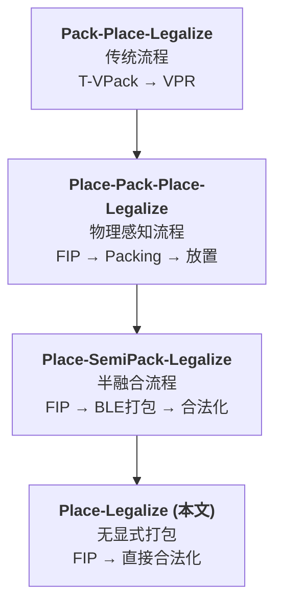
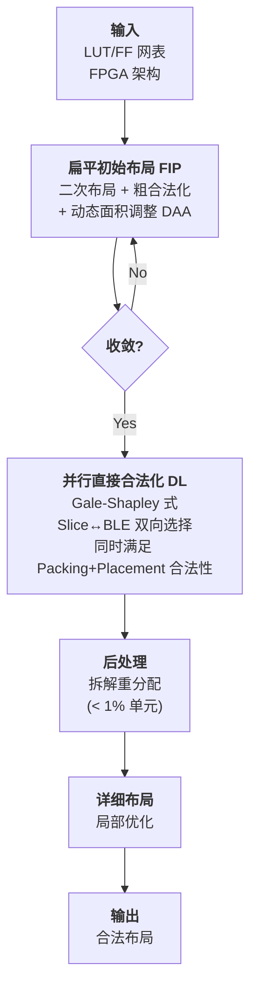

# Day 4: FPGA 布局新范式 —— 无需显式打包的 Place-Legalize 流程

> **论文标题**: A New Paradigm for FPGA Placement without Explicit Packing
>
> **作者**: Wuxi Li (Student Member, IEEE), David Z. Pan (Fellow, IEEE)
>
> **机构**: Department of Electrical and Computer Engineering, The University of Texas at Austin
>
> **期刊**: IEEE Transactions on Computer-Aided Design of Integrated Circuits and Systems (TCAD)
>
> **卷/期/页码**: Vol. 38, No. 11, pp. 2113–2126
>
> **DOI**: [10.1109/TCAD.2018.2877017](https://doi.org/10.1109/TCAD.2018.2877017)
>
> **关键词**: Placement, Legalization, Packing, FPGA, Parallel Algorithm
>
> **资助**: Xilinx Inc.
>
> **分析日期**: 2026-06-08
>
> **与前三天论文的关系**: 第一作者 Wuxi Li 是 DREAMPlace（Day 1）的第三作者，也是 UTPlaceF（ISPD 2016/2017 冠军）的一作。本文基于 UTPlaceF 框架，但采用了**二次布局**（而非 ePlace 静电模型），并引入了完全创新的直接合法化算法。

---

## 目录

1. [FPGA 布局与打包的根本矛盾](#1-fpga-布局与打包的根本矛盾)
2. [核心贡献：Place-Legalize 新范式](#2-核心贡献place-legalize-新范式)
3. [FPGA 架构与问题定义](#3-fpga-架构与问题定义)
4. [创新点一：动态 LUT/FF 面积调整（DAA）](#4-创新点一动态-lutff-面积调整daa)
5. [创新点二：完全可并行的直接合法化（DL）](#5-创新点二完全可并行的直接合法化dl)
6. [算法流程](#6-算法流程)
7. [实验结果与分析](#7-实验结果与分析)
8. [创新点深度分析](#8-创新点深度分析)
9. [参考文献](#9-参考文献)

---

## 1. FPGA 布局与打包的根本矛盾

### 1.1 传统 FPGA 设计流程的四种范式

本文将已有工作归纳为四种流程范式：



| 流程 | 代表 | Packing 阶段 | 核心问题 |
|------|------|-------------|---------|
| Pack-Place-Legalize | T-VPack, VPR | 完全独立，不考虑物理位置 | Packing 决策盲目 |
| Place-Pack-Place-Legalize | UTPlaceF, LSC | 先做 FIP，再基于物理信息 Packing | FIP 与最终解偏差大 |
| Place-SemiPack-Legalize | RippleFPGA | 仅做 BLE 级打包，CLB 打包留给合法化 | 仍存在信息断层 |
| **Place-Legalize (本文)** | — | **完全消除** | 需要解决新的挑战 |

### 1.2 顺序化流程的核心问题

传统 Place-Pack-Place-Legalize 流程存在两个关键问题：

**问题 1：FIP 与最终合法解的巨大偏差**

Packing 阶段将 BLE 打包进 CLB 时，CLB 的位置是通过对内部 BLE 位置取平均估计的——这个估计可能远离 CLB 的最终合法位置。特别是对于**控制集（control set）密集的设计**，FIP 中精心优化的线长、时序和可布线性指标在合法化后可能被严重破坏。

**问题 2：面积溢出不等于资源溢出**

FIP 只检查 LUT+FF 的总面积是否溢出，但不区分 LUT 和 FF 的资源类型。可能出现总面积不溢出、但 FF 密度溢出的情况（如下图）。传统布局器无法捕捉这种**资源类型不平衡**。

```
资源需求                                    资源需求
LUT  FF  LUT+FF  面积容量  CLB容量         LUT  FF  LUT+FF  面积容量  CLB容量
 │   │    │       ─ ─ ─     ─ ─            │   │    │       ─ ─ ─     ─ ─
 │   █    │       ─ ─ ─     ─ ─            │   │    │       ─ ─ ─     ─ ─
 │   █    │       ─ ─ ─     ─ ─            │   │    │       ─ ─ ─     ─ ─
 │   ██   │       ─ ─ ─     ─ ─            │   │    │       ─ ─ ─     ─ ─

 (a) 面积不溢出，但FF溢出！              (b) 合法：LUT和FF均不溢出
```

---

## 2. 核心贡献：Place-Legalize 新范式

### 2.1 核心主张

> **消除显式 Packing 阶段，直接从扁平初始布局（FIP）通过合法化获得最终合法解，在合法化过程中同时探索 Placement 和 Packing 的解空间。**

### 2.2 三大贡献

1. **动态 LUT/FF 面积调整（DAA）**：在 FIP 迭代中动态调整每个 LUT/FF 的面积，以考虑 Packing 效应和资源类型利用率，使 FIP 尽量接近真正合法的布局
2. **完全可并行的直接合法化（DL）**：受 Gale-Shapley 大学录取问题启发，每个 CLB slice 独立并行地寻找最优 BLE 聚类，同时满足 Placement 和 Packing 合法性
3. **实验验证**：ISPD 2016 基准上 routed wirelength 比 UTPlaceF 改善 **4.4%**，在难打包设计 FPGA-10 上改善 **29.5%**

---

## 3. FPGA 架构与问题定义

### 3.1 目标 FPGA 架构：Xilinx UltraScale VU095

本文采用 ISPD 2016 竞赛使用的 Xilinx UltraScale VU095 架构：

```
CLB (Configurable Logic Block)
├── Half CLB 0
│   ├── BLE 0: LUT_A + LUT_B + FF_A + FF_B  ← 共享 CK₀, SR₀, CEA₀, CEB₀
│   ├── BLE 1: LUT_A + LUT_B + FF_A + FF_B
│   ├── BLE 2: LUT_A + LUT_B + FF_A + FF_B
│   └── BLE 3: LUT_A + LUT_B + FF_A + FF_B
└── Half CLB 1
    ├── BLE 4: LUT_A + LUT_B + FF_A + FF_B  ← 共享 CK₁, SR₁, CEA₁, CEB₁
    ├── BLE 5: LUT_A + LUT_B + FF_A + FF_B
    ├── BLE 6: LUT_A + LUT_B + FF_A + FF_B
    └── BLE 7: LUT_A + LUT_B + FF_A + FF_B
```

**架构规则**：
- 每个 BLE 包含 **2 个 LUT**（可实现 1 个 6-input LUT 或 2 个总输入 ≤ 5 的小 LUT）和 **2 个 FF**
- 同一 BLE 中的 2 个 FF 必须共享 **CK（时钟）和 SR（置位/复位）**信号，但 **CE（时钟使能）**可以不同
- 同一 Half CLB 中的 4 个 BLE 共享相同的 CK, SR, CEA, CEB

> **控制集（Control Set）**：FF 的控制集定义为 (CK, SR, CE)；Half CLB 的控制集定义为 (CK, SR, CEA, CEB)。控制集的多样性直接决定了 Packing 的难度——不同控制集的 FF 无法放入同一个 Half CLB。

### 3.3 二次布局基础

本文的 FIP 采用**二次布局（Quadratic Placement）+ 粗合法化（Rough Legalization）**的迭代框架，与前三天的 ePlace/RePlAce/DREAMPlace 使用的静电模型+Nesterov 方法不同。

**二次线长目标函数**：

$$
W(\mathbf{x}, \mathbf{y}) = \frac{1}{2}\mathbf{x}^T Q_x \mathbf{x} + \mathbf{c}_x^T \mathbf{x} + \frac{1}{2}\mathbf{y}^T Q_y \mathbf{y} + \mathbf{c}_y^T \mathbf{y} + \text{const}
$$

其中 $Q_x, Q_y$ 是从网表连接关系构造的二次矩阵（使用 Hybrid 或 B2B 网模型），$\mathbf{c}_x, \mathbf{c}_y$ 是线性项向量。

> **为什么用二次布局而非静电模型？** 本文基于 UTPlaceF 框架，而 UTPlaceF 使用二次布局。FPGA 布局中二次布局的优势在于：矩阵 $Q$ 的稀疏结构与 FPGA 网表高度匹配，可以用高效的稀疏线性求解器快速求解。此外，FPGA 的 FIP 阶段只是起点，真正的核心在后续的 DAA 和 DL——因此 FIP 方法的选择不是本文的重点。

**FIP 的迭代流程**：
1. 求解二次方程组 $Q\mathbf{x} = -\mathbf{c}$（每轮迭代）
2. 粗合法化：将单元推向密度均匀的位置（消除重叠）
3. **动态面积调整（DAA，本文新增）**：根据 Packing 效应调整单元面积
4. 检查收敛，若未收敛则返回步骤 1

### 3.4 直接合法化（DL）问题的数学定义

给定 FIP 中所有单元的坐标 $(\bar{x}, \bar{y})$，直接合法化问题定义为：

$$
\max_{\mathbf{x}, \mathbf{y}} \sum_{s \in S} \Psi(\{v \in V \mid z_{v,s} = 1\}) - \frac{1}{\eta} \cdot \text{HPWL}(\mathbf{x}, \mathbf{y})
$$

$$
\text{s.t.} \quad \sum_{s \in S} z_{v,s} = 1, \quad \forall v \in V \quad \text{(每个单元恰好分配到一个 slice)}
$$

$$
\{v \mid v \in V, z_{v,s} = 1\} \text{ 是架构合法的}, \quad \forall s \in S \quad \text{(满足所有控制集/容量规则)}
$$

$$
|x_v - \bar{x}_v| + |y_v - \bar{y}_v| \leq D, \quad \forall v \in V \quad \text{(最大位移约束)}
$$

其中：
- $V$ 是所有 LUT 和 FF 的集合，$S$ 是所有 CLB slice 的集合
- $z_{v,s}$ 是二元变量：$z_{v,s} = 1$ 当且仅当单元 $v$ 分配到 slice $s$
- $\Psi(\cdot)$ 是聚类评分函数（捕捉引脚/网络共享、时序影响等）
- $\eta > 0$ 是线长归一化参数
- $D$ 是最大位移约束（软约束）

> **公式解读**：目标函数同时最大化聚类质量（Packing 目标）和最小化线长（Placement 目标）。约束 (3b) 保证每个单元恰好属于一个 slice，约束 (3c) 保证架构合法性（控制集兼容、容量不超），约束 (3d) 限制位移以保持 FIP 质量。**这是第一个同时保证 Placement 和 Packing 合法性的公式化表述。**

---

## 4. 创新点一：动态 LUT/FF 面积调整（DAA）

### 4.1 核心思想

在 FIP 的每次迭代后，动态调整每个 LUT 和 FF 的面积，使得：
1. **难打包的单元获得更大面积**（反映其实际资源需求）
2. **不同资源类型的利用率分别控制**（解决 LUT/FF 不平衡问题）
3. **布线拥塞区域避免过度压缩**

### 4.2 局部资源利用率

对于单元 $v$，定义其局部利用率为：

$$
U_v = \frac{\sum_{i \in N_v^+} A_i}{C_v}
$$

其中：
- $N_v^+ = \{v\} \cup N_v$，$N_v$ 是与 $v$ 同类型且在 $(x_v - L, y_v - L, x_v + L, y_v + L)$ 范围内的邻居
- $A_i$ 是单元 $i$ 的资源需求（反映打包难度）
- $C_v$ 是该范围内的 CLB slice 数量
- $L = 5$（经验值）

> **公式解读**：$U_v$ 衡量了单元 $v$ 附近区域的"拥挤程度"。$U_v > 1$ 意味着该区域的资源需求超过供给，需要膨胀单元面积来推开它们。关键创新是**对 LUT 和 FF 分别计算利用率**——这解决了"总面积不溢出但 FF 溢出"的问题。

### 4.3 面积更新规则

$$
a_v = \begin{cases}
\min(a_v^+, A_v \cdot U_v \cdot \nu_v), & \text{if } A_v \cdot U_v \cdot \nu_v > a_v \\[4pt]
\max(a_v^-, A_v \cdot U_v \cdot \nu_v), & \text{if } A_v \cdot U_v \cdot \nu_v < a_v \text{ and } R_v < R_{\max} \\[4pt]
a_v, & \text{otherwise}
\end{cases}
$$

其中：
- $a_v$ 是当前面积，$a_v^+ = a_v \cdot 1.1$（膨胀率），$a_v^- = a_v \cdot 0.95$（收缩率）
- $\nu_v \geq 1$ 是累积布线膨胀比
- $R_v$ 是局部布线利用率，$R_{\max} = 0.65$

> **三种情况的含义**：
> - **情况 1（膨胀）**：当估计的资源需求超过当前面积时，增大面积。上限为 $a_v^+$ 确保平滑增长
> - **情况 2（收缩）**：当区域资源充足且布线不拥塞时，缩小面积让其他单元进入
> - **情况 3（保持）**：当布线拥塞（$R_v \geq R_{\max}$）时，即使资源充足也不收缩——避免进一步加重布线压力

### 4.4 LUT 资源需求估计

每个 LUT 的资源需求基于其与邻居的架构兼容性：

$$
A_v^{(\text{LUT})} = \frac{|N_v'|}{|N_v^+|} \cdot \frac{1}{16} + \frac{|N_v^+| - |N_v'|}{|N_v^+|} \cdot \frac{1}{8}
$$

其中 $N_v'$ 是 $N_v^+$ 中与 $v$ 架构兼容（可放入同一 BLE）的 LUT 集合。

> **公式解读**：在 UltraScale 中，每个 BLE 可容纳 2 个兼容 LUT。如果 $v$ 的大部分邻居都与之兼容，$|N_v'|/|N_v^+|$ 接近 1，需求为 1/16 CLB（紧凑打包，两个 LUT 共享一个 BLE）；如果很少有兼容邻居，需求为 1/8 CLB（独占一个 BLE）。这是一个**概率估计**，不需要实际的 Packing 解。

### 4.5 FF 资源需求估计

FF 的需求估计更复杂，因为控制集规则限制了哪些 FF 可以共处同一个 Half CLB。本文采用**最紧打包下界估计**：

$$
A_v^{(\text{FF})} = \frac{1}{2} \cdot \left\lceil \frac{\sum_{i=0}^{m} \lceil n_i / 4 \rceil}{2} \right\rceil \cdot \frac{1}{n_0} \cdot \beta^{(\text{FF})}
$$

其中：
- FF $v$ 的控制集为 $(\text{CK}_0, \text{SR}_0, \text{CE}_0)$
- $\{\text{CE}_0, \text{CE}_1, \ldots, \text{CE}_m\}$ 是邻居 $N_v^+$ 中与 $v$ 共享 $(\text{CK}_0, \text{SR}_0)$ 的 FF 的不同 CE 集合
- $n_i$ 是控制集为 $(\text{CK}_0, \text{SR}_0, \text{CE}_i)$ 的 FF 数量
- $\beta^{(\text{FF})} = 1.1$，补偿最紧打包与实际打包之间的差距

> **推导思路**：4 个共享同一 (CK, SR, CE) 的 FF 组成一个"quarter CLB"，2 个共享同一 (CK, SR) 的 quarter CLB 组成一个"half CLB"。先计算每种 CE 变体需要多少 quarter CLB（$\lceil n_i/4 \rceil$），再计算总共需要多少 half CLB（$\lceil \text{sum}/2 \rceil$），最后将需求均摊到每个 FF。FF 需求范围 [1/16, 1/2]，差异可达 **8 倍**——这正是传统方法忽略的关键方差来源。

### 4.6 DAA 完整演算示例

以论文 Fig. 6 中的 FF 需求估计为例，逐步说明：

**场景**：某个 FF $v$ 的控制集为 (CK=A, SR=P, CE=X)，其邻居 $N_v^+$ 中的 FF 分布如下：

| (CK, SR) 组 | CE | FF 数量 | 需要 quarter CLB |
|------------|-----|---------|----------------|
| (A, P) | X | 6 | $\lceil 6/4 \rceil = 2$ |
| (A, P) | Z | 2 | $\lceil 2/4 \rceil = 1$ |
| (B, P) | X | 5 | $\lceil 5/4 \rceil = 2$ |
| (B, P) | Z | 2 | $\lceil 2/4 \rceil = 1$ |
| (B, Q) | Y | 1 | $\lceil 1/4 \rceil = 1$ |

**步骤 1**：按 (CK, SR) 分组，计算每组需要的 half CLB：

- (A, P) 组：3 个 quarter CLB → $\lceil 3/2 \rceil = 2$ 个 half CLB → 需求 = 2 × (1/2) = **1.0 CLB**
  - 其中 (A, P, X) 占 2/(2+1) = 2/3 CLB，(A, P, Z) 占 1/(2+1) = 1/3 CLB
- (B, P) 组：3 个 quarter CLB → 2 个 half CLB → 需求 = **1.0 CLB**
  - 其中 (B, P, X) 占 2/3 CLB，(B, P, Z) 占 1/3 CLB
- (B, Q) 组：1 个 quarter CLB → 1 个 half CLB → 需求 = **0.5 CLB**

**步骤 2**：将组内需求均摊到每个 FF：

- FF (A, P, X)：$(2/3) / 6 = 2/18 = 1/9 \approx 0.111$
- FF (A, P, Z)：$(1/3) / 2 = 1/6 \approx 0.167$
- FF (B, P, X)：$(2/3) / 5 = 2/15 \approx 0.133$
- FF (B, P, Z)：$(1/3) / 2 = 1/6 \approx 0.167$
- FF (B, Q, Y)：$(1/2) / 1 = 1/2 = 0.500$

**步骤 3**：乘以 $\beta^{(\text{FF})} = 1.1$ 补偿：

- FF (A, P, X)：$1/9 \times 1.1 = 0.122$ CLB
- FF (B, Q, Y)：$1/2 \times 1.1 = 0.550$ CLB

> **关键洞察**：最"贵"的 FF（B, Q, Y）的资源需求是最"便宜"的 FF（A, P, X）的 **4.5 倍**。传统方法将所有 FF 赋予相同面积，完全忽略了这种差异。DAA 通过公式 (7) 精确估计了每个 FF 的差异化需求，并通过公式 (5) 将其转化为面积调整。

**步骤 4（面积更新）**：假设 FF $v$ 的当前面积 $a_v = 0.15$，局部利用率 $U_v = 0.9$，资源需求 $A_v = 0.122$，布线膨胀 $\nu_v = 1.0$：

- 目标面积 = $A_v \cdot U_v \cdot \nu_v = 0.122 \times 0.9 \times 1.0 = 0.110$
- 因为 0.110 < 0.15（目标面积小于当前面积）→ 检查布线条件
- 如果 $R_v < 0.65$：$a_v = \max(0.15 \times 0.95, 0.110) = \max(0.1425, 0.110) = 0.1425$（缓慢收缩）
- 如果 $R_v \geq 0.65$：$a_v = 0.15$（保持不变，避免加重拥塞）

> **面积变化的效果**：面积从 0.15 收缩到 0.1425 意味着该 FF 在下次粗合法化中占据更少空间，允许其他单元进入其附近。多次迭代后，DAA 使每个单元的面积趋于反映其实际打包难度，FIP 逐步逼近真正合法的布局。

---

## 5. 创新点二：完全可并行的直接合法化（DL）

### 5.1 大学录取问题类比

DL 算法受 **Gale-Shapley 大学录取问题** 启发：

```
大学录取问题                    直接合法化
──────────────────────────────────────────
大学 (College)                 CLB Slice
学生 (Student)                 LUT/FF 单元
朋友 (Friends)                 共享网络的单元
大学录取学生                   Slice 接受 BLE 聚类
学生选择大学                   单元选择 Slice
```

关键差异：
1. 单元对 Slice 的偏好取决于其**连接单元的选择**（朋友也去了哪所"大学"）
2. 某些单元**不能同处一个 Slice**（架构合法性约束）

### 5.2 节点中心算法

每个 Slice 作为一个**计算节点**独立运行，维护以下数据结构：

| 数据结构 | 含义 | 初始值 |
|---------|------|--------|
| `det` | 已确定分配到该 Slice 的单元集合 | ∅（空） |
| `pq` | 优先队列，存储当前 Top-K=10 候选聚类 | ∅ |
| `nbr` | 邻居单元集合（距离 ≤ d 的单元） | 距离 ≤ 1 的所有单元 |
| `scl` | 种子聚类集合（用于生成新候选） | {空聚类} |
| `i` | 自上次最优候选变化以来的迭代数 | 0 |
| `d` | 当前最大搜索距离 | 1 |

#### DL 单次迭代的完整步骤

**步骤 1 —— 检查是否可以提交当前最优候选**

检查 `pq.top()` 是否满足两个条件：
- 稳定性：$i \geq I = 3$（连续 3 次迭代最优候选未变化）
- 全员接受：`pq.top()` 中的所有单元都接受了该 Slice 的 offer

如果两个条件都满足：
```
det ← pq.top()    // 将最优候选锁定到该 Slice
pq ← ∅             // 清空候选队列
scl ← {det}        // 种子聚类设为已确定的单元集合
```
> 为什么要等待 3 次迭代？防止"过早提交"——在 DL 早期，候选聚类可能频繁变化。等待 3 次迭代确保当前最优候选已经稳定，不会在下一轮被更好的候选替换。

**步骤 2 —— 清理无效项**

如果步骤 1 未提交：
- 从 `nbr` 中移除已分配到其他 Slice 的单元
- 从 `nbr` 中移除与 `det` 架构不兼容的单元（如控制集冲突的 FF）
- 从 `pq` 中移除包含无效单元的候选聚类

**步骤 3 —— 扩展搜索范围（如果必要）**

如果 $|nbr| < N_{\text{NBRmin}} = 10$ 且 $d < D = 12$：
```
d ← min(d + Δd, D)       // Δd = 1，逐步扩大搜索半径
nbr ← nbr ∪ {距离 ∈ (d-Δd, d] 的单元}
scl ← scl ∪ pq 中所有候选    // 确保新邻居能参与已有候选的扩展
```

> **为什么逐步扩展而非一次性搜索整个范围？** 优先使用近处单元（位移小，线长代价低），只在近处资源不足时才逐步扩大。这等价于一种"贪心扩展"策略——先尝试局部最优，再逐渐放宽约束。

**步骤 4 —— 生成新候选**

对 `nbr` 中每个单元 $i$ 和 `scl` 中每个种子聚类 $j$：
```
new_candidate = j ∪ {i}
if new_candidate 架构合法:
    pq.insert(new_candidate)   // 保持 Top-K=10
    scl.append(new_candidate)  // 作为下一轮的种子
```

> **候选生成的递归性质**：种子聚类 `scl` 包含上一轮的所有新候选，因此本轮可以在它们的基础上再添加一个单元。这实现了从空聚类 → 1 单元 → 2 单元 → ... → 满 CLB 的**渐进式聚类构建**。

**步骤 5 —— 更新稳定性计数器**

```
if pq.top() 未变化:  i ← i + 1
else:               i ← 0
```

**步骤 6 —— 广播 offer**

将 `pq.top()` 中的所有单元通知给该 Slice，等待单元的决策。

#### 单元端的决策过程

每个单元可能同时收到多个 Slice 的 offer。它选择 SCORE 改善最大的 Slice：

$$
\text{SCORE}(s) = \text{SCORE}(\text{pq.top() of } s, \, s) - \text{SCORE}(\text{det of } s, \, s)
$$

> **SCORE 改善的含义**：不是选择绝对评分最高的 Slice，而是选择"如果接受该 offer，评分提升最大"的 Slice。一个已经有优秀聚类（高 SCORE(det, s)）的 Slice 需要提供更大的边际改善才能赢得该单元——这防止了"强者恒强"的马太效应。

#### DL 完整迭代示例

假设有 3 个 Slice（S0, S1, S2）和若干 LUT/FF：

```
迭代 1:
  S0: nbr={L1,L2,FF1}, scl={∅}, 生成候选 {L1},{L2},{FF1}...
  S1: nbr={L2,L3,FF2}, scl={∅}, 生成候选 {L2},{L3},{FF2}...
  S2: nbr={L3,FF1,FF2}, scl={∅}, 生成候选 {L3},{FF1},{FF2}...

  → 广播: S0 offer {L1,L2} 给 L1,L2; S1 offer {L2,L3} 给 L2,L3; ...
  → L2 同时收到 S0 和 S1 的 offer
  → L2 计算: SCORE(S0)=0.5, SCORE(S1)=0.7 → 选择 S1

迭代 2:
  S0: L2 不可用，更新 nbr/pq，尝试新组合
  S1: L2 接受，pq.top()={L2,L3}，i=0（刚变化）
  S2: 继续...

迭代 3-5: 类似过程...

迭代 6: S1 的 pq.top()={L2,L3,FF2} 稳定 3 次，且全员接受
  → S1: det={L2,L3,FF2}, pq=∅, scl={{L2,L3,FF2}}
  → S1 继续从 scl 扩展，寻找更多可以加入的单元
```

> **关键特性**：同一时间，多个 Slice 可以同时竞争同一个单元。一个聚类只有在**所有成员都接受**时才会被提交——这保证了全局一致性，避免了贪心算法的局部最优陷阱。

### 5.3 评分函数

给定 Slice $s$ 和聚类 $c$：

$$
\text{SCORE}(c, s) = \sum_{e \in \text{Net}(c)} \frac{\text{InternalPins}(e, c)}{\text{TotalPins}(e)} - \frac{1}{\eta} \cdot \text{HPWL}(c, s)
$$

其中：
- $\text{Net}(c)$：至少包含聚类 $c$ 中一个单元的网络集合
- $\text{InternalPins}(e, c)$：网络 $e$ 在聚类 $c$ 内的引脚数
- $\text{TotalPins}(e)$：网络 $e$ 的总引脚数
- $\text{HPWL}(c, s)$：将聚类 $c$ 中的单元从 FIP 位置移到 Slice $s$ 位置的线长增量
- $\eta = 0.02$

#### 评分函数的具体计算示例

假设聚类 $c = \{L1, L2, FF1\}$ 被考虑分配到 Slice $s$（位于芯片坐标 (10, 20)），这三个单元在 FIP 中的位置分别为 (9, 19), (11, 21), (10, 22)。

**第一项：Packing 质量（内部引脚吸收率）**

假设这些单元涉及以下网络：
- Net A：连接 L1, L2, L3（L3 不在聚类中）→ InternalPins=2, TotalPins=3 → 贡献 2/3 = 0.667
- Net B：连接 L2, FF1（都在聚类中）→ InternalPins=2, TotalPins=2 → 贡献 2/2 = 1.000
- Net C：连接 FF1, FF3（FF3 不在聚类中）→ InternalPins=1, TotalPins=2 → 贡献 1/2 = 0.500

Packing 质量总分 = 0.667 + 1.000 + 0.500 = **2.167**

> **含义**：Net B 完全被吸收到 CLB 内部（贡献 1.0，最大值），Net A 大部分被吸收（2/3），Net C 一半被吸收。高 Packing 评分意味着更多外部网络变为内部网络 → CLB 间布线需求减少 → 可布线性改善。

**第二项：Placement 质量（位移线长代价）**

$$
\text{HPWL}(c, s) = \sum_{v \in c} (|x_v - \bar{x}_v| + |y_v - \bar{y}_v|)
$$

- L1 位移：|9-10| + |19-20| = 2
- L2 位移：|11-10| + |21-20| = 2
- FF1 位移：|10-10| + |22-20| = 2

线长代价 = 2 + 2 + 2 = 6

**总分**：

$$
\text{SCORE}(c, s) = 2.167 - \frac{1}{0.02} \times 6 = 2.167 - 300 = -297.833
$$

> **为什么线长项看起来这么大？** 因为 $\eta = 0.02$ 非常小，使得线长项被放大了 50 倍。这保证了在大多数情况下，**位移小的候选优先**——只有当两个候选的位移接近时，Packing 质量才成为决定因素。这是一个精心的权衡：过大的位移会破坏 FIP 的优化结果，必须严格控制。

#### SCORE 改善（单元决策依据）

假设 Slice S0 当前 det={L1}，pq.top()={L1, L2, FF1}：

$$
\text{SCORE}(S0) = \text{SCORE}(\{L1, L2, FF1\}, S0) - \text{SCORE}(\{L1\}, S0)
$$

这衡量了将 L2 和 FF1 加入 S0 带来的**边际改善**。即使 S0 的绝对评分很低，如果边际改善很大，S0 仍然可能赢得 L2 和 FF1。

### 5.4 并行化与串行等价性

**并行化**：所有 Slice 计算节点可以**完全并行**执行（Algorithm 1 line 9-11），所有单元也可以并行处理 offer 并返回决策（line 12-16）。

**串行等价性（Serial Equivalency）**：这是本文的一个重要理论贡献——保证无论使用多少线程，算法产生**完全相同**的解。关键机制是 Lemma 1：

> **Lemma 1**：如果在同一 DL 迭代中，任意两个计算节点提供相同的 SCORE 改进，则通过基于 Slice 唯一标识符的确定性 tie-breaking，可以保证算法收敛。

> **为什么串行等价性重要？** 它意味着可以放心使用尽可能多的并行资源（甚至 GPU/FPGA 加速），而不会牺牲结果质量。这与模拟退火等随机算法形成鲜明对比——后者通常在并行化时结果不一致。

### 5.5 后处理：异常处理

DL 完成后，通常有 < 1% 的单元无法在位移约束 $D$ 内找到合法位置。处理策略是**拆解重分配（Rip-up and Reallocate）**：

$$
\text{SCORE}_{\text{ripup}}(v, s, c) = -\frac{1}{\eta_1} \cdot \text{HPWL}(v, s) - \eta_2 \cdot \text{SCORE}(c, s) - \eta_3 \cdot \text{Area}(c)
$$

> 选择拆解哪个 Slice 的原则：线长代价小 + 原聚类评分低 + 原聚类面积小（面积大意味着单元多或难打包，拆解后难以重新合法化）。参数 $\eta_1 = 0.02, \eta_2 = 1.0, \eta_3 = 4.0$。

#### 拆解重分配的完整流程

```
对于每个非法单元 c:
    D(c) ← D    // 初始位移约束
    while 无法合法化 c:
        D(c) ← D(c) + 1    // 逐步放宽位移约束
        ls(c) ← {距离 ≤ D(c) 的所有 Slice}
        按 SCORE_ripup 降序排列 ls(c)
        for each Slice s in ls(c):
            // 尝试拆解 s.det 并合法化 c
            ripped_cells ← s.det
            s.det ← {c}    // 将 c 放入 s
            for each v in ripped_cells:
                // 为 v 找新位置
                ls(v) ← {距离 ≤ D 且架构兼容的 Slice}
                if ls(v) 为空:
                    撤销所有修改，恢复 s.det
                    break (尝试下一个 s)
                else:
                    选择 score 增益最大的 s' 放入 v
            if 所有 ripped_cells 都找到了新位置:
                成功！处理下一个非法单元
```

> **为什么不用 Tetris 式贪心合法化？** Tetris 方法一次只处理一个单元，不考虑被挤走的单元的去向。而本文的 rip-up 方法**同时考虑被拆解单元的重分配**——确保全局可行性。此外，`SCORE_ripup` 中 `Area(c)` 项的 $\eta_3 = 4.0$ 权重很大，倾向于拆解面积小的 Slice（即单元少、容易重新合法化的 Slice），避免连锁失败。

---

## 6. 算法流程



### 运行时间分布

| 阶段 | 占比 | 说明 |
|------|------|------|
| 二次布局 (QP + 粗合法化) | 64.5% | 主要时间消耗 |
| 详细布局 | 18.5% | — |
| 直接合法化 (DL) | 12.5% | 16 线程并行 |
| 动态面积调整 (DAA) | 2.2% | 开销极小 |
| 后处理异常处理 | 0.7% | — |

---

## 7. 实验结果与分析

### 7.1 实验设置

| 项目 | 配置 |
|------|------|
| **CPU** | Intel Core i9-7900X (3.30 GHz, 10 核, 13.75 MB L3) |
| **内存** | 128 GB RAM |
| **基准** | ISPD 2016 (12 个设计) + ISPD 2017 (13 个设计) |
| **FPGA** | Xilinx UltraScale VU095 (67K CLB slices) |
| **布线器** | Xilinx Vivado v2015.4 (2016) / v2016.4 (2017) |
| **并行** | DL 使用 16 线程 (OpenMP)，其余单线程 |

### 7.2 消融实验（ISPD 2016）

| 方法 | Routed WL (归一化) | 运行时间 (归一化) |
|------|-------------------|-----------------|
| UTPlaceF（原始） | **1.044** | 1.24 |
| UTPlaceF + DAA | 1.030 | 1.29 |
| DAA + 贪心 DL | 1.060 | 0.93 |
| **Proposed (DAA + DL)** | **1.000** | **1.00** |

> **关键发现**：
> - DAA 单独带来 1.4% 的 WL 改善（FIP 更接近合法解）
> - DL 比 UTPlaceF 的 Packing+合法化流程好 3.0%
> - DL 比贪心 DL 好 6.0%（并行探索更大解空间的价值）
> - 整体改善 4.4%，**同时运行更快**（1.24× 加速）

### 7.3 FIP 与合法解的位移对比

| 方法 | 平均位移 | 最大位移 |
|------|---------|---------|
| UTPlaceF | 21.4 | 162.5 |
| UTPlaceF + DAA | 11.7 | 135.0 |
| DAA + 贪心 DL | 1.5 | 57.4 |
| **Proposed (DAA + DL)** | **1.2** | **11.6** |

> **Proposed 方法将最大位移从 162.5 降到 11.6**（恰好低于预设的位移约束 D = 12）。这意味着 FIP 中优化的指标（线长、时序、可布线性）在合法化后几乎完全保留。

### 7.4 难打包设计的突出表现

| 设计 | 控制集数 | vs UTPlaceF WL 改善 | 说明 |
|------|---------|-------------------|------|
| FPGA-10 | 2541 | **-29.5%** | 控制集最多，传统 Packing 最难 |
| FPGA-06 | 2541 | -12.1% | |
| FPGA-07 | 2541 | -5.6% | |
| FPGA-09 | 1281 | -3.7% | |

> **核心洞察**：传统流程在控制集密集的设计上表现差，因为 Packing 阶段无法预见 CLB 的物理位置，导致大量位移。本文方法通过在合法化过程中同时考虑 Packing 和 Placement，特别适合这类**难打包设计**。

### 7.5 与其他学术布局器的对比（ISPD 2016）

| 对比方法 | Routed WL (归一化) | 运行时间 (归一化) |
|---------|-------------------|-----------------|
| ISPD 2016 第 1 名 | 1.080 | 3.96 |
| ISPD 2016 第 2 名 | 1.140 | 4.90 |
| ISPD 2016 第 3 名 | 1.444 | 5.84 |
| GPlace | 1.254 | 0.88 |
| RippleFPGA | 1.041 | 0.64 |
| **Proposed** | **1.000** | **1.00** |

> 比 ISPD 2016 冠军好 8.0%，比 RippleFPGA 好 4.1%。RippleFPGA 是最接近的竞争者——它采用了类似的方法论（Place-SemiPack-Legalize），但使用静态面积和贪心合法化。

### 7.6 DL 并行化扩展性

| 线程数 | 加速比 |
|--------|-------|
| 1 | 1.00× |
| 2 | 1.65× |
| 4 | 3.15× |
| 8 | 6.19× |
| 16 (超线程) | 8.68× |

> 近线性扩展到 8 线程，16 线程时因超线程资源竞争开始饱和。

---

## 8. 创新点深度分析

### 8.1 创新点一：消除显式 Packing —— 从"先打包再放置"到"放置中自然打包"

**本质**：将 FPGA CAD 中分离了二十多年的两个阶段合并为一个统一过程。

**为什么此前没人做到？**

1. **思维惯性**：经典 VPR 框架（Betz, Rose, 1997）将 Packing 和 Placement 定义为两个独立阶段，后续所有工作都在这个框架内改进
2. **技术障碍**：没有 DAA，FIP 解与合法解之间偏差太大，直接合法化会产生极差的结果。DAA 是使 Place-Legalize 流程可行的**必要前提**
3. **合法化算法瓶颈**：传统 Tetris 式贪心合法化一次只考虑一个单元，解空间极窄。本文的 Gale-Shapley 式并行合法化使解空间探索成为可能

**本文的关键洞察**：不是"如何做更好的 Packing"，而是"Packing 是否真的需要作为独立阶段存在？"。答案是否定的——如果 FIP 已经考虑了 Packing 效应（通过 DAA），且合法化算法足够强（通过 DL），Packing 就会自然涌现。

### 8.2 创新点二：DAA —— 将 Packing 信息隐式注入 FIP

**巧妙之处**：DAA 不直接求解 Packing 问题，而是通过**调整单元面积**间接影响 FIP 的密度分布。

- 面积大的单元 → 在粗合法化中被推开更远 → 自然占据更多空间 → 反映其"难打包"的特性
- 不同类型（LUT/FF）分别计算利用率 → 解决资源类型不平衡
- 布线拥塞区域禁止面积收缩 → 维护可布线性

> **反直觉的发现**：DAA 使 FIP 的 HPWL **增大了 2.5%**（Table VI），但最终 routed wirelength **改善了 1.4%**。这说明更大的 FIP HPWL 不是质量退化——而是 FIP 更接近合法解的信号。传统流程中 FIP HPWL 偏小是因为它忽略了 Packing 效应，看似好实则不可实现。

### 8.3 创新点三：Gale-Shapley 式并行合法化

**与经典 Gale-Shapley 的差异**：

| 维度 | 经典 Gale-Shapley | 本文 DL |
|------|-------------------|---------|
| 对象偏好 | 固定且独立 | 取决于"朋友"的选择 |
| 约束 | 仅容量 | 容量 + 架构合法性（控制集兼容） |
| 解空间 | 每个"学生"去一个"大学" | 聚类级别的绑定 |
| 收敛保证 | 经典理论 | Lemma 1（确定性 tie-breaking） |

**串行等价性**的工程价值极高——它允许用户在任何并行度下运行，总是得到相同结果。这是工业工具的基本要求（可复现性），也是后续 GPU/FPGA 加速实现的基础。

### 8.4 与前三天论文的方法论对比

| 维度 | ePlace/RePlAce/DREAMPlace | 本文 |
|------|--------------------------|------|
| **基础框架** | 静电模型 + Nesterov 优化 | 二次布局 + 粗合法化 |
| **密度处理** | Poisson 方程 + FFT | 动态面积调整 + 粗合法化 |
| **合法化** | 不涉及（ASIC 标准单元简单对齐） | **核心创新**（FPGA 架构约束极复杂） |
| **优化目标** | 线长 + 密度 | 线长 + Packing 质量 + 位移约束 |
| **并行化** | GPU 张量运算 | CPU 多线程 + 串行等价性 |

> ASIC 布局与 FPGA 布局的根本差异在于**合法化的复杂度**：ASIC 中标准单元只需要对齐到 site row，而 FPGA 中还需要满足 BLE/CLB 的架构约束（控制集兼容、容量限制）。这导致 FPGA 的合法化本质上是**装箱+分配的组合问题**，需要全新的算法思路。

---

## 9. 参考文献

1. W. Li and D. Z. Pan, "A New Paradigm for FPGA Placement without Explicit Packing," *IEEE Trans. Computer-Aided Design (TCAD)*, vol. 38, no. 11, pp. 2113–2126, 2019. DOI: [10.1109/TCAD.2018.2877017](https://doi.org/10.1109/TCAD.2018.2877017)

2. W. Li, S. Dhar, and D. Z. Pan, "UTPlaceF: A Routability-Driven FPGA Placer with Physical and Congestion Aware Packing," *IEEE TCAD*, 2017.

3. G. Chen et al., "RippleFPGA: Routability-Driven Simultaneous Packing and Placement for Modern FPGAs," *IEEE TCAD*, 2017.

4. D. Gale and L. S. Shapley, "College Admissions and the Stability of Marriage," *The American Mathematical Monthly*, vol. 69, no. 1, pp. 9–15, 1962.

5. V. Betz and J. Rose, "VPR: A New Packing, Placement and Routing Tool for FPGA Research," in *FPL*, 1997.

6. J. Lu et al., "ePlace: Electrostatics-Based Placement Using Fast Fourier Transform and Nesterov's Method," *ACM TODAES*, vol. 20, no. 2, 2015.

7. Y. Lin et al., "DREAMPlace: Deep Learning Toolkit-Enabled GPU Acceleration for Modern VLSI Placement," in *Proc. DAC*, 2019.

---

*本文档由 Claude Code 于 2026-06-08 基于论文全文重写，作为 EDA 论文每日分析系列的第 4 天内容。与前三天 ASIC 布局论文不同，本文展示了 FPGA 布局的独特挑战——架构约束使得合法化成为核心难题，而 Gale-Shapley 式并行算法提供了一种优雅的解决方案。*
