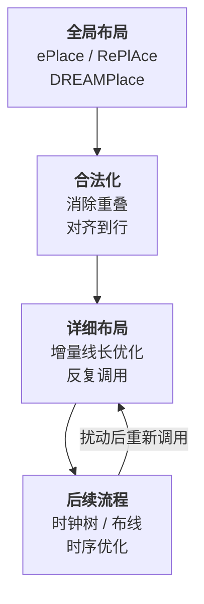
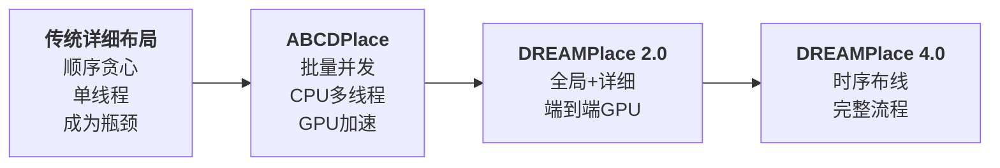
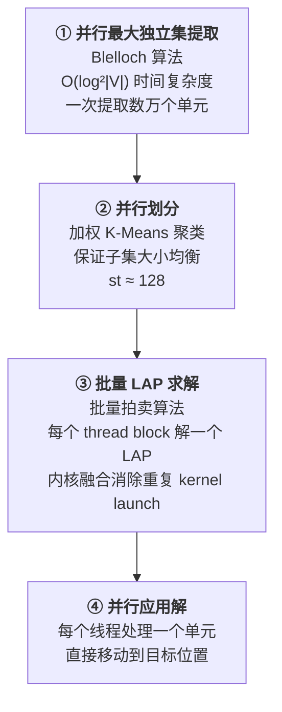
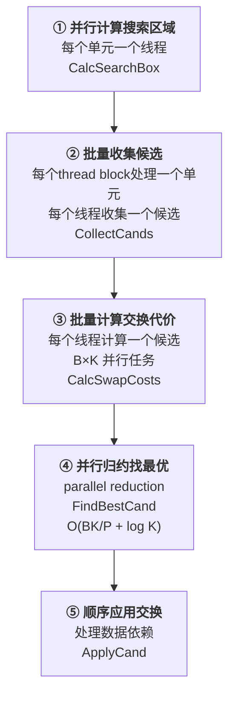
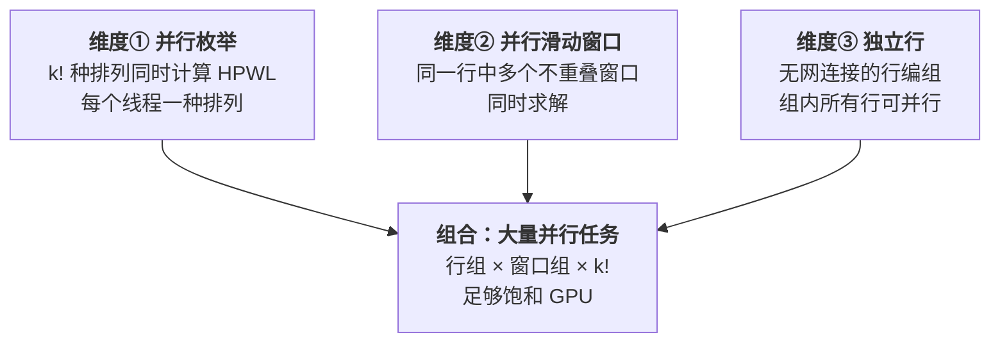
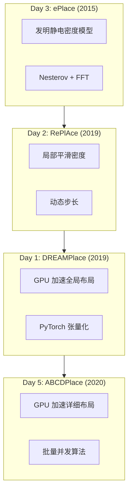

# Day 5: ABCDPlace —— 批量并发详细布局的 CPU/GPU 异构加速

> **论文标题**: ABCDPlace: Accelerated Batch-based Concurrent Detailed Placement on Multi-threaded CPUs and GPUs
>
> **作者**: Yibo Lin (Member, IEEE), Wuxi Li (Member, IEEE), Jiaqi Gu (Student Member, IEEE), Haoxing Ren (Senior Member, IEEE), Brucek Khailany (Senior Member, IEEE), David Z. Pan (Fellow, IEEE)
>
> **机构**: Peking University; Xilinx Inc.; The University of Texas at Austin; NVIDIA Corporation
>
> **期刊**: IEEE Transactions on Computer-Aided Design of Integrated Circuits and Systems (TCAD)
>
> **年份**: 2020
>
> **开源代码**: [https://github.com/limbo018/DREAMPlace](https://github.com/limbo018/DREAMPlace) (ABCDPlace 已集成到 DREAMPlace 2.0)
>
> **分析日期**: 2026-06-08
>
> **系列定位**: 本文是本系列第一篇**详细布局（Detailed Placement）**论文。Day 1-3 的 ePlace/RePlAce/DREAMPlace 均为**全局布局**方法——它们输出单元的近似位置，由详细布局进行最后的精细优化。ABCDPlace 揭示了这个常被忽视的阶段如何在 GPU 上实现 16×+ 加速。

---

## 目录

1. [历史背景：详细布局为什么重要？](#1-历史背景详细布局为什么重要)
2. [核心贡献概述](#2-核心贡献概述)
3. [数学建模：详细布局问题形式化](#3-数学建模详细布局问题形式化)
4. [算法一：并发独立集匹配](#4-算法一并发独立集匹配)
5. [算法二：并发全局交换](#5-算法二并发全局交换)
6. [算法三：并发局部重排序](#6-算法三并发局部重排序)
7. [CPU vs GPU 实现差异](#7-cpu-vs-gpu-实现差异)
8. [实验结果与分析](#8-实验结果与分析)
9. [创新点深度分析](#9-创新点深度分析)
10. [三部曲 + 详细布局全景对比](#10-三部曲--详细布局全景对比)
11. [参考文献](#11-参考文献)

---

## 1. 历史背景：详细布局为什么重要？

### 1.1 布局的三个阶段

VLSI 布局通常由三个阶段组成：

```
全局布局 (Global Placement)  →  合法化 (Legalization)  →  详细布局 (Detailed Placement)
   粗略位置                      消除重叠/DRC                增量优化线长
```

**全局布局**（Day 1-3 的主角）给出单元的近似位置——允许重叠但密度均匀。**合法化**消除所有重叠、将单元对齐到行（row）并满足设计规则。**详细布局**在合法化后的合法解上做增量式线长优化。

### 1.2 为什么详细布局是瓶颈？

详细布局在整个设计流程中被**反复调用**——不仅在初始布局后，还包括 buffer 插入后、布线优化后、时序优化后等等。每次调用时需要恢复因前置步骤扰动而损失的解质量。因此，详细布局的**效率直接影响设计收敛的周转时间**。



ABCDPlace 论文引用 DREAMPlace 的数据指出：在 200 万单元的设计中，全局布局被 GPU 加速 30-40× 后，**详细布局占据了整个布局时间的 75% 以上**。也就是说，全局布局快了，详细布局就成了新的瓶颈。

### 1.3 为什么详细布局难以并行化？

详细布局的经典算法具有三个内在特性，使得并行化极其困难：

| 特性 | 描述 | 并行化障碍 |
|------|------|-----------|
| **贪心性（Greedy）** | 每次选择当前最优的单元移动 | 后续移动依赖前序移动的结果 |
| **顺序性（Sequential）** | 逐个处理单元，依次执行 | 无法直接展开为独立任务 |
| **连接性（Connectivity）** | 单元通过网表互联，互相影响 | 并行移动可能相互冲突 |

> **核心挑战**：如何在不损失解质量的前提下，将"天生就是顺序的"贪心算法改造为可大规模并行执行的批量算法？

---

## 2. 核心贡献概述



ABCDPlace 的**三大核心贡献**：

1. **批量并发独立集匹配（Batch-based Concurrent ISM）**：将顺序的独立集提取和 LAP 求解改造为可并发的批量操作——每个 batch 包含数千个独立集，在 GPU 上同时求解
2. **批量并发全局交换（Batch-based Concurrent Global Swap）**：将逐单元的顺序交换搜索改为批量处理——一批单元并行搜索最优交换候选，大幅度增加可用并行度
3. **多维度并发局部重排序（Concurrent Local Reordering）**：利用平行窗口 + 独立行两个维度挖掘出足够的并行任务，突破单窗口枚举（k! = 6~24）并行度不足的限制

---

## 3. 数学建模：详细布局问题形式化

### 3.1 优化目标

详细布局的目标是**在保持合法性的前提下最小化 HPWL**：

$$
\text{HPWL} = \sum_{e \in E} \left( \max_{i,j \in e} |x_i - x_j| + \max_{i,j \in e} |y_i - y_j| \right)
$$

其中 \$e \\) 表示一个网（hyperedge），\$E \\) 为所有网的集合，\$i, j \\) 为网 \$e \\) 中任意两个连接的单元。

> **与全局布局的差异**：全局布局使用平滑的 WA 线长近似（可微），而详细布局使用**精确的 HPWL**（不可微），因为单元的移动是离散的——直接从一个位置跳到另一个位置。这决定了详细布局必须使用组合优化方法而非梯度下降。

### 3.2 三种搜索策略的数学本质

详细布局的核心是在合法解空间中搜索更优解。ABCDPlace 关注三种搜索策略：

| 策略 | 搜索空间 | 数学本质 |
|------|---------|---------|
| **局部重排序** | 一行中 k 个连续单元的所有排列 | 枚举 \$k! \\) 种排列，取 HPWL 最小者 |
| **全局交换** | 一个单元与搜索域内任意单元/空位的交换 | 贪心选择 HPWL 减少最多的交换 |
| **独立集匹配** | 一组互不连接单元间的位置重分配 | 求解**线性分配问题**（LAP）|

### 3.3 线性分配问题（LAP）的形式化

独立集匹配的核心是将单元到位置的最优分配建模为 LAP：

$$
\max \sum_{i,j} a_{ij} x_{ij}
$$

$$
\text{s.t.} \quad \sum_{i=1}^{N} x_{ij} = 1, \quad j = 1, 2, \ldots, N
$$

$$
\sum_{j=1}^{N} x_{ij} = 1, \quad i = 1, 2, \ldots, N
$$

$$
x_{ij} \geq 0, \quad i, j = 1, 2, \ldots, N
$$

其中：
- \$x_{ij} = 1 \\) 表示将单元 \$i \\) 分配到位置 \$j \\)
- \$a_{ij} \\) 为该分配的权重——等于将单元 \$i \\) 放到位置 \$j \\) 带来的线长变化的**负值**（因为 LAP 是最大化问题，我们想要最小化线长）

> **为什么独立集可以用 LAP 求解？** 独立集的定义是集合中任意两个单元之间不存在网连接。因此单元 \$i \\) 移到位置 \$j \\) 的线长增量 \$a_{ij} \\) 可以独立计算——它不受集合中其他单元位置变化的影响。这个"独立性"使得全局最优等价于 LAP 的最优解。

---

## 4. 算法一：并发独立集匹配

### 4.1 顺序算法回顾

传统的顺序独立集匹配流程：

```
遍历每个单元:
  1. 在当前单元邻域中搜索不互相连接的单元，形成独立集 I (|I| ≤ L, L ≈ 100)
  2. 计算将 I 中每个单元放到其他单元位置的线长代价 → 得到 L×L 代价矩阵
  3. 求解 LAP 找到最优分配
  4. 按 LAP 解移动单元
```

这个流程中，步骤 1（独立集提取）和步骤 3（LAP 求解）都极难并行化——独立集提取本质上是贪心的图遍历，LAP 是顺序的匈牙利算法或网络流算法。

### 4.2 批量并发改造

ABCDPlace 将上述流程彻底重构为四个全并行的步骤：



#### 4.2.1 并行最大独立集提取（Blelloch 算法）

顺序算法逐个检查单元，复杂度 O(|V|)。ABCDPlace 采用 **Blelloch 的并行算法**（Algorithm 2），其关键思想是：

- 给每个顶点分配一个**随机优先级** R(v)
- 每轮迭代中：顶点 v 只有在它的优先级低于所有邻居时才加入独立集
- 加入独立集的顶点及其邻居在下一轮之前被移除
- **最多需要 \$O(\log_2 |V|) \\) 轮**即可完成
- 每轮内部的 for 循环是**全并行的**——每个顶点可独立判断

> **关键性质**：拥有全局最小 R 值的顶点一定会在第一轮加入独立集。这保证了算法在每一轮都取得进展——不会出现"谁都等着别人"的死锁。这也解释了为什么轮数是对数级的：每轮至少移除一个顶点及其邻居，图的大小指数级缩小。

#### 4.2.2 加权 K-Means 均衡划分

从最大独立集中提取出数万个单元后，需要将它们划分为大小合适的子集（每个约 128 个单元）以求解 LAP。划分要求：
- 同一子集的单元在**物理上靠近**（局部移动）
- 各子集的**大小尽量均衡**（适合 GPU 批量处理）

标准 K-Means 可能导致子集大小不均衡。ABCDPlace 使用**加权 K-Means**：

$$
\min \sum_{i=1}^{K} w_i \sum_{x \in S_i} \|x - \mu_i\|^2
$$

权重 \$w_i \\) 根据子集大小动态调整：

$$
w_i^{k+1} \leftarrow w_i^k \cdot \left(1 + 0.5 \cdot \log(\max\{1, |S_i|/s_t\})\right)
$$

> **直观理解**：当一个子集超出目标大小 \$s_t \\) 时，其权重增大——更多的"质量"使其质心在下一轮迭代中吸引更少的单元。这形成了一种**负载均衡机制**：大子集"排斥"新单元，小子集"欢迎"新单元。实验表明只需 2 轮 K-Means 即可达到合理的均衡分布。

#### 4.2.3 批量拍卖算法：全 GPU 内核融合

这是 ABCDPlace 中最精巧的 GPU 实现。LAP 的拍卖算法（Auction Algorithm）模拟了经济学中的拍卖过程：

**拍卖算法基础**（Algorithm 3，单 LAP 实例）：

```
初始化：所有物品价格 price[j] = 0
重复直到所有物品被分配:
  竞价阶段（并行）：每个竞拍者 i
    v_ij = max_j(a_ij - price_j)        # 最大净收益
    w_ij = max_{j≠j*}(a_ij - price_j)   # 次大净收益
    bid_ij = v_ij - w_ij + ε            # 竞价增量（比次优多出 ε）
  分配阶段（并行）：每个物品 j
    找到出价最高的竞拍者 i*
    将物品 j 分配给 i*，price[j] += bid_{i*j}
```

**关键挑战**：Naive 地将每个 LAP 分配到一个 CUDA stream，会产生数以千计的 kernel launch（每个 LAP 约需 1000+ 次迭代 × 每次迭代一个 kernel）。每次 kernel launch 开销约几微秒，累积起来远超实际计算时间。

**ABCDPlace 的批量 GPU 解法**（Algorithm 4）：

```
一个 kernel 完成所有工作：
  block_id  → 选择第 block_id 个 LAP 实例
  thread_id → 在该 LAP 中负责第 thread_id 个竞拍者/物品

  引入退火方案：ε 从 ε_max 递减到 ε_min
    外层 while (ε ≥ ε_min):
      内层 while (还有物品未分配):
        同步线程
        竞价阶段：thread_id 竞拍
        同步线程
        分配阶段：thread_id 分配
        ε *= δ
```

> **设计精华**：
> 1. **内核融合**：将整个 while 循环包裹在一个 CUDA kernel 内，避免重复的 kernel launch 开销和 CPU-GPU 通信开销。kernel launch 数量从 O(B × K)（K 为每个 LAP 的最大迭代次数，约 1000+）减少到**1**。
> 2. **Block 级同步**：使用 `__syncthreads()` 在 block 内同步——比 device 级同步快几个数量级。每个 block 最多 1024 个线程，恰好适合 N ≈ 100 的 LAP 实例。
> 3. **退火加速收敛**：ε 从大（ε_max=10）开始，快速得到近似解；逐步减小到 ε_min=1，精化解。前一阶段的 price 作为下一阶段的初始值——这种"热启动"大幅减少了收敛所需的迭代次数。
> 4. **GPU vs CPU 的倒挂现象**：对于单个 N=128 的 LAP，CPU 拍卖算法只需 ~1ms，而 GPU kernel launch 本身就需要约 5μs × 1000 次迭代 = 5ms。但如果把 1024 个 LAP 批量处理在一个 kernel 中，GPU 的优势就显现出来了——这就是**批量执行**的力量。

### 4.3 独立集匹配小结

```
传统顺序方法：            ABCDPlace 批量并发：
O(|V| × L × T_LAP)      O(log²|V| × (并行+K-Means+批量LAP)/P)
逐个单元、逐个LAP        对数轮并行提取 × 数千LAP批量求解
```

---

## 5. 算法二：并发全局交换

### 5.1 顺序算法回顾

传统全局交换（Algorithm 5）迭代执行：

```
对每个单元 v:
  1. CalcSearchBox: 计算搜索区域 R（如 v 所在的 bin）
  2. CollectCands: 在 R 中收集候选交换对象 C
  3. CalcSwapCosts: 计算与每个候选交换的 HPWL 变化
  4. FindBestCand: 找到 HPWL 减少最多的候选 c
  5. ApplyCand: 执行与 c 的交换
```

### 5.2 为什么 Naive 并行化不够？

论文数据显示，直接并行化 CalcSwapCosts（在候选间并行）在 10 线程时加速比仅 **1.4×** 就饱和了。原因在于：

- 每个单元的候选数有限（约 100 个），总任务数不足以填满 GPU 的上千个线程
- 线程创建和同步的开销超过了并行的收益
- GPU 的单线程性能远不如 CPU，需要足够的并行任务来掩盖内存延迟

### 5.3 批量并发全局交换

ABCDPlace 的解决方案：**一次处理一批单元（batch size B ≈ 256）**，而非逐个处理。



> **并行度分析**：如果 B=256 个单元，每个单元搜索 K≈512 个候选，则有 **256 × 512 = 131,072** 个并行的代价计算任务——足以填充 GPU 的数千个线程。这比顺序方法（每个单元约 100 个任务）多了 500 倍以上的并行度。

**候选收集的 GPU 实现**（Figure 10）：
- 每个单元分配一个 thread block
- Block 内的每个线程在搜索区域中收集一个候选单元
- 预分配固定大小的候选数组（最大候选数 K），内存访问模式规则

**数据依赖的处理**：
- 最后一步 ApplyCand 需要**顺序执行**——因为一个 batch 内可能有多个单元竞争同一个交换对象
- 如果发现冲突（目标单元已被本 batch 中前面的单元移动），放弃该交换
- 这一步不是性能瓶颈（每个 batch 最多 B=256 次顺序操作）

---

## 6. 算法三：并发局部重排序

### 6.1 基础方法及其并行度瓶颈

局部重排序在一行中取 k 个连续单元，枚举所有 k! 种排列，选出 HPWL 最小的排列。传统实现滑动一个窗口从左到右依次求解。

Naive 并行的困难：k! 太小！（k=3→6 种，k=4→24 种）。枚举这些排列的任务数远不足以填充 GPU 线程。

### 6.2 三维并行度的挖掘

ABCDPlace 从三个维度挖掘并行任务：



#### 维度一：并行枚举

每个排列分配一个线程，计算该排列下的 HPWL。用并行归约找到最优排列。

#### 维度二：并行滑动窗口

**关键洞察**：如果同一行内的多个窗口不重叠，可以同时求解而**不影响各自窗口内的最优性**。

为什么？论文给出了一个巧妙的论证：当 cell 6 在窗口 B 中、cell 2 在窗口 A 中（窗口 A 在左边）时，cell 6 知道 cell 2 永远在它的**左侧**。在计算线长时，cell 6 可以假设 cell 2 固定在其窗口的左边界。这种"相对顺序固定"的假设保证了每个窗口内排列问题的最优性不受影响。

```
Step 1: |W1|W2|W3|  ← 各窗口不重叠，同时求解
Step 2:   |W1|W2|W3| ← 偏移 k/2，覆盖前一轮的间隙
```

通过多轮求解（每轮偏移 k/2），覆盖了与顺序滑动等价的解空间。论文实验中步长设为 k/2。

#### 维度三：独立行

**独立行（Independent Rows）** 指没有任意两个单元共享同一个网的行集合。

例如：{row1, row4} 中没有跨行的网连接 → 这两个行可以完全独立地并行求解。{row2} 和 {row3} 同理。

论文在 bigblue4 上的统计表明：独立行的分组效果很好，大多数组包含~100 行以上，少数组只有几行。加上并行窗口的维度，总的任务数足以充分填充 GPU。

> **设计哲学**：三个维度的并行性不是简单的加法，而是**乘法**——任务总数 = 行组数 × 窗口组数 × k!。一个典型配置可能产生 100 × 50 × 24 = 120,000 个并行任务，足以很好地利用 GPU。

---

## 7. CPU vs GPU 实现差异

ABCDPlace 的一个重要设计选择是**CPU 和 GPU 采用不同的算法变体**——"最快"的实现在两个平台上不同：

| 步骤 | 多线程 CPU | GPU |
|------|-----------|-----|
| **MIS 提取** | 顺序贪心（一轮完成） | 并行 Blelloch（多轮，每轮全并行） |
| **独立集划分** | 螺旋搜索（spiral search）| 加权 K-Means 聚类 |
| **LAP 求解** | 每线程串行解一个 LAP | 每个 thread block 并行解一个 LAP（内核融合） |
| **全局交换：候选收集** | 每个线程处理一个单元的候选收集 | 每个 thread block 处理一个单元，线程分工收集 |
| **全局交换：代价计算** | 每个线程处理一个单元的候选 | 每个线程计算**一个**候选的代价 |
| **局部重排序** | 线程级：独立行组内每线程处理一行 | 线程级：每线程处理一个窗口的一个排列 |

> **关键设计原则**：CPU 偏好**粗粒度并行**（减少同步开销），GPU 偏好**细粒度并行**（充分占用计算单元）。这不只是工程优化——某些算法在某个平台上甚至不 work（如 spiral search 在 GPU 上因不规则内存访问太慢，K-Means 在 CPU 上因距离计算太多而低效）。

---

## 8. 实验结果与分析

### 8.1 实验配置

| 项目 | 配置 |
|------|------|
| **实现语言** | C++/CUDA (GPU) + C++/OpenMP (CPU) |
| **CPU 测试平台** | Intel Xeon E5-2650 v3 @ 2.3GHz, 20 核 |
| **GPU 测试平台** | NVIDIA Tesla V100 |
| **基准测试集** | ISPD 2005, ISPD 2015, 工业基准（最高 1000 万单元） |
| **对比方法** | NTUplace3, NTUplace4dr |

### 8.2 HPWL 与运行时结果

#### ISPD 2005 基准

| 对比 | HPWL | 运行时加速比 |
|------|------|-------------|
| vs NTUplace3 单线程 | **几乎相同**（~0.1% 更好） | 1.33× (1T 单线程), 2.6× (20T), **10.6× (GPU)** |

#### 工业基准（最高 1000 万单元）

| 对比 | HPWL | 运行时加速比 |
|------|------|-------------|
| vs NTUplace3 单线程 | **几乎相同** | 1.14× (1T), 4.7× (20T), **16.9× (GPU)** |

> **1000 万单元的关键数据**：ABCDPlace GPU 在 **1 分钟内** 完成详细布局，而 NTUplace3 的顺序实现需要约 **26 分钟**（1565 秒）。这个加速是变革性的——将详细布局从"去喝杯咖啡等一会"变成了"眨个眼就好"。

#### ISPD 2015 可布线性基准

| 对比 | HPWL | Top5 Overflow |
|------|------|---------------|
| vs NTUplace4dr | **-2.1%**（更好） | **-2.9%**（更低拥塞） |

> 注意到 ABCDPlace 甚至**没有显式考虑可布线性**，但其线长优化自然降低了拥塞指标。这验证了一个事实：更短的线长通常（但不总是）对应更好的可布线性。

### 8.3 各步骤加速比分析

论文在 bigblue4 上测试了各步骤的加速比（vs 单线程顺序实现）：

| 步骤 | 20 线程加速比 | GPU 加速比 |
|------|-------------|-----------|
| **局部重排序** | ~5× | **32×+** |
| **全局交换** | ~5× | **22×+** |
| **独立集匹配** | ~3× | **19×+** |

> 局部重排序在 GPU 上获得最高的加速比（32×），因为它有最多的"天然并行性"（三个维度的乘积）。独立集匹配的加速比最低（19×），因为 LAP 求解仍有部分步骤需要线程同步。

### 8.4 各步骤运行时占比

**ISPD 2005 基准上的运行时分解**：

| 步骤 | CPU (20T) 占比 | GPU 占比 |
|------|---------------|---------|
| 独立集匹配 | **最大** | 中等 |
| 局部重排序 | 中等 | **最大** |
| 全局交换 | 较小 | 较小 |

> GPU 加速改变了运行时瓶颈的位置——在 CPU 上独立集匹配最慢（LAP 求解昂贵），在 GPU 上局部重排序相对较慢（因为它有更多的内存访问和同步）。这说明加速不是均匀的——每个步骤受益于 GPU 的程度不同。

### 8.5 GPU 加速比随设计规模的变化

论文的 Figure 13 显示了关键趋势：

```
加速比 vs 设计规模:
  - 设计 < 200K 单元: GPU 加速比 ~5× （开销主导）
  - 设计 1M-2M 单元: GPU 加速比饱和到 15-25×
  - 设计 > 2M 单元: GPU 加速比稳定在 15×+
```

> 小设计上 GPU 加速有限——kernel launch 和内存拷贝的固定开销占比较大。大设计上 GPU 的计算能力充分发挥。这个 "cross-over" 点在约 200K-500K 单元。

---

## 9. 创新点深度分析

### 9.1 创新点一：批量执行作为并行化的核心策略

**本质问题**：如何并行化本质上"顺序"的贪心算法？

ABCDPlace 的答案是**批量执行**（Batch Execution）：

- 传统方法：每次处理 1 个单元 → 无法并行
- Naive 并行：每次处理 1 个单元但并行内部步骤 → 并行度不够（如全局交换的 1.4× 瓶颈）
- **ABCDPlace 方法**：每次处理 B 个单元（B=256）→ 步骤 2-4 获得 B× 的并行度

> **批量执行的关键保证**：批量内的单元**互不干扰**——它们不能共享网连接（独立集匹配中）、不能竞争同一个交换对象（全局交换中通过 ApplyCand 的顺序执行处理冲突）。这个"互不干扰"的约束是批量执行的质量保证机制。

### 9.2 创新点二：小块 LAP 批量求解的 GPU 内核融合

**本质问题**：如何高效地在 GPU 上同时求解数千个小 LAP（N≈100）？

**挑战**：每个 LAP 太小，单独 kernel launch 的开销远超实际计算时间。

**解决方案**：将整个拍卖算法的 while 循环融合到一个 CUDA kernel 中：
- 每个 thread block 负责一个 LAP
- Block 内线程通过 `__syncthreads()` 同步（廉价）
- 退火 ε 策略加速收敛
- **kernel launch 减少 3-4 个数量级**

> **通用启示**：这个技术不仅适用于 LAP，也适用于任何"有很多小问题需要迭代求解"的场景——批量 + 内核融合 + block 级同步是一个通用的 GPU 优化模式。

### 9.3 创新点三：多维度并行性的系统挖掘

**局部重排序的并行度挖掘是一个系统性的设计空间探索**：

| 维度 | 任务数 | 限制因素 |
|------|--------|---------|
| 枚举排列 | k! = 6~24 | 太小 |
| 并行窗口 | ~100/行 | 行的长度 / k |
| 独立行 | 行数 / 组数 | 网表连接性 |

三个维度**相乘**才获得足够的并行度。这种"从多个维度同时找并行性"的思路是 GPU 算法设计的通用原则。

> **设计方法论**：当你发现一个维度的并行度不够时，不要只优化那个维度——去寻找新的、独立的并行维度。乘法远比加法强大。

### 9.4 创新点四：平台自适应的算法选择

ABCDPlace 没有试图找到一个"在所有平台上都最优"的统一算法。相反，它针对 CPU 和 GPU 分别选择了不同的算法变体：

- **MIS 提取**：CPU 用顺序贪心（一轮完成），GPU 用并行 Blelloch（多轮、全并行）
- **划分**：CPU 用螺旋搜索（快速，内存局部性好），GPU 用 K-Means（规则内存访问，适合并行）

这是一个重要的工程哲学：**"最优"的算法是相对于平台而言的**。在异构计算时代，设计"多面手"算法比设计"一招鲜"算法更重要。

### 9.5 创新点五：对 EDA 流程的全局视角

ABCDPlace 不仅是一个工具，它还揭示了一个重要的流程瓶颈转移：

```
全局布局 GPU 加速前：全局布局占 80% 时间，详细布局占 20%
全局布局 GPU 加速后：全局布局占 25% 时间，详细布局占 75%
ABCDPlace GPU 加速后：全局布局占 60%，详细布局占 40%（趋于平衡）
```

> **Amdahl 定律的生动演示**：优化一个瓶颈后，新的瓶颈会自然浮现。ABCDPlace 的价值不仅在于加速详细布局，还在于识别出"详细布局是下一步瓶颈"这一事实。这种**瓶颈意识**是系统优化的核心能力。

---

## 10. 三部曲 + 详细布局全景对比



### 关键维度对比

| 维度 | ePlace | RePlAce | DREAMPlace | **ABCDPlace** |
|------|--------|---------|------------|---------------|
| **年份** | 2015 | 2019 | 2019 | **2020** |
| **布局阶段** | 全局 | 全局 | 全局 | **详细** |
| **核心方法** | 静电 + Nesterov | 局部平滑 + 动态步长 | GPU 加速全局 | **批量并发 GPU** |
| **数学工具** | Poisson 方程 + FFT | Poisson 方程 + 回溯 | 同 ePlace + PyTorch | **LAP + 拍卖算法** |
| **优化本质** | 连续梯度下降 | 连续梯度下降 | 连续梯度下降 | **离散组合优化** |
| **计算平台** | CPU | CPU | GPU | **CPU/GPU 双平台** |
| **速度提升** | 3× vs BonnPlace | 基线（质量最优） | 30-40× vs RePlAce | **10-17× vs 顺序** |
| **质量影响** | — | -2.00% HPWL | 持平 RePlAce | **几乎无损** |
| **最大处理规模** | ~200 万单元 | ~200 万单元 | ~200 万单元 | **1000 万单元** |

> **完整的 VLSI 布局技术栈已经形成**：
> - **Day 3 (ePlace)**：定义了静电布局的数学基础
> - **Day 2 (RePlAce)**：提升了静电布局的解质量
> - **Day 1 (DREAMPlace)**：将全局布局搬到 GPU 上
> - **Day 5 (ABCDPlace)**：将详细布局也搬到 GPU 上
>
> 这四篇论文共同构成了现代 GPU 加速解析布局的端到端技术栈——从全局布局到详细布局，全部在 GPU 上高效运行。

---

## 11. 参考文献

1. Y. Lin, W. Li, J. Gu, H. Ren, B. Khailany, and D. Z. Pan, "ABCDPlace: Accelerated Batch-based Concurrent Detailed Placement on Multi-threaded CPUs and GPUs," *IEEE Trans. Computer-Aided Design of Integrated Circuits and Systems (TCAD)*, vol. 39, no. 12, pp. 5349–5362, 2020.

2. Y. Lin, S. Dhar, W. Li, H. Ren, B. Khailany, and D. Z. Pan, "DREAMPlace: Deep Learning Toolkit-Enabled GPU Acceleration for Modern VLSI Placement," in *Proc. ACM/IEEE DAC*, 2019.

3. T.-C. Chen, Z.-W. Jiang, T.-C. Hsu, H.-C. Chen, and Y.-W. Chang, "NTUplace3: An Analytical Placer for Large-Scale Mixed-Size Designs with Preplaced Blocks and Density Constraints," *IEEE TCAD*, vol. 27, no. 7, pp. 1228–1240, 2008.

4. C.-C. Huang, H.-Y. Lee, B.-Q. Lin, S.-W. Yang, C.-H. Chang, S.-T. Chen, Y.-W. Chang, T.-C. Chen, and I. Bustany, "NTUplace4dr: a Detailed-Routing-Driven Placer for Mixed-Size Circuit Designs with Technology and Region Constraints," *IEEE TCAD*, vol. 37, no. 3, pp. 669–681, 2017.

5. M. Pan, N. Viswanathan, and C. Chu, "An Efficient and Effective Detailed Placement Algorithm," in *Proc. ICCAD*, 2005, pp. 48–55.

6. J. Lu, P. Chen, C.-C. Chang, L. Sha, D. J.-H. Huang, C.-C. Teng, and C.-K. Cheng, "ePlace: Electrostatics-Based Placement Using Fast Fourier Transform and Nesterov's Method," *ACM TODAES*, vol. 20, no. 2, article 17, pp. 1–34, 2015.

7. C.-K. Cheng, A. B. Kahng, I. Kang, and L. Wang, "RePlAce: Advancing Solution Quality and Routability Validation in Global Placement," *IEEE TCAD*, vol. 38, no. 9, pp. 1717–1730, 2019.

8. D. P. Bertsekas, "A New Algorithm for the Assignment Problem," *Mathematical Programming*, vol. 21, no. 1, pp. 152–171, 1981.

9. G. E. Blelloch, J. T. Fineman, and J. Shun, "Greedy Sequential Maximal Independent Set and Matching are Parallel on Average," *CoRR*, vol. abs/1202.3205, 2012.

10. 开源代码: [https://github.com/limbo018/DREAMPlace](https://github.com/limbo018/DREAMPlace)

---

*本文档由 Claude Code 于 2026-06-08 生成，作为 EDA 论文每日分析系列的第 5 天内容。Day 5 首次覆盖详细布局，完成了从全局布局（ePlace/RePlAce/DREAMPlace）到详细布局（ABCDPlace）的完整技术栈分析。建议后续分析方向：宏布局（macro placement）、时序驱动布局、或 3D IC 布局。*
