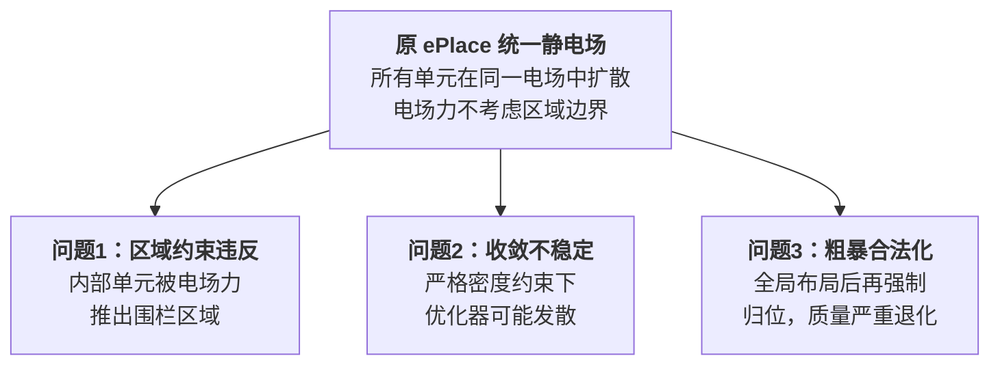
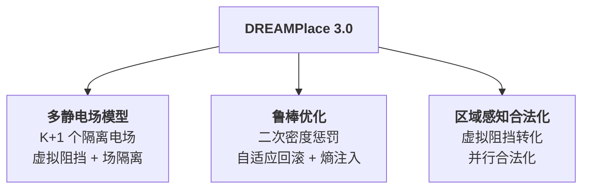
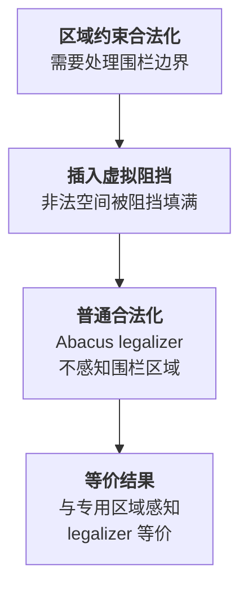
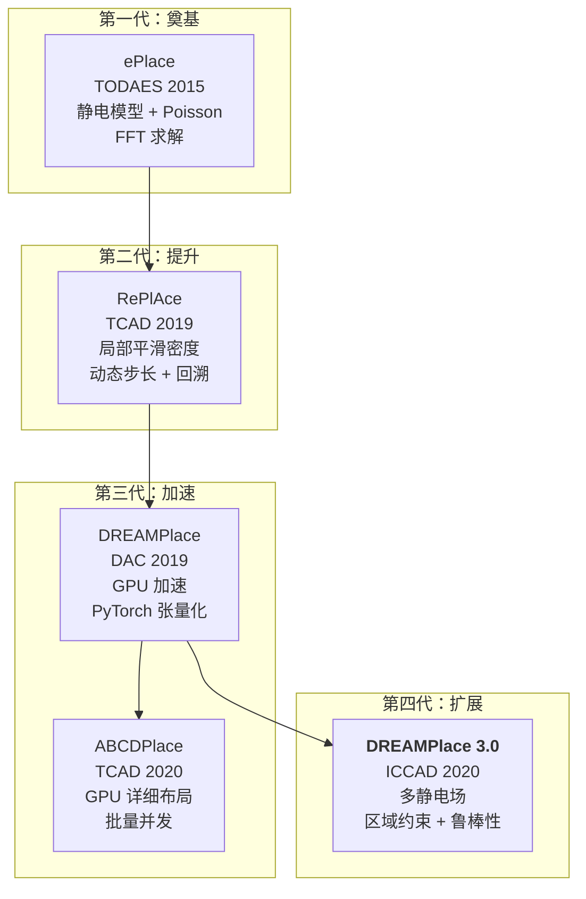

# Day 6: DREAMPlace 3.0 —— 多静电场约束布局与鲁棒优化

> **论文标题**: DREAMPlace 3.0: Multi-Electrostatics Based Robust VLSI Placement with Region Constraints
>
> **作者**: Jiaqi Gu, Zixuan Jiang, Yibo Lin, David Z. Pan
>
> **机构**: The University of Texas at Austin; Peking University
>
> **会议**: IEEE/ACM International Conference on Computer-Aided Design (ICCAD)
>
> **年份**: 2020
>
> **开源代码**: [https://github.com/limbo018/DREAMPlace](https://github.com/limbo018/DREAMPlace)
>
> **分析日期**: 2026-06-08
>
> **系列定位**: 本文是 ePlace → RePlAce → DREAMPlace 系列的重要演进——将单一静电场扩展为**多静电场**，解决区域约束问题并增强鲁棒性。Day 3 的 ePlace 定义了静电布局模型，Day 2 的 RePlAce 提升了解质量，Day 1 的 DREAMPlace 将其搬到 GPU 上，Day 5 的 ABCDPlace 加速了详细布局，而本文 DREAMPlace 3.0 解决了一个被忽视的关键问题——**区域约束（Fence Region）下的静电布局**。

---

## 目录

1. [背景：区域约束为什么重要？](#1-背景区域约束为什么重要)
2. [核心贡献概述](#2-核心贡献概述)
3. [多静电场模型：区域约束的物理化](#3-多静电场模型区域约束的物理化)
4. [二次密度惩罚与动态权重调度](#4-二次密度惩罚与动态权重调度)
5. [散度感知预条件与独立停止准则](#5-散度感知预条件与独立停止准则)
6. [区域感知合法化](#6-区域感知合法化)
7. [鲁棒优化：自适应回滚与熵注入](#7-鲁棒优化自适应回滚与熵注入)
8. [实验结果与分析](#8-实验结果与分析)
9. [创新点深度分析](#9-创新点深度分析)
10. [ePlace 系列演进全景对比](#10-eplace-系列演进全景对比)
11. [参考文献](#11-参考文献)

---

## 1. 背景：区域约束为什么重要？

### 1.1 区域约束（Fence Region）的定义

现代 VLSI 设计中，设计者经常需要将特定单元**约束在指定区域内**——这些区域称为**围栏区域（Fence Region）**。其作用包括：

- **电压隔离**：不同电压域的单元不能混放
- **性能优化**：关键路径上的单元靠近放置以减少延迟
- **功耗管理**：低功耗域与高性能域物理隔离
- **预留空间**：为后续优化步骤（如时钟树综合、ECO）留出空间

围栏区域的约束是**双向的**：
- **内部单元**必须放在区域内
- **外部单元**不允许出现在区域内

一个围栏区域可由多个**空间上不相交**的矩形子区域组成，且这些子区域可能与物理宏单元重叠。

### 1.2 现有方法的困境



> **关键矛盾**：ePlace 的静电模型中，电场力驱动所有可移动单元向低势能区域扩散——这是"全局统一"的力，不区分单元是否应该留在某个围栏区域内。如果全局布局不考虑区域约束，合法化阶段需要大幅移动单元来满足约束，导致之前精心优化的线长严重退化。

### 1.3 DREAMPlace 的不足

原始 DREAMPlace 不支持围栏区域约束。论文作者尝试了简单粗暴的方案——在全局布局过程中做粗合法化（rough legalization）来强制单元回到指定区域——结果性能和稳定性远差于 Eh?Placer 和 NTUplace4dr。

---

## 2. 核心贡献概述

DREAMPlace 3.0 的三大核心贡献：



1. **多静电场模型（Multi-Electrostatics）**：将单一统一电场分解为 K+1 个相互隔离的子电场（K 个围栏区域 + 1 个外部区域），每个子电场独立管理密度、势能、力、权重和停止准则
2. **鲁棒优化机制**：二次密度惩罚（Quadratic Density Penalty）+ 自适应回滚（Self-Adaptive Rollback）+ 熵注入（Entropy Injection），使优化器在严格密度约束下仍能稳定收敛
3. **区域感知合法化**：通过虚拟阻挡将围栏区域约束转化为普通合法化问题，支持并行处理

---

## 3. 多静电场模型：区域约束的物理化

### 3.1 从统一电场到多电场

原始 ePlace 使用**一个统一电场**处理所有单元。DREAMPlace 3.0 的核心创新是将其改造为 **K+1 个隔离电场**：

| 电场编号 | 对应区域 | 包含的单元 |
|---------|---------|-----------|
| 0 | 外部区域（排除了所有围栏区域和宏单元） | 未分配到任何围栏区域的单元 |
| 1 | 围栏区域 1 | 分配给围栏区域 1 的单元 |
| ... | ... | ... |
| K | 围栏区域 K | 分配给围栏区域 K 的单元 |

每个电场拥有独立的：
- **虚拟阻挡（Virtual Blockage）**
- **势能图（Potential Map）**
- **目标密度（Target Density）**
- **电力（Electric Force）**
- **密度权重（Density Weight）**
- **停止准则（Stop Criterion）**

> **关键设计**：场隔离**仅应用于静电相关计算**。线长目标函数仍保持统一——所有单元共享同一个线长目标。这保证了跨区域的网连接仍被正确优化。

### 3.2 虚拟阻挡插入（Virtual Blockage Insertion）

对于第 \$k \\) 个电场，其围栏区域之外的所有可放置空间需要被"封堵"——通过插入**带正电荷的虚拟阻挡**来实现。这些虚拟阻挡在 Poisson 方程求解时会产生排斥力，将单元推回其合法区域。

虚拟阻挡通过几何操作获得：

$$
B_k^+ = \text{rectangle\_slicing}(\Omega_k \setminus M), \quad 0 \leq k < K
$$

$$
B_K^+ = \text{rectangle\_slicing}(\Omega_K \setminus M), \quad k = K \text{ (外部区域)}
$$

其中 \$\Omega_k \\) 是第 \$k \\) 个围栏区域，\$M \\) 是物理宏单元集合，\$\setminus \\) 表示几何差集操作，`rectangle_slicing` 将多边形切分为不相交的矩形。

> **直观理解**：对于围栏区域 1 的电场，区域 1 之外的所有空间被虚拟阻挡填满。这些虚拟阻挡带正电荷，在 Poisson 方程求解时产生"墙"的效果——区域 1 内的单元受到来自虚拟阻挡的排斥力，被限制在区域内。同时，物理宏单元的位置被排除在虚拟阻挡之外，避免了重叠。

### 3.3 独立目标密度

不同区域的单元密度分布不同，使用统一目标密度会导致某些区域过密或过疏。DREAMPlace 3.0 为每个电场计算**独立的目标密度**：

$$
\hat{D}_k = \max\left(\frac{A_k^{mov}}{A_k^{site}} + \delta_D, \hat{D}_{global}\right) = \max\left(\frac{A(\mathcal{V}_k^{mov}) + \delta_D}{A(\Omega_k \setminus M)}, \hat{D}_{global}\right)
$$

其中：
- \$A_k^{mov} \\) 是区域 \$k \\) 内可移动单元的总面积
- \$A_k^{site} \\) 是区域 \$k \\) 的可放置面积
- \$\delta_D \\) 是密度裕度（density margin），防止目标密度过低导致发散
- \$\hat{D}_{global} \\) 是全局目标密度

> **为什么需要密度裕度 \$\delta_D \\)？** 当某个围栏区域的原生利用率（native utilization）接近 100% 时（如 ISPD 2015 的 mgc_fft_1 达到 83.5%），目标密度几乎等于原生利用率，优化空间极小。微小的数值波动就可能导致密度约束无法满足，从而引发优化器发散。\$\delta_D \\) 给了一个安全边界。

### 3.4 独立填充单元（Filler）

每个电场需要独立的填充单元来填充空白空间：

$$
A(\mathcal{F}_k) = \frac{A_k^{site} \cdot \hat{D}_k - A(\mathcal{V}_k^{mov}) - A(M_k)}{1 - \hat{w}_k^{mov} / \hat{D}_k}
$$

填充单元的高度设为布局行高，宽度设为可移动标准单元的平均宽度（去掉最小 5% 和最大 5% 的离群值）。

### 3.5 梯度传播：可微分的 Gather/Scatter

多电场的梯度通过**可微分的 gather/scatter 操作**隔离：

```
前向传播：
  - Gather：将每个电场的单元位置从全局位置数组中收集
  - 各电场独立计算密度目标
  - Scatter：将各电场的梯度写回全局梯度数组

线长目标：统一计算，不受场隔离影响
```

### 3.6 算法复杂度

多电场方法的**顺序复杂度与原始单一电场相同**：

$$
O(|\mathcal{V}_k| + N^2 \log N)
$$

对于区域 \$k \\)，复杂度取决于该区域内的单元数 \$|\mathcal{V}_k| \\) 和网格大小 \$N \\)。因为：
1. 虚拟阻挡的初始密度图只需计算一次
2. 不同区域独立处理其单元

这相对于区域数量的运行时间开销是**亚线性的**。

---

## 4. 二次密度惩罚与动态权重调度

### 4.1 从一阶到二阶密度惩罚

原始 ePlace 使用**一阶密度惩罚**：

$$
\min_{\mathbf{p}} \text{WL}(\boldsymbol{\epsilon}; \mathbf{p}) + \boldsymbol{\lambda}^T \mathbf{D}(\mathbf{p}, \boldsymbol{\Omega})
$$

问题：当线长梯度方向与密度梯度方向不一致时（例如可移动单元与固定宏单元之间缺少网连接），线长目标会试图将所有单元收缩为一个微小集群，需要等待密度权重 \$\lambda \\) 增大到足够大时才开始扩散——造成大量迭代浪费。

DREAMPlace 3.0 引入**二次密度惩罚**（基于增广 Lagrangian）：

$$
\mathcal{L} = \text{WL}(\boldsymbol{\epsilon}; \mathbf{p}) + \boldsymbol{\lambda}^T \mathbf{D}(\mathbf{p}, \boldsymbol{\Omega}) + \frac{\alpha}{2} \sum_k \boldsymbol{\lambda}_k^T \mathbf{D}_k^2(\mathbf{p}, \boldsymbol{\Omega})
$$

其中：
- 第一项是线长目标
- 第二项是**一阶密度惩罚**（线性项）
- 第三项是**二次密度惩罚**（二次项），权重系数 \$\alpha \\) 经验设为 1000

> **二次惩罚的物理意义**：线性惩罚的驱动力与溢出成正比——密度略微超标时驱动力很弱。二次惩罚的驱动力与溢出的**平方**成正比——即使轻微溢出也会产生显著的驱动力。这使得单元在优化早期就开始扩散，而非等待密度权重增大。

### 4.2 密度权重预条件器

密度权重的初始值基于预条件器 \$P \\)：

$$
P = \frac{1}{D_0}
$$

即初始密度的倒数。密度越高的区域，预条件值越小，需要的密度权重调整越精细。

### 4.3 动态密度权重调度（Algorithm 1）

DREAMPlace 3.0 提出了一个基于子梯度的密度权重调度算法：

```
初始化：
  λ₀ ← 1 + α·D₀·P                    # 基于初始密度和预条件器
  f₀ ← WL + λ₀ᵀD₀·P + (α/2)(λ₀ᵀD₀·P)²  # 初始目标函数值
  s₀ ← -∇WL / (λ₀ᵀ∇D₀·P)             # 基于线长/密度梯度比的初始步长
  μ₀ ← (γ-1)·s₀²                     # 初始步长下界

迭代 (k = 1, 2, ...):
  计算归一化子梯度：基于 D/P 和 (D/P)²
  λ_{k+1} ← λ_k + μ_k · (归一化子梯度)    # 梯度下降更新密度权重
  限制 λ_{k+1} ≤ λ_max                   # 防止权重爆炸
  指数增长步长：μ_{k+1} ← f(密度状态)     # 自适应步长增长
```

> **关键参数**：
> - 密度权重缩放因子 \$\gamma \\)：8×10⁻⁵
> - 密度权重步长下界：1.03，上界：1.04
> - 最大密度权重 \$\lambda_{max} \\)：10
>
> 步长以指数方式增长（每步乘以 1.03~1.04），保证密度权重逐渐增大——从线长主导过渡到密度主导。

---

## 5. 散度感知预条件与独立停止准则

### 5.1 散度感知梯度预条件

不同电场的梯度流不平衡——某些区域的优化可能收敛很慢甚至发散。DREAMPlace 3.0 提出了**散度感知预条件器** \$P \\)：

$$
P = \min\left(1, \frac{\beta}{\frac{\partial^2 \text{WL}}{\partial p_i^2} + \alpha \lambda \frac{\partial^2 \mathbf{D}}{\partial p_i^2}}\right)^{-1}
$$

展开为实例级计算：

$$
P = \min\left(1, \frac{\#(v_i) + \alpha \lambda w(v_i)}{h(v_i)}\right)^{-1}
$$

其中：
- \$\#(v_i) \\) 是单元 \$v_i \\) 的引脚数（近似线长二阶导数）
- \$w(v_i) \\) 和 \$h(v_i) \\) 是单元的宽度和高度
- \$\alpha \lambda w(v_i) / h(v_i) \\) 近似密度二阶导数
- \$\beta \\) 初始化为 1，当全局密度溢出低于 0.3 时每 20 次迭代翻倍（上限 \$2^{10} \\)）

> **设计动机**：大尺寸单元在预条件后移动速度较快，容易在后期优化中产生不稳定。通过动态增大 \$\beta \\)，大尺寸单元的预条件值被压缩（移动变慢），从而稳定收敛过程。

最终预条件梯度为：

$$
\hat{\nabla} = \nabla \cdot P
$$

### 5.2 独立停止准则

不同电场的收敛速度不同，使用统一的迭代次数会导致：
- 收敛快的区域：密度权重继续增大 → 权重爆炸 → 发散
- 收敛慢的区域：过早停止 → 密度约束不满足

解决方案：为每个电场设置**独立的停止准则**：

$$
\text{OVFL}_k = \frac{\sum_{i=0}^{N-1}\sum_{j=0}^{N-1} \max(\rho_k(i,j) - \hat{D}_k, 0)}{N^2 \cdot \hat{D}_k}
$$

当第 \$k \\) 个区域的密度溢出低于全局停止阈值（如 0.07）时，**冻结**该区域的所有可移动单元和填充单元。冻结后，线长和密度梯度不再流向这些单元。

> **冻结 vs 继续优化**：冻结是安全的选择——已经满足密度约束的区域不需要继续被扰动。继续优化的风险是密度权重指数增长可能导致该区域发散。

---

## 6. 区域感知合法化

### 6.1 核心思想：将区域约束转化为普通合法化

DREAMPlace 3.0 的合法化方法非常优雅：通过**虚拟阻挡**将围栏区域约束转化为普通的非约束合法化问题。



### 6.2 合法化流程（Algorithm 2）

```
对每个区域 k = 0, 1, ..., K:
  1. 使用 movable macro legalizer 处理可移动宏单元
  2. 使用 greedy legalizer 将标准单元粗略合法化
  3. 检查合法性

如果所有区域都合法:
  对每个区域 k:
    使用 Abacus legalizer 最小化总位移

否则:
  报告空间不足，无法合法布局
```

> **Abacus Legalizer**：一种经典的合法化算法，通过将单元分组到行中并求解二次规划来最小化总位移。DREAMPlace 3.0 使用它来确保合法化后的解尽可能接近全局布局的解。

不同区域的合法化可以**并行执行**，复杂度为 \$O(|\mathcal{V}_k|) \\)。

---

## 7. 鲁棒优化：自适应回滚与熵注入

### 7.1 问题的根源

布局是一个**非凸优化问题**。Nesterov 加速梯度下降在大多数情况下工作良好，但在以下场景中可能失败：

1. **缓慢收敛**：线长力试图将单元收缩，密度力试图将单元扩散，两者方向不一致时产生"拉锯"
2. **完全发散**：在严格密度约束下（目标密度接近原生利用率），优化器在密度溢出波动中失去方向，HPWL 持续恶化

论文给出了实际例子：在 ISPD 2015 的 mgc_fft_1 和 mgc_fft_2 上，原始 DREAMPlace 的 HPWL 和溢出曲线出现明显发散。

### 7.2 窗口式平台检测器（Plateau Detector）

检测缓慢收敛的方法——在一个滑动窗口内检查密度溢出的变化幅度：

$$
\text{PLT} = \frac{\max(\mathbf{o}) - \min(\mathbf{o})}{\text{avg}(\mathbf{o})} < \epsilon, \quad \bar{o} > 0.9
$$

其中 \$\mathbf{o} \\) 是窗口内的密度溢出序列，\$\epsilon = 0.1\% \\)，窗口大小 \$W = 20 \\) 次迭代。

**含义**：如果密度溢出在 20 次迭代内几乎没有变化（变化 < 0.1%），且整体溢出仍然很高（> 0.9），说明优化陷入了平台期。

### 7.3 熵注入（Entropy Injection）

当平台检测器触发时，执行三步操作：

1. **启用二次密度惩罚**（如果当前使用一阶惩罚）
2. **增大密度权重**（如乘以 2×）
3. **注入扰动**：

$$
\hat{x}_i = \gamma \cdot x_i - \frac{\gamma}{|\mathcal{V}|} \sum_j x_j + \eta_i
$$

其中 \$\gamma \in (0,1) \\) 是收缩因子，\$\eta_i \sim \mathcal{N}(0, \sigma^2) \\) 是高斯噪声。

> **熵注入的三个作用**：
> 1. **收缩因子 \$\gamma \\)**：回溯扩散过程，增大密度溢出，为重新优化提供空间
> 2. **高斯噪声 \$\eta \\)**：注入随机性，帮助逃离鞍点或高势能井
> 3. **理论依据**：受扰动梯度下降（Perturbed Gradient Descent）方法启发，Jin et al. [31] 证明加入噪声可以有效逃离鞍点

### 7.4 自适应回滚（Self-Adaptive Rollback）

当优化后期出现发散时（密度溢出显著恶化或 HPWL 超过最佳记录点的一定阈值），立即停止全局布局并**回滚到最佳检查点**。

```
窗口式发散检测器：
  - 在后期阶段（OVFL < 4 × StopOVFL）启用
  - 检查密度溢出是否波动过大
  - 检查 HPWL 和溢出是否比最佳记录差超过阈值（如 100%）

如果检测到发散:
  立即停止全局布局
  回滚到具有最低密度溢出的迭代
  将该检查点作为最终全局布局解
```

> **回滚的直觉**：在非凸优化中，"走得太远"可能比"停在较早的好解"更糟糕。与其让优化器在发散中浪费计算时间并产生更差的解，不如退回到曾经最好的状态。

---

## 8. 实验结果与分析

### 8.1 实验配置

| 项目 | 配置 |
|------|------|
| **平台** | Intel Core i9-7900X @ 3.30GHz + NVIDIA TITAN Xp GPU |
| **精度** | 单精度浮点 |
| **基准测试** | ISPD 2015（含围栏区域）、ISPD 2019、ICCAD 2014 |
| **对比方法** | Eh?Placer (8 CPU线程), NTUplace4dr (8 CPU线程), DREAMPlace (GPU) |

### 8.2 ISPD 2015 区域约束基准（Table 1）

| 对比 | HPWL 改善 | Top5 Overflow 改善 | 运行时加速 |
|------|-----------|-------------------|-----------|
| vs Eh?Placer | **20.6%** | **12.4%** | 3.7× |
| vs NTUplace4dr | **13.1%** | **11.2%** | 34.8× |

> **注意**：DREAMPlace 3.0 是**线长驱动**的布局器，没有显式的可布线性优化。但它在线长和拥塞指标上都优于专门做详细可布线性优化的 Eh?Placer 和 NTUplace4dr——这说明更好的线长优化本身就能改善拥塞。

### 8.3 ISPD 2015 无区域约束基准（Table 2）

| 对比 | HPWL 改善 | Top5 Overflow | 运行时加速 |
|------|-----------|---------------|-----------|
| vs Eh?Placer | 17.0% | -3.8%（更好） | 13.9× |
| vs NTUplace4dr | 7.2% | +3%（稍差） | 37.8× |
| vs DREAMPlace | 1.4% | -3.3%（更好） | 基本持平 |

### 8.4 ISPD 2019 + ICCAD 2014 鲁棒性评估（Table 3）

| 对比 | HPWL 改善 | 运行时改善 |
|------|-----------|-----------|
| vs DREAMPlace | **0.7%** | **10.8%** |

关键发现：
- 13 个基准测试触发了二次惩罚和/或熵注入机制（标注为 q&e）
- 2 个基准测试（fft_1, fft_2）DREAMPlace 发散但 DREAMPlace 3.0 通过回滚成功收敛
- 1 个基准测试（ispd19_test_5）有围栏区域，DREAMPlace 无法处理但 DREAMPlace 3.0 可以
- 1 个基准测试（iccad14_netcard）DREAMPlace 发散但 DREAMPlace 3.0 通过回滚成功收敛

### 8.5 鲁棒机制触发统计

| 机制 | 触发场景 | 效果 |
|------|---------|------|
| **二次密度惩罚** | 高密度约束（利用率 > 80%） | 加速早期扩散 |
| **熵注入** | 平台检测器触发（20 次迭代无进展） | 逃离鞍点 |
| **自适应回滚** | 后期发散检测 | 防止质量退化 |
| **独立停止** | 某区域提前收敛 | 防止权重爆炸 |

---

## 9. 创新点深度分析

### 9.1 创新点一：多静电场——区域约束的物理化建模

**核心思想**：将布局区域划分为 K+1 个独立的"物理世界"，每个世界有自己的电场、势能和力。

> **为什么不用粗合法化？** 粗合法化在 ePlace 框架中效果差，原因是它破坏了电场的全局视野。ePlace 的优势在于 Poisson 方程给出了全局最优的力分布——粗合法化是一种"局部修补"，会引入不连续性。多电场方法则保持了每个区域内 Poisson 方程的全局最优性，同时通过场隔离保证区域约束。

### 9.2 创新点二：虚拟阻挡——几何到物理的桥梁

虚拟阻挡插入将**几何约束**（围栏区域边界）转化为**物理约束**（带正电荷的固定区域），使得 Poisson 方程求解器自然地"看到"了区域边界。

> **深层意义**：这是一种"物理化"的约束处理方式——不是在算法层面添加 if-else 检查，而是在物理模型层面嵌入约束。这保持了整个框架的数学优雅性和可微性。

### 9.3 创新点三：二次密度惩罚——从线性到二次的范式转变

$$
\underbrace{\lambda^T D}_{\text{线性项：力正比于溢出}} \quad \longrightarrow \quad \underbrace{\lambda^T D + \frac{\alpha}{2} \lambda^T D^2}_{\text{二次项：力正比于溢出的平方}}
$$

> **直观理解**：线性惩罚像"弹簧"——位移越大，力越大。但弹簧在微小位移时力很弱。二次惩罚像"硬弹簧"——即使微小位移也会产生显著的力。这使得优化在早期就开始扩散单元，而非等待密度权重增大。

### 9.4 创新点四：熵注入——受理论启发的实践创新

熵注入受到 Jin et al. [31] 的扰动梯度下降理论启发——在非凸优化中，注入噪声可以帮助逃离鞍点。

> **工程意义**：在布局优化中，"鞍点"表现为：密度溢出长时间不变（平台期），但线长已经无法进一步改善。注入噪声打破了这种"虚假的平衡"，让优化器有机会找到更好的解。

### 9.5 创新点五：自适应回滚——安全网机制

> **设计哲学**：非凸优化不保证单调改善。与其祈祷"再多迭代几次会变好"，不如在检测到发散时果断止损。回滚机制就是优化器的"安全带"——它不保证找到全局最优，但保证不会比曾经最好的解更差。

---

## 10. ePlace 系列演进全景对比



| 维度 | ePlace | RePlAce | DREAMPlace | ABCDPlace | **DREAMPlace 3.0** |
|------|--------|---------|------------|-----------|-------------------|
| **年份** | 2015 | 2019 | 2019 | 2020 | **2020** |
| **布局阶段** | 全局 | 全局 | 全局 | 详细 | **全局** |
| **核心创新** | 静电密度模型 | 局部平滑 | GPU 加速 | 批量并发 | **多电场 + 鲁棒** |
| **密度模型** | 单一电场 | 单一电场 | 单一电场 | N/A | **K+1 隔离电场** |
| **密度惩罚** | 一阶 | 一阶 | 一阶 | N/A | **一阶 + 二阶** |
| **区域约束** | ✗ | ✗ | ✗ | ✗ | **✓** |
| **鲁棒性** | 手动调参 | 手动调参 | 可能发散 | — | **自适应回滚 + 熵注入** |
| **平台** | CPU | CPU | GPU | CPU/GPU | **GPU** |
| **vs 前代质量** | 基线 | +2% HPWL | 持平 | 几乎无损 | **+13~20% HPWL (区域约束)** |

> **演进脉络**：ePlace 系列的演进遵循"**能力递增**"的路径——从基础能力（静电建模）到解质量提升（RePlAce）到效率提升（DREAMPlace/ABCDPlace）到功能扩展（DREAMPlace 3.0 区域约束 + 鲁棒性）。每次演进都在不损失已有能力的前提下增加新能力。

---

## 11. 参考文献

1. J. Gu, Z. Jiang, Y. Lin, and D. Z. Pan, "DREAMPlace 3.0: Multi-Electrostatics Based Robust VLSI Placement with Region Constraints," in *Proc. IEEE/ACM ICCAD*, 2020.

2. J. Lu, P. Chen, C. Chang, L. Sha, D. Huang, C. Teng, and C. Cheng, "ePlace: Electrostatics-Based Placement Using Fast Fourier Transform and Nesterov's Method," *ACM TODAES*, vol. 20, no. 2, p. 17, 2015.

3. C. Cheng, A. B. Kahng, I. Kang, and L. Wang, "RePlAce: Advancing Solution Quality and Routability Validation in Global Placement," *IEEE TCAD*, vol. 38, no. 9, pp. 1717–1730, 2019.

4. Y. Lin, S. Dhar, W. Li, H. Ren, B. Khailany, and D. Z. Pan, "DREAMPlace: Deep Learning Toolkit-Enabled GPU Acceleration for Modern VLSI Placement," in *Proc. DAC*, 2019.

5. Y. Lin, W. Li, J. Gu, H. Ren, B. Khailany, and D. Z. Pan, "ABCDPlace: Accelerated Batch-based Concurrent Detailed Placement on Multi-threaded CPUs and GPUs," *IEEE TCAD*, 2020.

6. I. S. Bustany, D. Chinnery, J. R. Shinnerl, and V. Yutsis, "ISPD 2015 Benchmarks with Fence Regions and Routing Blockages for Detailed-Routing-Driven Placement," in *Proc. ISPD*, 2015.

7. N. K. Darav, A. Kennings, A. F. Tabrizi, D. Westwick, and L. Behjat, "Eh?Placer: A High-Performance Modern Technology-Driven Placer," *ACM TODAES*, vol. 21, no. 3, 2016.

8. C. Huang, H. Lee, B. Lin, S. Yang, C. Chang, S. Chen, Y. Chang, T. Chen, and I. Bustany, "NTUplace4dr: A Detailed-Routing-Driven Placer for Mixed-Size Circuit Designs with Technology and Region Constraints," *IEEE TCAD*, vol. 37, no. 3, pp. 669–681, 2018.

9. Z. Zhu, J. Chen, Z. Peng, W. Zhu, and Y. Chang, "Generalized Augmented Lagrangian and Its Applications to VLSI Global Placement," in *Proc. DAC*, 2018.

10. C. Jin, R. Ge, P. Netrapalli, S. M. Kakade, and M. I. Jordan, "How to Escape Saddle Points Efficiently," in *Proc. ICML*, 2017.

---

*本文档由 Claude Code 于 2026-06-08 生成，作为 EDA 论文每日分析系列的第 6 天内容。Day 6 将 ePlace 系列从"单一静电场"推向"多静电场"，同时解决了区域约束和鲁棒性两个关键问题——标志着静电布局框架的功能完整性和工程成熟度达到了新高度。*
