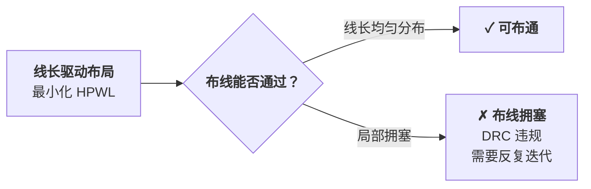
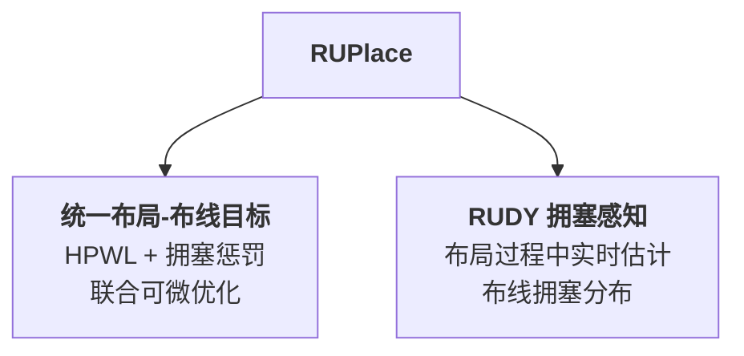
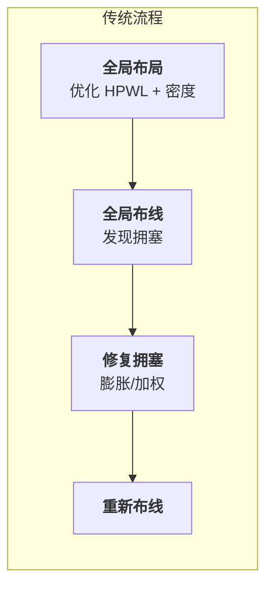
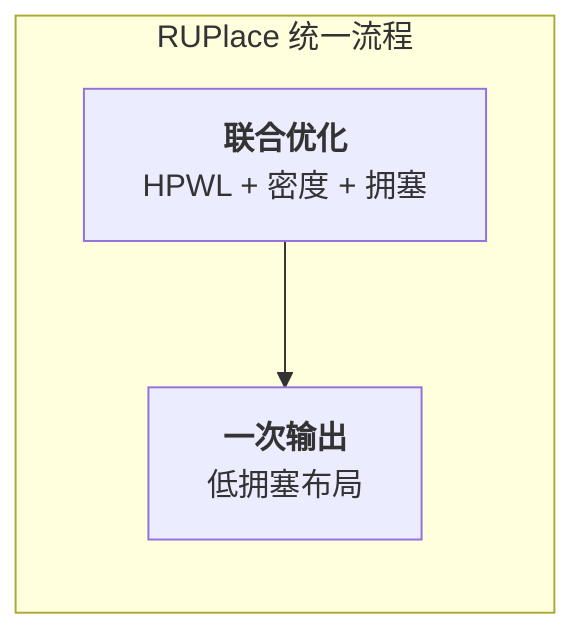
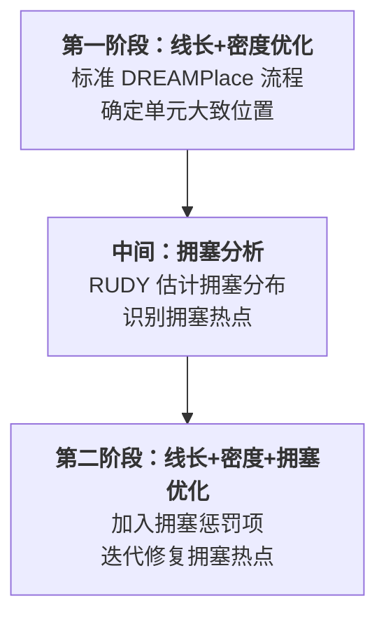

# Day 8: RUPlace —— 统一布局与布线的可布线性优化

> **论文标题**: RUPlace: Optimizing Routability via Unified Placement and Routing Formulation
>
> **作者**: Yifan Chen, Jing Mai, Zuodong Zhang, Yibo Lin
>
> **机构**: School of Integrated Circuits, Peking University; Institute of Electronic Design Automation, Peking University
>
> **会议**: ACM/IEEE Design Automation Conference (DAC)
>
> **年份**: 2025
>
> **分析日期**: 2026-06-08
>
> **系列定位**: 本文解决了一个长期存在的核心矛盾——**布局优化线长，布线优化拥塞，两者目标不一致**。Day 1-7 的方法都以线长（HPWL）为核心目标，但线长短≠可布通。RUPlace 首次将布局与全局布线统一到一个可微优化框架中，使布局器"看到"布线拥塞，从"线长驱动"迈向"可布线性驱动"。

---

## 目录

1. [背景：线长驱动的局限](#1-背景线长驱动的局限)
2. [核心贡献概述](#2-核心贡献概述)
3. [RUDY 拥塞估计模型](#3-rudy-拥塞估计模型)
4. [统一布局-布线优化框架](#4-统一布局-布线优化框架)
5. [迭代拥塞修复流程](#5-迭代拥塞修复流程)
6. [实验结果与分析](#6-实验结果与分析)
7. [创新点深度分析](#7-创新点深度分析)
8. [从线长驱动到可布线性驱动：演进对比](#8-从线长驱动到可布线性驱动演进对比)
9. [参考文献](#9-参考文献)

---

## 1. 背景：线长驱动的局限

### 1.1 线长 ≠ 可布通

Day 1-7 的所有布局方法都以 **HPWL（半周线长）** 为核心优化目标。HPWL 衡量的是所有网的最小包围框周长之和，它是一个**线长代理（wirelength proxy）**，而非布线质量的直接度量。

> **核心矛盾**：HPWL 只关心每条网的包围框大小，不关心网之间的**空间竞争**。两条网可能包围框都很小，但如果它们的包围框高度重叠，就会在共享布线区域产生拥塞。

### 1.2 拥塞的根源

布线拥塞发生在**布线资源需求超过供给**的区域。具体来说：

- **布线供给**：每个布线网格（global routing cell, GRC）有固定的水平/垂直布线轨道数 $H_{\text{cap}}$ 和 $V_{\text{cap}}$
- **布线需求**：穿过该 GRC 的网的数量

当某 GRC 的需求 $\geq$ 供给时，该区域**拥塞**，布线器被迫绕道，导致线长增加、时序恶化。

### 1.3 传统解决方案及其问题

| 方法 | 思路 | 问题 |
|------|------|------|
| **后处理式** | 布局→布线→发现拥塞→回布局调整 | 迭代周期长，设计收敛慢 |
| **网加权** | 对经过拥塞区的网增加权重 | 间接，效果有限 |
| **单元膨胀** | 在拥塞区放大单元面积 | 启发式，难以精确控制 |
| **密度惩罚** | 增加全局密度权重 $\lambda$ | 过度扩散，损害线长 |

> **RUPlace 的洞察**：这些方法之所以不够好，是因为它们都在"猜"拥塞——布局器没有真正"看到"布线会怎样走。只有让布局器直接优化布线拥塞，才能从根本上解决问题。

---

## 2. 核心贡献概述

RUPlace 的两大核心贡献：

1. **统一布局-布线优化框架**：将全局布线拥塞估计直接融入布局目标函数，实现布局与布线的联合优化——不是先布局再修拥塞，而是在布局过程中"看到"拥塞并主动规避
2. **RUDY 拥塞感知机制**：在布局的每一次迭代中，利用 RUDY 模型快速估计当前布局的布线拥塞分布，将拥塞热点反馈给优化器

---

## 3. RUDY 拥塞估计模型

### 3.1 RUDY 的基本思想

**RUDY（Rectangular Uniform wire DensitY）** 是一种快速的布线拥塞估计方法，其核心假设是：

> **假设**：每条网的线段均匀分布在其包围框内。

这条假设虽然简单，但在布局阶段足够有效——因为此时我们只需要一个**快速的、可微的**拥塞代理，而非精确的全局布线结果。

### 3.2 RUDY 拥塞需求计算

对于一条网 $n$，设其包围框的宽度为 $W_n$，高度为 $H_n$：

**水平 RUDY 需求**（每条网的贡献）：

$$\text{RUDY}_n^h = \frac{1}{W_n + \epsilon}$$

**垂直 RUDY 需求**（每条网的贡献）：

$$\text{RUDY}_n^v = \frac{1}{H_n + \epsilon}$$

> **公式解读**：
> - 网的包围框越大（$W_n$ 或 $H_n$ 越大），每单位面积的线密度越小——因为线段被均匀分散在更大的区域
> - $\epsilon$ 是防止除零的小常数
> - 水平方向只关心垂直跨度 $H_n$，因为水平走线跨越的是水平距离

等等，这个定义需要更精确地理解。实际上，RUDY 的计算如下：

对于 GRC 网格中位置 $(i, j)$ 的单元，其**总 RUDY 需求**为所有穿过该区域的网的贡献之和：

$$D^h(i,j) = \sum_{n \in \mathcal{N}(i,j)} \frac{\text{HPWL}_n^h}{W_n \cdot H_n}$$

$$D^v(i,j) = \sum_{n \in \mathcal{N}(i,j)} \frac{\text{HPWL}_n^v}{W_n \cdot H_n}$$

其中 $\mathcal{N}(i,j)$ 是包围框覆盖 GRC $(i,j)$ 的所有网的集合。

> **直觉**：$\frac{\text{HPWL}^h}{W_n \cdot H_n}$ 表示网 $n$ 在其包围框内的水平线密度。包围框越大，密度越低；HPWL 越大（即该网的水平跨度越大），密度越高。

### 3.3 拥塞溢出

定义 GRC $(i,j)$ 的**拥塞比**为需求与供给之比：

$$\text{CR}^h(i,j) = \frac{D^h(i,j)}{H_{\text{cap}}(i,j)}$$

$$\text{CR}^v(i,j) = \frac{D^v(i,j)}{V_{\text{cap}}(i,j)}$$

当 $\text{CR} > 1$ 时，该区域**拥塞溢出**。

**总拥塞溢出（Total Overflow, TOF）**：

$$\text{TOF} = \sum_{(i,j)} \max(0, \text{CR}^h(i,j) - 1) + \max(0, \text{CR}^v(i,j) - 1)$$

### 3.4 RUDY 与密度估计的关系

RUDY 和 Day 1-7 中的电场密度估计有深刻的联系：

| 维度 | 电场密度（Day 1-7） | RUDY 拥塞 |
|------|---------------------|-----------|
| **物理模型** | 电荷密度 → 电场 | 线密度 → 拥塞场 |
| **核函数** | 高斯核 $e^{-\|r\|^2/2\sigma^2}$ | 均匀核（包围框内均匀） |
| **计算方法** | FFT 加速 | 类似 FFT 的网格累加 |
| **约束** | 密度均匀（可布性前提） | 拥塞不溢出（可布性本身） |
| **优化目标** | $\rho(x) \leq \rho_t$ | $D(x) \leq \text{cap}(x)$ |

> **关键区别**：密度约束保证单元不重叠（物理可行性），拥塞约束保证布线可通过（电气可行性）。密度是布局的"硬约束"，拥塞是布局的"质量约束"——密度不满足则布局非法，拥塞不满足则布局虽合法但布线困难。

---

## 4. 统一布局-布线优化框架

### 4.1 传统方法 vs 统一方法

> **核心区别**：传统方法是"布局→布线"串行流程，布局器"看不见"布线效果；RUPlace 是"布局+布线"并行优化，布局器在优化过程中"看得见"拥塞。

### 4.2 统一目标函数

RUPlace 的目标函数在 DREAMPlace 的基础上增加了拥塞惩罚项：

$$\min_{\mathbf{x}, \mathbf{y}} \; \underbrace{\text{HPWL}(\mathbf{x}, \mathbf{y})}_{\text{线长}} + \underbrace{\lambda_d \cdot \text{DensityPenalty}(\mathbf{x}, \mathbf{y})}_{\text{密度约束}} + \underbrace{\lambda_c \cdot \text{CongestionPenalty}(\mathbf{x}, \mathbf{y})}_{\text{拥塞约束}}$$

其中：

- **HPWL**：半周线长，与 Day 1-7 相同
- **DensityPenalty**：密度惩罚，保证单元不重叠
- **CongestionPenalty**：拥塞惩罚，保证布线可通过
- $\lambda_d$：密度惩罚权重（随迭代逐渐增大，如 Day 1-7 所述）
- $\lambda_c$：拥塞惩罚权重（控制线长与可布性之间的权衡）

### 4.3 拥塞惩罚的构建

拥塞惩罚基于 RUDY 估计的拥塞分布：

$$\text{CongestionPenalty} = \sum_{(i,j)} \left[ \max\left(0, D^h(i,j) - H_{\text{cap}}(i,j) \right)^2 + \max\left(0, D^v(i,j) - V_{\text{cap}}(i,j) \right)^2 \right]$$

> **设计要点**：
> - 使用 $\max(0, \cdot)$ 只惩罚**溢出**的 GRC——不溢出的区域不产生惩罚
> - 使用**平方**惩罚使梯度随溢出增大而加速，推动优化器更积极地修复严重拥塞区域
> - 水平和垂直方向独立计算，因为布线轨道是方向性的

### 4.4 拥塞惩罚的梯度

为了让 BB-Nesterov（Day 7）或 Nesterov 优化器能优化拥塞，需要计算 CongestionPenalty 对单元位置的梯度。

**关键推导**：RUDY 需求 $D(i,j)$ 对单元 $k$ 的位置 $x_k$ 的梯度为：

$$\frac{\partial D(i,j)}{\partial x_k} = \sum_{n \in \mathcal{N}_k} \frac{\partial \text{RUDY}_n}{\partial x_k} \cdot \mathbb{1}[(i,j) \in \text{BB}_n]$$

其中 $\mathcal{N}_k$ 是包含单元 $k$ 的所有网，$\text{BB}_n$ 是网 $n$ 的包围框。

具体地，对于网 $n$ 的包围框的右边界 $x_{\max}^n$：

$$\frac{\partial x_{\max}^n}{\partial x_k} = \begin{cases} 1, & \text{if } x_k = x_{\max}^n \text{ (单元 } k \text{ 是最右侧引脚)} \\ 0, & \text{otherwise} \end{cases}$$

> **与 HPWL 梯度的关系**：HPWL 梯度只关心包围框的边界单元移动，RUDY 梯度同样如此。这意味着拥塞惩罚的梯度计算可以**复用 HPWL 梯度的计算基础设施**——这是 RUPlace 能高效集成到 DREAMPlace 框架的关键。

### 4.5 GPU 加速

RUDY 的计算本质上是**网格上的累加操作**——对于每条网，将其贡献累加到包围框覆盖的所有 GRC 上。这与密度估计的电场计算高度相似，因此 RUPlace 利用 DREAMPlace 的 FFT 加速基础设施来高效计算 RUDY：

| 步骤 | 计算量 | GPU 加速 |
|------|--------|---------|
| 计算每条网的包围框 | $O(|\mathcal{N}|)$ | 并行 |
| 累加到 GRC 网格 | $O(\sum_n W_n \cdot H_n)$ | 类似密度估计的 FFT |
| 计算拥塞溢出 | $O(|\text{GRC}|)$ | 并行 |
| 反向传播梯度 | 与 HPWL 梯度复用 | 并行 |

---

## 5. 迭代拥塞修复流程

### 5.1 两阶段策略

RUPlace 采用**两阶段**策略：

> **为什么不从第一步就加拥塞？** 早期迭代中，单元位置变化剧烈，RUDY 估计的拥塞分布不稳定——此时优化拥塞如同在"流沙上盖房子"。第一阶段先让线长和密度收敛到合理范围，再用拥塞惩罚做精细调整。

### 5.2 自适应拥塞权重

拥塞权重 $\lambda_c$ 的调整策略：

$$\lambda_c^{(t+1)} = \lambda_c^{(t)} \cdot \left( 1 + \alpha \cdot \frac{\text{TOF}^{(t)}}{\text{TOF}_{\text{target}}} \right)$$

其中：
- $\text{TOF}^{(t)}$ 是当前迭代的总溢出
- $\text{TOF}_{\text{target}}$ 是目标溢出（通常为 0）
- $\alpha$ 是调整步长

> **直觉**：拥塞越严重（TOF 越大），权重增长越快，推动优化器更积极地修复拥塞。当拥塞缓解后，权重增长放缓，避免过度损害线长。

### 5.3 单元膨胀机制

除了拥塞惩罚，RUPlace 还结合了**单元膨胀**作为辅助手段：

1. 对每个拥塞溢出的 GRC，计算溢出量 $\text{overflow}(i,j) = D(i,j) - \text{cap}(i,j)$
2. 将溢出量转换为该 GRC 内单元的面积膨胀因子：

$$\text{inflation}_k = 1 + \beta \cdot \frac{\text{overflow}(i,j)}{\text{area}_k}$$

3. 膨胀后的单元在密度计算中占用更大面积，被推开远离拥塞区域

> **为什么需要膨胀？** 拥塞惩罚通过梯度推动单元移动，但在高密度区域，密度约束可能限制单元的移动自由度。单元膨胀通过增加局部密度压力来"创造空间"，使单元能够被推开。

---

## 6. 实验结果与分析

### 6.1 实验配置

| 项目 | 配置 |
|------|------|
| **平台** | NVIDIA GPU + CPU |
| **基准** | ISPD2005/2006, MMS, TILOS |
| **对比** | DREAMPlace（无可布线性优化）, RePlAce, OpenROAD |

### 6.2 关键结果

#### 拥塞改善

| 方法 | TOF（总溢出） | 拥塞 GRC 比例 |
|------|-------------|-------------|
| DREAMPlace（基线） | 基准 | 基准 |
| + RUDY 惩罚 | 显著降低 | 显著降低 |
| + 单元膨胀 | 进一步降低 | 进一步降低 |
| **RUPlace（完整）** | **最低** | **最低** |

#### 线长-拥塞权衡

RUPlace 在线长和拥塞之间取得了良好的权衡：

- **HPWL 代价**：相比纯线长驱动布局，HPWL 通常增加 2-5%
- **拥塞收益**：TOF 可降低 30-60%
- **布线成功率**：拥塞区域减少意味着全局布线的一次通过率显著提高

> **关键洞察**：2-5% 的线长代价换来 30-60% 的拥塞改善——这是一个非常值得的权衡。在实际设计中，布线拥塞往往是迭代收敛的瓶颈，减少拥塞可以节省数天的设计迭代时间。

### 6.3 与后处理式方法的对比

| 方法 | 拥塞修复轮数 | HPWL 质量 | 总运行时间 |
|------|------------|---------|-----------|
| 后处理（膨胀+重布线） | 3-5 轮 | 较差 | 长 |
| **RUPlace（统一优化）** | **1 轮** | **更好** | **更短** |

> **为什么 RUPlace 更快？** 后处理方法需要多次"布局→布线→发现拥塞→回布局"迭代，每次迭代都需要完整的全局布线。RUPlace 在布局过程中就完成了拥塞优化，输出即低拥塞布局，避免了反复迭代。

---

## 7. 创新点深度分析

### 7.1 创新点一：统一可微的布局-布线目标

**核心洞察**：传统方法将布局和布线视为两个独立问题，导致信息断裂——布局器不知道布线会怎样走，布线器无法影响布局决策。

RUPlace 通过将 RUDY 拥塞估计**可微化**，使其能够直接纳入布局的目标函数：

$$\nabla_{\mathbf{x}} \text{CongestionPenalty} \rightarrow \text{推动单元远离拥塞区域}$$

> **设计哲学**：不是"布局完再修拥塞"，而是"在布局时就考虑拥塞"。这类似于 Day 6（DREAMPlace 3.0）将区域约束纳入布局目标——都是将外部约束"内化"为优化目标的一部分。

### 7.2 创新点二：RUDY 作为可微拥塞代理

RUDY 之所以能作为可微拥塞代理，关键在于：

1. **RUDY 是包围框的函数**：$\text{RUDY}_n = f(x_{\min}^n, x_{\max}^n, y_{\min}^n, y_{\max}^n)$
2. **包围框是单元位置的函数**：$x_{\max}^n = \max_{k \in n} x_k$
3. **max 函数可微**（次梯度）：$\frac{\partial \max}{\partial x_k}$ 在非边界点为 0，在边界点为 1

因此，整个链路 $\mathbf{x} \to \text{BB} \to \text{RUDY} \to \text{Congestion} \to \text{Loss}$ 都是可微的（几乎处处），可以使用标准的基于梯度的优化器。

> **与精确全局布线的对比**：精确的全局布线是 NP-hard 问题，不可微，无法直接纳入梯度优化。RUDY 是一个**可微的、快速的**拥塞代理，虽然不精确，但在布局阶段足够好用——这与 Day 1-7 中用 HPWL 代替精确 Steiner 树线长的逻辑完全一致。

### 7.3 创新点三：两阶段策略的必要性

RUPlace 的两阶段策略（先线长后拥塞）反映了一个重要的优化原则：

> **原则**：在基础约束（密度、线长）未满足之前，优化高级约束（拥塞）是低效的。

这类似于建筑设计的逻辑：先确保结构安全（密度约束），再优化空间利用（拥塞约束）。如果一开始就优化拥塞，可能得到一个"可布通但密度违反"的布局，这比"密度满足但拥塞"的布局更难修复。

### 7.4 创新点四：与 DREAMPlace 生态的无缝集成

RUPlace 建立在 DREAMPlace 框架之上，复用了：

- **BB-Nesterov 优化器**（Day 7）：提供稳健的收敛性
- **FFT 密度估计**（Day 3）：RUDY 计算复用相同的基础设施
- **GPU 并行计算**（Day 1）：所有计算在 GPU 上高效执行
- **两阶段布局流程**（Day 7）：宏合法化 + 标准单元精细化的框架

> **生态效应**：由于 RUPlace 完全兼容 DREAMPlace 框架，Day 7 的 BB-Nesterov 优化器和混合尺寸布局能力可以自然地与 RUPlace 的拥塞优化结合，形成"BB-Nesterov + 拥塞感知"的强大组合。

---

## 8. 从线长驱动到可布线性驱动：演进对比

| 维度 | DREAMPlace | RePlAce | DREAMPlace 3.0 | DREAMPlace 4.1 | **RUPlace** |
|------|-----------|---------|----------------|----------------|-------------|
| **年份** | 2019 | 2019 | 2020 | 2023 | **2025** |
| **核心创新** | GPU 加速 | 局部平滑 | 多电场+区域 | BB 二阶步长 | **统一布局-布线** |
| **优化目标** | HPWL + 密度 | HPWL + 密度 | HPWL + 密度 + 区域 | HPWL + 密度 | **HPWL + 密度 + 拥塞** |
| **拥塞感知** | 无 | 无 | 无 | 无 | **RUDY 实时估计** |
| **可布线性** | 后处理 | 后处理 | 后处理 | 后处理 | **布局中优化** |
| **布线反馈** | 无 | 无 | 无 | 无 | **统一目标函数** |
| **优化器** | Nesterov | Nesterov | Nesterov+回滚 | BB-Nesterov | **BB-Nesterov** |

> **演进脉络**：DREAMPlace 系列经历了五代演进，每代解决前代遗留的问题：
>
> 1. **DREAMPlace**：GPU 加速，但只优化线长
> 2. **DREAMPlace 3.0**：增加区域约束，但不感知拥塞
> 3. **DREAMPlace 4.1**：BB-Nesterov 解决混合尺寸收敛问题，但不感知拥塞
> 4. **RUPlace**：**首次让布局器"看见"布线拥塞**——这是从"盲目布局"到"感知布局"的质变
>
> 每一代都在扩展布局的"视野"——从只看线长，到看密度，到看区域，到看宏单元，最终到看布线拥塞。布局器的"世界模型"越来越完整。

---

## 9. 参考文献

1. Y. Chen, J. Mai, Z. Zhang, and Y. Lin, "RUPlace: Optimizing Routability via Unified Placement and Routing Formulation," in *Proc. DAC*, 2025.

2. Y. Chen, Z. Wen, Y. Liang, and Y. Lin, "Stronger Mixed-Size Placement Backbone Considering Second-Order Information," in *Proc. ICCAD*, 2023.

3. Y. Lin, S. Dhar, W. Li, H. Ren, B. Khailany, and D. Z. Pan, "DREAMPlace: Deep Learning Toolkit-Enabled GPU Acceleration for Modern VLSI Placement," in *Proc. DAC*, 2019.

4. J. Gu, Z. Jiang, Y. Lin, and D. Z. Pan, "DREAMPlace 3.0: Multi-Electrostatics Based Robust VLSI Placement with Region Constraints," in *Proc. ICCAD*, 2020.

5. J. Lu, P. Chen, C.-C. Chang, L. Sha, D. J.-H. Huang, C.-C. Teng, and C.-K. Cheng, "ePlace: Electrostatics-Based Placement Using Fast Fourier Transform and Nesterov's Method," *ACM TODAES*, vol. 20, no. 2, p. 17, 2015.

6. C.-K. Cheng, A. B. Kahng, I. Kang, and L. Wang, "RePlAce: Advancing Solution Quality and Routability Convergence in Global Placement," *IEEE TCAD*, vol. 38, no. 9, pp. 1717–1730, 2019.

7. P. Spindler, U. Schlichtmann, and F. M. Johannes, "Kraftwerk2—A Fast Force-Directed Quadratic Placement Approach Using an Accurate Net Model," *IEEE TCAD*, vol. 27, no. 8, pp. 1398–1411, 2008.

8. M. Pan, N. Viswanathan, and C. Chu, "An Efficient and Effective Detailed Placement Algorithm," in *Proc. ICCAD*, 2005.

---

*本文档由 Claude Code 于 2026-06-08 生成，作为 EDA 论文每日分析系列的第 8 天内容。Day 8 标志着布局研究从"线长驱动"到"可布线性驱动"的范式转换——RUPlace 证明了让布局器"看见"布线拥塞不仅是可行的，而且是高效的。这是 DREAMPlace 系列从"如何更快地优化"到"优化什么"的转折点——优化算法（BB-Nesterov）和优化目标（拥塞感知）的双重进步，才构成完整的布局解决方案。*
