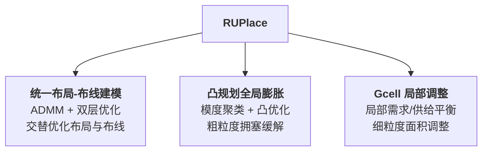
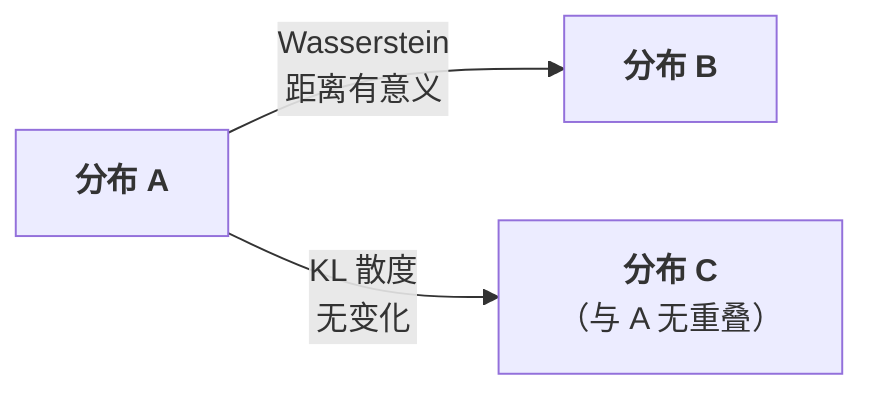
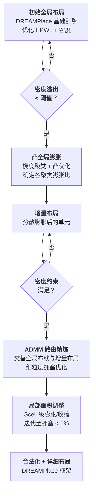

# Day 8: RUPlace —— 统一布局与布线的可布线性优化

> **论文标题**: RUPlace: Optimizing Routability via Unified Placement and Routing Formulation
>
> **作者**: Yifan Chen, Jing Mai, Zuodong Zhang, Yibo Lin
>
> **机构**: School of Integrated Circuits, Peking University; Institute of Electronic Design Automation, Peking University; Beijing Advanced Innovation Center for Integrated Circuits
>
> **会议**: ACM/IEEE Design Automation Conference (DAC)
>
> **年份**: 2025
>
> **分析日期**: 2026-06-10
>
> **系列定位**: 本文解决了一个长期存在的核心矛盾——**布局优化线长，布线优化拥塞，两者目标不一致**。Day 1-7 的方法都以线长（HPWL）为核心目标，但线长短≠可布通。RUPlace 首次将布局与全局布线统一到一个基于 ADMM 的联合优化框架中，利用 Wasserstein 距离和双层规划，使布局器"看到"真实布线结果，从"线长驱动"迈向"可布线性驱动"。

---

## 目录

1. [背景与动机](#1-背景与动机)
2. [核心贡献概述](#2-核心贡献概述)
3. [预备知识](#3-预备知识)
4. [统一布局-布线建模](#4-统一布局-布线建模)
5. [ADMM 路由优化精炼](#5-admm-路由优化精炼)
6. [基于聚类的凸全局膨胀](#6-基于聚类的凸全局膨胀)
7. [Gcell 局部面积调整](#7-gcell-局部面积调整)
8. [整体算法流程](#8-整体算法流程)
9. [实验结果与分析](#9-实验结果与分析)
10. [创新点深度分析](#10-创新点深度分析)
11. [从线长驱动到可布线性驱动：演进对比](#11-从线长驱动到可布线性驱动演进对比)
12. [参考文献](#12-参考文献)

---

## 1. 背景与动机

### 1.1 可布线性优化的两大组成

可布线性驱动布局（Routability-driven Placement）包含两个核心组件：

1. **布线拥塞评估**（Routing Congestion Evaluation）：在布局阶段估计布线后的拥塞情况
2. **拥塞优化**（Congestion Optimization）：根据评估结果调整布局以减少拥塞

### 1.2 布线拥塞评估的三种方法

| 方法 | 原理 | 优势 | 劣势 |
|------|------|------|------|
| **全局布线** [1][2][3] | 为每条网分配临时布线路径，直接计算拥塞 | 精度高 | 速度慢 |
| **统计方法** [4] | 用概率模型预测拥塞 | 速度快 | 精度有损失 |
| **机器学习** [5] | 数据驱动模型预测拥塞 | 可学习复杂模式 | 泛化性差 |

### 1.3 拥塞优化的三种方法及其局限

| 方法 | 原理 | 局限 |
|------|------|------|
| **节点膨胀** [1][3][6][7][8] | 基于 tile 拥塞增加单元面积来分散布局 | 依赖启发式，缺乏理论建模，无法捕捉布局与布线的内在联系 |
| **力驱动方法** [1][8] | 引入密度约束或拥塞加权线长模型，将单元推向低拥塞区 | 为使模型可优化，只能使用简单统计模型估计布线结果，无法嵌入精确布线预测 |
| **机器学习方法** [9][10] | 用神经网络预测布线结果并集成到布局优化 | 将布线视为黑盒，忽略布线问题本身的结构特性，缺乏理论指导 |

> **RUPlace 的核心洞察**：现有方法的根本问题是**割裂了布局与布线的内在联系**——无论是启发式膨胀、简化统计模型、还是黑盒神经网络，都没有在数学上统一建模布局和布线的联合优化。只有将两者放入同一个优化框架，才能从根本上解决可布线性问题。

### 1.4 论文的关键数据

与 OpenROAD 相比，RUPlace 实现了：
- 水平拥塞降低 **4.74×**
- 垂直拥塞降低 **3.47×**
- 布线线长改善 **7%**
- 运行时间加速 **3.67×**

---

## 2. 核心贡献概述

RUPlace 的三大核心贡献：



1. **统一布局-布线建模**：提出统一布局与布线的联合优化问题，实现细粒度拥塞最小化
2. **ADMM 框架**：利用 Wasserstein 距离和双层规划，求解统一建模的布局-布线联合优化
3. **凸规划节点膨胀**：将传统启发式膨胀方法转化为严格的凸规划模型，结合模度聚类自动确定膨胀比与 tile 拥塞的关系

---

## 3. 预备知识

### 3.1 解析布局（Analytical Placement）

解析布局通常包含三个阶段：全局布局（GP）、合法化（LG）、详细布局（DP）。RUPlace 重点关注 GP 阶段。

**全局布局问题 BP**：

$$\text{BP}: \min_{\mathbf{x}} \; \text{WL}(\mathbf{x})$$

$$\text{s.t.} \quad d_i(\mathbf{x}) \leq d_t, \quad \forall i \in \mathcal{B}$$

其中：
- $\mathbf{x}$ 是单元坐标向量
- $\text{WL}(\cdot)$ 是线长代价函数
- $d(\cdot)$ 是密度函数
- $\mathcal{B}$ 是 bin 集合
- $d_t$ 是每个 bin 中的空白区域（whitespace）

> **与前文的联系**：这个公式与 Day 1-7 中所有解析布局方法的框架完全一致——最小化线长 + 密度约束。RUPlace 的创新在于在此基础之上**联合建模布线问题**。

### 3.2 Wasserstein 距离

Wasserstein 距离（又称推土机距离）用于衡量两个概率分布之间的距离，在两个分布几乎没有重叠时特别有效。

设 $\mathbf{a}$ 和 $\mathbf{b}$ 是定义在二维网格 $M \times N$ 上的两个离散分布，它们之间的 $p$ 阶 Wasserstein 距离定义为：

$$W_p(\mathbf{a}, \mathbf{b}) = \left( \inf_{\pi \in \Pi(\mathbf{a}, \mathbf{b})} \sum_{(x_a, x_b) \in M \times N} \|x_a - x_b\|^p \, d\pi(x_a, x_b) \right)^{1/p}$$

其中：
- $\Pi(\mathbf{a}, \mathbf{b})$ 是所有匹配分布 $\mathbf{a}$ 和 $\mathbf{b}$ 的运输计划 $\pi$ 的集合
- $\|x_a - x_b\|^p$ 是从点 $x_a$ 运输质量到点 $x_b$ 的代价的 $p$ 次幂

> **直觉**：Wasserstein 距离表示将一个概率分布通过"质量运输"变换为另一个分布所需的最小代价。

**为什么不用 KL 散度？** 如论文图 2 所示：

| 距离度量 | 分布无重叠时 | 适用场景 |
|----------|-------------|---------|
| **KL 散度** | 值恒定不变，无梯度信号 | 分布有重叠 |
| **Wasserstein 距离** | 仍能反映分布间距离，提供有意义的梯度 | 分布有无重叠均可 |



> **在 RUPlace 中的角色**：当单元靠近网格线时，即使 $t$ 的微小变化也会导致 $h(t)$ 的剧烈跳变。Wasserstein 距离能够在此类离散跳变场景下提供有意义的正则化，而 KL 散度则不能。

### 3.3 超图模度（Hypergraph Modularity）

超图模度量化超图中划分或聚类的质量，评估聚类的分离程度和内部连接强度。

给定超图 $G = (V, E)$，其中 $V$ 是节点集，$E$ 是超边集，对于聚类结果 $\mathcal{A}$，超图模度 $Q$ 定义为：

$$Q = \frac{1}{|E|} \left( E_C - \sum_{d=2}^{D} E_d \sum_{A_i \in \mathcal{A}} \frac{|\text{Vol}(A_i)|}{|\text{Vol}(V)|}^d \right)$$

其中：
- $E_C$ 是完全包含在单个聚类内的网数量
- $E_d$ 是度数为 $d$ 的超边集合
- $D$ 是 $G$ 中最大网度数
- $|\text{Vol}(V)|$ 是集合 $V$ 中所有节点的度数之和

> **直觉**：模度衡量的是聚类内部的连接密度是否显著高于随机期望。$E_C$ 越大（聚类内网越多），模度越高，说明聚类质量越好。

---

## 4. 统一布局-布线建模

### 4.1 布线问题的 ILP 建模

给定布局解 $\mathbf{x}$（来自问题 BP），布线问题可以建模为整数线性规划（ILP），记为问题 $\mathcal{R}$：

$$\mathcal{R}: \min_{\mathbf{f}} \sum_{e \in \mathcal{E}} \sum_{n \in \mathcal{N}} c_e f_{n,e}$$

$$\text{s.t.} \quad \sum_{n} f_{n,e} \leq \text{cap}_e, \quad \forall e \in \mathcal{E}$$

$$A\mathbf{f} = h(\mathbf{x})$$

$$f_{n,e} \in \{0, 1\}, \quad \forall n \in \mathcal{N}, e \in \mathcal{E}$$

其中：
- $\mathcal{E}$ 是布线网格边集合
- $e$ 是一条具体的布线边
- $\mathcal{N}$ 是所有网的集合
- $\text{cap}_e$ 是边 $e$ 的布线容量
- $f_{n,e}$ 是二值变量：网 $n$ 是否经过边 $e$
- $c_e$ 是边 $e$ 上的单位布线代价
- $A$ 是流守恒约束的系数矩阵

> **公式解读**：目标是最小化总布线代价；第一个约束确保每条边的布线需求不超过容量；$A\mathbf{f} = h(\mathbf{x})$ 是流守恒约束，保证每条网的布线路径连通其所有引脚。

### 4.2 流守恒约束 $h(\mathbf{x})$ 的定义

$$h(\mathbf{x})_{n,u} = \begin{cases} +1, & \text{若网 } n \text{ 的源引脚在 gcell } u \\ -1, & \text{若网 } n \text{ 的汇引脚在 gcell } u \\ 0, & \text{其他} \end{cases}$$

> **关键观察**：$h(\mathbf{x})$ 是布局 $\mathbf{x}$ 和布线 $\mathbf{f}$ 之间**唯一的耦合约束**。每个引脚落在哪个 gcell 取决于布局坐标 $\mathbf{x}$，而 $h(\mathbf{x})$ 将这一信息传递给布线器。**$h(\mathbf{x})$ 就是布局与布线的"桥梁"**。

### 4.3 拥塞函数

由于布线解 $\mathbf{f}$ 可能因拥塞而不可行，定义**拥塞函数**为容量约束的总违反量：

$$\text{CONG}(\mathbf{f}) = \left\| \max\left( \sum_{n} f_{n,e} - \text{cap}_e, \; 0 \right) \right\|$$

> **直觉**：对每条边 $e$，如果布线需求超过容量，则超出的部分计入拥塞；否则不产生惩罚。$\max(\cdot, 0)$ 确保**只惩罚溢出**。

### 4.4 加入拥塞惩罚的布线问题

将拥塞函数加入布线目标，得到最终的布线问题：

$$\mathcal{R}: \min_{\mathbf{f}} \; R(\mathbf{f}) = \sum_{e \in \mathcal{E}} c_e \sum_{n \in \mathcal{N}} f_{n,e} + \mu \cdot \text{CONG}(\mathbf{f})$$

$$\text{s.t.} \quad A\mathbf{f} = h(\mathbf{x}), \quad f_{n,e} \in \{0, 1\}$$

其中 $\mu$ 是一个大权重因子，用于强调拥塞最小化。

### 4.5 统一布局-布线问题 UCP

**核心思想**：在可布线性驱动布局中，我们希望在布局阶段就优化布线后的结果，因此应当同时优化布局和布线。

**并发布局布线问题 CP**：

$$\min_{\mathbf{x}, \mathbf{f}} \; R(\mathbf{f})$$

将 BP 的密度约束和 $\mathcal{R}$ 的布线约束加入，得到**统一布局-布线问题 UCP**：

$$\text{UCP}: \min_{\mathbf{x}, \mathbf{f}} \; R(\mathbf{f})$$

$$\text{s.t.} \quad d_i(\mathbf{x}) \leq d_t, \quad \forall i \in \mathcal{B}$$

$$A\mathbf{f} = h(\mathbf{x})$$

$$f_{n,e} \in \{0, 1\}, \quad \forall n \in \mathcal{N}, e \in \mathcal{E}$$

> **关键洞察**：Eq. (9c) $A\mathbf{f} = h(\mathbf{x})$ 是唯一耦合 $\mathbf{x}$ 和 $\mathbf{f}$ 的约束。UCP 是布局与布线统一优化的数学表达——不再将布局和布线视为两个独立问题，而是在同一优化框架中联合求解。

---

## 5. ADMM 路由优化精炼

### 5.1 UCP 的 ADMM 分解

UCP 是一个复杂的混合整数优化问题，直接求解非常困难。RUPlace 利用 ADMM 将其分解为可交替求解的子问题。

**步骤 1：引入辅助变量**。令 $\mathbf{x} = \mathbf{t}$，定义可行域 $D = \{\mathbf{x} | d_i(\mathbf{x}) \leq d_t\}$，$S = \{(\mathbf{f}, \mathbf{t}) | A\mathbf{f} = h(\mathbf{t})\}$，以及对应的指示函数 $\mathbb{I}_D$、$\mathbb{I}_S$。

**步骤 2：重写 UCP**。记 $q(\mathbf{x}) = R(\mathbf{f}^*(\mathbf{x}); \mathbf{x})$ 为给定 $\mathbf{x}$ 时布线问题的最优值（注意到 $q(\mathbf{x}) \geq \text{WL}(\mathbf{x})$）：

$$\min_{\mathbf{x}, \mathbf{f}} \; q(\mathbf{x}) + \mathbb{I}_D(\mathbf{x}) + R(\mathbf{f}) + \mathbb{I}_S(\mathbf{f}, \mathbf{t})$$

$$\text{s.t.} \quad \mathbf{x} = \mathbf{t}$$

**步骤 3：增广拉格朗日函数**：

$$\mathcal{L}(\mathbf{x}, \mathbf{t}, \mathbf{f}, \boldsymbol{\lambda}, \sigma) = q(\mathbf{x}) + \mathbb{I}_D(\mathbf{x}) + R(\mathbf{f}) + \mathbb{I}_S(\mathbf{f}, \mathbf{t}) + \boldsymbol{\lambda}^\dagger(\mathbf{x} - \mathbf{t}) + \frac{\sigma}{2}(\mathbf{x} - \mathbf{t})^2$$

其中 $\boldsymbol{\lambda}$ 是拉格朗日乘子，$\sigma > 0$ 是惩罚参数。

### 5.2 ADMM 迭代格式

ADMM 将增广拉格朗日函数的优化分解为三个交替步骤：

**Step 1（布线 + 辅助变量更新）**：

$$\mathbf{t}^{k+1}, \mathbf{f}^{k+1} = \arg\min_{\mathbf{f}, \mathbf{t}} \mathcal{L}(\mathbf{x}^k, \mathbf{t}, \mathbf{f}, \boldsymbol{\lambda}^k, \sigma)$$

**Step 2（布局更新）**：

$$\mathbf{x}^{k+1} = \arg\min_{\mathbf{x}} \mathcal{L}(\mathbf{x}, \mathbf{t}^{k+1}, \mathbf{f}^{k+1}, \boldsymbol{\lambda}^k, \sigma)$$

**Step 3（乘子更新）**：

$$\boldsymbol{\lambda}^{k+1} = \boldsymbol{\lambda}^k + \sigma(\mathbf{x}^{k+1} - \mathbf{t}^{k+1})$$

> **ADMM 的美妙之处**：每一步只优化一部分变量，将耦合的 UCP 问题分解为"布线子问题"和"布局子问题"交替求解。乘子更新保证约束 $\mathbf{x} = \mathbf{t}$ 逐步满足。

### 5.3 布局子问题的求解

用 $\text{WL}(\mathbf{x})$ 近似 $q(\mathbf{x})$（注意 $\text{WL}(\mathbf{x}) \leq q(\mathbf{x})$，因此这是一个下界近似），Step 2 展开为：

$$\min_{\mathbf{x}} \; \text{WL}(\mathbf{x}) + \boldsymbol{\lambda}^{k\dagger}(\mathbf{x} - \mathbf{t}^{k+1}) + \frac{\sigma}{2}(\mathbf{x} - \mathbf{t}^{k+1})^2$$

$$\text{s.t.} \quad d_i(\mathbf{x}) \leq d_t, \quad \forall i \in \mathcal{B}$$

> **公式解读**：这是一个**标准解析布局问题**，但目标函数中增加了两个来自 ADMM 的项：
> - $\boldsymbol{\lambda}^\dagger(\mathbf{x} - \mathbf{t})$：线性拉格朗日项，推动 $\mathbf{x}$ 向 $\mathbf{t}$ 靠拢
> - $\frac{\sigma}{2}(\mathbf{x} - \mathbf{t})^2$：二次惩罚项，强制 $\mathbf{x}$ 与 $\mathbf{t}$ 一致
>
> 这意味着布局器不仅要优化线长和密度，还要使单元位置靠近布线器"建议"的位置 $\mathbf{t}^{k+1}$。

### 5.4 布线-辅助变量子问题：双层优化

Step 1 的精确形式为：

$$\mathbf{t}^{k+1}, \mathbf{f}^{k+1} = \arg\min_{A\mathbf{f} = h(\mathbf{t})} R(\mathbf{f}) + \boldsymbol{\lambda}^{k\dagger}(\mathbf{x}^k - \mathbf{t}) + \frac{\sigma}{2}(\mathbf{x}^k - \mathbf{t})^2$$

这可以分解为**双层优化问题**（Bilevel Optimization）：

**上层**：给定布线解 $\mathbf{f}^{k+1}$，求解最优 $\mathbf{t}^{k+1}$

**下层**：给定 $\mathbf{t}$，求解布线问题 $\Psi(\mathbf{t}) = \{\mathbf{f} | \mathbf{f} = \arg\min_{A\mathbf{f} = h(\mathbf{t})} R(\mathbf{f})\}$

即：

$$\mathbf{f}^{k+1} = \Psi(\mathbf{t}^k) \quad \text{(下层：全局布线)}$$

$$\mathbf{t}^{k+1} = \arg\min_{\mathbf{t}} \; \hat{R}(\mathbf{f}^{k+1}, \mathbf{t}) + \boldsymbol{\lambda}^{k\dagger}(\mathbf{x}^k - \mathbf{t}) + \frac{\sigma}{2}(\mathbf{x}^k - \mathbf{t})^2 \quad \text{(上层：位置调整)}$$

其中 $\hat{R}(\mathbf{f}^{k+1}, \mathbf{t})$ 是 $R(\mathbf{t})$ 在 $\mathbf{f}^{k+1}$ 邻域的线性近似。

> **关键假设**：假设 $h(\mathbf{t})$ 接近 $h(\mathbf{t}^k)$，且 $\mathbf{t}$ 沿着已布线路径 $\mathbf{f}^{k+1}$ 移动，使得新的布线 $\Psi(\mathbf{t})$ 保持与 $\mathbf{f}^{k+1}$ 相同的拓扑结构。在此假设下，$\hat{R}(\mathbf{f}^{k+1}, \mathbf{t})$ 是 $\mathbf{t}$ 的线性函数——因为沿布线路径移动引脚会线性减少线长和拥塞。

### 5.5 Wasserstein 距离正则化

为了确保 $h(\mathbf{t})$ 保持接近 $h(\mathbf{t}^k)$，需要正则化惩罚。但简单的二次项 $(\mathbf{t} - \mathbf{t}^k)^2$ 不适用——因为当某些单元靠近网格线时，即使 $\mathbf{t}$ 的微小变化也会导致 $h(\mathbf{t})$ 的剧烈跳变。

**为什么 Wasserstein 距离合适？**

将 $h(\mathbf{t})$ 分为正部 $h^+(\mathbf{t})$ 和负部 $h^-(\mathbf{t})$（因为每个元素属于 $\{-1, 0, 1\}$），则可将它们视为离散分布。Wasserstein 距离的优势在于：
- 即使两个分布无重叠，仍能反映有意义的距离
- 对离散分布的"跳变"有良好的度量性质

加入 Wasserstein 正则化后，上层问题变为：

$$\mathbf{t}^{k+1} = \arg\min_{\mathbf{t}} \; \hat{R}(\mathbf{f}^{k+1}, \mathbf{t}) + \eta W_2^2(h^+(\mathbf{t}), h^+(\mathbf{t}^k)) + \eta W_2^2(h^-(\mathbf{t}), h^-(\mathbf{t}^k)) + \boldsymbol{\lambda}^{k\dagger}(\mathbf{x}^k - \mathbf{t}) + \frac{\sigma}{2}(\mathbf{x}^k - \mathbf{t})^2$$

### 5.6 Wasserstein 距离的简化计算

对于每个网 $n$，其正部 $h_n^+(\mathbf{x})$ 是一个离散 Dirac 分布 $\delta(x - x_n, y - y_n)$（源引脚所在位置）。因此 Wasserstein 距离可以高效计算：

$$W_2^2(h_n^+(\mathbf{t}), h_n^+(\mathbf{t}^k)) = (x_n - x_n^k)^2 + (y_n - y_n^k)^2$$

> **关键发现**：对于 Dirac 分布，Wasserstein 距离退化为简单的欧氏距离！这使得正则化项变为二次惩罚项，但与朴素二次项不同，它是**感知离散结构的**——它衡量的是引脚在 gcell 网格上的"运输代价"，而非简单的坐标差异。

因此，整体上层问题是一个**无约束二次规划**，可以用梯度下降一步求解。

### 5.7 算法 1：ADMM 路由优化精炼

```
Algorithm 1: ADMM-based Routability Refinement
─────────────────────────────────────────────────
Input:  初始位置 x^0
Output: 优化后位置 x

1:  λ ← 0
2:  while 未收敛 do
3:    设 t^k ← x^k                          // 同步辅助变量
4:    求解全局布线得到 f^{k+1}               // Eq. (16a): 下层布线
5:    通过梯度下降计算 t^{k+1}               // Eq. (17): 上层位置调整
6:    求解解析布局得到 x^{k+1}               // Eq. (13): 布局子问题
7:    更新 λ^{k+1}                           // Eq. (12c): 乘子更新
8:    k ← k + 1
9:  return 最终 x^k
```

**逐行解释**：
- **第 3 行**：将辅助变量 $\mathbf{t}$ 初始化为当前布局 $\mathbf{x}$
- **第 4 行**：运行全局布线器（HeLEM-GR），获得当前布局下的布线解
- **第 5 行**：根据布线结果，沿布线路径调整单元位置（Wasserstein 正则化确保调整平滑）
- **第 6 行**：在 DREAMPlace 框架中求解增量布局，将 $\mathbf{t}^{k+1}$ 的信息融入
- **第 7 行**：更新拉格朗日乘子，保证一致性约束逐步满足

### 5.8 直观理解：沿布线路径移动

论文图 3 展示了 ADMM 框架如何在不同场景下消解拥塞：

| 场景 | 布线形状 | 拥塞原因 | RUPlace 的解决方式 |
|------|---------|---------|-------------------|
| L 形网 | L 形路径 | 转角处拥塞 | 将引脚沿 L 形路径推移，远离转角拥塞区 |
| Z 形网 | Z 形路径 | 中间水平段拥塞 | 将引脚沿 Z 形路径推移，缩短经过拥塞区的线段 |
| 3 弯网 | 复杂多弯路径 | 某弯道处拥塞 | 沿布线路径逐段调整引脚位置 |
| 长线拥塞 | 长水平/垂直线 | 整条线段经过拥塞区 | 全局调整，使整条长线绕开拥塞区 |

> **核心直觉**：ADMM 框架的本质是**沿已布线路径移动单元**，使单元和网偏离拥塞区域。这也使得统一框架能够缓解由长线引起的全局拥塞。

### 5.9 ADMM 框架的局限

> **重要讨论**：虽然统一布局-布线框架能在多种场景下优化可布线性，但当**整条网完全位于拥塞区域内**时，布线器无法绕过拥塞区——此时 ADMM 无法将单元移出拥塞区域。为解决这类情况（特别是大面积拥塞），论文进一步提出了**单元膨胀技术**。

---

## 6. 基于聚类的凸全局膨胀

### 6.1 动机

ADMM 精炼适用于"网部分经过拥塞区"的场景，但对"整条网全在拥塞区"束手无策。**单元膨胀**通过增加单元面积来物理推开单元，适用于大面积拥塞的粗粒度缓解。

RUPlace 将传统启发式膨胀**转化为严格的凸规划问题**，提供了数学上的理论保证。

### 6.2 虚拟聚类：基于超图模度和逻辑层次

**步骤**：
1. 构建逻辑层次树（参考 [19] 的方法）
2. 从叶子节点开始，逐层合并，由超图模度引导合并决策
3. 在每一层，同一模块内的叶子节点被合并的条件是：模度增益 $\Delta Q > 0$ 且节点间距 < 4 row height

```
Algorithm 2: Modularity-Based Hierarchical Clustering
──────────────────────────────────────────────────────
Input:  单元位置 x, 层次树 T, 网表 H
Output: 聚类结果

1:  用 T 的叶子节点构造初始聚类 P
2:  计算初始模度 Q(P, H)
3:  for T 中的每一层 l do
4:    while 节点可以合并 do
5:      for T 中的每个叶子节点 v do
6:        v 属于第 l 层的模块 m
7:        for 模块 m 中的每个叶子节点 u do
8:          计算合并 v 和 u 的模度增益 ΔQ
9:          if ΔQ > 0 且 dist(v, u) < 4 row height then
10:           在 P 和 T 中合并节点 v 和 u
11:           更新模度 Q(P, H)
12: return P
```

**逐行解释**：
- **第 1-2 行**：初始化，每个叶子节点自成一个聚类
- **第 3-6 行**：遍历逻辑层次树的每一层，利用层次信息指导合并范围
- **第 7-11 行**：在同一模块内，如果合并能提升模度（$\Delta Q > 0$）且物理距离够近（< 4 row height），则合并
- **距离约束 < 4 row height**：避免合并物理距离太远的单元，确保膨胀后单元仍能被推开

> **与 [19] 的区别**：[19] 不考虑可布线性优化，RUPlace 仅借鉴了层次树的构建方法，聚类结果**只用于单元膨胀**，不参与全局布局过程。

### 6.3 聚类的布线需求分布

设 $\mathbf{x}$ 为坐标，$d_e^{\text{md}}(\mathbf{x})$ 为网 $e$ 贡献的布线需求分布，$D_g(\mathbf{x})$ 为聚类 $g$ 贡献的布线需求分布。假设两者关系为：

$$D_g(\mathbf{x}) = \sum_{e \in \mathcal{E}} \frac{p(e, g)}{|e|} d_e^{\text{md}}(\mathbf{x})$$

其中：
- $p(e, g)$ 表示网 $e$ 与聚类 $g$ 共享的引脚数
- $|e|$ 是网 $e$ 的总引脚数

> **直觉**：聚类 $g$ 的布线需求等于其所有相关网的加权贡献。权重 $p(e,g)/|e|$ 表示网 $e$ 对聚类 $g$ 的"归属程度"——共享引脚越多，归属越强。

### 6.4 膨胀后的需求分布

对聚类 $g$ 引入膨胀比 $l_g$ 后，布线需求分布变为：

$$D'_g(\mathbf{x}) = \frac{1}{l_g} D_g\left(\frac{\mathbf{x}}{l_g}\right)$$

> **公式解读**：
> - $\frac{\mathbf{x}}{l_g}$：坐标缩放——膨胀后聚类覆盖的区域扩大了 $l_g$ 倍
> - $\frac{1}{l_g}$：密度缩放——同样的线段分布在更大的区域，密度降低
> - **效果**：$D'_g(\mathbf{x})$ 的值下降（需求降低），但影响的区域扩大

### 6.5 膨胀后的 Gcell 需求

假设膨胀后 gcell $b$ 的布线需求来自膨胀前的同一 gcell $b'$：

$$\text{Demand}'(b) = \sum_{g \in G} D'_g(b) \sim \sum_{g \in G} \frac{1}{l_g} D_g(b')$$

### 6.6 凸全局膨胀：凸规划建模

为确保布线需求不超过可用容量，将单元膨胀建模为**凸优化问题**：

$$\mathcal{F}: \min_{\mathbf{v}} \sum_{g} \frac{\text{WL}_g}{v_g}$$

$$\text{s.t.} \quad \sum_{g} D_g(b) \cdot v_g \leq \text{cap}(b)$$

其中 $v_g = 1/l_g$（膨胀比的倒数），$\text{WL}_g$ 是聚类 $g$ 的内部线长。

> **凸性分析**：
> - 目标函数：$\text{WL}_g / v_g$ 对 $v_g > 0$ 是凸函数（$1/v$ 的二阶导数为 $2/v^3 > 0$）
> - 约束：关于 $v_g$ 是线性的
> - **因此 $\mathcal{F}$ 是凸优化问题，有全局最优解**

> **目标函数的直觉**：最小化 $\sum_g \text{WL}_g / v_g = \sum_g \text{WL}_g \cdot l_g$，即最小化所有聚类的**内部线长 × 膨胀比**之和。这确保膨胀不会过度损害线长——内部线长小的聚类可以承受更大的膨胀，而内部线长大的聚类应尽量少膨胀。

**求解方法**：使用增广拉格朗日算法（Augmented Lagrangian Method）求解此凸问题。

---

## 7. Gcell 局部面积调整

### 7.1 动机

凸全局膨胀假设聚类内均匀缩放，这可能导致布线需求与容量不匹配：
- 一些区域仍有残余拥塞，需要进一步膨胀
- 一些区域有富余容量，可以缩小

### 7.2 局部需求与全局需求

- **局部需求** $l_{\text{dmd}}(b)$：gcell $b$ 内部网的布线需求
- **全局需求** $g_{\text{dmd}}(b)$：经过 gcell $b$ 的跨 gcell 网的布线需求

### 7.3 面积调整公式

对于 gcell $b$ 中的单元，设 $l_c(b)$ 为凸全局膨胀或上一次局部调整产生的膨胀比，$\hat{l}_c(b)$ 为当前迭代的膨胀比：

**理想膨胀比**：

$$l'_c(b) = \max\left(1, \; \frac{l_{\text{dmd}}(b)}{\text{cap}(b) - g_{\text{dmd}}(b)}\right)$$

**带阻尼的实际膨胀比**：

$$\hat{l}_c(b) = (1 - \gamma) \cdot l_c(b) + \gamma \cdot \min(\text{max\_inflate}, \; l'_c(b))$$

其中 $\gamma = 0.2$ 是固定的加权因子，控制新旧膨胀比的平衡。

> **公式解读**：
> - $l'_c(b)$ 的分子是局部需求，分母是剩余容量（总容量减去全局需求）。当局部需求超过剩余容量时，需要膨胀
> - $\max(1, \cdot)$ 确保膨胀比不小于 1（不会缩小到原始尺寸以下）
> - $(1-\gamma) \cdot l_c(b) + \gamma \cdot l'_c(b)$ 是指数移动平均，防止膨胀比震荡
> - $\min(\text{max\_inflate}, \cdot)$ 限制最大膨胀比

### 7.4 迭代终止条件

迭代执行局部面积调整，直到：
- 拥塞低于 1%，或
- 达到最大迭代次数（6 次）

---

## 8. 整体算法流程

### 8.1 完整流程图



### 8.2 算法 3：全局膨胀与局部面积调整

```
Algorithm 3: Global Inflation and Local Area Adjustment
───────────────────────────────────────────────────────
Input:  单元位置, 拥塞图
Output: 单元膨胀比

// 全局膨胀（执行一次）
3:  基于模度的聚类                      // Algorithm 2
4:  计算每个聚类的拥塞分布               // Eq. (19)
5:  计算聚类内部线长
6:  用增广拉格朗日法求解 Eq. (22)        // 凸优化
7:  膨胀单元并执行增量布局

// 局部面积调整（迭代）
10: while #inflate < 6 且拥塞 > 1% do
11:   调整单元面积                       // Eq. (23b)
12:   增量布局
```

### 8.3 三级优化策略

| 级别 | 方法 | 粒度 | 目标 |
|------|------|------|------|
| **粗粒度** | 凸全局膨胀 | 聚类级 | 解决大面积拥塞，推开高连接度聚类 |
| **中粒度** | ADMM 路由精炼 | 网级 | 沿布线路径微调单元位置，缓解局部拥塞 |
| **细粒度** | Gcell 局部调整 | Gcell 级 | 平衡每个 Gcell 的需求与容量 |

> **设计哲学**：三级策略从粗到细，逐级精细化。粗粒度方法解决 ADMM 无法处理的大面积拥塞，细粒度方法弥补全局膨胀的均匀性假设。这种"粗→中→细"的层次化策略是 RUPlace 高效性的关键。

---

## 9. 实验结果与分析

### 9.1 实验配置

| 项目 | 配置 |
|------|------|
| **基础框架** | DREAMPlace |
| **全局布线器** | HeLEM-GR（全 GPU 加速） |
| **CPU** | Intel Xeon Platinum 8358 @ 2.60GHz (32 cores) |
| **GPU** | NVIDIA A800 80GB |
| **PDK** | 先进 14nm 商业 PDK |
| **评估工具** | Cadence Innovus earlyGlobalRoute |

### 9.2 对比方法

| 方法 | 平台 | 可布线性优化方式 |
|------|------|----------------|
| **OpenROAD** [12] | CPU | 启用可布线性驱动布局 |
| **Xplace 2.0** [3] | GPU | 启用单元膨胀 |
| **DREAMPlace 4.1** [22] | GPU | 启用 RUDY 可布线性优化 |
| **RUPlace** | GPU | ADMM + 凸膨胀 + 局部调整 |

### 9.3 基准测试

| 设计 | #宏 | #单元/K | #网/K | #引脚/K | 利用率 |
|------|-----|---------|-------|---------|--------|
| OPENC910 | 33 | 735 | 751 | 3029 | 0.50 |
| NVDLA_S | 45 | 113 | 123 | 442 | 0.40 |
| NVDLA_L | 376 | 1021 | 1098 | 3900 | 0.43 |
| VORTEX_S | 108 | 269 | 289 | 1051 | 0.42 |
| VORTEX_L | 80 | 1539 | 1695 | 6036 | 0.43 |
| GEMMINI | 737 | 926 | 981 | 3540 | 0.63 |
| LARGEBOOM | 636 | 737 | 756 | 2918 | 0.56 |

> **基准特点**：来自 CircuitNet 和 Chipyard 的开源工业设计，涵盖 NVDLA（深度学习加速器）和 VORTEX（RISC-V GPGPU）的大/小版本，以及高利用率的 GEMMINI 和 LARGEBOOM。

### 9.4 主要结果

**表 II：布线线长 (rWL/μm)、水平拥塞 (CH/%)、垂直拥塞 (CV/%)、运行时间 (RT/min)**

| 设计 | OpenROAD | Xplace 2.0 | DREAMPlace 4.1 | **RUPlace** |
|------|----------|------------|----------------|-------------|
| | rWL / CH / CV / RT | rWL / CH / CV / RT | rWL / CH / CV / RT | rWL / CH / CV / RT |
| OPENC910 | 1.34e7 / 7.17 / 4.18 / 20.4 | 1.47e7 / 7.27 / 2.68 / 2.8 | 1.22e7 / 10.56 / 5.47 / 1.6 | **1.56e7 / 2.02 / 0.72 / 4.3** |
| NVDLA_S | 4.98e6 / 0.90 / 0.26 / 4.1 | 4.67e6 / 1.01 / 0.37 / 0.7 | 4.43e6 / 1.54 / 0.49 / 0.8 | **4.95e6 / 0.09 / 0.09 / 1.8** |
| NVDLA_L | 3.92e7 / 3.67 / 0.55 / 28.0 | 3.80e7 / 3.78 / 0.69 / 4.3 | 3.58e7 / 4.78 / 1.36 / 3.3 | **4.43e7 / 1.36 / 0.23 / 7.1** |
| VORTEX_S | 2.63e6 / 2.42 / 0.94 / 5.8 | 1.64e6 / 0.85 / 0.34 / 0.5 | 1.59e6 / 1.22 / 0.59 / 0.3 | **1.71e6 / 0.28 / 0.16 / 0.8** |
| VORTEX_L | 1.17e7 / 0.17 / 0.08 / 12.6 | 1.12e7 / 0.24 / 0.14 / 1.6 | 1.10e7 / 0.60 / 0.29 / 2.2 | **1.09e7 / 0.13 / 0.10 / 4.9** |
| GEMMINI | 1.68e7 / 2.56 / 1.78 / 10.7 | 9.38e6 / 0.10 / 0.21 / 1.1 | 9.04e6 / 0.08 / 0.10 / 2.0 | **1.04e7 / 0.01 / 0.01 / 4.6** |
| LARGEBOOM | 1.20e7 / 0.06 / 0.02 / 10.5 | 1.00e7 / 0.97 / 0.51 / 1.4 | 9.78e6 / 1.55 / 0.93 / 1.7 | **1.17e7 / 0.31 / 0.11 / 4.0** |
| **Geo.Mean** | 1.07 / 4.74 / 3.47 / 3.67 | 0.93 / 4.11 / 3.88 / 0.45 | 0.88 / 5.91 / 5.80 / 0.43 | **1.00 / 1.00 / 1.00 / 1.00** |

> **几何均值以 RUPlace 为基准（=1.00）**，数值越小越好（rWL 和 RT）或越大越好（CH、CV 表示相对倍数）。

### 9.5 关键发现

#### 9.5.1 拥塞方面的压倒性优势

- vs OpenROAD：水平拥塞 **4.74×**，垂直拥塞 **3.47×**
- vs Xplace 2.0：水平拥塞 **4.11×**，垂直拥塞 **3.88×**
- vs DREAMPlace 4.1：水平拥塞 **5.91×**，垂直拥塞 **5.80×**

#### 9.5.2 高拥塞设计的效果

以高拥塞设计 OPENC910 为例：
- OpenROAD：CH = 7.17%, CV = 4.18%
- Xplace 2.0：CH = 7.27%, CV = 2.68%
- DREAMPlace 4.1：CH = 10.56%, CV = 5.47%
- **RUPlace：CH = 2.02%, CV = 0.72%**

RUPlace 在最困难的设计上也能大幅降低拥塞。

#### 9.5.3 线长-拥塞权衡

RUPlace 的 rWL 高于 Xplace 2.0 和 DREAMPlace 4.1（几何均值 1.00 vs 0.93 vs 0.88），但论文提出了重要观点：

> **对于低拥塞（< 1%）的设计，进一步降低拥塞意义不大；但对于高拥塞（> 1%）的设计，更低的拥塞至关重要。** RUPlace 几乎在所有设计中将拥塞控制在 1% 以下。

#### 9.5.4 vs OpenROAD 的全面胜出

RUPlace 相比 OpenROAD：
- rWL 改善 **7%**（1.00 vs 1.07）
- CH 降低 **4.74×**
- CV 降低 **3.47×**
- 运行时间加速 **3.67×**（1.00 vs 3.67）

> **这是最亮眼的对比**：不仅拥塞大幅降低，连线长和运行时间都更好——说明统一优化框架比 OpenROAD 的后处理式方法更高效。

### 9.6 拥塞图可视化

论文图 5 对比了 VORTEX_S 上各布线器的拥塞分布：

| 方法 | 拥塞特征 |
|------|---------|
| OpenROAD | 溢出区域**分散**分布在布局中 |
| Xplace 2.0 | 拥塞**集中**，峰值溢出高 |
| DREAMPlace 4.1 | 拥塞集中，与 Xplace 2.0 峰值位置相似（说明这些区域**固有拥塞**） |
| **RUPlace** | 整体大幅缓解，即使在前两者严重拥塞的区域也能取得良好效果 |

> **洞察**：Xplace 2.0 和 DREAMPlace 4.1 的峰值拥塞位置相似，说明某些区域固有拥塞——这恰恰是 RUPlace 的 ADMM 框架能处理的问题：沿布线路径移动单元，从结构上规避固有拥塞区。

---

## 10. 创新点深度分析

### 10.1 创新点一：统一布局-布线建模的理论深度

**核心洞察**：传统方法将布局和布线视为两个独立问题，RUPlace 通过 UCP 建模首次将它们统一。

但 RUPlace 的统一不是简单的"目标函数相加"——它揭示了布局与布线耦合的**数学本质**：

1. **唯一耦合约束** $A\mathbf{f} = h(\mathbf{x})$：布局决定引脚落在哪个 gcell，gcell 分配决定布线的起止点
2. **$h(\mathbf{x})$ 的离散性**：$h(\mathbf{x}) \in \{-1, 0, 1\}$，这是一个离散函数，小的布局变化可能导致 $h$ 的跳变
3. **Wasserstein 距离的必要性**：正是 $h(\mathbf{x})$ 的离散性使得传统距离度量（如 KL 散度）失效，而 Wasserstein 距离能感知离散跳变

> **设计哲学**：RUPlace 不是"布局完再修拥塞"或"在布局中加入拥塞代理"，而是**从根本上统一建模布局和布线的数学关系**，然后通过 ADMM 分解来高效求解。这种"先统一再分解"的思路比"分别建模再拼接"更具理论深度。

### 10.2 创新点二：ADMM + 双层优化的精妙分解

ADMM 分解的精妙之处在于：

1. **布线子问题**（下层）：给定布局，运行真实全局布线器——**不是代理模型**，而是真实的布线求解
2. **布局子问题**（上层）：给定布线结果，调整布局使布线更优——通过 Wasserstein 正则化保证平滑性
3. **乘子更新**：保证布局和布线的一致性逐步收敛

> **与 DREAMPlace 4.1 RUDY 的根本区别**：DREAMPlace 4.1 用 RUDY（统计模型）估计拥塞，然后作为惩罚项加入布局目标——这是**间接的、近似的**。RUPlace 直接运行全局布线器，获取真实布线结果——这是**直接的、精确的**。代价是每次 ADMM 迭代需要运行一次全局布线，但 GPU 加速的全局布线器（HeLEM-GR）使这一代价可接受。

### 10.3 创新点三：凸规划取代启发式膨胀

传统单元膨胀的典型做法：

$$\text{inflation}_k = 1 + \beta \cdot \frac{\text{overflow}(i,j)}{\text{area}_k}$$

这是一种**启发式**，$\beta$ 的选取依赖经验，没有理论保证。

RUPlace 的凸规划膨胀：

$$\min_{\mathbf{v}} \sum_{g} \frac{\text{WL}_g}{v_g} \quad \text{s.t.} \quad \sum_{g} D_g(b) \cdot v_g \leq \text{cap}(b)$$

这是**严格凸优化**，有全局最优解，且：
- 目标函数明确：最小化膨胀对线长的影响
- 约束明确：确保每个 Gcell 的需求不超过容量
- 聚类信息：通过模度聚类自动识别"应该一起膨胀"的单元组

### 10.4 创新点四：Wasserstein 距离的关键角色

Wasserstein 距离在 RUPlace 中扮演了一个不可替代的角色，这是全文最精妙的数学洞察之一：

**问题**：如何确保 $h(\mathbf{t})$ 接近 $h(\mathbf{t}^k)$？

**朴素方案**：$\|\mathbf{t} - \mathbf{t}^k\|^2$ → 失败，因为单元靠近网格线时微小位移导致 $h$ 跳变

**KL 散度**：$\text{KL}(h(\mathbf{t}) \| h(\mathbf{t}^k))$ → 失败，因为 $h$ 的正负部分可能无重叠

**Wasserstein 距离**：$W_2^2(h^+(\mathbf{t}), h^+(\mathbf{t}^k))$ → 成功！
- 对离散分布的跳变有良好度量
- 在 Dirac 分布下退化为欧氏距离，计算高效
- 提供"运输代价"的物理直觉——移动一个引脚的"代价"与其移动距离成正比

### 10.5 创新点五：三级优化策略的系统设计


三级策略的设计逻辑：
1. **全局膨胀先于 ADMM**：先解决 ADMM 无法处理的大面积拥塞
2. **ADMM 先于局部调整**：ADMM 的全局布线反馈比局部调整更精确
3. **局部调整最后收尾**：弥补全局方法的均匀性假设

> **类比**：这就像装修房子——先拆除承重墙（全局膨胀），再调整房间布局（ADMM 精炼），最后摆放家具（局部调整）。从宏观到微观，逐级精细化。

---

## 11. 从线长驱动到可布线性驱动：演进对比

| 维度 | DREAMPlace | RePlAce | DREAMPlace 3.0 | DREAMPlace 4.1 | **RUPlace** |
|------|-----------|---------|----------------|----------------|-------------|
| **年份** | 2019 | 2019 | 2020 | 2023 | **2025** |
| **核心创新** | GPU 加速 | 局部平滑 | 多电场+区域 | BB 二阶步长 | **统一布局-布线** |
| **优化目标** | HPWL + 密度 | HPWL + 密度 | HPWL + 密度 + 区域 | HPWL + 密度 | **HPWL + 密度 + 拥塞** |
| **拥塞感知** | 无 | 无 | 无 | RUDY 代理 | **真实全局布线** |
| **布线反馈** | 无 | 无 | 无 | 统计估计 | **ADMM 交替优化** |
| **单元膨胀** | 无 | 无 | 无 | 启发式 | **凸规划** |
| **理论保证** | 电场模型 | Nesterov 收敛 | 多电场约束 | BB 步长 | **ADMM 收敛 + 凸优化** |
| **优化器** | Nesterov | Nesterov | Nesterov+回滚 | BB-Nesterov | **BB-Nesterov + ADMM** |

> **演进脉络**：
>
> 1. **DREAMPlace**：GPU 加速，但只优化线长
> 2. **DREAMPlace 3.0**：增加区域约束，但不感知拥塞
> 3. **DREAMPlace 4.1**：BB-Nesterov 解决混合尺寸收敛，RUDY 做统计拥塞估计
> 4. **RUPlace**：**首次用真实全局布线替代统计代理**，ADMM 实现布局-布线联合优化
>
> 从 Day 1 到 Day 8，布局器的"视野"经历了：线长 → 密度 → 区域 → 宏单元 → 统计拥塞 → **真实布线**。每一步都在扩展布局器"看到"的信息，RUPlace 是信息维度上最大的一次跃迁——从"猜"拥塞到"看"布线。

---

## 12. 参考文献

1. C.-C. Huang et al., "Ntuplace4dr: A detailed-routing-driven placer for mixed-size circuit designs with technology and region constraints," IEEE TCAD, vol. 37, no. 3, pp. 669–681, 2018.

2. C.-K. Cheng, A. B. Kahng, I. Kang, and L. Wang, "RePlAce: Advancing solution quality and routability validation in global placement," IEEE TCAD, vol. 38, no. 9, pp. 1717–1730, 2019.

3. L. Liu, B. Fu, S. Lin, J. Liu, E. F. Young, and M. D. Wong, "Xplace: An extremely fast and extensible placement framework," IEEE TCAD, 2023.

4. P. Spindler and F. M. Johannes, "Fast and accurate routing demand estimation for efficient routability-driven placement," in Proc. DATE, 2007, pp. 1–6.

5. Z. Xie et al., "RouteNet: Routability prediction for mixed-size designs using convolutional neural network," in Proc. ICCAD, 2018, pp. 1–8.

6. T. Lin and C. Chu, "Polar 2.0: An effective routability-driven placer," in Proc. DAC, 2014, pp. 1–6.

7. X. He, Y. Wang, Y. Guo, and E. F. Y. Young, "Ripple 2.0: Improved movement of cells in routability-driven placement," ACM TODAES, vol. 22, no. 1, 2016.

8. J.-M. Lin et al., "Routability-driven global placer target on removing global and local congestion for VLSI designs," in Proc. ICCAD, 2021, pp. 1–8.

9. S. Liu, Q. Sun, P. Liao, Y. Lin, and B. Yu, "Global placement with deep learning-enabled explicit routability optimization," in Proc. DATE, 2021, pp. 1821–1824.

10. S. Park, D. Kim, S. Kwon, and S. Kang, "Routability prediction and optimization using explainable AI," in Proc. ICCAD, 2023, pp. 1–8.

11. M.-K. Hsu et al., "Ntuplace4h: A novel routability-driven placement algorithm for hierarchical mixed-size circuit designs," IEEE TCAD, vol. 33, no. 12, pp. 1914–1927, 2014.

12. T. Ajayi et al., "OpenROAD: Toward a self-driving, open-source digital layout implementation tool chain," 2019.

13. J. Lu, P. Chen, C.-C. Chang, L. Sha, D. J.-H. Huang, C.-C. Teng, and C.-K. Cheng, "ePlace: Electrostatics-based placement using fast Fourier transform and Nesterov's method," ACM TODAES, vol. 20, no. 2, p. 17, 2015.

14. M. E. J. Newman, "Modularity and community structure in networks," PNAS, vol. 103, no. 23, pp. 8577–8582, 2006.

15. Y. Lin, S. Dhar, W. Li, H. Ren, B. Khailany, and D. Pan, "DREAMPlace: Deep learning toolkit-enabled GPU acceleration for modern VLSI placement," in Proc. DAC, 2019.

16. P. Yao, P. Zhang, and W. Zhu, "Pathfinding model and Lagrangian-based global routing," in Proc. DAC, 2023, pp. 1–6.

17. D. P. Bertsekas, *Constrained Optimization and Lagrange Multiplier Methods*, Academic Press, 2014.

18. Y. Beck and M. Schmidt, "A gentle and incomplete introduction to bilevel optimization," 2021.

19. A. Kahng et al., "PPA-relevant clustering-driven placement for large-scale VLSI designs," in Proc. DAC, 2024.

20. Z. Chai, Y. Zhao, W. Liu, Y. Lin, R. Wang, and R. Huang, "CircuitNet: An open-source dataset for machine learning in VLSI CAD applications," IEEE TCAD, 2023.

21. A. Amid et al., "Chipyard: Integrated design, simulation, and implementation framework for custom SoCs," IEEE Micro, vol. 40, no. 4, pp. 10–21, 2020.

22. Y. Chen, Z. Wen, Y. Liang, and Y. Lin, "Stronger mixed-size placement backbone considering second-order information," in Proc. ICCAD, 2023.

23. C. Zhao, Z. Guo, R. Wang, Z. Wen, Y. Liang, and Y. Lin, "HeLEM-GR: Heterogeneous global routing with linearized exponential multiplier method," in Proc. ICCAD, 2024.

24. Cadence Innovus Implementation System, Cadence Design Systems, Inc., 2023.

---

*本文档由 Claude Code 于 2026-06-10 重新生成，作为 EDA 论文每日分析系列的第 8 天内容。Day 8 标志着布局研究从"统计拥塞代理"到"真实布线反馈"的范式转换——RUPlace 证明了让布局器直接"看到"布线结果不仅是可行的，而且是极其高效的。ADMM + Wasserstein 距离 + 双层优化的组合，为布局-布线联合优化提供了坚实的理论基础，是 DREAMPlace 系列从"优化算法进步"到"优化范式转变"的标志性工作。*
