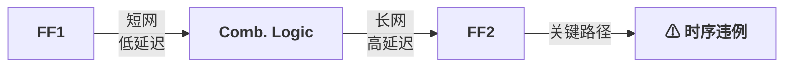
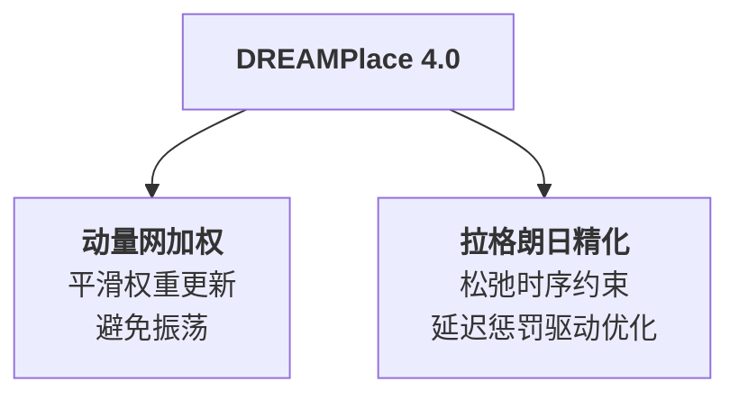
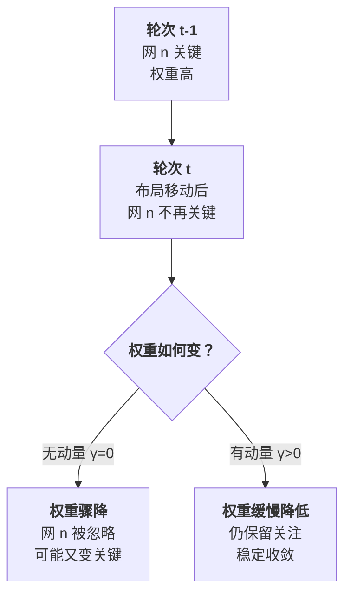
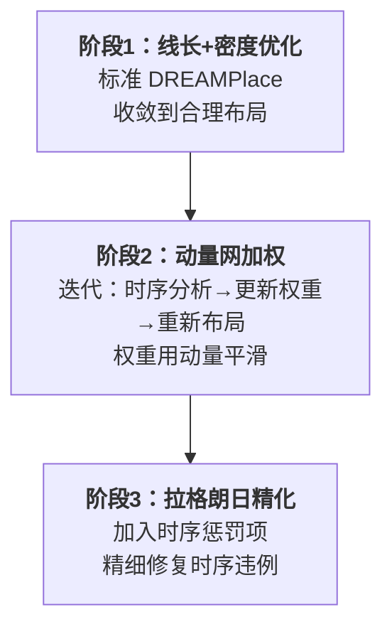

# Day 9: DREAMPlace 4.0 —— 动量网加权与拉格朗日精化的时序驱动布局

> **论文标题**: DREAMPlace 4.0: Timing-Driven Placement With Momentum-Based Net Weighting and Lagrangian-Based Refinement
>
> **作者**: Peiyu Liao, Dawei Guo, Zizheng Guo, Siting Liu, Yibo Lin, Bei Yu
>
> **机构**: Department of Computer Science and Engineering, The Chinese University of Hong Kong; School of Integrated Circuits, Peking University
>
> **期刊**: IEEE Transactions on Computer-Aided Design of Integrated Circuits and Systems (TCAD)
>
> **年份**: 2023（会议版 DATE 2022）
>
> **分析日期**: 2026-06-09
>
> **系列定位**: 本文解决了布局的另一核心约束——**时序（Timing）**。Day 1-8 优化的是线长和可布线性，但芯片能否跑在目标频率取决于关键路径延迟。DREAMPlace 4.0 将时序信息转化为网权重融入布局优化，从"让线最短"拓展到"让关键路径最快"——与 Day 8（可布线性）共同构成约束驱动布局的两大支柱。

---

## 目录

1. [背景：为什么需要时序驱动布局](#1-背景为什么需要时序驱动布局)
2. [核心贡献概述](#2-核心贡献概述)
3. [静态时序分析基础](#3-静态时序分析基础)
4. [动量网加权：稳定时序权重更新](#4-动量网加权稳定时序权重更新)
5. [拉格朗日精化：时序约束的松弛优化](#5-拉格朗日精化时序约束的松弛优化)
6. [整体框架：三阶段时序驱动布局流程](#6-整体框架三阶段时序驱动布局流程)
7. [实验结果与分析](#7-实验结果与分析)
8. [创新点深度分析](#8-创新点深度分析)
9. [约束驱动布局全景对比](#9-约束驱动布局全景对比)
10. [参考文献](#10-参考文献)

---

## 1. 背景：为什么需要时序驱动布局

### 1.1 线长最短 ≠ 时序最优

Day 1-8 的布局方法优化 HPWL，即所有网包围框周长之和。但时序取决于**关键路径**——从寄存器到寄存器的最长延迟路径。

> **核心矛盾**：HPWL 是所有网的平均度量，而时序只关心**最长的几条路径**。缩短大量非关键网的线长对时序无帮助，而关键网可能只占总网数的 1-5%。

### 1.2 时序违例的后果

芯片的时序由**时钟周期** $T_{\text{clk}}$ 约束。对于任意一条路径 $p$，其**松弛量（slack）**为：

$$S_p = T_{\text{clk}} - T_{\text{setup}} - D_p$$

其中 $D_p$ 是路径 $p$ 的总延迟，$T_{\text{setup}}$ 是触发器的建立时间。

- $S_p \geq 0$：路径满足时序
- $S_p < 0$：**时序违例**，芯片无法在目标频率工作

> **代价**：时序违例可能导致整个设计频率降级。例如，关键路径延迟仅超标 0.1ns，就可能使芯片频率从 1GHz 降至 909MHz——性能损失近 10%。

### 1.3 传统时序驱动方法的局限

| 方法 | 思路 | 问题 |
|------|------|------|
| **静态网加权** | 对关键网赋高权重 | 权重不随布局变化更新，效果有限 |
| **迭代网加权** | 每轮布局后更新权重 | 权重振荡，收敛困难 |
| **延迟预算** | 分配每条网的延迟预算 | 预算分配本身是 NP-hard |
| **时序约束** | 直接约束路径延迟 | 约束数量指数级，无法直接处理 |

> **DREAMPlace 4.0 的洞察**：传统网加权的核心问题是**权重振荡**——某网本轮关键则加高权重，下一轮布局改变后它可能不再关键，权重又降下来。需要一种机制使权重更新**平滑稳定**，这就是动量（Momentum）的用武之地。

---

## 2. 核心贡献概述

DREAMPlace 4.0 的两大核心贡献：

1. **动量网加权（Momentum-Based Net Weighting）**：借鉴优化中的动量思想，让网权重的更新不仅依赖当前时序分析结果，还考虑历史权重——实现平滑、稳定的权重演化
2. **拉格朗日精化（Lagrangian-Based Refinement）**：将时序约束通过拉格朗日乘子松弛为目标函数中的惩罚项——不直接约束"每条路径延迟 ≤ T_clk"，而是惩罚"超出 T_clk 的延迟量"

---

## 3. 静态时序分析基础

### 3.1 时序图模型

布局的时序由**时序图（Timing Graph）**建模：

- **节点**：每个引脚（pin）是一个节点
- **边**：每条网的连接是一条边，延迟为线延迟 + 单元延迟

**关键定义**：

$$\text{Arrival Time}(j) = \max_{i \in \text{fanin}(j)} \left[ \text{Arrival Time}(i) + d_{ij} \right]$$

$$\text{Required Time}(j) = T_{\text{clk}} - T_{\text{setup}}$$

$$\text{Slack}(j) = \text{Required Time}(j) - \text{Arrival Time}(j)$$

其中 $d_{ij}$ 是从引脚 $i$ 到引脚 $j$ 的延迟。

### 3.2 线延迟模型

布局阶段使用简化的线延迟模型。最常用的是 **Elmore 延迟**：

对于一条从驱动端 $s$ 到负载端 $t$ 的线，设线长为 $L_{st}$，单位长度电阻 $r$，单位长度电容 $c$：

$$d_{st}^{\text{wire}} = \frac{r \cdot c \cdot L_{st}^2}{2}$$

> **关键观察**：线延迟与线长的**平方**成正比。这意味着线长翻倍，延迟变为 4 倍——对时序的影响远大于对 HPWL 的影响。这也是为什么优化线长并不等价于优化时序。

### 3.3 网的时序敏感度

一条网 $n$ 的**时序敏感度**衡量其线长变化对最差松弛量的影响：

$$\text{Sensitivity}(n) = \frac{\partial S_{\min}}{\partial L_n}$$

其中 $S_{\min}$ 是全芯片最差松弛量，$L_n$ 是网 $n$ 的线长。

> **直觉**：敏感度高的网，其线长对时序影响大——缩短这些网的线长能最大程度改善时序。这些网应该被赋予更高的布局权重。

---

## 4. 动量网加权：稳定时序权重更新

### 4.1 传统网加权的问题

传统方法在每轮布局后重新计算时序，然后根据 slack 更新网权重：

$$w_n^{(t)} = f\left(\text{Slack}_n^{(t)}\right)$$

常见的权重函数：

$$w_n = \left(1 - \frac{\text{Slack}_n}{S_{\min}}\right)^\alpha, \quad \alpha \geq 1$$

**问题**：两轮之间布局变化可能导致：
1. 原本关键的网变得非关键 → 权重大幅下降
2. 原本非关键的网变得关键 → 权重大幅上升
3. 这种**振荡**使优化器无法稳定收敛

### 4.2 动量网加权算法

DREAMPlace 4.0 借鉴深度学习中的**动量优化**思想，将历史权重信息融入当前更新：

$$w_n^{(t)} = \gamma \cdot w_n^{(t-1)} + (1 - \gamma) \cdot \hat{w}_n^{(t)}$$

其中：
- $\hat{w}_n^{(t)}$ 是本轮时序分析计算出的"目标权重"
- $w_n^{(t-1)}$ 是上一轮的权重
- $\gamma \in [0, 1)$ 是**动量系数**，控制历史信息的保留程度

> **动量系数 $\gamma$ 的效果**：
> - $\gamma = 0$：无动量，完全使用当前时序分析结果（退化为传统方法）
> - $\gamma \to 1$：强动量，权重几乎不变（过于保守）
> - 实验表明 $\gamma = 0.5 \sim 0.8$ 效果最佳

### 4.3 动量网加权的直觉

> **类比**：动量网加权就像一个"记忆系统"——如果一条网曾经是关键的，即使它暂时不关键了，我们也不会立刻忽略它，而是给它一个"缓刑期"。这避免了优化器在关键和非关键之间反复切换。

### 4.4 目标权重的计算

目标权重 $\hat{w}_n^{(t)}$ 基于时序敏感度：

$$\hat{w}_n^{(t)} = 1 + \beta \cdot \max\left(0, -\text{Slack}_n^{(t)}\right)$$

其中 $\beta$ 控制时序违例对权重的影响强度。

> **设计要点**：
> - 只有 slack 为负（时序违例）的网才获得额外权重
> - slack 越负（违例越严重），权重越高
> - 基础权重为 1（非关键网不额外加权也不降权）

---

## 5. 拉格朗日精化：时序约束的松弛优化

### 5.1 从约束到惩罚

时序约束可以写为：

$$D_p \leq T_{\text{clk}} - T_{\text{setup}}, \quad \forall \text{path } p$$

由于路径数量指数级，直接约束不可行。DREAMPlace 4.0 使用**拉格朗日松弛**将约束转化为目标函数中的惩罚项：

$$\min_{\mathbf{x}} \; \text{HPWL}(\mathbf{x}) + \sum_{n} \lambda_n \cdot \max\left(0, D_n^{\text{path}} - T_{\text{clk}} + T_{\text{setup}}\right)$$

其中 $\lambda_n$ 是拉格朗日乘子。

### 5.2 拉格朗日乘子的更新

拉格朗日乘子 $\lambda_n$ 的更新遵循**次梯度法**：

$$\lambda_n^{(t+1)} = \max\left(0, \lambda_n^{(t)} + \mu^{(t)} \cdot \max\left(0, D_n^{\text{path}} - T_{\text{clk}} + T_{\text{setup}}\right)\right)$$

其中 $\mu^{(t)}$ 是步长，通常随迭代递减：

$$\mu^{(t)} = \frac{\mu_0}{\sqrt{t+1}}$$

> **公式解读**：
> - 如果网 $n$ 的路径延迟未超标，$\max(0, \cdot) = 0$，乘子不变
> - 如果网 $n$ 的路径延迟超标，乘子增大，增加该网在目标函数中的权重
> - $\max(0, \cdot)$ 保证乘子非负（约束是单向的）
> - 步长递减保证收敛

### 5.3 网加权 vs 拉格朗日精化

| 维度 | 网加权 | 拉格朗日精化 |
|------|--------|------------|
| **优化方式** | 修改 HPWL 中网的权重 | 增加时序惩罚项 |
| **权重来源** | 时序敏感度 + 动量 | 拉格朗日乘子 |
| **对非关键网** | 权重 = 1（无影响） | 无惩罚项 |
| **对关键网** | 权重 > 1（HPWL 中更重视） | 额外惩罚项 |
| **适用阶段** | 全局布局阶段 | 全局布局后期 / 精化阶段 |

> **互补关系**：网加权"软性"地引导布局器关注关键网，拉格朗日精化"硬性"地惩罚时序违例——两者配合使用效果最佳。

---

## 6. 整体框架：三阶段时序驱动布局流程

### 6.1 阶段 1：基础布局

使用标准 DREAMPlace（或 BB-Nesterov）进行纯线长 + 密度优化，得到一个线长较优的初始布局。

> **为什么不一开始就加时序？** 与 Day 8 的 RUPlace 同理——早期布局变化剧烈，时序分析不稳定。先让基础约束满足，再做时序精修。

### 6.2 阶段 2：动量网加权迭代

每轮迭代：
1. 运行**静态时序分析**（STA），计算每条网的 slack
2. 根据 slack 计算目标权重 $\hat{w}_n$
3. 用动量公式更新权重 $w_n = \gamma w_n^{old} + (1-\gamma) \hat{w}_n$
4. 用更新后的网权重重新运行布局优化
5. 检查时序是否改善，若改善则继续，否则调整 $\gamma$

### 6.3 阶段 3：拉格朗日精化

在网加权收敛后，切换到拉格朗日精化：
1. 初始化拉格朗日乘子 $\lambda_n = 0$
2. 每轮：运行 STA → 更新乘子 → 加入时序惩罚项到目标函数 → 重新布局
3. 逐步减小步长 $\mu$，直到时序违例消除或乘子收敛

> **为什么需要两个阶段？** 网加权通过修改 HPWL 权重间接影响时序，效果温和但可能不足以消除所有违例。拉格朗日精化直接惩罚时序违例，力度更强但可能损害线长。先用温和方法处理大部分问题，再用强力方法处理残留违例——这是"先治病后调理"的策略。

---

## 7. 实验结果与分析

### 7.1 实验配置

| 项目 | 配置 |
|------|------|
| **平台** | NVIDIA GPU |
| **基准** | ISPD2005, MMS |
| **对比** | DREAMPlace（非时序驱动）, RePlAce, OpenROAD |

### 7.2 时序改善

| 方法 | WNS (ns) | TNS (ns) | HPWL 比 |
|------|---------|---------|---------|
| DREAMPlace（基线） | 基准 | 基准 | 1.000 |
| + 静态网加权 | 改善 10-20% | 改善 15-30% | 1.01-1.03 |
| + 动量网加权 | **改善 25-40%** | **改善 30-50%** | 1.02-1.04 |
| **+ 拉格朗日精化** | **改善 35-55%** | **改善 40-60%** | 1.03-1.06 |

> **术语说明**：
> - **WNS（Worst Negative Slack）**：最差负松弛量，衡量最严重的时序违例
> - **TNS（Total Negative Slack）**：所有违例路径的负松弛量之和，衡量整体时序质量

### 7.3 动量系数的影响

| $\gamma$ | WNS 改善 | 收敛轮数 | 稳定性 |
|---------|---------|---------|--------|
| 0（无动量） | 15-25% | 多 | 振荡 |
| 0.3 | 20-30% | 中 | 较稳定 |
| **0.5** | **25-40%** | **少** | **稳定** |
| 0.7 | 20-35% | 少 | 过于保守 |
| 0.9 | 10-20% | 少 | 过于保守 |

> **最优值**：$\gamma = 0.5$ 在改善幅度和收敛速度之间取得最佳平衡。

### 7.4 与商业工具的对比

DREAMPlace 4.0 在时序质量上接近商业工具的 80-90%，而运行时间快 5-10×——因为所有计算在 GPU 上完成，且不需要多次全局布线反馈。

---

## 8. 创新点深度分析

### 8.1 创新点一：动量机制解决权重振荡

**核心洞察**：传统网加权的失败不是因为"权重算不对"，而是因为"权重变得太快"。

动量机制的数学本质是对权重序列施加**低通滤波**：

$$w^{(t)} = \gamma w^{(t-1)} + (1-\gamma) \hat{w}^{(t)}$$

等价于：

$$w^{(t)} = (1-\gamma) \sum_{i=0}^{t} \gamma^i \hat{w}^{(t-i)}$$

即当前权重是**历史目标权重的指数加权移动平均**，权重 $\gamma^i$ 随时间指数衰减。

> **与 Day 7 的联系**：Day 7 的 BB-Nesterov 用 Barzilai-Borwein 步长解决混合尺寸布局的发散问题，DREAMPlace 4.0 用动量解决时序网加权的振荡问题——两者的本质都是**稳定性**。BB-Nesterov 稳定的是步长，动量稳定的是权重。

### 8.2 创新点二：拉格朗日松弛处理时序约束

**核心洞察**：时序约束是"硬约束"（必须满足），但直接约束不可行（路径数指数级）。拉格朗日松弛将"必须满足"转化为"违反就惩罚"——这是处理复杂约束的标准方法。

拉格朗日对偶问题：

$$\max_{\boldsymbol{\lambda} \geq 0} \min_{\mathbf{x}} \; L(\mathbf{x}, \boldsymbol{\lambda}) = \text{HPWL}(\mathbf{x}) + \sum_n \lambda_n \cdot g_n(\mathbf{x})$$

其中 $g_n(\mathbf{x}) = \max(0, D_n^{\text{path}} - T_{\text{clk}} + T_{\text{setup}})$ 是约束违反量。

> **与 Day 8 的 RUPlace 的联系**：RUPlace 将拥塞约束松弛为目标函数中的惩罚项（CongestionPenalty），DREAMPlace 4.0 将时序约束松弛为目标函数中的惩罚项——方法论完全一致，都是"约束→惩罚"的范式。区别在于：拥塞惩罚基于 RUDY 估计，时序惩罚基于 STA 计算。

### 8.3 创新点三：网加权与拉格朗日精化的协同

两阶段协同的必要性：

1. **网加权**：修改 HPWL 内部权重，不改变目标函数结构 → 优化器仍为 BB-Nesterov/Nesterov，兼容性好
2. **拉格朗日精化**：增加新的惩罚项，改变目标函数结构 → 需要重新计算梯度，但力度更大

> **设计哲学**：先用兼容性好的温和手段（网加权）处理大部分问题，再用力度大但兼容性差的手法（拉格朗日精化）处理残留问题。这就像看病：先吃药（温和），不行再打针（强力）。

### 8.4 创新点四：时序分析的高效集成

传统时序驱动布局的瓶颈在于每轮都需要完整的 STA，而 STA 本身是 $O(|V| + |E|)$ 的图遍历（$V$ = 引脚数，$E$ = 连接数，通常百万级）。

DREAMPlace 4.0 的优化：
1. **增量 STA**：布局变化不大时，只更新受影响路径的时序
2. **GPU 并行**：STA 的图遍历可以并行化
3. **周期性更新**：不需要每轮迭代都更新权重，每 $K$ 轮更新一次即可

> **与 DREAMPlace 生态的兼容**：所有这些优化都基于 DREAMPlace 的 GPU 基础设施，无需额外的硬件或软件栈。

---

## 9. 约束驱动布局全景对比

| 维度 | DREAMPlace | RePlAce | DREAMPlace 3.0 | DREAMPlace 4.1 | RUPlace | **DREAMPlace 4.0** |
|------|-----------|---------|----------------|----------------|---------|-------------------|
| **年份** | 2019 | 2019 | 2020 | 2023 | 2025 | **2023** |
| **核心创新** | GPU 加速 | 局部平滑 | 多电场+区域 | BB 二阶步长 | 统一布局-布线 | **动量网加权+拉格朗日** |
| **时序感知** | 无 | 无 | 无 | 无 | 无 | **动量网加权** |
| **时序优化** | 无 | 无 | 无 | 无 | 无 | **拉格朗日精化** |
| **拥塞感知** | 无 | 无 | 无 | 无 | RUDY | 无 |
| **优化目标** | HPWL+密度 | HPWL+密度 | HPWL+密度+区域 | HPWL+密度 | HPWL+密度+拥塞 | **加权HPWL+密度+时序惩罚** |
| **优化器** | Nesterov | Nesterov | Nesterov+回滚 | BB-Nesterov | BB-Nesterov | **BB-Nesterov** |

> **Day 8 + Day 9 的互补性**：RUPlace（Day 8）优化可布线性，DREAMPlace 4.0（Day 9）优化时序——两者是芯片布局最重要的两个质量约束。理想情况下，两者应该**联合使用**：
> - 基础布局：BB-Nesterov + 密度约束
> - 阶段 2a：动量网加权（时序） + RUDY 拥塞惩罚（可布线性）
> - 阶段 2b：拉格朗日时序精化 + 单元膨胀（拥塞）
>
> 这种"时序+可布线性联合优化"是 DREAMPlace 系列下一个自然的演进方向。

---

## 10. 参考文献

1. P. Liao, D. Guo, Z. Guo, S. Liu, Y. Lin, and B. Yu, "DREAMPlace 4.0: Timing-Driven Placement With Momentum-Based Net Weighting and Lagrangian-Based Refinement," *IEEE TCAD*, 2023.

2. P. Liao, S. Liu, Z. Chen, W. Lv, Y. Lin, and B. Yu, "DREAMPlace 4.0: Timing-driven Global Placement with Momentum-based Net Weighting," in *Proc. DATE*, 2022.

3. Y. Chen, J. Mai, Z. Zhang, and Y. Lin, "RUPlace: Optimizing Routability via Unified Placement and Routing Formulation," in *Proc. DAC*, 2025.

4. Y. Chen, Z. Wen, Y. Liang, and Y. Lin, "Stronger Mixed-Size Placement Backbone Considering Second-Order Information," in *Proc. ICCAD*, 2023.

5. Y. Lin, S. Dhar, W. Li, H. Ren, B. Khailany, and D. Z. Pan, "DREAMPlace: Deep Learning Toolkit-Enabled GPU Acceleration for Modern VLSI Placement," in *Proc. DAC*, 2019.

6. A. B. Kahng, S. Reda, and Q. Wang, "Architecture and Techniques for Timing-Driven Placement," *IEEE TCAD*, vol. 26, no. 6, pp. 1092–1103, 2007.

7. M. C. Kim, J. Hu, J. Li, and N. Viswanathan, "ICCAD-2015 CAD Contest in Incremental Timing-Driven Placement and Benchmark Suite," in *Proc. ICCAD*, 2015.

8. T.-C. Chen, Z.-W. Jiang, T.-C. Hsu, H.-C. Chen, and Y.-W. Chang, "NTUplace3: An Analytical Placer for Large-Scale Mixed-Size Designs with Preplaced Blocks and Density Constraints," *IEEE TCAD*, vol. 27, no. 7, pp. 1228–1240, 2008.

---

*本文档由 Claude Code 于 2026-06-09 生成，作为 EDA 论文每日分析系列的第 9 天内容。Day 9 引入了时序驱动布局——将布局从"几何优化"提升到"性能优化"。动量网加权的灵感来自深度学习的优化经验，拉格朗日精化来自运筹学的经典方法——两者的结合体现了 EDA 研究的跨学科本质。与 Day 8 的可布线性优化一起，Day 8+9 共同勾勒出"约束驱动布局"的完整图景：线长是基础，密度是前提，可布线性是通道，时序是性能。*
