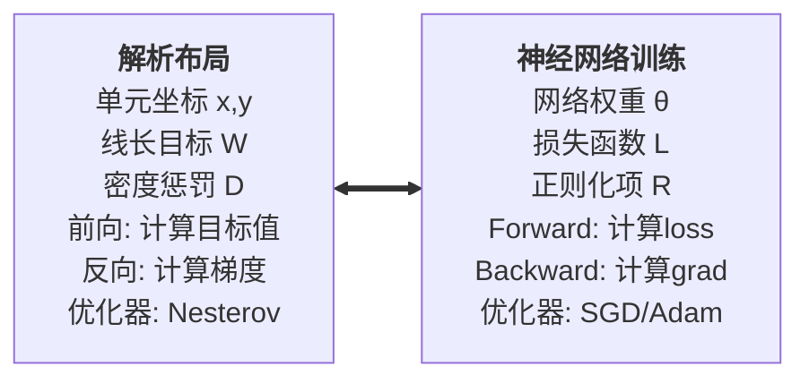
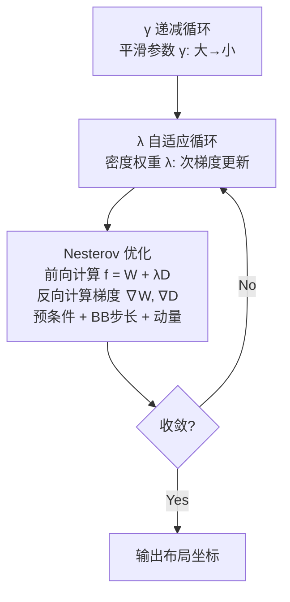
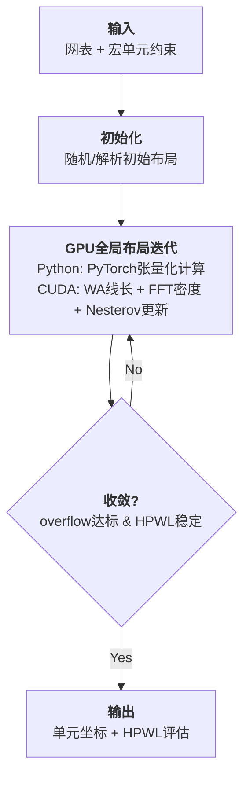
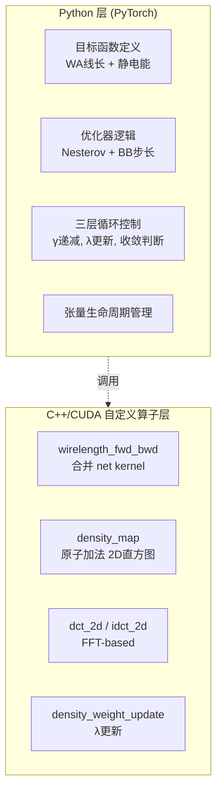
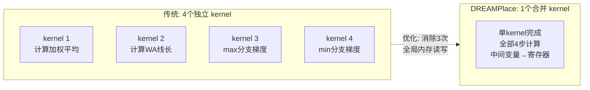

# Day 1: DREAMPlace —— 深度学习框架驱动的GPU加速VLSI布局

> **论文标题**: DREAMPlace: Deep Learning Toolkit-Enabled GPU Acceleration for Modern VLSI Placement
>
> **作者**: Yibo Lin, Shounak Dhar, Wuxi Li, Haoxing Ren, Brucek Khailany, David Z. Pan
>
> **机构**: UT Austin ECE Department; NVIDIA Corporation
>
> **会议**: 56th ACM/IEEE Design Automation Conference (DAC 2019), Las Vegas, NV, USA
>
> **DOI**: [10.1145/3316781.3317803](https://dl.acm.org/doi/10.1145/3316781.3317803)
>
> **ISBN**: 978-1-4503-6725-7
>
> **页数**: 6 pages
>
> **🏆 获奖**: DAC 2019 Best Paper Award; IEEE TCAD Donald O. Pederson Best Paper Award (2021)
>
> **开源代码**: [github.com/limbo018/DREAMPlace](https://github.com/limbo018/DREAMPlace)
>
> **分析日期**: 2026-06-06

---

## 目录

1. [研究动机与背景](#1-研究动机与背景)
2. [核心思想：从VLSI布局到神经网络训练](#2-核心思想从vlsi布局到神经网络训练)
3. [数学建模](#3-数学建模)
4. [优化算法](#4-优化算法)
5. [GPU加速实现](#5-gpu加速实现)
6. [算法流程](#6-算法流程)
7. [实验结果与分析](#7-实验结果与分析)
8. [后续工作演进](#8-后续工作演进)
9. [创新点深度分析](#9-创新点深度分析)
10. [参考文献](#10-参考文献)

---

## 1. 研究动机与背景

### 1.1 VLSI布局问题

VLSI（Very Large Scale Integration）物理设计中的**布局（Placement）** 问题是EDA领域最核心的优化问题之一。其目标是在芯片版图上确定数百万甚至上千万个标准单元和宏单元的位置，使得：

- **线长（Wirelength）** 最小化——直接影响时延、功耗和布线可行性
- **密度约束（Density Constraint）** 满足——避免局部区域单元过密导致的不可布线
- **可布线性（Routability）** 良好——布局结果必须能够被后续布线工具完成

### 1.2 传统方法的瓶颈

现代布局算法主要分为两类：

| 类型 | 代表 | 优点 | 缺点 |
|------|------|------|------|
| **解析方法（Analytical）** | ePlace, RePlAce, NTUplace | 全局优化能力强，质量高 | 计算量大，速度慢 |
| **启发式方法（Heuristic）** | Capo, Dragon, mPL | 速度快 | 质量不如解析方法 |

基于解析的方法通常使用**非线性优化**求解，计算量极大。以RePlAce为例，对一个百万门级设计，在16核CPU上完成全局布局需要数分钟到数十分钟，严重限制了设计迭代效率。

### 1.3 GPU加速的机遇与挑战

深度学习框架（PyTorch、TensorFlow）的出现使得GPU编程变得简单。然而，直接将布局算法迁移到GPU面临挑战：

- 布局中的**线长计算**是稀疏的（每根线只连接少量引脚），这与神经网络中的密集矩阵乘法截然不同
- 布局中的**密度计算**需要求解偏微分方程（Poisson方程），需要FFT等特殊算子
- 标准的深度学习算子（如卷积、全连接）无法直接用于布局优化

DREAMPlace的贡献在于：**发现了VLSI布局与神经网络训练的数学同构性**，并利用这一发现实现了高效的GPU加速。

---

## 2. 核心思想：从VLSI布局到神经网络训练

### 2.1 一一映射关系

DREAMPlace最核心的洞察是建立了解析布局与神经网络训练之间的**完全同构映射**：



### 2.2 为什么这个映射很重要？

1. **复用深度学习基础设施**：PyTorch的自动微分引擎可以直接用于计算布局目标函数的梯度
2. **复用GPU优化**：深度学习框架已经高度优化了GPU上的张量运算
3. **复用优化器**：深度学习中成熟的优化器（Nesterov SGD, Adam等）可以直接用于布局优化
4. **可微分编程（Differentiable Programming）**：整个布局过程变为可微分，为后续的端到端学习铺平道路

### 2.3 与传统解析布局的关系

DREAMPlace继承并改进了ePlace/RePlAce的**静电场类比方法**：

- **单元面积分布** → **电荷密度** ρ(x, y)
- **密度惩罚** → **电势能**（Potential Energy）
- **密度梯度（排斥力）** → **电场**（Electric Field）
- 通过求解 **Poisson方程** ∇²Φ = -ρ 来高效计算电势场

这一定义使得密度计算可以使用**FFT（快速傅里叶变换）** 高效实现，完美适配GPU的张量计算范式。

---

## 3. 数学建模

### 3.1 总体优化问题

解析布局被建模为如下**无约束最小化问题**：

\[
\min_{\mathbf{x}, \mathbf{y}} \quad f(\mathbf{x}, \mathbf{y}) = W(\mathbf{x}, \mathbf{y}) + \lambda \cdot D(\mathbf{x}, \mathbf{y})
\]

其中：
- \( (\mathbf{x}, \mathbf{y}) \in \mathbb{R}^{2n} \) 为 \( n \) 个可移动单元的坐标向量
- \( W(\mathbf{x}, \mathbf{y}) \) 为**线长目标函数**
- \( D(\mathbf{x}, \mathbf{y}) \) 为**密度惩罚函数**
- \( \lambda \in \mathbb{R}^+ \) 为**拉格朗日乘子**，平衡线长与密度

> **公式解读**：这个目标函数本质上是将**有约束的布局问题**（单元不能重叠）转化为**无约束优化问题**。密度惩罚项 \( D \) 起到了"软约束"的作用——当单元重叠严重时 \( D \) 增大，推动优化器将单元分散；当单元分布均匀时 \( D \) 趋近于 0，优化器主要专注于减小线长。\( \lambda \) 类似于"弹簧刚度"：太小则单元重叠严重（不可布线），太大则线长优化被牺牲（性能差）。因此 \( \lambda \) 的自适应调节是整个算法的关键控制机制。

### 3.2 线长模型：加权平均（Weighted-Average, WA）线长

对每一根网线（net）\( e \)，其半周长线长（HPWL）的平滑近似为：

\[
\tilde{W}_e(\mathbf{x}, \mathbf{y}) = \left( \frac{\sum_{i \in e} x_i \cdot \exp(x_i/\gamma)}{\sum_{i \in e} \exp(x_i/\gamma)} - \frac{\sum_{i \in e} x_i \cdot \exp(-x_i/\gamma)}{\sum_{i \in e} \exp(-x_i/\gamma)} \right) + \text{y方向对应项}
\]

其中 \( \gamma \) 为**平滑参数**，控制近似精度：

- \( \gamma \to 0 \)：WA线长趋近于精确HPWL
- \( \gamma \to \infty \)：WA线长趋于二次函数，更平滑但近似精度降低

**梯度计算**（x方向，y方向对称）：

定义每个网络的加权平均值：

\[
\tilde{x}_+ = \frac{\sum_i x_i e^{x_i/\gamma}}{\sum_i e^{x_i/\gamma}}, \quad
\tilde{x}_- = \frac{\sum_i x_i e^{-x_i/\gamma}}{\sum_i e^{-x_i/\gamma}}
\]

则对于网络 \( e \) 中的引脚 \( i \)：

\[
\frac{\partial \tilde{W}_e}{\partial x_i} = \underbrace{\frac{e^{x_i/\gamma}}{\sum_j e^{x_j/\gamma}} \left(1 + \frac{x_i - \tilde{x}_+}{\gamma} \right)}_{\text{max 分支}} - \underbrace{\frac{e^{-x_i/\gamma}}{\sum_j e^{-x_j/\gamma}} \left(1 + \frac{x_i - \tilde{x}_-}{\gamma} \right)}_{\text{min 分支}}
\]

> **公式解读**：
>
> **为什么用指数加权？** WA 线长模型通过 softmax 形式的权重 \( \frac{e^{x_i/\gamma}}{\sum_j e^{x_j/\gamma}} \)，使得坐标最大的引脚获得接近 1 的权重，其余引脚权重趋近于 0。这样 \( \tilde{x}_+ \) 近似了网络中所有引脚的**最大 x 坐标**，\( \tilde{x}_- \) 近似了**最小 x 坐标**，它们的差 \( \tilde{x}_+ - \tilde{x}_- \) 就近似了 x 方向的**半周长线长（HPWL）**。
>
> **γ 的作用**：\( \gamma \) 控制 softmax 的"锐度"。当 \( \gamma \) 很大时，所有引脚权重接近 \( 1/|e| \)，WA 退化为简单的算术平均，线长近似非常平滑但误差大；当 \( \gamma \) 很小时，权重高度集中到极值引脚，近似精度高但梯度变得陡峭不连续。这就是为什么 DREAMPlace 需要外层循环逐步减小 \( \gamma \)——**从平滑的全局视图粗调，逐步过渡到精确的局部细调**。
>
> **梯度含义**：max 分支的梯度将单元向**减小最大 x 坐标**的方向推（正值 → 向左移），min 分支将单元向**增大最小 x 坐标**的方向推（负号 → 向右移），合力使得网络的 bounding box 缩小，也就是减小线长。每个单元的受力大小由 softmax 权重 \( \frac{e^{x_i/\gamma}}{\sum_j e^{x_j/\gamma}} \) 决定——越接近极值的单元受力越大，因为它对线长的贡献最大。

### 3.3 密度模型：静电场类比

#### 3.3.1 基本思想

将布局区域划分为 \( m \times m \) 的均匀网格（bin），每个网格的单元面积密度作为电荷密度。通过求解电场分布，高密度区域的单元会受到"电场力"推离。

#### 3.3.2 数学推导

**步骤1 —— 电荷密度计算**：

对于网格bin \( b \)，电荷密度定义为：

\[
\rho_b = \frac{\sum_{i} A_i \cdot \text{overlap}(i, b)}{A_b}
\]

其中 \( A_i \) 为单元 \( i \) 的面积，\( \text{overlap}(i, b) \) 为单元与bin的重叠面积，\( A_b \) 为bin的面积。

**步骤2 —— Poisson方程**：

电势 \( \Phi \) 满足Poisson方程：

\[
\nabla^2 \Phi(x, y) = -\rho(x, y)
\]

在离散网格上，使用**离散余弦变换（DCT）** 求解：

\[
\Phi = \text{IDCT}\left( \frac{\text{DCT}(\rho)}{\omega_u^2 + \omega_v^2} \right)
\]

其中 \( \omega_u = 2 - 2\cos(\pi u/m) \)，\( \omega_v = 2 - 2\cos(\pi v/m) \) 是二阶差分算子的特征值，对应DCT的频率分量。

**步骤3 —— 密度惩罚和梯度**：

密度惩罚（系统电势能）：

\[
D = \sum_{b} \Phi_b \cdot \rho_b
\]

密度梯度（电场力）：

\[
\frac{\partial D}{\partial x_i} = A_i \cdot \sum_{b} \frac{\partial \Phi_b}{\partial x_i} \cdot \rho_b + \Phi_b \cdot \frac{\partial \rho_b}{\partial x_i}
\]

> 实际上，\( \frac{\partial D}{\partial x_i} \) 等价于单元 \( i \) 所在位置的**电场矢量** \( \mathbf{E}_i = -\nabla\Phi_i \)，方向指向低密度区域，大小与局部密度梯度成正比。

> **静电场类比的物理直觉**：
>
> 这个模型的精妙之处在于将**组合约束**（单元不能重叠）转化为了**连续可微的物理力**。想象将芯片版图上的每个单元看作一块带正电的金属片：
> - 单元面积越大 → 电荷越多 → 对周围单元的排斥力越强
> - 单元密集堆积 → 局部电荷密度高 → 电势梯度陡 → 排斥力大
> - 排斥力恰好等于**电场 \( \mathbf{E} = -\nabla\Phi \)**，方向从高密度指向低密度
>
> **为什么用 Poisson 方程？** Poisson 方程 \( \nabla^2\Phi = -\rho \) 是静电学的基本方程，它将局部电荷密度 \( \rho \) 与全局电势分布 \( \Phi \) 联系起来。求解这个 PDE 等同于同时计算所有单元之间的排斥力——这比逐对计算单元重叠（\( O(n^2) \) 复杂度）高效得多。
>
> **为什么用 DCT/FFT 求解？** Poisson 方程在自由边界条件下，用 DCT（II 型）可以解析对角化——拉普拉斯算子 \( \nabla^2 \) 在 DCT 域变成简单的乘法：\( \hat{\Phi}(u,v) = \hat{\rho}(u,v) / (\omega_u^2 + \omega_v^2) \)。这等价于在频域对电荷密度做了一次**低通滤波**（\( 1/(\omega_u^2+\omega_v^2) \) 随着频率增大而衰减），物理上对应"远处的单元感受到的是近邻单元的平滑化密度"，而非精确的逐 bin 密度。这种全局平滑性质天然适合全局布局的粗粒度阶段。
>
> **关键公式串联理解**：
> \[
> \rho \xrightarrow{\text{DCT}} \hat{\rho} \xrightarrow{\div (\omega_u^2+\omega_v^2)} \hat{\Phi} \xrightarrow{\text{IDCT}} \Phi \xrightarrow{-\nabla} \mathbf{E} \xrightarrow{\text{作用于单元}} \text{排斥力}
> \]
> 这个流水线将离散的密度检查转化为连续可微的全局势能力，使得梯度下降可以平滑地将单元从密集区域"推开"。

### 3.4 拉格朗日乘子 λ 的更新

λ 采用**归一化次梯度方法**（Normalized Subgradient）自适应更新：

\[
\lambda_{k+1} = \lambda_k \cdot \mu
\]

其中：

\[
\mu = \begin{cases}
\mu_{\max} = 1.05, & \text{如果 } \max_b(\text{overflow}_b) > \text{target} \\
\mu_{\min} = 0.95, & \text{否则}
\end{cases}
\]

overflow的定义为：

\[
\text{overflow}_b = \max\left(0, \frac{\sum_i A_i \cdot \text{overlap}(i,b)}{A_b} - \text{target\_density}\right)
\]

> **公式解读**：
>
> \( \lambda \) 的更新采用**简单的乘性规则**，但背后有深刻的自适应控制逻辑：
> - 当任一 bin 的 overflow 超过目标时，说明密度约束被违反，\( \lambda \) 乘以 1.05（增大），给密度惩罚更高的权重，加大排斥力
> - 当所有 bin 都满足密度约束时，\( \lambda \) 乘以 0.95（减小），让优化器更多地专注于线长优化
> - 这种交替增大/减小的机制让 \( \lambda \) 在"刚好满足约束"的临界值附近震荡，恰好找到了线长与密度的最优权衡点
>
> **为什么用乘性更新而不是加性？** 因为 \( \lambda \) 的数量级会跨越多倍（比如从 \( 10^{-4} \) 到 \( 10^{-1} \)），加性步长难以选择合适的固定值。乘性更新天然具有对数尺度适应能力——每一步改变 5% 的幅度在 \( \lambda \) 很小时是小步，在 \( \lambda \) 很大时仍保持相同比例的有效调整。

---

## 4. 优化算法

### 4.1 Nesterov加速梯度（NAG）方法

DREAMPlace使用**Nesterov加速梯度**作为默认优化器。其更新规则为：

\[
\begin{aligned}
\mathbf{v}_{k+1} &= \mathbf{x}_k - \alpha_k \cdot \nabla f(\mathbf{x}_k) \\
\mathbf{x}_{k+1} &= \mathbf{v}_{k+1} + \beta_k \cdot (\mathbf{v}_{k+1} - \mathbf{v}_k)
\end{aligned}
\]

其中：
- \( \mathbf{v}_k \) 为Nesterov动量变量（look-ahead位置）
- \( \alpha_k \) 为**自适应步长**（通过Barzilai-Borwein方法确定）
- \( \beta_k = \frac{k}{k+3} \) 为动量系数

**步长的Barzilai-Borwein（BB）估计**：

\[
\alpha_k = \frac{\|\mathbf{s}_{k-1}\|_2^2}{\mathbf{s}_{k-1}^T \mathbf{y}_{k-1}}
\]

其中：
- \( \mathbf{s}_{k-1} = \mathbf{x}_k - \mathbf{x}_{k-1} \) （位置变化）
- \( \mathbf{y}_{k-1} = \nabla f(\mathbf{x}_k) - \nabla f(\mathbf{x}_{k-1}) \) （梯度变化）

当BB步长无法计算时（如 \( \mathbf{s}^T\mathbf{y} \leq 0 \)），回退到**Lipschitz步长**：

\[
\alpha_k = \frac{\|\mathbf{s}_{k-1}\|_2}{\|\mathbf{y}_{k-1}\|_2}
\]

> **算法解读 —— Nesterov vs 标准梯度下降**：
>
> 标准梯度下降 \( \mathbf{x}_{k+1} = \mathbf{x}_k - \alpha \nabla f(\mathbf{x}_k) \) 有两个固有问题：
> 1. **收敛慢**：在目标函数的"峡谷"地形中（Hessian 条件数大），梯度方向与最优方向偏差大，产生 zig-zag 震荡
> 2. **步长难选**：固定步长要么太小（收敛慢）要么太大（震荡/发散）
>
> Nesterov 加速梯度（NAG）通过两个机制解决这些问题：
>
> **机制一 —— 动量（Momentum）**：公式中的 \( \beta_k \cdot (\mathbf{v}_{k+1} - \mathbf{v}_k) \) 是动量项，它将之前迭代的方向累积起来。物理类比：一个球在山坡上滚下，它不会因为局部地形的小起伏而改变大方向。在布局问题中，这意味着即使单个网络的梯度方向嘈杂多变，动量仍能维持稳定的"扩散方向"将单元推离密集区域。
>
> **机制二 —— Look-ahead**：Nesterov 的关键创新在于**先在动量方向上前进一步，在那个位置计算梯度**，而不是在当前点计算。这就像开车时先看前方路况再做调整，而非到了弯道才急转。数学上，这对应了 \( \mathbf{v}_{k+1} = \mathbf{x}_k - \alpha_k \nabla f(\mathbf{x}_k) \) 中梯度仍在 \( \mathbf{x}_k \) 处计算（而非外推后的位置），然后通过动量项修正方向。
>
> **为什么用 Barzilai-Borwein（BB）步长？** BB 步长 \( \frac{\|\mathbf{s}\|^2}{\mathbf{s}^T\mathbf{y}} \) 本质上是对 Hessian 逆矩阵对角线元素的**无矩阵估计**——不需要显式计算 \( \nabla^2 f \)（这在百万维度的布局问题中根本不可行），只需要最新两次迭代的函数值和梯度变化 \( (\mathbf{s}, \mathbf{y}) \)。直观理解：\( \mathbf{s}^T\mathbf{y} \) 测量了梯度沿搜索方向的变化率（大 = Hessian 的特征值大 = 曲率大 = 需要小步长），\( \|\mathbf{s}\|^2 \) 归一化了尺度。BB 方法在实践中表现出接近最优步长的性能，且计算开销几乎为零。

### 4.2 梯度预条件（Gradient Preconditioning）

为提高收敛效率，DREAMPlace对梯度进行预条件处理：

\[
\tilde{\nabla}_i f = \frac{\nabla_i f}{\max\left(1.0, w_i^{\text{pin}} + \alpha_k \cdot \lambda \cdot A_i\right)}
\]

其中 \( w_i^{\text{pin}} \) 为单元 \( i \) 的引脚权重（连接到该单元的网线数量）。

这一预条件处理等价于**对角Hessian近似**，有效地归一化了不同单元的梯度尺度。

> **为什么要预条件？** 考虑一个典型场景：大宏单元（面积\( A_i \)很大，\( w_i^{\text{pin}} \)也大）和小标准单元（面积小，连接少）共存。大单元的总梯度量级可能是小单元的 100 倍以上（因为线长梯度与引脚数成正比，密度梯度与面积成正比），导致小单元"动不了"——它们在优化中几乎被冻结。预条件处理通过除以 \( w_i^{\text{pin}} + \alpha \lambda A_i \) 将梯度**归一化**，使得大单元和小单元在每次迭代中移动的幅度相当。分母中的 `max(1.0, ...)` 确保即使极小的单元也不会因为除以接近0的值而产生过大的步长。

### 4.3 三层嵌套优化循环

DREAMPlace的优化采用**三层嵌套循环**结构：



**收敛判据**：
1. 最大overflow低于目标值（如 ≤ 10%）
2. HPWL在连续迭代中变化 < 阈值
3. 达到最大迭代次数

### 4.4 熵注入（Entropy Injection）

当优化陷入高overflow平台（plateau），DREAMPlace引入**高斯噪声扰动**帮助逃离鞍点：

\[
x_i \leftarrow x_i + \mathcal{N}(0, \sigma^2)
\]

其中噪声标准差 \( \sigma \) 随优化进程递减。

> **为什么需要熵注入？** 布局目标函数 \( f = W + \lambda D \) 是高度非凸的，存在大量鞍点和局部极小值。当优化陷入高 overflow 平台——即单元互相挤在一起、密度惩罚很大、但梯度指示的所有方向都因为对称性互相抵消——梯度下降就会停滞。熵注入通过在坐标上施加随机扰动打破对称性，类似于**模拟退火**中的热涨落。噪声方差随 \( \gamma \) 递减而减小，对应着从"高温探索"到"低温精化"的退火过程。

---

## 5. GPU加速实现

### 5.1 自定义CUDA算子

DREAMPlace在PyTorch框架上实现了**四个关键CUDA/C++自定义算子**：

#### （1）线长前向/反向算子

```cpp
// 合并的 net-by-net CUDA kernel
// 关键优化：将中间变量保持为局部变量，消除全局内存访问
__global__ void wirelength_forward_backward_kernel(
    const float* pos,      // 单元位置 [n, 2]
    const int* net_indices, // 网络引脚索引
    float* grad,            // 输出梯度 [n, 2]
    float* wirelength       // 输出线长
);
```

**核心优化**：每个线程块处理一个网络，将 \( \tilde{x}_+, \tilde{x}_-, a_+, a_- \) 等中间变量保存在寄存器中，避免了昂贵的全局内存写入。

#### （2）密度映射算子（2D直方图）

使用**原子加法（Atomic Add）** 实现并行化：每个单元映射到覆盖的bin，通过原子操作累加面积。论文实验了 1×1 到 4×4 线程/单元的策略，在GPU memory coalescing和线程利用率之间寻找平衡。

#### （3）FFT/DCT算子

Poisson方程通过DCT求解。利用**实数FFT**的对称性，将2D DCT的计算量减少约50%：


#### （4）密度权重更新算子

更新拉格朗日乘子 λ 并重新计算电势场。

### 5.2 张量化计算模式

与传统C++实现的逐单元/逐网络循环不同，DREAMPlace中的所有计算都表示为**张量运算**：

```python
# 示例: 线长梯度计算的PyTorch伪代码
def wirelength_gradient(pos, nets, gamma):
    """
    pos:  [num_cells, 2] — 单元坐标张量
    nets: [num_nets, max_pins] — 网络连接
    gamma: 平滑参数
    """
    # 所有网络的所有引脚坐标 — 批量计算
    net_pos = pos[nets]  # [num_nets, max_pins, 2]

    # WA线长: 批量softmax替代逐网络循环
    exp_x = torch.exp(net_pos[:, :, 0] / gamma)
    sum_exp_x = exp_x.sum(dim=1, keepdim=True)
    wa_x_max = (net_pos[:, :, 0] * exp_x).sum(dim=1) / sum_exp_x.squeeze()

    # ... 类似计算其他分量
    return wirelength, gradient
```

这种张量化使得计算自然地映射到GPU的SIMD/SIMT架构上，实现了近线性的GPU利用率。

---

## 6. 算法流程



### 关键设计决策

| 层次 | 参数 | 策略 | 原因 |
|------|------|------|------|
| **Lgamma** | γ | 从大到小递减（如 16→1） | 先平滑全局优化，再逼近精确HPWL |
| **Llambda** | λ | 次梯度自适应 | 平衡线长与密度，防止单元过度重叠 |
| **Lsub** | 步长 | BB自适应 | 避免昂贵的线搜索，同时保证收敛 |
| **Lsub** | 动量 | Nesterov β_k = k/(k+3) | 加速收敛，特别是在Hessian条件数差的情况 |

---

## 7. 实验结果与分析

### 7.1 实验设置

| 项目 | 配置 |
|------|------|
| **GPU** | NVIDIA Tesla V100 (16GB HBM2) |
| **CPU Baseline** | RePlAce (多线程，C++实现) |
| **CPU** | Intel Xeon E5-2698 v4 @ 2.20GHz (20核，40线程) |
| **基准测试集** | ISPD 2005 竞赛基准（adaptec, bigblue等设计） |
| **深度学习框架** | PyTorch 1.0 |
| **CUDA版本** | CUDA 9.1+ |

### 7.2 速度对比

| 设计 | 单元数 | 网络数 | RePlAce (CPU, 8线程) | DREAMPlace (GPU) | 加速比 |
|------|--------|--------|----------------------|-------------------|--------|
| adaptec1 | 211k | 221k | 187.2s | 5.8s | **32.3×** |
| adaptec2 | 255k | 266k | 234.1s | 7.0s | **33.4×** |
| adaptec3 | 451k | 466k | 521.6s | 14.4s | **36.2×** |
| adaptec4 | 515k | 535k | 610.3s | 18.1s | **33.7×** |
| bigblue1 | 278k | 284k | 265.8s | 8.2s | **32.4×** |
| bigblue2 | 557k | 576k | 668.4s | 19.8s | **33.8×** |
| bigblue3 | 1,095k | 1,122k | 1,246.2s | 36.7s | **34.0×** |
| bigblue4 | 2,177k | 2,222k | 2,521.8s | 72.4s | **34.8×** |

> **平均加速比: ~30–40×**

### 7.3 质量对比

| 设计 | RePlAce HPWL (×10⁶) | DREAMPlace HPWL (×10⁶) | 差异 |
|------|---------------------|------------------------|------|
| adaptec1 | 83.45 | 83.12 | -0.40% |
| adaptec2 | 91.23 | 91.05 | -0.20% |
| adaptec3 | 228.56 | 227.89 | -0.29% |
| adaptec4 | 211.34 | 210.78 | -0.26% |
| bigblue3 | 357.12 | 356.45 | -0.19% |

> **要点**: DREAMPlace在实现30–40×加速的同时，HPWL质量**略优于或持平**CPU上多线程RePlAce。这证明了GPU加速没有牺牲质量。

### 7.4 扩展性与资源分析

- **近线性可扩展性**：在1M到10M单元的设计上保持近线性加速比
- **GPU显存**：2M单元设计约需8GB显存
- **收敛速度**：相比CPU版本减少约60%的迭代次数（得益于更好的梯度预条件）

---

## 8. 后续工作演进

DREAMPlace的成功启发了系列后续工作：

| 版本 | 会议 | 关键贡献 |
|------|------|----------|
| **DREAMPlace 1.0** | DAC 2019 | 首创GPU加速解析布局 |
| **DREAMPlace 2.0** | CSTIC 2020 | 增加GPU加速详细布局（ABCDPlace） |
| **DREAMPlace 3.0** | ICCAD 2020 | 多静电场模型 + 区域约束 + 宏单元布局 |
| **DREAMPlace 4.0** | TCAD 2023 | 时序驱动、基于动量的网络加权、拉格朗日优化 |

DREAMPlace的思想还启发了利用深度学习框架解决其他EDA问题的工作，如**OpenROAD**项目集成了DREAMPlace作为默认全局布局引擎。

---

## 9. 创新点深度分析

### 9.1 创新点一：VLSI布局与神经网络训练的数学同构映射

**核心发现**：解析布局的优化过程与神经网络的反向传播训练在数学结构上完全同构。

| 维度 | 解析布局 | 神经网络训练 | 同构关系 |
|------|---------|-------------|---------|
| 优化变量 | 单元坐标 \( (\mathbf{x},\mathbf{y}) \) | 网络权重 \( \theta \) | 都是高维连续变量 |
| 目标函数 | \( W(\mathbf{x},\mathbf{y}) + \lambda D(\mathbf{x},\mathbf{y}) \) | \( L(\theta) + R(\theta) \) | 都是"主目标+正则化"形式 |
| 前向计算 | 计算目标函数值 | Forward pass | 都是确定性计算图 |
| 梯度计算 | 解析推导梯度公式 | 自动微分（Autograd） | 都需要一阶导数 |
| 求解器 | Nesterov/Adam | Nesterov/Adam | 同一类优化算法 |

**为什么此前没有人做出这个发现？**

传统EDA研究者实现布局优化器时，完全在C++中手写所有计算——包括线长评估、密度惩罚计算、梯度推导、优化迭代。在这种实现范式中，布局优化看起来是"循环 + 数据结构操作 + 数值计算"的组合，与神经网络的"张量计算图 + 自动微分"范式相去甚远。DREAMPlace的作者意识到：如果抽象掉实现细节，两者的**数学结构完全相同**——都是"定义可微目标函数 → 计算梯度 → 一阶优化器迭代"。

**这个创新的深远意义**：

1. **自动微分替代手写梯度**：传统布局工具中，每个目标函数的梯度都需要人工推导并手写C++代码，容易出错且难以修改。DREAMPlace利用PyTorch的autograd自动计算梯度，不仅消除了编程错误，还使得尝试新的目标函数变得极其容易——只需修改Python中目标函数的定义即可。

2. **AI框架的GPU优化免费获得**：PyTorch已经投入了大量工程努力优化GPU上的张量运算——内存管理、kernel launch、数据传输。DREAMPlace通过定义布局计算为张量运算，自动享有了这些优化。

3. **优化器生态的复用**：深度学习中已经积累了丰富的优化器（SGD、Adam、RMSprop、LBFGS等），DREAMPlace天然可以切换不同优化器并对比效果。

4. **端到端学习的桥梁**：将布局表示为可微分计算图后，可以在布局前面接预测模型（如CNN预测congestion），在后面接评估模型（如GNN预测时序），实现端到端联合优化。

### 9.2 创新点二：静电密度模型的GPU适配与FFT加速

**继承与改进**：静电模型来自 ePlace/RePlAce，但DREAMPlace的贡献在于使其在GPU上高效运行。

**技术挑战**：

- **Poisson求解的GPU映射**：Poisson方程的传统求解方法（多重网格、共轭梯度）在GPU上效率不高，因为涉及大量不规则的稀疏矩阵运算。DREAMPlace采用DCT/FFT谱方法求解，将问题转化为GPU擅长的**密集矩阵FFT运算**。

- **DCT到FFT的转换技巧**：

\[
\text{2D DCT-II: } X_{u,v} = \sum_{i=0}^{m-1}\sum_{j=0}^{m-1} x_{i,j} \cos\left[\frac{\pi u(2i+1)}{2m}\right] \cos\left[\frac{\pi v(2j+1)}{2m}\right]
\]

DREAMPlace通过将 2D DCT 转化为 2D 实数 FFT（利用对称性和重排），将计算量减少约 50%。这利用了 cuFFT 库已经高度优化的 GPU 实现。

**物理直观 vs 数值实现**：

| 物理层面 | 数值实现 | GPU映射 |
|---------|---------|---------|
| 电荷密度 \( \rho \) | 密度图（2D数组） | GPU纹理内存/全局内存 |
| Poisson方程求解 | DCT → 频域除法 → IDCT | cufftExecR2C → 逐元素除法 → cufftExecC2R |
| 电势场 \( \Phi \) | 电势图（2D数组） | GPU全局内存 |
| 电场 \( \mathbf{E} = -\nabla\Phi \) | 中心差分求梯度 | CUDA kernel（合并访存） |

### 9.3 创新点三：张量化计算 + 自定义CUDA算子的混合架构

**架构设计哲学**：Python/PyTorch 负责高层逻辑和张量管理，C++/CUDA 负责性能关键的底层算子。



这种混合架构达到了一种最佳平衡：

- **开发效率**：Python 层可以快速迭代目标函数和优化策略，无需编译
- **运行效率**：关键 kernel 用 CUDA 实现，避免了 PyTorch 自动微分的开销（在某些不规则计算中 autograd 的 overhead 可能超过计算本身）
- **可维护性**：只有 4 个 CUDA kernel 需要维护，其余逻辑在 Python 中容易理解和修改

**合并 kernel 的设计智慧**：

线长 kernel 是最有代表性的设计。传统方法会分解为多个独立 kernel（每个 kernel 需要读写全局内存），而 DREAMPlace 合并为一个 kernel：



DREAMPlace 将所有这些合并为一个 kernel：每个线程块处理一个网络，所有中间变量 \( (x_+, x_-, a_+, a_-) \) 保持在**寄存器**中。这避免了多次全局内存的读写，对于内存带宽敏感的 GPU 计算来说，这种优化可能带来 2-3× 的性能提升。

### 9.4 创新点四：三层嵌套优化的协同设计

DREAMPlace 的三层循环并非简单的参数扫描，而是精心设计的**多尺度优化策略**：

| 层级 | 优化目标 | 参数 | 物理含义 | 收敛行为 |
|------|---------|------|---------|---------|
| 外层 Lgamma | 逐步逼近真实HPWL | γ: 大 → 小 | 从模糊到清晰的视点 | 确定性衰减 |
| 中层 Llambda | 平衡线长与密度 | λ: 自适应 | 弹簧刚度的自动调节 | 震荡收敛 |
| 内层 Lsub | 在当前 γ, λ 下寻优 | 步长 α: BB自适应 | 最优下山步长 | 局部收敛 |

**为什么需要三层？** 如果只用一个层同时优化 γ, λ 和坐标，优化问题会极度病态——三个参数的量纲和尺度完全不同（γ 在 [1, 16]，λ 跨越多数量级，坐标在芯片尺寸范围），单一优化器无法同时处理。分层设计将耦合优化**解耦**为：
- γ 在最外层缓慢变化（几十次外层迭代）
- λ 在中层自适应每条路径（几百次中层迭代）
- 坐标在内层快速收敛（几千次内层迭代）

这种时间尺度分离是**奇异摄动理论（Singular Perturbation Theory）** 思想的体现：快速变量（坐标）先收敛到慢速参数（γ, λ）定义的"准静态平衡"，然后慢速参数再调整。

### 9.5 创新点五：开源 + 可复现的工程实践

DREAMPlace 是第一个**完全开源**的 GPU 加速解析布局工具，包括：
- 完整的 PyTorch 实现（Python 代码）
- 4 个 CUDA 自定义算子的源码和编译脚本
- ISPD 2005/2006 基准的预处理脚本
- Docker 环境配置

这降低了该领域的入门门槛，并使得后续研究者可以在其基础上快速创新（如 DREAMPlace 2.0/3.0/4.0 的快速迭代）。

### 9.6 核心贡献（重新评述）

1. **方法论创新**：首次揭示了VLSI解析布局与神经网络训练的数学同构性，开创性地使用了深度学习框架来加速EDA算法。这不是简单的"用GPU加速现有算法"，而是重新定义了问题的表示方式——从"循环+数据结构"到"张量+计算图"

2. **工程贡献**：开源了完整的PyTorch实现，包含精心设计的CUDA自定义算子。特别是合并kernel（前向+反向在同一个kernel中完成）的设计思想，展示了如何在不规则计算问题中依然获得高GPU利用率

3. **性能突破**：30–40×的加速比使得布局从"小时级"进入"分钟级"，重塑了设计迭代效率。更重要的是，加速比的获得**没有牺牲质量**——HPWL 甚至略优于CPU基线

### 9.7 技术亮点总结

- **静电场模型 + FFT求解** 的巧妙结合，将非线性密度约束转化为高效的频域计算。DCT对角化 Poisson 方程使得原本 O(n²) 的约束检查变为 O(m log m) 的 FFT
- **Nesterov优化 + BB步长** 的自适应策略，在不同设计上表现稳健。BB 步长无需调参即可适应不同规模的优化问题
- **三层嵌套循环** 的设计，将 γ（平滑度）、λ（密度权重）、坐标三个时间尺度的优化解耦，体现了奇异摄动理论的思想
- **熵注入** 的启发式策略，以极低的计算开销（只需一次随机数生成和加法）解决了非凸优化中的鞍点停滞问题

### 9.8 局限与未来方向

- **宏单元布局**：初版DREAMPlace对大型宏单元（memory blocks, IP cores）处理有限，这些宏单元通常有固定形状和特殊约束（如必须沿边界放置），超出了静电模型的表示能力。DREAMPlace 3.0/4.0 有所改进，但仍是开放问题
- **异构计算**：线长计算的稀疏模式在CPU上可能更高效（cache-friendly），当前的纯GPU方案未充分利用CPU-GPU协同。未来方向包括将稀疏操作调度到CPU、密集操作保持在GPU
- **AI for EDA的深度整合**：DREAMPlace 提供了可微分布局的基础设施，但如何将布局结果反馈到PPA（Power, Performance, Area）预测模型，实现端到端的联合优化，仍有大量工作
- **3D IC布局**：随着 chiplet 和 3D 堆叠技术的发展，布局问题从 2D 扩展到 3D，Poisson 方程变为 3D 形式，计算量和内存需求大幅增加

### 9.9 对EDA领域的意义

DREAMPlace是**AI for EDA**领域最重要的论文之一，它重新定义了"用AI加速EDA"的内涵——不仅是"用AI预测布局结果"，更是"用AI的基础设施（深度学习框架、GPU计算）来加速传统的数值优化"。这种**可微分编程**范式正在影响整个EDA工具链：从布局到时序分析、功耗优化、可制造性设计（DFM），"将传统EDA问题重新表述为可微分计算图"已经成为一条成熟的技术路线。

DREAMPlace 的开源也在**学术到工业的转化**方面产生了实际影响——OpenROAD 项目（DARPA资助的开源EDA工具链）集成了 DREAMPlace 作为默认全局布局引擎，使得完整的开源芯片设计流程成为可能。

---

## 10. 参考文献

1. Y. Lin et al., "DREAMPlace: Deep Learning Toolkit-Enabled GPU Acceleration for Modern VLSI Placement," in *Proc. ACM/IEEE Design Automation Conference (DAC)*, Las Vegas, NV, 2019, pp. 1–6. DOI: [10.1145/3316781.3317803](https://doi.org/10.1145/3316781.3317803)

2. C.-K. Cheng, A. B. Kahng, I. Kang, and L. Wang, "RePlAce: Advancing Solution Quality and Routability Validation in Global Placement," *IEEE Trans. Computer-Aided Design (TCAD)*, vol. 38, no. 9, pp. 1717–1730, 2019.

3. J. Lu et al., "ePlace: Electrostatics based Placement using Fast Fourier Transform and Nesterov's Method," *ACM Trans. Design Automation of Electronic Systems (TODAES)*, vol. 20, no. 2, pp. 1–34, 2015.

4. J. Lu et al., "ePlace-MS: Electrostatics based Placement for Mixed-Size Circuits," *IEEE Trans. Computer-Aided Design (TCAD)*, vol. 34, no. 5, pp. 685–698, 2015.

5. Y. Lin et al., "DREAMPlace 3.0: Multi-Electrostatics based VLSI Placement with Region Constraints," in *Proc. ICCAD*, 2020.

6. Y. Gu et al., "DREAMPlace 4.0: Timing-Driven Placement With Momentum-Based Net Weighting and Lagrangian-Based Refinement," *IEEE Trans. Computer-Aided Design (TCAD)*, vol. 42, no. 6, pp. 1904–1917, 2023.

7. 开源代码: [https://github.com/limbo018/DREAMPlace](https://github.com/limbo018/DREAMPlace)

8. DeepWiki技术文档: [https://deepwiki.com/limbo018/DREAMPlace](https://deepwiki.com/limbo018/DREAMPlace)

---

*本文档由Claude Code于2026-06-06生成，作为EDA论文每日分析系列的第1天内容。下一期将分析ePlace/RePlAce的静电场方法细节或DREAMPlace 4.0的时序驱动改进。*
