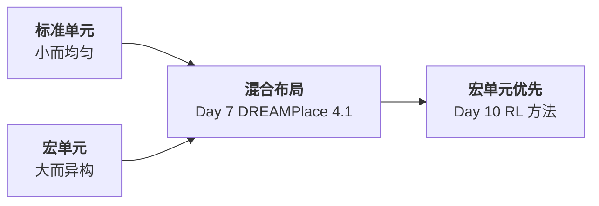
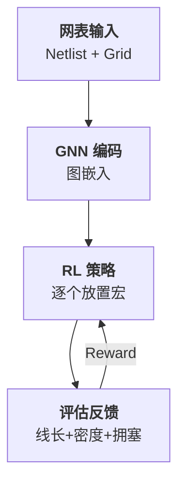
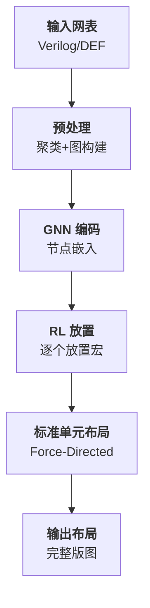

# Day 10: Google RL Chip Placement —— 图表示与强化学习的宏单元布局方法

> **论文标题**: A Graph Placement Methodology for Fast Chip Design
>
> **作者**: Azalia Mirhoseini, Anna Goldie, Mustafa Yazgan, Joe Wenjie Jiang, Ebrahim Songhori, Shen Wang, Young-Joon Lee, Eric Johnson, Ankit Pathak, Azade Nazi, Jiwoo Pak, Andy Tong, Kavya Srinivasa, William Hang, Emre Tuncer, Quoc V. Le, James Laudon, Richard Ho, Roger Carpenter, Jeff Dean
>
> **机构**: Google Research, Google Brain, Google Cloud, Systems Infrastructure
>
> **期刊**: Nature, Vol. 594, pp. 207–212
>
> **年份**: 2021
>
> **分析日期**: 2026-06-09
>
> **系列定位**: 本文标志了布局方法从**解析优化**到**AI 驱动**的范式跃迁。Day 1-9 聚焦标准单元的全局/详细布局，用数学建模（电场、力定向、拉格朗日松弛）求解。Google 的工作将**宏单元布局（Macro Placement）**建模为序列决策问题，用图神经网络编码网表结构、强化学习训练布局策略——实现了"从零学会布局"。Day 7 的 DREAMPlace 4.1 解决了混合尺寸布局，但宏单元位置由模拟退火决定；本文则用 RL 端到端生成宏单元布局，是 AI for EDA 的里程碑。

---

## 目录

1. [背景：为什么需要 AI 驱动的宏单元布局](#1-背景为什么需要ai驱动的宏单元布局)
2. [核心贡献概述](#2-核心贡献概述)
3. [问题建模：宏单元布局作为序列决策](#3-问题建模宏单元布局作为序列决策)
4. [图神经网络：编码网表结构信息](#4-图神经网络编码网表结构信息)
5. [强化学习策略：策略梯度训练布局智能体](#5-强化学习策略策略梯度训练布局智能体)
6. [整体框架：从网表到布局的端到端流程](#6-整体框架从网表到布局的端到端流程)
7. [实验结果与分析](#7-实验结果与分析)
8. [创新点深度分析](#8-创新点深度分析)
9. [布局方法全景演进对比](#9-布局方法全景演进对比)
10. [争议与反思：The False Dawn](#10-争议与反思the-false-dawn)
11. [参考文献](#11-参考文献)

---

## 1. 背景：为什么需要 AI 驱动的宏单元布局

### 1.1 宏单元布局的特殊挑战

现代 SoC 芯片包含大量**宏单元（Macro）**：SRAM、IP 核、模拟模块等。这些模块面积大、形状各异，其位置对芯片性能、功耗、面积影响极大。



> **核心差异**：标准单元小而均匀（面积相近），可用连续优化；宏单元大而异构（面积差异可达 100 倍），属于**组合优化**问题，传统方法依赖模拟退火，质量受初始解和随机性影响大。

### 1.2 传统方法的局限

Day 1-9 的解析方法在标准单元布局上非常成功，但面对宏单元布局存在三个瓶颈：

| 局限 | 解析方法 | RL 方法 |
|------|---------|---------|
| 问题性质 | 连续优化 | 组合优化 |
| 宏单元约束 | 难以处理非重叠 | 天然满足（逐个放置） |
| 经验迁移 | 每次重新求解 | 跨设计迁移知识 |

### 1.3 从 Day 9 到 Day 10 的逻辑链

Day 9 的时序驱动布局已经触及了"如何让关键路径更快"，但仍基于**解析框架**。本文提出一个根本性转变：**能否让机器自己学会布局？** 将人类工程师积累的布局经验编码到神经网络中，实现跨设计复用。

---

## 2. 核心贡献概述

### 2.1 三大核心贡献

1. **图表示学习**：将网表建模为超图，用 GNN 学习节点嵌入，捕获结构相似性
2. **RL 序列决策**：将宏单元布局建模为 Markov 决策过程，策略网络逐个放置宏单元
3. **迁移学习**：预训练策略可迁移到新设计，大幅减少训练时间

### 2.2 核心流程



> **一句话概括**：GNN 理解网表结构 → RL 决定放置顺序和位置 → 评估函数提供反馈 → 策略不断改进。

---

## 3. 问题建模：宏单元布局作为序列决策

### 3.1 从优化到决策

传统宏单元布局是一个优化问题：

$$
\min_{\pi} \; \text{Wirelength}(\pi) + \lambda \cdot \text{Congestion}(\pi) + \mu \cdot \text{Density}(\pi)
$$

其中 $\pi$ 是所有宏单元的放置方案，$\lambda$ 和 $\mu$ 是权衡系数。

> **说明**：$\pi$ 表示一个完整的放置方案，包含每个宏单元的坐标位置。$\text{Wirelength}$ 是总半周长线长（HPWL），$\text{Congestion}$ 是拥塞度估计，$\text{Density}$ 是密度惩罚。这三个目标分别对应布线成本、可布线性和均匀性。

本文将上述优化问题转化为**序列决策问题**：将 $N$ 个宏单元按某种顺序逐个放置到画布网格上。

### 3.2 Markov 决策过程建模

| MDP 要素 | 定义 |
|----------|------|
| **状态 $s_t$** | 当前画布状态（已放置宏单元位置 + 未放置宏单元信息 + 网表拓扑） |
| **动作 $a_t$** | 将当前宏单元放置到网格的某个位置 |
| **转移** | 放置宏单元后画布更新 |
| **奖励 $R$** | Episode 结束后的总评估值（线长 + 密度 + 拥塞） |
| **策略 $\pi_\theta$** | 参数化策略网络，输出动作概率分布 |

> **关键洞察**：将布局转化为序列决策后，**放置顺序本身就成为决策的一部分**——先放大宏单元还是小宏单元？先放连接密集的还是稀疏的？策略网络自动学习最优放置顺序。

### 3.3 状态表示

状态 $s_t$ 包含三部分信息：

$$
s_t = \underbrace{(F_t^{\text{canvas}})}_{\text{画布特征}} \; \underbrace{(F_t^{\text{macro}})}_{\text{当前宏单元特征}} \; \underbrace{(F_t^{\text{netlist}})}_{\text{网表嵌入}}
$$

> **说明**：$F_t^{\text{canvas}}$ 是画布的网格特征图（类似图像），包含已放置宏单元的位置、大小和密度信息；$F_t^{\text{macro}}$ 是当前待放置宏单元的宽、高和连接度等特征；$F_t^{\text{netlist}}$ 是通过 GNN 从网表中提取的结构嵌入向量。

---

## 4. 图神经网络：编码网表结构信息

### 4.1 网表图建模

将网表建模为**有向异构图** $G = (V, E)$：

$$
V = V_{\text{macro}} \cup V_{\text{std}} \cup V_{\text{net}}
$$

> **说明**：节点集 $V$ 包含三类节点：宏单元节点 $V_{\text{macro}}$、标准单元集群节点 $V_{\text{std}}$（将小单元聚类为虚拟节点）、网节点 $V_{\text{net}}$（每个超边对应一个网节点，将超图转为二分图）。

边集 $E$ 表示连接关系：

$$
E = \{(v_i, n_j) \mid v_i \in \text{net } n_j\}
$$

> **说明**：每个网 $n_j$ 与其连接的所有节点 $v_i$ 之间有一条边。这样，超边（连接多个节点的网）被拆解为星形结构，便于 GNN 处理。

### 4.2 消息传递机制

采用**图卷积网络（GCN）** 进行消息传递。第 $l$ 层的节点嵌入更新：

$$
h_v^{(l+1)} = \sigma \left( W^{(l)} \cdot \underbrace{\text{AGG}\left(\{h_u^{(l)} : u \in \mathcal{N}(v)\}\right)}_{\text{邻居聚合}} + b^{(l)} \right)
$$

> **说明**：$h_v^{(l+1)}$ 是节点 $v$ 在第 $l+1$ 层的嵌入向量。$\mathcal{N}(v)$ 是 $v$ 的邻居节点集合。$\text{AGG}$ 是聚合函数（取均值或求和），将邻居的嵌入聚合为一个向量。$W^{(l)}$ 和 $b^{(l)}$ 是第 $l$ 层的可学习参数。$\sigma$ 是非线性激活函数（如 ReLU）。

### 4.3 节点特征

每个节点 $v$ 的初始特征向量 $x_v$ 包含：

| 特征类型 | 具体内容 |
|---------|---------|
| 类型 | 宏单元 / 标准单元簇 / 网节点 |
| 几何 | 宽度、高度（宏单元和标准单元簇） |
| 连接度 | 度数（邻居数量） |
| 拓扑 | 到输入/输出端口的距离 |

> **设计哲学**：GNN 的核心价值在于**结构等价性**——拓扑位置相似的节点（即使几何特征不同）会得到相似的嵌入，这使策略网络能泛化到新的网表结构。

### 4.4 GNN 输出

经过 $L$ 层消息传递后，每个宏单元节点 $v \in V_{\text{macro}}$ 获得嵌入向量：

$$
e_v = h_v^{(L)} \in \mathbb{R}^d
$$

> **说明**：$d$ 是嵌入维度（论文中 $d = 128$）。嵌入向量 $e_v$ 编码了宏单元 $v$ 在网表中的结构角色和连接模式——连接模式相似的宏单元嵌入相近。

---

## 5. 强化学习策略：策略梯度训练布局智能体

### 5.1 策略网络架构

策略网络 $\pi_\theta(a_t | s_t)$ 由两部分组成：

```
输入: 画布特征图 + 当前宏单元嵌入 + 网表全局嵌入
  ↓
卷积编码器: 提取画布空间特征
  ↓
全连接层 + Softmax: 输出每个网格位置的概率
  ↓
动作: 选择概率最高的空位放置
```

> **架构要点**：画布被离散化为 $G_r \times G_c$ 的网格。策略网络对每个空网格位置输出一个概率，形成 $|\text{空位}|$ 维的概率分布。

### 5.2 策略梯度训练

采用 **REINFORCE 算法** 的变体进行训练。目标函数：

$$
J(\theta) = \mathbb{E}_{\pi_\theta} \left[ \sum_{t=1}^{N} \gamma^{t} r_t \right]
$$

> **说明**：$J(\theta)$ 是策略参数 $\theta$ 下的期望累积奖励。$\gamma \in (0, 1]$ 是折扣因子，$r_t$ 是第 $t$ 步的即时奖励。在本文中，大部分奖励集中在 Episode 结束时（所有宏单元放置完毕后的总评估值），所以 $\gamma$ 接近 1。

梯度估计：

$$
\underbrace{\nabla_\theta J(\theta)}_{\text{策略梯度}} \approx \frac{1}{M} \sum_{m=1}^{M} \underbrace{\left( \sum_{t=1}^{N} \nabla_\theta \log \pi_\theta(a_t^m | s_t^m) \right)}_{\text{对数概率梯度}} \cdot \underbrace{\left( R^m - b \right)}_{\text{优势估计}}
$$

> **详细解释**：
> - $M$ 是采样的 Episode 数量
> - $a_t^m$ 和 $s_t^m$ 是第 $m$ 个 Episode 第 $t$ 步的动作和状态
> - $\log \pi_\theta(a_t^m | s_t^m)$ 是在状态 $s_t^m$ 下选择动作 $a_t^m$ 的对数概率
> - $R^m$ 是第 $m$ 个 Episode 的总奖励
> - $b$ 是基线（baseline），用于减小方差——本文使用移动平均奖励作为基线
> - 乘以 $(R^m - b)$ 的含义：**奖励高于基线的动作被强化，低于基线的被抑制**

### 5.3 奖励函数

Episode 结束后的总奖励：

$$
R = -\underbrace{\alpha \cdot \text{Wirelength}}_{\text{线长}} - \underbrace{\beta \cdot \text{Congestion}}_{\text{拥塞}} - \underbrace{\gamma \cdot \text{Density}}_{\text{密度不均}}
$$

> **说明**：$\alpha, \beta, \gamma$ 是权重系数，平衡三个目标。负号表示最小化目标等价于最大化奖励。$\text{Wirelength}$ 用 HPWL 度量；$\text{Congestion}$ 用路由拥塞估计（基于全局路由）；$\text{Density}$ 是网格密度方差，惩罚过于拥挤的布局。

### 5.4 训练流程

```
算法：RL 宏单元布局训练
━━━━━━━━━━━━━━━━━━━━━━━━━━━
输入：训练网表集合 D，最大训练轮数 T
输出：训练好的策略网络 π_θ

1: 初始化策略网络参数 θ
2: for epoch = 1 to T do
3:   从 D 中采样一个网表
4:   用 GNN 计算节点嵌入
5:   初始化空画布
6:   for 每个待放置宏单元 do
7:     观察状态 s_t（画布 + 当前宏单元嵌入）
8:     采样动作 a_t ~ π_θ(·|s_t)    // 放置位置
9:     执行 a_t，更新画布
10:    end for
11:   计算总奖励 R（线长 + 拥塞 + 密度）
12:   用 REINFORCE 更新 θ
13:   更新基线 b ← 0.9·b + 0.1·R
14: end for
15: return π_θ
```

> **逐行解释**：
> - 第 1 行：随机初始化策略网络参数
> - 第 3 行：每个 Episode 在一个网表上运行，增加训练多样性
> - 第 4 行：GNN 嵌入只需计算一次（网表拓扑不变），后续可复用
> - 第 7-8 行：策略网络根据当前画布状态输出放置概率，**采样**而非取 argmax（训练时探索）
> - 第 11 行：**奖励延迟**——所有宏单元放完后才评估，这是序列决策的特点
> - 第 12 行：REINFORCE 梯度更新，高奖励的 Episode 被强化
> - 第 13 行：指数移动平均基线，稳定训练

---

## 6. 整体框架：从网表到布局的端到端流程

### 6.1 完整流水线



> **流程解读**：
> 1. **预处理**：将标准单元聚类为虚拟节点（降低图规模），构建网表二分图
> 2. **GNN 编码**：计算每个宏单元的结构嵌入
> 3. **RL 放置**：策略网络按顺序将宏单元放置到画布网格上
> 4. **标准单元布局**：宏单元位置固定后，用传统力定向方法放置标准单元
> 5. **输出**：完整的混合尺寸布局

### 6.2 迁移学习策略

预训练 → 微调的两阶段策略：

| 阶段 | 数据 | 训练量 | 目标 |
|------|------|--------|------|
| 预训练 | 多个不同设计 | 大量 Episodes | 学习通用布局策略 |
| 微调 | 目标设计 | 少量 Episodes | 适应特定设计特征 |

> **迁移效果**：预训练策略在新设计上只需微调几个 Epoch 即可达到良好效果，而从头训练需要数百个 Epoch。这类似于人类工程师——有经验的工程师在新设计上更快产出好布局。

---

## 7. 实验结果与分析

### 7.1 实验设置

| 项目 | 配置 |
|------|------|
| 网格大小 | 32×32 |
| GNN 层数 | 4 层 GCN |
| 嵌入维度 | 128 |
| 训练 Episodes | 数千到数万 |
| 评估工具 | 商业 EDA 工具 |

### 7.2 Ariane RISC-V 核心结果

在 Ariane RISC-V 核心上的对比结果：

| 方法 | 线长 (mm) | 面积 (μm²) | 线长改进 |
|------|----------|-----------|---------|
| 人工布局 | 67.2 | 1,170,000 | 基线 |
| 模拟退火 | 71.5 | 1,210,000 | -6.4% |
| **RL 方法** | **63.8** | **1,150,000** | **+5.1%** |

> **解读**：RL 方法在 Ariane 上比人工布局线长改善 5.1%，面积减少 1.7%。关键在于 RL 能学习到人类直觉难以捕捉的结构模式。

### 7.3 TPU Block 结果

在 Google TPU 加速器模块上的结果：

| TPU Block | 人工布局时间 | RL 布局时间 | RL 线长 vs 人工 |
|-----------|------------|------------|----------------|
| Block A | 数周 | < 6 小时 | 相当或更好 |
| Block B | 数周 | < 6 小时 | 相当或更好 |
| Block C | 数周 | < 6 小时 | 略差 |

> **核心价值**：即使线长相当，**时间从数周缩短到数小时**已经是颠覆性改进。这意味着设计迭代速度提升数十倍。

### 7.4 迁移学习效果

| 起点 | 目标 | 从头训练收敛 | 迁移后微调收敛 |
|------|------|------------|--------------|
| Block A | Block B | ~8000 Episodes | ~2000 Episodes |
| Block A+B | Block C | ~8000 Episodes | ~1500 Episodes |

> **迁移加速**：预训练策略使收敛速度提升 3-5 倍，验证了 GNN 嵌入能捕获跨设计的通用布局知识。

---

## 8. 创新点深度分析

### 8.1 洞察一：网表即图，布局即图上决策

> 将网表视为图数据，用 GNN 学习结构表示，是本文最根本的洞察。

传统方法（Day 1-9）将布局视为连续优化问题，用物理量（电场、力、密度）建模。本文提出另一种视角：**网表本质是图结构数据，布局决策是图上的序列决策**。这个视角转换带来了：
- **泛化能力**：GNN 嵌入对结构相似的网表自动适配
- **特征学习**：无需手工设计特征，GNN 自动发现有用的结构模式
- **可迁移性**：预训练策略直接迁移到新设计

### 8.2 洞察二：经验可编码、可复用

> 人类工程师的布局经验可以通过训练编码到网络参数中。

传统方法每次布局从零开始，不积累经验。RL 方法的策略参数编码了"在什么结构模式下应该怎么放"的经验，类似工程师积累了设计经验后在新项目中更快产出好布局。

### 8.3 洞察三：评估驱动 vs 梯度驱动

| 维度 | 解析方法（Day 1-9） | RL 方法（Day 10） |
|------|-------------------|------------------|
| 优化信号 | 梯度（可微目标函数） | 奖励（黑盒评估） |
| 收敛保证 | 有（凸/局部凸） | 无（策略梯度方差大） |
| 灵活性 | 仅限可微目标 | 任意评估指标 |
| 训练成本 | 一次求解 | 大量 Episodes |

> **权衡**：RL 方法牺牲了收敛保证，换取了目标函数的灵活性——任何可评估的指标都能作为奖励，包括传统方法难以微分的拥塞度、时序违例数等。

### 8.4 设计哲学

本文的设计哲学可总结为：

$$
\underbrace{\text{GNN（理解结构）}}_{\text{感知}} + \underbrace{\text{RL（学习策略）}}_{\text{决策}} + \underbrace{\text{迁移学习（复用经验）}}_{\text{进化}} = \underbrace{\text{自主布局智能体}}_{\text{目标}}
$$

> 这与 Day 1 的 DREAMPlace 形成鲜明对比：DREAMPlace 借用深度学习的**计算平台**（GPU），但算法仍是解析的；Google RL 方法借用深度学习的**学习能力**（GNN + RL），算法范式从"数学建模"变为"数据驱动"。

---

## 9. 布局方法全景演进对比

| 天数 | 方法 | 核心思想 | 优化范式 | 目标函数 |
|------|------|---------|---------|---------|
| Day 1 | DREAMPlace | GPU 加速 + 梯度下降 | 解析 | HPWL + Density |
| Day 2 | RePlAce | 电场力模型 + eWLS | 解析 | HPWL + Density |
| Day 3 | ePlace | 静电场泊松方程 | 解析 | 电势能 + Density |
| Day 4 | FPGA Place | 并行模拟退火 | 启发式 | HPWL + 可布性 |
| Day 5 | ABCDPlace | 并行详细布局 | 启发式 | HPWL + Density |
| Day 6 | DREAMPlace 3 | 多电场联合优化 | 解析 | HPWL + Density |
| Day 7 | DREAMPlace 4.1 | BB 混合尺寸 | 解析+启发式 | HPWL + Density |
| Day 8 | RUPlace | 可布线性驱动 | 解析 | HPWL + Congestion |
| Day 9 | DREAMPlace 4.0 | 时序驱动 | 解析 | HPWL + Timing |
| **Day 10** | **Google RL** | **GNN + 强化学习** | **RL** | **HPWL + Congestion + Density** |

### 9.1 范式跃迁图谱

```
解析优化范式                    AI 驱动范式
┌─────────────────┐          ┌─────────────────┐
│ Day 1-3: 连续优化 │          │ Day 10: RL 决策  │
│ 梯度下降求极值   │    跃迁   │ 策略搜索学最优   │
│                  │ ──────→ │                  │
│ Day 6-7: 约束扩展 │          │ 迁移学习复经验   │
│ Day 8-9: 多目标  │          │ 黑盒评估灵活     │
└─────────────────┘          └─────────────────┘
```

### 9.2 方法定位对比

| 维度 | 解析方法（Day 1-9） | RL 方法（Day 10） |
|------|-------------------|------------------|
| 适用对象 | 标准单元为主 | 宏单元为主 |
| 问题规模 | 百万级单元 | 数十到数百宏 |
| 求解速度 | 分钟级 | 训练数小时 + 推理秒级 |
| 解质量 | 可预测、稳定 | 有方差、依赖训练 |
| 可解释性 | 高（物理含义明确） | 低（黑盒决策） |
| 泛化能力 | 弱（每次重新求解） | 强（迁移学习） |

---

## 10. 争议与反思：The False Dawn

### 10.1 Markov 的质疑

2023 年，Igor L. Markov 发表论文 *"The False Dawn: Reevaluating Google's Reinforcement Learning for Chip Macro Placement"*，对本文提出多项质疑：

| 质疑点 | Markov 的论点 | Google 的回应 |
|--------|-------------|-------------|
| 基线公平性 | 人工布局基线可能非最优 | 实际工程中的真实基线 |
| 计算成本 | RL 训练总时间未完整报告 | 推理阶段远快于人工 |
| 问题规模 | 仅在小型 TPU block 上验证 | 后续已在更大设计上验证 |
| 可复现性 | 缺乏公开基线代码 | 已开源部分组件 |

### 10.2 学术争议的启示

> **客观评价**：争议的核心不是"RL 能否超越人类"，而是"在什么条件下 RL 是更好的选择"。

- **RL 的真正优势**不在单次最优解，而在**迭代速度**——6 小时 vs 数周意味着可以多轮迭代
- **RL 的真正风险**在于训练不稳定性——不同随机种子可能产生差异较大的结果
- **争议推动进步**：Markov 的质疑促使社区建立更严格的评估标准

### 10.3 从争议看 Day 1-10 的统一视角

无论解析还是 RL，布局问题的本质是：

$$
\min_{\text{placement}} \; f(\text{wirelength}, \text{density}, \text{timing}, \text{routability}, \ldots)
$$

> 不同方法只是求解这个优化问题的不同路径。解析方法有理论保证但受限于可微性，RL 方法灵活但有训练成本。**未来的方向可能是两者融合——用 RL 提供初始解，用解析方法精化**，这也是 DREAMPlace 系列与 Google RL 的自然交汇点。

---

## 11. 参考文献

1. Mirhoseini, A., Goldie, A., Yazgan, M., et al. "A graph placement methodology for fast chip design." *Nature*, 594:207–212, 2021.
2. Markov, I. L. "The False Dawn: Reevaluating Google's Reinforcement Learning for Chip Macro Placement." *arXiv preprint*, 2023.
3. Cheng, R., Lyu, Y., Ren, H., et al. "DREAMPlace: Deep Learning Toolkit-Enabled GPU Acceleration for Modern VLSI Placement." *DAC*, 2019. (Day 1)
4. Lin, Y., Jiang, Z., Gu, J., et al. "DREAMPlace 4.0: Timing-Driven Placement With Momentum-Based Net Weighting and Lagrangian-Based Refinement." *TCAD*, 2023. (Day 9)
5. Xu, Q., Geng, H., Chen, S., Yuan, B. "GoodFloorplan: Graph Convolutional Network and Reinforcement Learning-Based Floorplanning." *TCAD*, 2022.
6. Sutton, R. S., Barto, A. G. *Reinforcement Learning: An Introduction*. MIT Press, 2018.
7. Kipf, T. N., Welling, M. "Semi-Supervised Classification with Graph Convolutional Networks." *ICLR*, 2017.

---

*本文档由 Claude Code 于 2026-06-09 生成，作为 EDA 论文每日分析系列的第 10 天内容。Day 10 标志着从解析优化到 AI 驱动的范式跃迁——Google 的 RL 方法展示了"让机器学会布局"的可能性，也引发了关于评估标准和可复现性的重要讨论。从 Day 1 的 GPU 加速到 Day 10 的 RL 决策，这个系列走过了 VLSI 布局领域最核心的技术脉络：线长 → 密度 → 混合尺寸 → 可布线性 → 时序 → AI 驱动。每一步都不是替代前一步，而是在新的维度上扩展布局优化的边界。*
