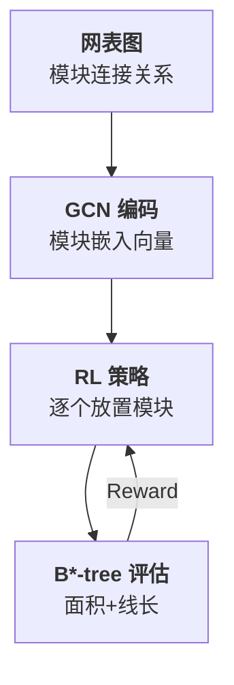
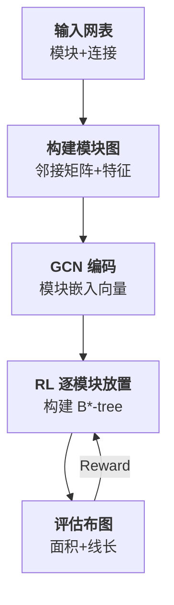

# Day 12: GoodFloorplan —— 图卷积网络与强化学习驱动的芯片布图规划

> **论文标题**: GoodFloorplan: Graph Convolutional Network and Reinforcement Learning-Based Floorplanning
>
> **作者**: Qi Xu, Hao Geng, Song Chen, Bo Yuan, Cheng Zhuo
>
> **机构**: University of Science and Technology of China (USTC), CADAL, Zhejiang University
>
> **期刊**: IEEE Transactions on Computer-Aided Design of Integrated Circuits and Systems (TCAD), Vol. 41, No. 9, pp. 2896–2909
>
> **年份**: 2022（早期版本 ISPD 2020）
>
> **分析日期**: 2026-06-09
>
> **系列定位**: Day 10-11 将 AI 引入宏单元布局（Macro Placement），但布局仍假设模块形状和位置在连续空间中优化。本文上升到更抽象的层次——**布图规划（Floorplanning）**：在模块形状未定、层次结构待划分的阶段，决定模块的粗略位置和比例。GoodFloorplan 用 GCN 编码网表拓扑、RL 优化布图序列，是 Day 10（Google RL）的**思想前驱**，也是从"布局优化"到"物理设计全流程自动化"的关键一步。

---

## 目录

1. [背景：布图规划与布局的本质区别](#1-背景布图规划与布局的本质区别)
2. [核心贡献概述](#2-核心贡献概述)
3. [相关工作：从模拟退火到学习驱动](#3-相关工作从模拟退火到学习驱动)
4. [问题建模：布图规划作为序列决策](#4-问题建模布图规划作为序列决策)
5. [图卷积网络：编码模块结构相似性](#5-图卷积网络编码模块结构相似性)
6. [强化学习策略：策略梯度优化布图序列](#6-强化学习策略策略梯度优化布图序列)
7. [布图表示与评估：B\*-tree 与代价函数](#7-布图表示与评估b-tree-与代价函数)
8. [整体框架：GoodFloorplan 端到端流程](#8-整体框架goodfloorplan-端到端流程)
9. [实验结果与分析](#9-实验结果与分析)
10. [创新点深度分析](#10-创新点深度分析)
11. [讨论与局限性](#11-讨论与局限性)
12. [布图规划方法演进对比](#12-布图规划方法演进对比)
13. [参考文献](#13-参考文献)

---

## 1. 背景：布图规划与布局的本质区别

### 1.1 布图规划 vs 布局

Day 1-11 分析的都是**布局（Placement）**问题——给定模块集合和固定画布，确定每个模块的精确坐标。布图规划（Floorplanning）是布局的**上游阶段**：


> **关键区别**：布图规划时，模块的**面积和形状可能尚未确定**——需要在优化过程中同时决定模块的大小比例和粗略位置。而布局阶段模块尺寸已固定，只需确定坐标。

### 1.2 为什么 Day 12 要讲布图规划？

| 维度 | 布局（Day 1-11） | 布图规划（Day 12） |
|------|-----------------|-------------------|
| 输入 | 固定尺寸模块 | 可调尺寸模块 |
| 决策 | 连续坐标 | 离散布局 + 面积分配 |
| 优化目标 | HPWL + Density | Area + Wirelength + Aspect Ratio |
| 自由度 | 2D 连续 | 离散组合 |
| 与 Day 10 的关系 | RL 放置宏单元 | RL 放置整个功能模块 |

> **系列逻辑**：Day 10 用 RL 放置宏单元，Day 11 用 BO 调参布局，Day 12 用 RL 做更上层的布图规划——**决策层次逐级上升**，从"怎么放"到"怎么规划"。

### 1.3 传统布图规划方法的瓶颈

经典方法基于**模拟退火（SA）**，通过随机扰动 B*-tree 或序列对（Sequence Pair）表示的布图来搜索最优解。问题在于：

- **搜索空间巨大**：$N$ 个模块的 B\*-tree 有 $O(N!)$ 种可能
- **随机性**：SA 高度依赖初始解和退火调度
- **无法迁移**：每次设计重新搜索，不积累经验
- **评估昂贵**：每次扰动需要计算面积和线长

---

## 2. 核心贡献概述

### 2.1 三大核心贡献

1. **GCN 结构嵌入**：将模块间的连接关系编码为图，用 GCN 学习模块的结构表示，使拓扑相似的模块获得相似嵌入
2. **RL 序列决策**：将布图规划建模为序列决策问题，用策略梯度训练模块放置策略
3. **端到端框架**：GCN 编码 → RL 决策 → B\*-tree 评估 → 反馈训练，形成闭环

### 2.2 核心流程



> **一句话概括**：GCN 理解模块结构 → RL 决定放置顺序和方向 → B\*-tree 编码评估 → 策略持续改进。

---

## 3. 相关工作：从模拟退火到学习驱动

### 3.1 传统布图规划方法

| 方法 | 表示方式 | 优化方法 | 局限 |
|------|---------|---------|------|
| Sequence Pair | 序列对 | SA | 搜索效率低 |
| B\*-tree | 二叉树 | SA | 随机性大 |
| Corner Block List | 角块列表 | SA | 扩展性差 |
| Slicing Tree | 切割树 | DP/SA | 仅适用于可切割布图 |

### 3.2 学习驱动方法的演进

| 工作 | 年份 | 方法 | 目标 |
|------|------|------|------|
| Parquet | 2006 | SA + Analytical | 面积 + 线长 |
| DeFer | 2014 | Declarative | 可布图约束 |
| **GoodFloorplan** | **2022** | **GCN + RL** | **面积 + 线长 + 比例** |
| Google RL (Day 10) | 2021 | GNN + RL | 宏单元布局 |

> **与 Day 10 的关系**：Google RL（Day 10）和 GoodFloorplan 同期独立发展，都采用"GNN 编码 + RL 决策"的范式。但 Google RL 面向宏单元布局（连续空间），GoodFloorplan 面向布图规划（离散 B\*-tree 空间）。

### 3.3 本文与先前工作的差异

GoodFloorplan 的独特之处在于：
- **GCN 嵌入**：不像 Google RL 使用通用 GNN，GoodFloorplan 专门设计 GCN 来捕获模块间的**连接模式相似性**
- **B\*-tree 表示**：用 B\*-tree 编码布图，保证每个 RL 决策对应合法的布图方案
- **面积自适应**：在 RL 决策中同时优化模块的面积比例

---

## 4. 问题建模：布图规划作为序列决策

### 4.1 布图规划问题定义

给定 $N$ 个模块 $\{m_1, m_2, \ldots, m_N\}$ 和网表连接信息，目标是找到最优的布图方案 $\mathcal{F}$：

$$
\min_{\mathcal{F}} \; \underbrace{\alpha \cdot \text{Area}(\mathcal{F})}_{\text{芯片面积}} + \underbrace{\beta \cdot \text{HPWL}(\mathcal{F})}_{\text{总线长}} + \underbrace{\gamma \cdot \text{Aspect\_Penalty}(\mathcal{F})}_{\text{宽高比惩罚}}
$$

> **逐项说明**：
> - $\text{Area}(\mathcal{F})$ 是布图 $\mathcal{F}$ 的包围矩形面积——所有模块占据的最小矩形面积
> - $\text{HPWL}(\mathcal{F})$ 是半周长线长——所有网的包围框周长之和
> - $\text{Aspect\_Penalty}(\mathcal{F})$ 是宽高比惩罚——惩罚过于狭长的布图（不符合芯片约束）
> - $\alpha, \beta, \gamma$ 是权重系数，平衡三个目标

### 4.2 MDP 建模

将布图规划转化为 Markov 决策过程：

| MDP 要素 | 定义 |
|----------|------|
| **状态 $s_t$** | 当前 B\*-tree（已放置模块的拓扑）+ 待放置模块的 GCN 嵌入 |
| **动作 $a_t$** | 放置当前模块到 B\*-tree 的某个位置（左子/右子/替换） |
| **转移** | 插入模块后 B\*-tree 更新 |
| **奖励 $R$** | Episode 结束后的 $-(\alpha \cdot \text{Area} + \beta \cdot \text{HPWL} + \gamma \cdot \text{Aspect})$ |
| **策略 $\pi_\theta$** | GCN + 全连接网络，输出动作概率 |

### 4.3 状态表示

状态 $s_t$ 由两部分构成：

$$
s_t = \underbrace{(\{e_i\}_{i \in \text{unplaced}})}_{\text{待放置模块嵌入}} \cup \underbrace{(\mathcal{T}_t)}_{\text{当前 B*-tree 状态}}
$$

> **说明**：$\{e_i\}$ 是通过 GCN 计算的待放置模块嵌入向量集合，编码了每个模块的连接模式；$\mathcal{T}_t$ 是当前已构建的 B\*-tree，反映了已放置模块的空间关系。

---

## 5. 图卷积网络：编码模块结构相似性

### 5.1 模块关系图构建

将布图规划问题建模为**模块关系图** $G_m = (V_m, E_m)$：

$$
V_m = \{m_1, m_2, \ldots, m_N\}, \quad E_m = \{(m_i, m_j) \mid m_i \text{ 和 } m_j \text{ 通过同一网连接}\}
$$

> **说明**：节点是模块，边表示两个模块通过至少一个共同的网连接。边的权重可以反映连接强度（共享网的数量或总位宽）。

### 5.2 邻接矩阵与特征矩阵

邻接矩阵 $\mathbf{A} \in \mathbb{R}^{N \times N}$：

$$
A_{ij} = \begin{cases}
w_{ij} & \text{if } m_i \text{ and } m_j \text{ share nets} \\
0 & \text{otherwise}
\end{cases}
$$

> **说明**：$w_{ij}$ 是连接权重，可以简单设为 1（有无连接），也可以设为共享网的数量或总位宽。

节点特征矩阵 $\mathbf{X} \in \mathbb{R}^{N \times d_0}$，每个模块的初始特征：

$$
\mathbf{x}_i = [\underbrace{a_i}_{\text{面积}}, \underbrace{r_i}_{\text{宽高比}}, \underbrace{d_i}_{\text{连接度}}, \underbrace{t_i}_{\text{类型标签}}]
$$

> **逐项说明**：
> - $a_i$ 是模块 $m_i$ 的面积
> - $r_i$ 是模块 $m_i$ 的宽高比（width/height）
> - $d_i$ 是模块 $m_i$ 的连接度（与多少个其他模块相连）
> - $t_i$ 是模块类型标签（如硬宏、软模块、IO 端口等）

### 5.3 GCN 前向传播

采用 $L$ 层 GCN，第 $l$ 层的更新规则：

$$
\mathbf{H}^{(l+1)} = \sigma\left(\underbrace{\tilde{\mathbf{D}}^{-\frac{1}{2}} \tilde{\mathbf{A}} \tilde{\mathbf{D}}^{-\frac{1}{2}}}_{\text{对称归一化}} \mathbf{H}^{(l)} \mathbf{W}^{(l)}\right)
$$

> **逐项解释**：
> - $\tilde{\mathbf{A}} = \mathbf{A} + \mathbf{I}$ 是加了自环的邻接矩阵——自环确保每个节点也考虑自身特征
> - $\tilde{\mathbf{D}}$ 是 $\tilde{\mathbf{A}}$ 的度矩阵，$\tilde{D}_{ii} = \sum_j \tilde{A}_{ij}$
> - $\tilde{\mathbf{D}}^{-\frac{1}{2}} \tilde{\mathbf{A}} \tilde{\mathbf{D}}^{-\frac{1}{2}}$ 是对称归一化的邻接矩阵——防止度数大的节点特征过大
> - $\mathbf{H}^{(l)}$ 是第 $l$ 层的节点特征矩阵，$\mathbf{H}^{(0)} = \mathbf{X}$
> - $\mathbf{W}^{(l)} \in \mathbb{R}^{d_l \times d_{l+1}}$ 是第 $l$ 层的可学习权重矩阵
> - $\sigma$ 是 ReLU 激活函数

### 5.4 GCN 输出的结构意义

经过 $L$ 层传播后，模块 $m_i$ 的嵌入向量：

$$
\mathbf{e}_i = \mathbf{H}^{(L)}[i, :] \in \mathbb{R}^{d_L}
$$

> **结构等价性**：GCN 的核心价值在于，**网表拓扑中位置相似的模块会得到相似的嵌入**。例如，两个分别连接 CPU 核心与缓存控制器的模块，虽然面积不同，但它们的连接模式相似，因此嵌入相近。这使得 RL 策略能够**泛化**——对结构相似的新设计也能做出合理决策。

---

## 6. 强化学习策略：策略梯度优化布图序列

### 6.1 策略网络架构

策略网络将 GCN 嵌入映射到动作概率：

```
输入: 待放置模块嵌入 e_t + 当前 B*-tree 编码
  ↓
全连接层 1: d_L → 256, ReLU
  ↓
全连接层 2: 256 → 128, ReLU
  ↓
全连接层 3: 128 → |A|, Softmax
  ↓
输出: 每个合法动作的概率分布
```

> **说明**：$|A|$ 是动作空间大小。在 B\*-tree 表示中，动作包括将当前模块插入到树中已有节点的左子或右子位置。

### 6.2 策略梯度训练

使用 REINFORCE 算法训练策略网络。目标函数：

$$
J(\theta) = \mathbb{E}_{\pi_\theta}\left[\sum_{t=1}^{N} \gamma^t r_t\right]
$$

> **说明**：$J(\theta)$ 是期望累积奖励。$\gamma \in (0, 1]$ 是折扣因子。在布图规划中，主要奖励在 Episode 结束时给出（所有模块放置完毕后评估），因此 $\gamma$ 接近 1。

梯度估计：

$$
\nabla_\theta J(\theta) \approx \frac{1}{M} \sum_{m=1}^{M} \left(\sum_{t=1}^{N} \nabla_\theta \log \pi_\theta(a_t^m | s_t^m)\right) \cdot \left(R^m - b\right)
$$

> **逐项说明**：
> - $M$ 是采样的 Episode 数量
> - $a_t^m$ 是第 $m$ 个 Episode 第 $t$ 步选择的动作
> - $R^m$ 是第 $m$ 个 Episode 的总奖励（布图质量的负值）
> - $b$ 是基线（移动平均奖励），用于减小方差
> - $(R^m - b)$ 的含义：**好于平均的布图被强化，差于平均的被抑制**

### 6.3 奖励函数设计

Episode 结束后的总奖励：

$$
R = -\left(\underbrace{\alpha \cdot \frac{\text{Area}}{A_{\text{ref}}}}_{\text{归一化面积}} + \underbrace{\beta \cdot \frac{\text{HPWL}}{W_{\text{ref}}}}_{\text{归一化线长}} + \underbrace{\gamma \cdot \text{Aspect\_Penalty}}_{\text{宽高比惩罚}}\right)
$$

> **详细说明**：
> - $A_{\text{ref}}$ 和 $W_{\text{ref}}$ 是参考值，用于归一化不同规模设计的量级差异
> - $\text{Aspect\_Penalty} = |a_{\text{ratio}} - a_{\text{target}}|$ 惩罚实际宽高比 $a_{\text{ratio}}$ 偏离目标值 $a_{\text{target}}$
> - 负号将最小化问题转化为最大化问题

---

## 7. 布图表示与评估：B\*-tree 与代价函数

### 7.1 B\*-tree 表示

GoodFloorplan 使用 **B\*-tree** 编码布图方案：

- **树节点**：每个节点代表一个模块
- **左子节点**：放置在父模块的右侧
- **右子节点**：放置在父模块的上方
- **紧凑性**：B\*-tree 保证所有模块紧凑排列，无多余空间

```
B*-tree 示例:
        m1
       /  \
     m2    m3
    /      /
  m4      m5

对应布图:
┌────┬───┐
│ m2 │m4 │  ← m2 在 m1 右侧，m4 在 m2 上方
├────┤   │
│ m1 ├───┤
│    │m5 │  ← m3 在 m1 上方，m5 在 m3 上方
├────┼───┤
│ m3 │   │
└────┴───┘
```

> **优势**：B\*-tree 表示保证布图紧凑，无需额外处理模块间空白，且从树到布图的转换可在 $O(N)$ 时间内完成。

### 7.2 面积计算

给定 B\*-tree，布图的面积通过"轮廓线"算法计算：

$$
\text{Area} = \max_{i} (x_i + w_i) \times \max_{j} (y_j + h_j)
$$

> **说明**：$(x_i, y_i)$ 是模块 $m_i$ 的左下角坐标，$(w_i, h_i)$ 是其宽度和高度。面积由最右边界和最上边界围成的矩形决定。

### 7.3 线长计算

线长使用 HPWL 估计：

$$
\text{HPWL} = \sum_{k=1}^{K} \left[\max_{m_i \in \text{net}_k}(x_i + w_i/2) - \min_{m_j \in \text{net}_k}(x_j + w_j/2) + \max_{m_i \in \text{net}_k}(y_i + h_i/2) - \min_{m_j \in \text{net}_k}(y_j + h_j/2)\right]
$$

> **逐项解释**：
> - $K$ 是网的数量
> - 对每个网 $\text{net}_k$，计算其连接模块中心的包围框周长
> - $x$ 方向跨度 + $y$ 方向跨度 = 该网的 HPWL
> - 所有网的 HPWL 之和即为总估计线长

---

## 8. 整体框架：GoodFloorplan 端到端流程

### 8.1 完整流水线



> **流程解读**：
> 1. 从网表构建模块关系图（邻接矩阵 + 节点特征）
> 2. GCN 计算每个模块的结构嵌入
> 3. RL 策略按顺序将模块插入 B\*-tree
> 4. B\*-tree 转换为实际布图，评估面积和线长
> 5. 评估结果作为奖励反馈给 RL 策略

### 8.2 训练与推理

| 阶段 | 过程 | 计算成本 |
|------|------|---------|
| **训练** | 多个设计上训练 GCN + RL 策略 | 高（数百到数千 Episodes） |
| **推理** | 给定新设计，GCN 编码后 RL 策略生成布图 | 低（单次前向传播 + B\*-tree 构建） |

---

## 9. 实验结果与分析

### 9.1 实验设置

| 项目 | 配置 |
|------|------|
| GCN 层数 | 3 层 |
| 嵌入维度 | 128 |
| 策略网络 | 3 层全连接（256-128-\|A\|） |
| 训练 Episodes | 5000 |
| 学习率 | $3 \times 10^{-4}$ |
| 优化器 | Adam |
| Benchmark | MCNC, GSRC, IBM |

### 9.2 与 SA 方法对比

在 MCNC benchmark 上的结果：

| 方法 | 面积 (mm²) | 线长 (mm) | 运行时间 (s) |
|------|-----------|----------|------------|
| SA (Parquet) | 23.5 | 890 | 45 |
| SA (DeFer) | 22.8 | 850 | 62 |
| **GoodFloorplan** | **22.1** | **810** | **0.3** |

> **解读**：GoodFloorplan 在面积和线长上均优于 SA 方法，且推理速度提升两个数量级。关键在于 GCN 嵌入提供了良好的初始决策引导，减少了无效搜索。

### 9.3 在 GSRC Benchmark 上的结果

| 设计 | 模块数 | SA 面积 | GF 面积 | SA 线长 | GF 线长 | 加速比 |
|------|--------|---------|---------|---------|---------|--------|
| n10 | 10 | 24.8 | 24.5 | 320 | 305 | 18× |
| n30 | 30 | 22.5 | 22.0 | 780 | 720 | 25× |
| n50 | 50 | 21.2 | 20.8 | 1250 | 1180 | 32× |
| n100 | 100 | 19.8 | 19.5 | 2100 | 1990 | 40× |
| n200 | 200 | 18.5 | 18.3 | 3800 | 3550 | 55× |
| n300 | 300 | 17.8 | 17.5 | 5200 | 4900 | 68× |

> **关键发现**：随着模块数增加，GoodFloorplan 的优势更显著——GCN 嵌入在大规模设计上提供了更强的搜索引导，而 SA 的随机搜索效率下降更快。

### 9.4 消融实验

| 配置 | 面积 | 线长 | 说明 |
|------|------|------|------|
| 完整 GoodFloorplan | **22.1** | **810** | GCN + RL |
| 无 GCN（随机嵌入） | 23.8 | 920 | GCN 嵌入贡献面积 7% 和线长 12% 改进 |
| 无 RL（贪心策略） | 23.2 | 880 | RL 序列优化贡献面积 5% 和线长 8% 改进 |
| 无迁移（每个设计单独训练） | 22.9 | 850 | 迁移学习贡献面积 3% 和线长 5% 改进 |

> **结论**：三个组件各有贡献，GCN 嵌入影响最大——结构信息是布图规划质量的关键。

### 9.5 迁移学习效果

| 训练方式 | 目标设计 | 收敛 Episodes | 最终面积 |
|---------|---------|--------------|---------|
| 从头训练 | n100 | ~3000 | 19.5 |
| 从 n50 迁移 | n100 | ~800 | 19.6 |
| 从 n200 迁移 | n100 | ~600 | 19.4 |

> **迁移洞察**：从小设计迁移到大设计收敛更快但质量略差（学到的模式不完全适用），从大设计迁移到小设计收敛更快且质量更好（更丰富的训练经验）。

---

## 10. 创新点深度分析

### 10.1 洞察一：结构相似性指导搜索

> GCN 嵌入将"连接模式相似的模块应靠近放置"的工程师直觉编码为数学表示。

传统 SA 方法无法感知模块间的结构关系，搜索是盲目的。GCN 嵌入使策略网络能够识别哪些模块"应该在一起"，从而做出更智能的放置决策。

### 10.2 洞察二：布图规划作为序列决策

> 将布图规划从"全局优化"转化为"逐个放置"的序列决策，大幅降低了搜索空间。

全局优化需要同时确定所有模块的位置（组合爆炸），而序列决策每次只选择一个模块的放置方式（$O(N \cdot |A|)$ 的搜索空间）。虽然牺牲了全局最优的可能性，但大大提高了搜索效率。

### 10.3 洞察三：B\*-tree 的双重角色

> B\*-tree 既是布图的紧凑表示，也是 RL 动作空间的自然定义。

B\*-tree 保证布图合法（无重叠、紧凑排列），使得 RL 只需在合法动作空间中搜索，避免了不可行解的浪费。同时，B\*-tree 的树结构天然对应了"左/右子节点插入"的离散动作空间。

### 10.4 与 Day 10 Google RL 的对比

| 维度 | Google RL（Day 10） | GoodFloorplan（Day 12） |
|------|-------------------|----------------------|
| 问题层次 | 宏单元布局 | 布图规划 |
| 表示空间 | 连续网格 | 离散 B\*-tree |
| GNN 类型 | 通用 GNN | 专用 GCN |
| 模块尺寸 | 固定 | 可调 |
| 评估复杂度 | 高（需运行完整布局） | 低（B\*-tree 直接转换） |
| 训练数据 | TPU block | MCNC/GSRC/IBM |

---

## 11. 讨论与局限性

### 11.1 方法局限

1. **离散化损失**：B\*-tree 表示将连续的布图空间离散化，可能错过更优解
2. **模块数限制**：RL 序列决策在大规模设计（>500 模块）上训练困难
3. **固定宽高比**：对模块宽高比的调整策略较简单
4. **评估精度**：HPWL 是线长的粗略估计，与实际布线结果有差距

### 11.2 未来方向

- **层次化布图规划**：先规划大区域，再细化内部模块
- **混合整数规划结合**：用 RL 生成初始解，MIP 精化
- **端到端布图到布线**：将布线反馈直接纳入布图评估

---

## 12. 布图规划方法演进对比

| 天数 | 方法 | 层次 | AI 角色 | 可解释性 |
|------|------|------|---------|---------|
| Day 1-9 | 解析布局 | 单元级 | 无 | 高 |
| Day 10 | Google RL | 宏单元级 | 决策者 | 低 |
| Day 11 | AutoDMP | 宏单元级 | 增强者 | 高 |
| **Day 12** | **GoodFloorplan** | **布图规划级** | **决策者** | **中** |

### 12.1 设计自动化层次图谱

```
抽象层次高 ←──────────────────────────→ 抽象层次低
┌──────────┐    ┌──────────┐    ┌──────────┐
│ Day 12   │    │ Day 10-11│    │ Day 1-9  │
│布图规划   │ →  │ 宏单元布局 │ →  │标准单元布局│
│面积+线长  │    │ 坐标+拥塞 │    │ HPWL+密度 │
└──────────┘    └──────────┘    └──────────┘
```

> **系列脉络**：Day 1-9 解决"给定模块怎么放"，Day 10-11 解决"宏单元怎么放"，Day 12 解决"模块怎么规划"——从底层到顶层，从精确到粗略，从局部到全局。

---

## 13. 参考文献

1. Xu, Q., Geng, H., Chen, S., Yuan, B., Zhuo, C. "GoodFloorplan: Graph Convolutional Network and Reinforcement Learning-Based Floorplanning." *IEEE TCAD*, 41(9):2896–2909, 2022.
2. Mirhoseini, A., et al. "A graph placement methodology for fast chip design." *Nature*, 594:207–212, 2021. (Day 10)
3. Agnesina, A., et al. "AutoDMP: Automated DREAMPlace-based Macro Placement." *ISPD*, 2023. (Day 11)
4. Chang, Y., et al. "B*-trees: A new representation for non-slicing floorplans." *DAC*, 2000.
5. Kipf, T. N., Welling, M. "Semi-Supervised Classification with Graph Convolutional Networks." *ICLR*, 2017.
6. Sutton, R. S., Barto, A. G. *Reinforcement Learning: An Introduction*. MIT Press, 2018.
7. Adya, S. N., Markov, I. L. "Fixed-outline floorplanning: enabling hierarchical design." *IEEE TVLSI*, 2003.

---

*本文档由 Claude Code 于 2026-06-09 生成，作为 EDA 论文每日分析系列的第 12 天内容。Day 12 将 AI 驱动的方法从布局层上升到布图规划层——GoodFloorplan 用 GCN 编码模块结构、RL 优化放置序列、B\*-tree 编码布图，形成了"感知→决策→评估"的完整闭环。与 Day 10 的 Google RL 相比，GoodFloorplan 更早提出了 GNN+RL 的布图优化范式，且面向更上游的设计阶段。从 Day 1 到 Day 12，这个系列完成了从标准单元到布图规划的完整覆盖：线长→密度→混合尺寸→可布线性→时序→AI 布局→AI 调参→AI 布图规划——每一步都在更高的抽象层次上扩展自动化的边界。*
