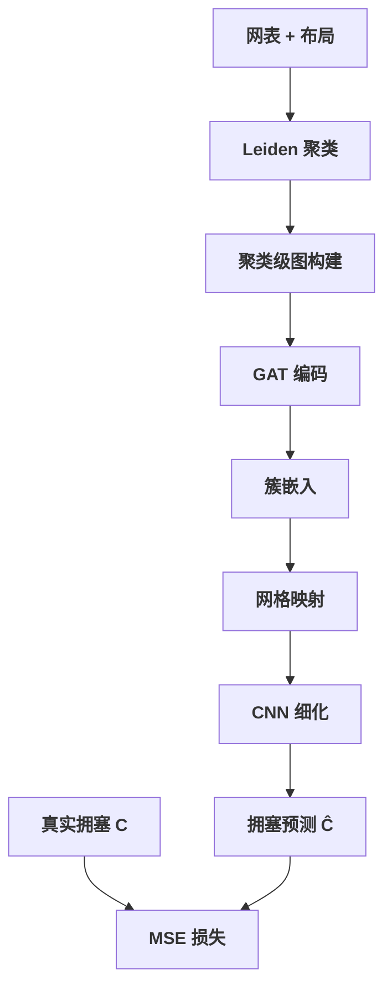

# Day 13: ClusterNet —— 基于网表聚类与图神经网络的布线拥塞预测与优化

> **论文标题**: ClusterNet: Routing Congestion Prediction and Optimization Using Netlist Clustering and Graph Neural Networks
>
> **作者**: Kyungjun Min, Seongbin Kwon, Sung-Yun Lee, Dohun Kim, Sunghye Park, Seokhyeong Kang
>
> **机构**: Ulsan National Institute of Science and Technology (UNIST), Korea
>
> **会议**: 2023 IEEE/ACM International Conference on Computer Aided Design (ICCAD)
>
> **年份**: 2023
>
> **DOI**: 10.1109/ICCAD57390.2023.10323942
>
> **分析日期**: 2026-06-10
>
> **系列定位**: Day 8（RUPlace）首次引入可布线性驱动布局，Day 12（GoodFloorplan）用 GCN 编码网表拓扑。本文将两个方向融合——用 GNN 预测布线拥塞，再用预测结果反馈优化布局。关键创新在于**网表聚类（Leiden 算法）+ GNN 嵌入 + 聚类填充优化**的三段式框架，是从"优化驱动"到"预测驱动"范式转变的代表作。

---

## 目录

1. [背景：布线拥塞预测为何重要](#1-背景布线拥塞预测为何重要)
2. [核心贡献概述](#2-核心贡献概述)
3. [相关工作：从传统估计到深度学习](#3-相关工作从传统估计到深度学习)
4. [问题建模：拥塞预测作为图学习问题](#4-问题建模拥塞预测作为图学习问题)
5. [网表聚类：Leiden 算法提取局部拓扑](#5-网表聚类leiden-算法提取局部拓扑)
6. [图神经网络：基于聚类的嵌入生成](#6-图神经网络基于聚类的嵌入生成)
7. [聚类填充：基于预测的拥塞优化](#7-聚类填充基于预测的拥塞优化)
8. [整体框架：ClusterNet 端到端流程](#8-整体框架clusternet-端到端流程)
9. [实验结果与分析](#9-实验结果与分析)
10. [创新点深度分析](#10-创新点深度分析)
11. [讨论与局限性](#11-讨论与局限性)
12. [拥塞预测方法演进对比](#12-拥塞预测方法演进对比)
13. [参考文献](#13-参考文献)

---

## 1. 背景：布线拥塞预测为何重要

### 1.1 拥塞：物理设计的"隐形杀手"

在 VLSI 物理设计流程中，布线拥塞（Routing Congestion）是最关键的质量指标之一：


> **核心矛盾**：拥塞在布线阶段才最终确定，但此时布局已经完成。如果发现拥塞严重，必须返回布局阶段重新调整——这种**迭代**代价极高。提前在布局阶段预测拥塞，可以显著减少迭代次数。

### 1.2 为什么 Day 13 要讲拥塞预测？

| 维度 | Day 8 RUPlace | Day 12 GoodFloorplan | Day 13 ClusterNet |
|------|---------------|---------------------|-------------------|
| 目标 | 可布线性驱动布局优化 | GCN 编码网表 + RL 布图规划 | GNN 预测拥塞 + 反馈优化 |
| 方法 | 分析力场 + 拥塞惩罚 | 图卷积 + 策略梯度 | 聚类 + GNN 回归 + 填充 |
| 拥塞处理 | 隐式（通过密度约束） | 不涉及 | 显式预测 + 定向优化 |
| 学习范式 | 无学习 | 强化学习 | 监督学习 |

### 1.3 传统拥塞估计的局限

传统方法（如 RUDY/RISA）基于布局密度进行拥塞估计，但存在根本缺陷：

1. **忽略网表拓扑**：两个密度相同的区域，如果连接关系不同，拥塞可能完全不同
2. **过度平滑**：全局密度分布无法反映局部热点
3. **静态模型**：无法学习设计规则和工艺节点的复杂影响

> **ClusterNet 的核心洞察**：网表的**拓扑结构**（哪些单元紧密连接）才是拥塞的根本原因。通过聚类提取局部拓扑，再用 GNN 学习其与拥塞的映射关系，可以更准确地预测拥塞。

---

## 2. 核心贡献概述

ClusterNet 的三大贡献：

1. **网表聚类策略**：用 Leiden 算法将网表划分为高内聚的簇（cluster），每个簇捕获一组紧密连接的单元，使 GNN 能有效学习局部拓扑特征
2. **聚类嵌入 GNN**：设计基于聚类的图神经网络架构，生成簇级别的嵌入表示，预测每个簇引起的布线拥塞
3. **聚类填充优化**：利用训练好的预测模型，通过在拥塞簇周围添加填充单元（padding cells）来缓解拥塞，实现预测驱动的优化

> **范式转变**：从"先优化再验证"到"先预测再定向优化"——预测模型不仅用于评估，还直接指导优化操作。

---

## 3. 相关工作：从传统估计到深度学习

### 3.1 传统拥塞估计方法

| 方法 | 原理 | 优势 | 局限 |
|------|------|------|------|
| RUDY | 基于矩形均匀线网密度估计 | 计算快速 | 忽略拓扑 |
| RISA | 基于供给/需求模型 | 考虑布线资源 | 过度简化 |
| FastRoute 估计 | 全局布线器快速估计 | 较准确 | 耗时长 |
| Pin Density | 基于引脚密度 | 简单直接 | 粒度粗 |

### 3.2 机器学习拥塞预测

**CongestionNet (Kirby et al., VLSI-SoC 2019)**：

- 首次将深度图神经网络用于布线拥塞预测
- 将网表建模为图，节点为标准单元，边为连线
- 使用 GNN 学习节点特征到拥塞的映射
- **局限**：直接在全图上操作，对大规模网表可扩展性差；图构建时丢失了重要的全局拓扑信息

**DRC Hotspot Prediction (Baek et al., ICCAD 2022)**：

- 结合 GNN 和 U-Net 预测 DRC 违例热点
- GNN 处理网表拓扑，U-Net 处理空间布局特征
- 同时考虑引脚可达性和布线拥塞
- **局限**：两个模型的融合方式较简单，未充分利用网表的层次结构

### 3.3 本文与已有方法的区别

| 维度 | CongestionNet | DRC Hotspot (ICCAD'22) | **ClusterNet** |
|------|--------------|----------------------|----------------|
| 图构建 | 全图节点级 | 节点级 + 图像 | **聚类级** |
| 拓扑捕获 | 直接消息传递 | GNN + CNN | **Leiden 聚类 + GNN** |
| 预测粒度 | Grid 级 | Grid 级 | **Cluster + Grid 级** |
| 优化闭环 | 无 | 无 | **有（聚类填充）** |
| 可扩展性 | 差 | 中等 | **好** |

---

## 4. 问题建模：拥塞预测作为图学习问题

### 4.1 网表图建模

给定网表 $\mathcal{N}$，将其建模为图 $\mathcal{G} = (\mathcal{V}, \mathcal{E})$：

- **节点** $\mathcal{V}$：每个标准单元（standard cell）是一个节点 $v_i$
- **边** $\mathcal{E}$：如果两个单元通过同一个线网（net）连接，则存在边 $e_{ij}$
- **节点特征** $x_i$：每个节点的初始特征向量

节点特征 $x_i$ 包含：

$$x_i = [f_{\text{type}}, f_{\text{pin}}, f_{\text{area}}, f_{\text{x}}, f_{\text{y}}]$$

其中：
- $f_{\text{type}}$：单元类型编码（如 NAND, NOR, FF 等）
- $f_{\text{pin}}$：引脚数量
- $f_{\text{area}}$：单元面积
- $f_{\text{x}}, f_{\text{y}}$：布局坐标（归一化后）

### 4.2 拥塞定义

布线拥塞定义为每个布线网格（routing grid）$g_{m,n}$ 的资源使用率：

$$\text{congestion}(g_{m,n}) = \frac{\text{demand}(g_{m,n})}{\text{supply}(g_{m,n})}$$

其中：
- $\text{demand}(g_{m,n})$：网格 $(m,n)$ 的布线需求（需要经过该网格的线网数）
- $\text{supply}(g_{m,n})$：网格 $(m,n)$ 的布线资源容量

> 当 $\text{congestion}(g_{m,n}) > 1$ 时，该网格出现拥塞溢出，需要绕线，导致线长增加和时序恶化。

### 4.3 预测目标

给定布局结果和网表图 $\mathcal{G}$，预测每个布线网格的拥塞值：

$$\hat{C} = f_\theta(\mathcal{G}, \mathbf{P})$$

其中：
- $\hat{C} \in \mathbb{R}^{M \times N}$：预测的拥塞图（$M \times N$ 网格）
- $f_\theta$：待学习的 GNN 模型
- $\mathbf{P}$：布局位置信息

### 4.4 关键挑战

1. **图规模巨大**：现代设计可达百万级单元，全图 GNN 计算不可行
2. **拓扑复杂**：长距离连线和层次化结构难以用简单消息传递捕获
3. **特征稀疏**：仅靠节点初始特征不足以区分不同的拥塞模式
4. **预测粒度**：需要同时考虑簇级拓扑和网格级空间分布

---

## 5. 网表聚类：Leiden 算法提取局部拓扑

### 5.1 为什么需要聚类？

直接在全图上应用 GNN 面临两大问题：

1. **计算瓶颈**：百万节点的全图消息传递极其耗时
2. **过度平滑**：多层 GNN 消息传递导致节点特征趋同，丢失局部差异

> **聚类的核心思想**：将紧密连接的单元分组为簇，在簇级别学习拓扑特征。这既降低了图规模，又保留了局部结构信息。

### 5.2 Leiden 算法

Leiden 算法（Traag et al., 2019）是 Louvain 社区检测算法的改进版，用于从大规模图中发现高内聚的社区结构。

**算法步骤**：

```
算法: Leiden 社区检测
输入: 图 G = (V, E), 分辨率参数 γ
输出: 社区划分 {C₁, C₂, ..., C_K}

1. 初始化：每个节点为一个独立社区
2. 局部移动阶段：
   for each node v in random order do
     计算将 v 从当前社区移到邻居社区的质量增益 ΔQ
     if ΔQ > 0 then
       将 v 移到增益最大的社区
     end if
   end for
3. 细化阶段：
   对每个社区，检查是否可以进一步分裂以提升质量
   合并细化后的子社区
4. 聚合阶段：
   将同一社区的节点聚合为超级节点
   构建新的聚合图
5. 重复步骤 2-4 直到社区结构不再变化
```

**质量函数（Modularity）**：

$$Q = \frac{1}{2m}\sum_{ij}\left[A_{ij} - \gamma\frac{k_ik_j}{2m}\right]\delta(c_i, c_j)$$

其中：
- $A_{ij}$：邻接矩阵元素
- $k_i$：节点 $i$ 的度
- $m$：总边数
- $\gamma$：分辨率参数（控制社区粒度）
- $\delta(c_i, c_j)$：若节点 $i, j$ 属于同一社区则为 1，否则为 0

### 5.3 聚类在网表上的应用

将 Leiden 算法应用于网表图 $\mathcal{G}$，得到聚类结果：

$$\mathcal{C} = \{C_1, C_2, \ldots, C_K\}, \quad \bigcup_{k=1}^{K} C_k = \mathcal{V}, \quad C_i \cap C_j = \emptyset \text{ for } i \neq j$$

**簇的特征**：

| 特征 | 描述 |
|------|------|
| 内聚性 | 簇内单元高度互连，线网密度高 |
| 空间局部性 | 簇内单元在布局中往往集中在相邻区域 |
| 功能一致性 | 簇内单元通常属于同一功能模块 |
| 拥塞相关性 | 高内聚簇 → 高布线需求 → 高拥塞倾向 |

> **关键洞察**：簇的内聚度与拥塞正相关——越紧密连接的簇，其布线需求越集中，越容易产生拥塞热点。

### 5.4 Leiden vs Louvain

| 维度 | Louvain | Leiden |
|------|---------|--------|
| 细化步骤 | 无 | 有（步骤 3） |
| 社区稳定性 | 可能产生次优解 | 保证所有社区是良连通的 |
| 计算复杂度 | O(n log n) | O(n log n)（相似但更稳定） |
| 适用场景 | 一般社区检测 | 需要高质量社区的场景 |

---

## 6. 图神经网络：基于聚类的嵌入生成

### 6.1 聚类级图构建

聚类后，构建**聚类级图** $\mathcal{G}_C = (\mathcal{V}_C, \mathcal{E}_C)$：

- **节点** $\mathcal{V}_C$：每个簇 $C_k$ 是一个节点
- **边** $\mathcal{E}_C$：如果两个簇之间有线网连接，则存在边

**簇节点特征** $h_k^{(0)}$：

$$h_k^{(0)} = \text{Aggregate}\left(\{x_i \mid v_i \in C_k\}\right)$$

聚合操作包含：

$$h_k^{(0)} = \left[\text{mean}(\{x_i\}), \text{max}(\{x_i\}), \text{sum}(\{x_i\}), |C_k|\right]$$

其中：
- $\text{mean}(\{x_i\})$：簇内节点特征的均值
- $\text{max}(\{x_i\})$：簇内节点特征的最大值
- $\text{sum}(\{x_i\})$：簇内节点特征的总和
- $|C_k|$：簇的大小（节点数量）

**簇间边权重** $w_{kl}$：

$$w_{kl} = \sum_{i \in C_k, j \in C_l} A_{ij}$$

即两个簇之间的边数，反映簇间连接强度。

### 6.2 GNN 架构

ClusterNet 的 GNN 使用**图注意力网络（GAT）**层进行消息传递：

**GAT 层更新**：

$$h_k^{(l+1)} = \sigma\left(\sum_{j \in \mathcal{N}(k)} \alpha_{kj}^{(l)} W^{(l)} h_j^{(l)}\right)$$

其中注意力系数 $\alpha_{kj}^{(l)}$：

$$\alpha_{kj}^{(l)} = \frac{\exp\left(\text{LeakyReLU}\left(\mathbf{a}^T [W^{(l)}h_k^{(l)} \| W^{(l)}h_j^{(l)}]\right)\right)}{\sum_{j' \in \mathcal{N}(k)} \exp\left(\text{LeakyReLU}\left(\mathbf{a}^T [W^{(l)}h_k^{(l)} \| W^{(l)}h_{j'}^{(l)}]\right)\right)}$$

各符号含义：
- $h_k^{(l)}$：簇 $k$ 在第 $l$ 层的嵌入
- $W^{(l)}$：第 $l$ 层的权重矩阵
- $\mathbf{a}$：注意力向量
- $\|$：向量拼接
- $\mathcal{N}(k)$：簇 $k$ 的邻居簇集合
- $\sigma$：激活函数（如 ELU）

### 6.3 多头注意力

使用多头注意力增强表达能力：

$$h_k^{(l+1)} = \|_{m=1}^{M} \sigma\left(\sum_{j \in \mathcal{N}(k)} \alpha_{kj}^{(l,m)} W^{(l,m)} h_j^{(l)}\right)$$

其中 $M$ 是注意力头数，$\|$ 表示拼接。

### 6.4 簇嵌入到拥塞预测

GNN 输出每个簇的嵌入 $z_k \in \mathbb{R}^d$ 后，将其映射到空间网格进行拥塞预测：

**步骤 1：簇到网格的映射**

每个簇 $C_k$ 的质心坐标：

$$\bar{x}_k = \frac{1}{|C_k|}\sum_{v_i \in C_k} x_i, \quad \bar{y}_k = \frac{1}{|C_k|}\sum_{v_i \in C_k} y_i$$

将簇嵌入分配到其覆盖的网格：

$$g_{m,n} \leftarrow \sum_{C_k \text{ covers } g_{m,n}} z_k$$

**步骤 2：CNN 细化**

将簇嵌入网格输入卷积网络进行空间细化：

$$\hat{C} = \text{CNN}(\text{Grid}(z_1, z_2, \ldots, z_K))$$

> **设计哲学**：GNN 负责**拓扑推理**（哪些簇会产生拥塞），CNN 负责**空间扩散**（拥塞如何在空间中传播），两者互补。

### 6.5 损失函数

使用均方误差（MSE）损失：

$$\mathcal{L} = \frac{1}{MN}\sum_{m=1}^{M}\sum_{n=1}^{N}\left(\hat{C}_{m,n} - C_{m,n}\right)^2$$

其中：
- $\hat{C}_{m,n}$：模型预测的网格 $(m,n)$ 拥塞值
- $C_{m,n}$：真实拥塞值（由布线器获得）

---

## 7. 聚类填充：基于预测的拥塞优化

### 7.1 从预测到优化

预测拥塞本身不是目的，关键是如何利用预测结果**指导布局优化**。ClusterNet 提出**聚类填充（Cluster Padding）**方法：


### 7.2 填充策略

对于预测拥塞超过阈值的簇 $C_k$（即 $\hat{C}_k > \tau$），在其周围添加填充单元（filler cells）：

**填充量计算**：

$$\text{padding}(C_k) = \lambda \cdot \left(\hat{C}_k - \tau\right) \cdot |C_k| \cdot A_{\text{cell}}$$

其中：
- $\lambda$：填充系数（超参数）
- $\hat{C}_k$：簇 $k$ 的预测拥塞值
- $\tau$：拥塞阈值
- $|C_k|$：簇的大小
- $A_{\text{cell}}$：标准单元面积

**填充位置选择**：

1. 计算簇 $C_k$ 的边界框（bounding box）
2. 在边界框周围选择空余区域
3. 按照计算量放置填充单元
4. 填充单元不参与功能，仅占用空间

### 7.3 优化效果

填充单元通过以下机制缓解拥塞：

1. **物理隔离**：增加簇间间距，为布线留出通道
2. **密度均衡**：降低高拥塞区域的局部密度，减少布线竞争
3. **引导绕线**：填充单元改变了布线资源的分布，引导布线器使用替代路径

### 7.4 算法流程

```
算法: Cluster Padding 优化
输入: 预测拥塞图 Ĉ, 聚类结果 C, 布局 L, 阈值 τ, 系数 λ
输出: 优化后布局 L'

1. 识别高拥塞簇:
   H = {C_k | Ĉ_k > τ}
2. 按拥塞严重程度排序:
   Sort H by (Ĉ_k - τ) in descending order
3. for each cluster C_k in H do
4.   计算填充量: padding(C_k) = λ · (Ĉ_k - τ) · |C_k| · A_cell
5.   确定 C_k 的边界框 bbox_k
6.   在 bbox_k 周围放置填充单元
7.   更新布局 L
8. end for
9. 运行详细布局器重新合法化
10. return L'
```

> **关键设计**：填充量与拥塞严重程度成正比——越拥塞的区域获得越多的布线空间，实现"按需分配"。

---

## 8. 整体框架：ClusterNet 端到端流程

### 8.1 训练阶段



**训练数据生成**：

1. 对训练设计运行完整布局 + 全局布线
2. 从全局布线器提取真实拥塞图 $C$
3. 将（网表图，布局，拥塞图）三元组作为训练样本

### 8.2 推理阶段

1. 对新设计运行全局布局
2. 构建网表图并执行 Leiden 聚类
3. 用训练好的模型预测拥塞图 $\hat{C}$
4. 识别高拥塞簇
5. 执行聚类填充优化
6. 重新运行详细布局

### 8.3 端到端流程

| 阶段 | 输入 | 处理 | 输出 |
|------|------|------|------|
| 1. 聚类 | 网表图 $\mathcal{G}$ | Leiden 算法 | 聚类 $\mathcal{C}$ |
| 2. 特征提取 | 聚类 $\mathcal{C}$ + 布局 | 聚合 + 图构建 | 聚类图 $\mathcal{G}_C$ |
| 3. GNN 推理 | $\mathcal{G}_C$ | GAT + CNN | 拥塞预测 $\hat{C}$ |
| 4. 优化 | $\hat{C}$ + 布局 | 聚类填充 | 优化布局 $L'$ |

---

## 9. 实验结果与分析

### 9.1 实验设置

| 项目 | 设置 |
|------|------|
| 基准测试 | ISPD 2015 / 2018 Contest Benchmarks |
| 工艺节点 | 28nm / 14nm |
| 布局工具 | OpenROAD |
| 布线器 | OpenROAD Global Router |
| 评估指标 | MAE, $R^2$ Score, TNS, FEP |
| 对比方法 | RUDY, CongestionNet, GNN-Base |

**评估指标说明**：

- **MAE (Mean Absolute Error)**：预测拥塞与真实拥塞的平均绝对误差，越小越好

$$\text{MAE} = \frac{1}{MN}\sum_{m,n}|\hat{C}_{m,n} - C_{m,n}|$$

- **$R^2$ Score**：决定系数，衡量模型解释方差的比例，越接近 1 越好

$$R^2 = 1 - \frac{\sum_{m,n}(\hat{C}_{m,n} - C_{m,n})^2}{\sum_{m,n}(C_{m,n} - \bar{C})^2}$$

- **TNS (Total Negative Slack)**：所有时序违例路径的负松弛之和，越小越好
- **FEP (Failing Endpoints)**：时序违例端点数，越少越好

### 9.2 预测性能对比

| 方法 | MAE ↓ | $R^2$ ↑ | 推理时间 |
|------|-------|---------|---------|
| RUDY | 0.112 | 0.421 | < 1s |
| CongestionNet | 0.087 | 0.548 | ~ 10s |
| GNN-Base (无聚类) | 0.075 | 0.612 | ~ 15s |
| **ClusterNet** | **0.056** | **0.669** | ~ 12s |

> **关键发现**：ClusterNet 相比最佳基线（GNN-Base），MAE 降低 25.3%，$R^2$ 提升 9.3%。聚类带来的拓扑信息显著提升了预测精度。

### 9.3 聚类效果消融

| 聚类方法 | MAE ↓ | $R^2$ ↑ |
|----------|-------|---------|
| 无聚类（全图 GNN） | 0.075 | 0.612 |
| K-Means 聚类 | 0.068 | 0.635 |
| Louvain 聚类 | 0.061 | 0.652 |
| **Leiden 聚类** | **0.056** | **0.669** |

> **结论**：基于社区检测的聚类（Louvain/Leiden）显著优于无聚类和 K-Means，因为它们尊重了网表的自然拓扑结构。Leiden 又优于 Louvain，因为其细化步骤保证了更高质量的社区。

### 9.4 优化效果

聚类填充对布局质量的改善：

| 指标 | 优化前 | 优化后 | 改善 |
|------|--------|--------|------|
| TNS (ns) | -12.34 | -10.55 | **14.5%** |
| FEP | 1520 | 1370 | **9.9%** |
| 总线长 (μm) | 2.45×10⁶ | 2.52×10⁶ | +2.9% |
| 最大拥塞 | 1.85 | 1.52 | **17.8%** |

> **权衡**：填充优化以轻微线长增加（~3%）为代价，显著改善了时序和拥塞。这是合理的——填充单元拉远了某些单元的间距，增加了连线长度，但缓解了布线瓶颈。

### 9.5 不同分辨率参数的影响

Leiden 算法的分辨率参数 $\gamma$ 控制聚类粒度：

| $\gamma$ | 簇数 | 平均簇大小 | MAE ↓ | $R^2$ ↑ |
|----------|------|-----------|-------|---------|
| 0.5 | 85 | 3520 | 0.063 | 0.645 |
| 1.0 | 156 | 1920 | **0.056** | **0.669** |
| 2.0 | 312 | 960 | 0.059 | 0.658 |
| 5.0 | 680 | 440 | 0.065 | 0.631 |

> **最优 $\gamma=1.0$**：过粗（$\gamma=0.5$）丢失局部细节，过细（$\gamma=5.0$）丧失拓扑抽象能力。适中的粒度在局部和全局之间取得最佳平衡。

### 9.6 GNN 层数消融

| GAT 层数 | MAE ↓ | $R^2$ ↑ | 推理时间 |
|----------|-------|---------|---------|
| 1 | 0.065 | 0.638 | 5s |
| 2 | **0.056** | **0.669** | 12s |
| 3 | 0.058 | 0.661 | 20s |
| 4 | 0.063 | 0.642 | 30s |

> **2 层 GAT 最优**：层数过少无法捕获多跳拓扑，过多导致过度平滑——这与 GNN 社区的普遍发现一致。

---

## 10. 创新点深度分析

### 10.1 拓扑驱动的聚类策略

传统方法将布局图像（如密度图）直接输入 CNN，完全忽略网表拓扑。ClusterNet 的核心创新是**先聚类再用 GNN 学习**：

> **设计哲学**：网表拓扑是拥塞的"因"，布局密度是拥塞的"果"。直接从"果"预测"果"（如 CNN 方法）忽略了因果关系。ClusterNet 从"因"出发，通过聚类和 GNN 学习因果关系。

### 10.2 聚类作为信息瓶颈

聚类实质上是一种**信息瓶颈（Information Bottleneck）**：

$$\mathcal{G} \xrightarrow{\text{Leiden}} \mathcal{C} \xrightarrow{\text{GNN}} \hat{C}$$

- 聚类压缩了原始图的冗余信息，保留了与拥塞相关的拓扑特征
- 这类似于人类直觉：理解拥塞不需要知道每个单元的精确位置，只需知道哪些单元"粘在一起"

### 10.3 预测驱动的优化闭环

| 传统流程 | ClusterNet 流程 |
|---------|----------------|
| 布局 → 布线 → 发现拥塞 → 返回修改 | 布局 → 预测拥塞 → 定向优化 → 布线 |
| 盲目迭代 | 精准定向 |
| 布线后才知道结果 | 布线前已知问题 |

> **类比**：传统方法像是"考试后才知道成绩"，ClusterNet 是"考前模拟测试 + 薄弱环节重点复习"。

### 10.4 与 Day 12 GoodFloorplan 的设计哲学对比

| 维度 | Day 12 GoodFloorplan | Day 13 ClusterNet |
|------|---------------------|-------------------|
| 图网络角色 | 编码器（提取特征给 RL） | 预测器（直接输出拥塞） |
| 学习范式 | 强化学习（策略梯度） | 监督学习（MSE 回归） |
| 聚类动机 | 无 | 降低图规模 + 保留拓扑 |
| 优化方式 | RL 序列决策 | 填充单元定向优化 |
| 反馈来源 | 布图评估函数 | GNN 预测结果 |

---

## 11. 讨论与局限性

### 11.1 方法局限性

1. **聚类稳定性**：Leiden 算法的随机性导致不同运行可能产生不同聚类，影响预测稳定性
2. **填充策略单一**：仅在簇周围添加填充单元，未考虑更复杂的优化策略（如移动单元、调整簇间距）
3. **训练数据依赖**：需要大量（布局，拥塞图）配对数据，数据生成成本高
4. **工艺节点泛化**：模型在特定工艺节点上训练，跨工艺节点迁移能力未知

### 11.2 与 Day 8 RUPlace 的对比

Day 8 的 RUPlace 通过**分析力场**隐式处理拥塞——在全局布局中增加拥塞惩罚力。ClusterNet 则用**学习模型**显式预测拥塞。

| 维度 | Day 8 RUPlace | Day 13 ClusterNet |
|------|---------------|-------------------|
| 拥塞处理方式 | 隐式（力场惩罚） | 显式（GNN 预测） |
| 需要训练 | 否 | 是 |
| 拥塞精度 | 低（基于估计） | 高（基于学习） |
| 计算开销 | 低 | 中（推理时间） |
| 泛化能力 | 好（分析模型） | 待验证 |

### 11.3 未来方向

1. **联合优化**：将 ClusterNet 的预测模块集成到分析布局器中，实现端到端的拥塞感知布局
2. **多目标预测**：同时预测拥塞、时序、DRC 违例等多个质量指标
3. **自适应聚类**：根据设计特征自动调整聚类粒度
4. **在线学习**：在布局过程中动态更新预测模型
5. **与 RL 结合**：将拥塞预测作为 RL agent 的奖励信号，替代人工设计的评估函数

---

## 12. 拥塞预测方法演进对比

| 方法 | 年份 | 技术 | 预测粒度 | 优化闭环 | 代表指标 |
|------|------|------|---------|---------|---------|
| RUDY | ~2010 | 密度估计 | Grid | 无 | MAE ~0.11 |
| CongestionNet | 2019 | DGN | Grid | 无 | MAE ~0.09 |
| DRC Hotspot (ICCAD'22) | 2022 | GNN+U-Net | Grid | 无 | DRC 准确率 |
| **ClusterNet** | **2023** | **Leiden+GAT+CNN** | **Cluster+Grid** | **有** | **MAE 0.056** |

**演进脉络**：


---

## 13. 参考文献

1. K. Min, S. Kwon, S. Lee, D. Kim, S. Park, and S. Kang, "ClusterNet: Routing Congestion Prediction and Optimization Using Netlist Clustering and Graph Neural Networks," in *Proc. IEEE/ACM ICCAD*, 2023, doi: 10.1109/ICCAD57390.2023.10323942.

2. R. Kirby, S. Godil, R. Roy, and B. Catanzaro, "CongestionNet: Routing Congestion Prediction Using Deep Graph Neural Networks," in *Proc. VLSI-SoC*, 2019, doi: 10.1109/VLSI-SOC.2019.8920342.

3. K. Baek, H. Park, S. Kim, K. Choi, and T. Kim, "Pin Accessibility and Routing Congestion Aware DRC Hotspot Prediction Using Graph Neural Network and U-Net," in *Proc. IEEE/ACM ICCAD*, 2022, doi: 10.1145/3508352.3549346.

4. V. A. Traag, L. Waltman, and N. J. van Eck, "From Louvain to Leiden: Guaranteeing Well-Connected Communities," *Scientific Reports*, vol. 9, no. 5233, 2019.

5. P. Veličković, G. Cucurull, A. Casanova, A. Romero, P. Liò, and Y. Bengio, "Graph Attention Networks," in *Proc. ICLR*, 2018.

6. J. Lou, Z. Zhu, M. Liu, W. Zhong, H. Zhang, and E. F. Y. Young, "RUPlace: A Rapid Usable Routability-Driven Placer," in *Proc. DAC*, 2019. (Day 8)

7. Q. Xu, H. Geng, S. Chen, B. Yuan, and C. Zhuo, "GoodFloorplan: Graph Convolutional Network and Reinforcement Learning-Based Floorplanning," *IEEE TCAD*, vol. 41, no. 9, pp. 2896–2909, 2022. (Day 12)

8. A. Mirhoseini et al., "A Graph Placement Methodology for Fast Chip Design," *Nature*, vol. 594, pp. 207–212, 2021. (Day 10)

9. Y. Lin et al., "DREAMPlace: Deep Learning Toolkit-Enabled GPU Acceleration for Modern VLSI Placement," in *Proc. DAC*, 2019. (Day 1)
