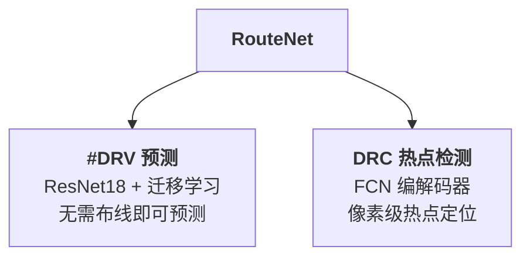
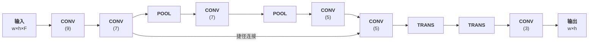

# Day 15: RouteNet —— 基于 CNN 的混合尺寸设计可布线性预测

> **论文标题**: RouteNet: Routability Prediction for Mixed-Size Designs Using Convolutional Neural Network
>
> **作者**: Zhiyao Xie, Yu-Hung Huang, Guan-Qi Fang, Haoxing Ren, Shao-Yun Fang, Yiran Chen, Jiang Hu
>
> **机构**: Duke University; National Taiwan University of Science and Technology; Nvidia Corporation; Texas A&M University
>
> **会议**: IEEE/ACM International Conference on Computer-Aided Design (ICCAD)
>
> **年份**: 2018
>
> **DOI**: 10.1145/3240765.3240843
>
> **分析日期**: 2026-06-11
>
> **系列定位**: Day 8（RUPlace）用 ADMM 实现布局-布线联合优化，Day 13（ClusterNet）用 GNN 预测拥塞。本文 RouteNet 是**深度学习用于可布线性预测的开山之作**——首次将 CNN 引入该领域，解决两个核心问题：①快速预测整体可布线性（#DRV），②精确定位 DRC 热点。与 Day 13 的 GNN 方法形成 CNN vs GNN 的对比，也和 Day 8 的优化方法形成"预测 vs 优化"的互补视角。

---

## 目录

1. [背景与动机](#1-背景与动机)
2. [核心贡献概述](#2-核心贡献概述)
3. [背景知识](#3-背景知识)
4. [问题建模](#4-问题建模)
5. [宏单元的挑战](#5-宏单元的挑战)
6. [RouteNet 算法](#6-routenet-算法)
7. [实验结果与分析](#7-实验结果与分析)
8. [消融实验与讨论](#8-消融实验与讨论)
9. [创新点深度分析](#9-创新点深度分析)
10. [从统计估计到深度学习：拥塞预测演进对比](#10-从统计估计到深度学习拥塞预测演进对比)
11. [参考文献](#11-参考文献)

---

## 1. 背景与动机

### 1.1 可布线性预测的两大需求

在 VLSI 物理设计中，可布线性预测有两个核心应用：

| 需求 | 目标 | 使用场景 |
|------|------|---------|
| **整体可布线性预测** | 预测 #DRV（设计规则违反数） | 从多个候选布局中选出最优 |
| **DRC 热点定位** | 预测 DRC 违反的具体位置 | 在已选布局上定向修复 |

### 1.2 现有方法的困境

| 方法 | 整体预测精度 | 热点定位精度 | 速度 | 问题 |
|------|-------------|-------------|------|------|
| **试布线（Trial Routing）** | 较好 | 差 | 太慢 | 需要完整全局布线，在布局引擎中被反复调用时无法承受 |
| **全局布线（Global Routing）** | 较好 | 不够精确 | 太慢 | DRC 热点定位精度不够，因设计规则复杂 |
| **概率估计** | 差 | — | 快 | 精度牺牲太大，仍是试布线为事实标准 |
| **SVM [4]** | — | 中等 | 快 | 无法处理宏单元，只能在无宏设计中使用 |

> **核心矛盾**：全局布线既不够快（用于整体预测），也不够准（用于热点定位）。概率方法虽快但精度太低。**需要一种既快又准的新方法**。

### 1.3 机器学习的引入

近年来机器学习在 EDA 多个领域展现了潜力：
- 光刻热点检测 [7]
- 结构化设计布局 [23]
- NoC 路由器建模 [10]

但已有 ML 方法存在严重局限：

| 方法 | 使用全局布线？ | 预测 #DRV？ | 预测热点？ | 处理宏？ |
|------|-------------|-----------|-----------|---------|
| MARS [18] | ✓ | ✓ | ✗ | ✓ |
| MARS/SVM [26] | ✓ | ✓ | ✗ | ✗ |
| SVM [3] | ✗ | ✓ | ✗ | ✗ |
| SVM [4] | ✓ | ✗ | ✓ | ✗ |
| **RouteNet (#DRV)** | **✗** | **✓** | **✗** | **✓** |
| **RouteNet (热点)** | **✓** | **✗** | **✓** | **✓** |

> **RouteNet 的独特性**：首次用 CNN 解决可布线性预测，且能处理宏单元——这对现代工业设计至关重要。

---

## 2. 核心贡献概述



1. **首次系统性研究 CNN 用于可布线性预测**：直觉上这是有前景的方向，但此前未有深入研究
2. **#DRV 预测**：速度比全局布线快数个数量级（即使算上训练时间），精度相当；首次实现既快又准的整体可布线性预测
3. **DRC 热点检测**：相比全局布线精度提升 50%，显著优于 SVM 和逻辑回归

---

## 3. 背景知识

### 3.1 CNN 与迁移学习

CNN 自 2012 年在 ImageNet 挑战赛中取得突破 [13] 以来，已成为图像识别的核心架构。ResNet（2015）是当时最先进的 CNN 架构之一 [8]。

**典型 CNN 结构**：


> **关键洞察**：芯片布局信息（如引脚密度、RUDY）可以被看作**图像**——这正是将 CNN 迁移到 EDA 领域的理论基础。

**迁移学习**：从头训练 CNN 需要海量数据和长时间。常见做法是下载在 ImageNet 上预训练的网络，然后在目标任务上微调（fine-tune）。RouteNet 利用预训练的 ResNet18 进行迁移学习。

### 3.2 全卷积网络（FCN）

与分类用 CNN 不同，FCN 去掉全连接层，用于端到端语义分割 [14]：

- **输入**：任意大小的图像 $w \times h \times F$
- **输出**：与输入同大小的二维密度图 $w \times h$
- **关键技术**：转置卷积（TRANS）层上采样恢复分辨率
- **多路径结构**：捷径连接（shortcut）将浅层特征图直接拼接到深层，保留浅层细节信息

> **为什么 FCN 适合热点检测？** 热点检测需要输出与输入同大小的密度图（每个网格单元一个预测值），FCN 恰好满足。而且 FCN 接受任意大小的输入，允许不同设计使用同一模型。

### 3.3 RUDY（Rectangular Uniform wire DensitY）

RUDY [21] 是一种预布线拥塞估计器，被 RouteNet 用作输入特征。它与 Day 8 RUPlace 中提到的 RUDY 是同一个方法。

对于第 $k$ 条网，包围框为 $\{x_{\min}^k, x_{\max}^k, y_{\min}^k, y_{\max}^k\}$：

$$w_k = x_{\max}^k - x_{\min}^k, \quad h_k = y_{\max}^k - y_{\min}^k$$

$$c_k = \begin{cases} 1, & x \in [x_{\min}^k, x_{\max}^k], y \in [y_{\min}^k, y_{\max}^k] \\ 0, & \text{otherwise} \end{cases}$$

$$\text{RUDY}_k(x, y) \propto c_k \frac{w_k + h_k}{w_k \times h_k}$$

所有 $K$ 条网的 RUDY 叠加得到总体拥塞估计：

$$\text{RUDY}(x, y) = \sum_{k=1}^{K} \text{RUDY}_k(x, y)$$

> **为什么 RUDY 适合作为 CNN 输入？** ①部分关联布线拥塞，②计算速度快，③可以直接表示为图像——与 CNN 的输入格式完美契合。

---

## 4. 问题建模

### 4.1 网格化表示

布局被划分为 $w \times h$ 个网格单元，每个单元为 $l \times l$ 的正方形（$l$ 为标准单元高度）。

### 4.2 DRC 违反的表示

- **整体 #DRV**：第 $i$ 个布局的 DRV 总数记为 $y_i \in \mathbb{N}$
- **DRV 密度**：每个网格单元的 DRV 密度为 $Y_i \in \mathbb{R}^{w \times h}$，由该单元内所有 DRC 违反的面积贡献求和得到
- **DRC 热点**：当某网格单元的 DRV 密度超过阈值 $\epsilon$ 时标记为热点，$V_i \in \{0, 1\}^{w \times h}$

### 4.3 输入特征

第 $i$ 个布局的第 $j$ 个特征为 $X_{ij} \in \mathbb{R}^{w \times h}$。$F$ 个特征堆叠成三维输入张量：

$$X_i \in \mathbb{R}^{w \times h \times F}$$

### 4.4 问题 1：#DRV 预测

$$f_{\#\text{DRV}} : X_i^{(\#\text{DRV})} \in \mathbb{R}^{w \times h \times F_1} \to y_i \in \mathbb{N}$$

$$f_{\#\text{DRV}}^* = \arg\min_f \text{Loss}(f(X_i^{(\#\text{DRV})}), y_i)$$

> **注意**：#DRV 预测不使用全局布线信息——因为此预测在详细布局之前执行，布线尚不可得。

### 4.5 问题 2：DRC 热点检测

$$f_{\text{hotspot}} : X_i^{(\text{hotspot})} \in \mathbb{R}^{w \times h \times F_2} \to V_i \in \{0, 1\}^{w \times h}$$

$$f_{\text{hotspot}}^* = \arg\min_f \text{Loss}(f(X_i^{(\text{hotspot})}), V_i)$$

> **注意**：热点检测使用全局布线信息作为特征——因为此检测在详细布局之后执行，布线信息已可得，且运行时间约束较宽松。

---

## 5. 宏单元的挑战

### 5.1 宏单元对热点分布的影响

论文图 3 展示了含宏单元的基准电路中 DRC 热点分布：
- **橙色区域**：热点强烈聚集在相邻宏单元之间的狭窄间隙
- **蓝色区域**：少量热点稀疏分布在宏单元边缘

> **关键观察**：要检测热点，必须捕获**宏单元间的全局空间关系**——仅看局部信息无法判断一个网格单元是否位于两个宏单元的间隙中。

### 5.2 宏单元破坏了引脚密度与 #DRV 的相关性

| 情况 | 引脚密度变异系数 vs #DRV 的 $R^2$ | 含义 |
|------|--------------------------------|------|
| **无宏单元** | 高相关性 | 可用简单统计量预测 |
| **有宏单元** | 相关性大幅降低 | 简单统计量不足，需更详细的局部信息 |

### 5.3 宏单元对训练数据的影响

| 无宏设计 | 有宏设计 |
|---------|---------|
| 布局同质，不同区域彼此相似 | 布局异质，不同区域差异大 |
| 可用单个小区块作为训练样本 | 必须以整个布局作为单个训练样本 |
| SVM [4] 可用小区块训练 | 需要能处理全局信息的模型 |

> **RouteNet 的应对**：CNN/FCN 的**感受野**（receptive field）天然能捕获大范围空间信息——通过多层卷积和池化，每个输出单元可以"看到"大范围的输入区域，从而判断宏单元间的间隙等全局模式。

---

## 6. RouteNet 算法

### 6.1 特征提取

RouteNet 从物理设计流程的不同阶段提取特征：

| 阶段 | 特征 | 维度 |
|------|------|------|
| **Floorplan 后** | 宏单元区域 | $w \times h$ |
| | 宏单元引脚密度（每金属层） | $w \times h \times L$ |
| **全局布局后** | 全局单元密度 | $w \times h$ |
| | 全局单元引脚密度 | $w \times h$ |
| | 全局长程 RUDY | $w \times h$ |
| | 全局短程 RUDY | $w \times h$ |
| | 全局 RUDY 引脚 | $w \times h$ |
| **详细布局后** | 单元密度 | $w \times h$ |
| | 单元引脚密度 | $w \times h$ |
| | 长程 RUDY | $w \times h$ |
| | 短程 RUDY | $w \times h$ |
| | RUDY 引脚 | $w \times h$ |
| **试布线后** | TR 拥塞 | $w \times h$ |
| **全局布线后** | GR 拥塞 | $w \times h$ |

### 6.2 RUDY 的分解

RouteNet 将 RUDY 分解为**长程 RUDY** 和**短程 RUDY**：

- **长程 RUDY**：跨越距离超过阈值的网的 RUDY
- **短程 RUDY**：跨越距离低于阈值的网的 RUDY

> **分解原因**：长程 RUDY 与 DRV 的相关性更强。单独提取长程 RUDY 可以让网络更容易学习这种强相关。

**RUDY 引脚**：类似引脚密度，但每个引脚的贡献权重等于其所属网的长程 RUDY 值。这进一步强调了长程网对拥塞的影响。

### 6.3 #DRV 预测：ResNet18 + 迁移学习

```
Algorithm 1: RouteNet for #DRV Prediction
──────────────────────────────────────────
Input:  N 个训练布局的特征 {X_i ∈ R^{w×h×3}} 和目标 {y_i}
Output: 预测器 f_#DRV

预处理:
1:  for i = 1 to N do
2:    将 X_i 插值缩放为 X_i^{#DRV} ∈ R^{224×224×3}
3:  计算 y_i 的 25%, 50%, 75% 分位数 q_1, q_2, q_3
4:  for i = 1 to N do
5:    C_i ← 0
6:    for t = 1 to 3 do
7:      if y_i > q_t then C_i ← t, break
8:  构建数据集 {(X_i^{#DRV}, C_i)}
9:  训练集仅保留 C_i = 0 或 C_i = 3 的样本

训练:
1:  获取 ImageNet 预训练的 ResNet18: f_Res: R^{224×224×3} → R^{1000}
2:  替换输出层: f_#DRV: R^{224×224×3} → R
3:  使用 MSE 损失函数，SGD 优化器
4:  微调 ~30 个 epoch
```

**逐行解释**：

- **第 2 行**：从 $w \times h$ 的原始特征中选取 3 个通道（宏区域、全局长程 RUDY、全局 RUDY 引脚），插值缩放到 ResNet 要求的 $224 \times 224 \times 3$
- **第 3-7 行**：将 #DRV 分为 4 个等级 $c_0, c_1, c_2, c_3$（按分位数划分），避免网络学习微小差异
- **第 9 行**：**只保留最好（$c_0$）和最差（$c_3$）的样本训练**——让网络学习极端情况的差异模式，而非中间模糊地带
- **第 1-2 行**：迁移学习——将 ResNet18 的 1000 类输出层替换为单一回归值
- **第 3-4 行**：MSE 损失 + SGD 微调所有层权重

> **为什么不直接回归 #DRV？** 不同布局间 #DRV 范围很广，微小差异在特征中可能没有显著模式。先分类再回归可以避免网络"追逐"噪声。

> **为什么只训练极端类？** $c_0$ 和 $c_3$ 差异最大，模式最明显。实验证明这种"极端对比训练"比使用全部四类效果更好。

### 6.4 三通道输入的选择

输入的 3 个通道选择为：
1. **宏区域**（红色通道）：全局结构信息
2. **全局长程 RUDY**（绿色通道）：远程拥塞估计
3. **全局 RUDY 引脚**（蓝色通道）：引脚级别的长程拥塞影响

> **选择理由**：这三个特征包含最多的全局和通用信息，比引脚密度等局部特征更适合整体可布线性判断。

### 6.5 DRC 热点检测：FCN 编解码器



**架构详解**：
- **编码路径**：2 个 CONV + 2 个 POOL，将特征图从 $h \times w$ 下采样到 $\frac{h}{4} \times \frac{w}{4}$
- **解码路径**：2 个 TRANS 层上采样回 $h \times w$
- **捷径连接**：第 2 层直接连接到第 7 层，提供短路径
- **大卷积核**：3-9 个网格单元，显著扩大感受野

> **为什么需要大感受野？** 检测宏单元间隙中的热点需要"看到"远处的宏单元。传统方法只能捕获小范围特征，FCN 的大感受野使每个输出单元都能考虑全局信息。

### 6.6 热点检测的损失函数

**DRV 密度裁剪**（减少极端值的主导效应）：

$$Y_{imn}^{\text{clip}} = \min(Y_{imn}, c)$$

**损失函数**（逐像素欧氏距离 + L2 正则化）：

$$\text{Loss} = \sum_{i=1}^{N} \sum_{m=1}^{w} \sum_{n=1}^{h} \|f_{\text{hotspot}}(X_{imn}) - Y_{imn}^{\text{clip}}\|^2 + \lambda\|W\|^2$$

其中 $\lambda$ 是正则化系数，$W$ 是 FCN 中所有权重。

> **设计要点**：
> - **裁剪**：少数网格单元可能有极高的 DRV 密度，不加裁剪会使损失被这些极端值主导
> - **L2 正则化**：强制权重衰减趋近零，减少不必要的权重，避免过拟合
> - **逐像素损失**：每个网格单元的预测独立计算损失，确保空间定位精度

### 6.7 训练细节

| 项目 | #DRV 预测 | 热点检测 |
|------|----------|---------|
| **架构** | ResNet18（预训练） | 自定义 FCN |
| **优化器** | SGD | Adam |
| **损失函数** | MSE | 欧氏距离 + L2 正则 |
| **特殊处理** | 只训练 $c_0$ 和 $c_3$ | Batch Normalization |
| **输入** | 3 通道（宏 + 长程 RUDY + RUDY 引脚） | F 通道（所有可用特征） |
| **输出** | 单个 #DRV 等级分数 | $w \times h$ 热点密度图 |

---

## 7. 实验结果与分析

### 7.1 实验配置

**基准电路**：ISPD 2015 benchmarks

| 电路 | #宏 | #单元 | #网 | 宽度 (μm) | #布局 |
|------|-----|-------|-----|----------|-------|
| des_perf | 4 | 108,288 | 110,283 | 900 | 600 |
| edit_dist | 6 | 127,413 | 131,134 | 800 | 300 |
| fft | 6 | 30,625 | 32,088 | 800 | 300 |
| matrix_mult_a | 5 | 149,650 | 154,284 | 1500 | 300 |
| matrix_mult_b | 7 | 146,435 | 151,614 | 1500 | 300 |

**实验方法**：每次测试一个设计时，模型仅在其他四个设计上训练，确保测试设计完全未见。

**平台**：2.40 GHz CPU + NVIDIA GTX 1080 GPU，PyTorch 实现。

### 7.2 #DRV 预测结果

| 电路 | SVM | LR | 试布线 | 全局布线 | **RouteNet** |
|------|-----|-----|-------|---------|-------------|
| **c₀/c₁+c₂+c₃ 准确率 (%)** | | | | | |
| des_perf | 63 | 74 | 80 | 77 | **80** |
| edit_dist | 69 | 68 | 78 | 77 | **76** |
| fft | 66 | 62 | 73 | 70 | **75** |
| matrix_mult_a | 66 | 65 | 78 | 74 | **72** |
| matrix_mult_b | 63 | 62 | 76 | 73 | **76** |
| **平均** | **65** | **66** | **77** | **74** | **76** |
| **Top-10 中最佳排名** | | | | | |
| des_perf | 87th | 15th | 2nd | 1st | **2nd** |
| edit_dist | 17th | 17th | 3rd | 3rd | **2nd** |
| fft | 6th | 6th | 2nd | 33rd | **1st** |
| matrix_mult_a | 30th | 5th | 1st | 1st | **5th** |
| matrix_mult_b | 22nd | 93rd | 4th | 1st | **4th** |
| **平均** | **32nd** | **27th** | **2nd** | **8th** | **3rd** |

> **关键发现**：
> - RouteNet 的分类准确率（76%）与试布线（77%）和全局布线（74%）**相当**
> - 在 Top-10 排名中，RouteNet 平均找到第 3 名，与试布线（第 2 名）接近，远优于 SVM（第 32 名）和 LR（第 27 名）
> - **但 RouteNet 的推理速度快数个数量级**——即使算上训练时间，平均每个布局的推理时间仍不到 1 秒

### 7.3 速度-精度权衡

论文图 8 展示了关键的速度-精度权衡：
- **RouteNet** 聚集在左下角（低推理时间 + 低误差）——**唯一既快又准的方法**
- **试布线和全局布线**需要更长运行时间才能达到类似精度
- **LR 和 SVM** 虽然快但误差高

### 7.4 DRC 热点检测结果

| 电路 | FPR (%) | 试布线 | 全局布线 | LR | SVM | **RouteNet** |
|------|---------|-------|---------|-----|-----|-------------|
| des_perf | 0.54 | 17 | 56 | 54 | 42 | **74** |
| edit_dist | 1.00 | 25 | 36 | 36 | 38 | **64** |
| fft | 0.30 | 21 | 45 | 54 | 31 | **71** |
| matrix_mult_a | 0.21 | 13 | 30 | 34 | 12 | **49** |
| matrix_mult_b | 0.24 | 13 | 37 | 41 | 20 | **53** |
| **平均** | **0.46** | **18** | **41** | **44** | **27** | **62** |

> **关键发现**：
> - RouteNet 的 TPR（62%）比全局布线（41%）提升 **50%**
> - 试布线作为热点检测器表现很差（TPR 仅 18%）
> - LR 优于全局布线，但不如 RouteNet
> - SVM 表现最差，即使精心调参

### 7.5 热点检测结果可视化

论文图 9 的关键观察：
- RouteNet 的预测结果最接近 ground truth
- LR 在宏单元边缘产生大量**高置信度误报**——LR 放大了宏单元对边缘网格的影响
- 这进一步证实了**大感受野**的重要性：RouteNet 能区分"宏边缘"和"宏间隙"，而 LR 只看到"靠近宏"就报热点

---

## 8. 消融实验与讨论

### 8.1 FCN 架构变体

| 变体 | 描述 | 平均 TPR (%) |
|------|------|-------------|
| **RouteNet** | 原始 FCN | **62** |
| Infer seen | 同一设计不同布局训练+推理 | 66 |
| Less data | 仅用 2 个设计训练 | 60 |
| No short | 去掉捷径连接 | 60 |
| Less conv | 去掉捷径中的 3 层卷积 | 60 |
| No pool | 去掉 POOL 和 TRANS 层 | 57 |

> **关键洞察**：
>
> 1. **Infer seen (66% > 62%)**：在同一设计上训练效果更好，说明每个设计有其独特的热点模式，但跨设计训练仍然有效
> 2. **Less data (60% < 62%)**：更多训练数据可以弥合设计间差异
> 3. **No short (60% < 62%)**：捷径连接有用——浅层路径保留细节，深层路径捕获全局
> 4. **No pool (57% < 62%)**：去掉池化后感受野大幅减小，精度显著下降——**证实大感受野的重要性**

### 8.2 替代方法的窗口大小

| 方法 | LR | 5×5 LR | 9×9 LR | SVM | 5×5 SVM | 9×9 SVM |
|------|-----|--------|--------|-----|---------|---------|
| 平均 TPR (%) | 44 | 47 | 45 | 27 | 38 | 19 |

> **发现**：
> - 增大窗口（3×3 → 5×5）确实有帮助，但 5×5 是上限
> - 更大的窗口（9×9）反而模糊了目标单元的局部信息
> - RouteNet 的 FCN 架构提供了比简单窗口更好的感受野解决方案

---

## 9. 创新点深度分析

### 9.1 创新点一：CNN 用于可布线性预测的首次系统性研究

**核心洞察**：芯片布局特征（引脚密度、RUDY、宏区域）可以被视为**图像**，因此 CNN 在图像识别上的强大能力可以迁移到可布线性预测。

> **设计哲学**：不是设计专门的 EDA 模型，而是**利用通用视觉模型的迁移能力**。ResNet 在 ImageNet 上学到的边缘、纹理、模式识别能力，可以迁移到布局图像中识别拥塞模式。

### 9.2 创新点二：两个问题的差异化架构设计

| 维度 | #DRV 预测 | DRC 热点检测 |
|------|----------|-------------|
| **问题类型** | 图像分类/回归 | 语义分割 |
| **架构** | ResNet18 + 迁移学习 | 自定义 FCN |
| **输入大小** | 固定 224×224 | 任意 w×h |
| **输出** | 单一数值 | 二维密度图 |
| **是否需要布线** | 否 | 是 |
| **标签** | #DRV 等级 | DRV 密度图 |

> **差异化设计的智慧**：两个问题的本质不同——整体评估是"这张图好不好"，热点定位是"这张图的哪里有问题"。前者用分类架构，后者用分割架构，各得其所。

### 9.3 创新点三：极端对比训练策略

只保留 $c_0$（最好）和 $c_3$（最差）的训练策略看似"浪费"数据，实则有深刻原因：

1. **中间类模糊**：$c_1$ 和 $c_2$ 的特征模式差异微弱，强行学习可能引入噪声
2. **对比学习直觉**：让网络学习"好"和"差"的极端模式，比学习"一般好"和"一般差"更有效
3. **与对比学习（Contrastive Learning）的联系**：这种策略与后来的 SimCLR、MoCo 等自监督对比学习方法有异曲同工之妙

### 9.4 创新点四：RUDY 的分解与 RUDY 引脚

将 RUDY 分解为长程和短程，并引入 RUDY 引脚特征，是 RouteNet 特征工程的核心：

- **长程 RUDY** 与 DRV 的相关性更强，单独提取有助于网络聚焦
- **RUDY 引脚** 将引脚位置与长程拥塞关联，提供了"哪个引脚最可能导致拥塞"的信息

> **与 Day 8 RUPlace 的联系**：RUPlace 也使用 RUDY，但只是作为统一的统计代理。RouteNet 则对 RUDY 做了更精细的分解和增强，体现了数据驱动方法对特征工程的重视。

### 9.5 创新点五：大感受野处理宏单元

传统方法（SVM、LR）只能捕获小范围特征（3×3 或 5×5 窗口），无法"看到"远处的宏单元。RouteNet 的 FCN 通过以下方式实现大感受野：

1. **POOL 层**：每次下采样 2 倍，等效扩大感受野 4 倍
2. **大卷积核**（3-9）：直接增大每层的感受野
3. **捷径连接**：同时保留浅层细节和深层全局信息

> **与 Day 13 ClusterNet 的对比**：ClusterNet 用 GNN 的消息传递机制捕获图结构中的长距离依赖，RouteNet 用 CNN 的感受野捕获图像中的空间依赖。两者解决的是同一个问题（全局信息），但路径不同。

---

## 10. 从统计估计到深度学习：拥塞预测演进对比

| 维度 | RUDY [21] | SVM [3][4] | **RouteNet** | ClusterNet [Day13] |
|------|-----------|-----------|-------------|-------------------|
| **年份** | 2007 | 2016-17 | **2018** | 2023 |
| **方法** | 统计估计 | 传统 ML | **CNN** | GNN |
| **输入** | 布局特征 | 统计量/小窗口 | 布局图像 | 网表图 |
| **感受野** | 全局（均匀假设） | 3×3~5×5 | 全局（CNN 感受野） | 全局（消息传递） |
| **宏单元** | 不显式处理 | 不支持 | **支持** | 支持 |
| **#DRV 预测** | 间接（通过拥塞） | ✓ | **✓** | ✗ |
| **热点定位** | 间接 | ✓（无宏） | **✓（含宏）** | ✓ |
| **训练数据** | 无需 | 中等 | **需要** | 需要 |
| **泛化性** | 通用 | 设计特定 | **跨设计** | 跨设计 |
| **速度** | 极快 | 快 | **快（推理）** | 快（推理） |
| **精度** | 低 | 中 | **高** | 高 |

> **演进脉络**：
>
> 1. **RUDY (2007)**：快速统计估计，精度低但无需训练
> 2. **SVM (2016-17)**：传统 ML，精度中等但无法处理宏和全局信息
> 3. **RouteNet (2018)**：**首次用 CNN 实现既快又准的预测**，处理宏单元，是深度学习进入可布线性预测的里程碑
> 4. **ClusterNet (2023)**：从 CNN 到 GNN，利用网表图结构，用聚类增强局部信息
>
> 从 RUDY 到 RouteNet 是**统计→学习**的跃迁；从 RouteNet 到 ClusterNet 是**图像→图**的跃迁。每一步都在丰富模型的"信息源"——从均匀假设，到像素特征，到网表拓扑。

---

## 11. 参考文献

1. I. S. Bustany et al., "ISPD 2015 Benchmarks with Fence Regions and Routing Blockages for Detailed-Routing-Driven Placement," in *Proc. ISPD*, 2015.

2. Cadence, "Cadence Encounter User Guide," 2017.

3. W.-T. J. Chan, Y. Du, A. B. Kahng, S. Nath, and K. Samadi, "BEOL Stack-Aware Routability Prediction from Placement Using Data Mining Techniques," in *Proc. ICCD*, 2016.

4. W.-T. J. Chan, P.-H. Ho, A. B. Kahng, and P. Saxena, "Routability Optimization for Industrial Designs at Sub-14nm Process Nodes Using Machine Learning," in *Proc. ISPD*, 2017.

5. C.-H. Chiou, C.-H. Chang, S.-T. Chen, and Y.-W. Chang, "Circular-Contour-Based Obstacle-Aware Macro Placement," in *Proc. ASPDAC*, 2016.

6. J. Deng et al., "ImageNet: A Large-Scale Hierarchical Image Database," in *Proc. CVPR*, 2009.

7. D. Ding, B. Yu, J. Ghosh, and D. Z. Pan, "EPIC: Efficient Prediction of IC Manufacturing Hotspots with a Unified Meta-Classification Formulation," in *Proc. ASPDAC*, 2012.

8. K. He, X. Zhang, S. Ren, and J. Sun, "Deep Residual Learning for Image Recognition," in *Proc. CVPR*, 2016.

9. S. Ioffe and C. Szegedy, "Batch Normalization: Accelerating Deep Network Training by Reducing Internal Covariate Shift," in *Proc. ICML*, 2015.

10. K. Jeong, A. B. Kahng, B. Lin, and K. Samadi, "Accurate Machine-Learning-Based On-Chip Router Modeling," *IEEE ESL*, 2010.

11. A. B. Kahng, "New Directions for Learning-based IC Design Tools and Methodologies," in *Proc. ASPDAC*, 2018.

12. D. P. Kingma and J. Ba, "Adam: A Method for Stochastic Optimization," in *Proc. ICLR*, 2015.

13. A. Krizhevsky, I. Sutskever, and G. E. Hinton, "ImageNet Classification with Deep Convolutional Neural Networks," in *Proc. NIPS*, 2012.

14. J. Long, E. Shelhamer, and T. Darrell, "Fully Convolutional Networks for Semantic Segmentation," *IEEE TPAMI*, 2017.

15. J. Lou, S. Krishnamoorthy, and H. S. Sheng, "Estimating Routing Congestion using Probabilistic Analysis," in *Proc. ISPD*, 2001.

16. A. Paszke et al., "Automatic Differentiation in PyTorch," in *NIPS-W*, 2017.

17. F. Pedregosa et al., "Scikit-learn: Machine Learning in Python," *JMLR*, 2011.

18. Z. Qi, Y. Cai, and Q. Zhou, "Accurate Prediction of Detailed Routing Congestion using Supervised Data Learning," in *Proc. ICCD*, 2014.

19. O. Ronneberger, P. Fischer, and T. Brox, "U-Net: Convolutional Networks for Biomedical Image Segmentation," in *Proc. MICCAI*, 2015.

20. V. A. Sindagi and V. M. Patel, "Generating High-Quality Crowd Density Maps using Contextual Pyramid CNNs," in *Proc. ICCV*, 2017.

21. P. Spindler and F. M. Johannes, "Fast and Accurate Routing Demand Estimation for Efficient Routability-driven Placement," in *Proc. DATE*, 2007.

22. A. F. Tabrizi et al., "A Machine Learning Framework to Identify Detailed Routing Short Violations from a Placed Netlist," in *Proc. DAC*, 2018.

23. S. Ward, D. Ding, and D. Z. Pan, "PADE: A High-performance Placer with Automatic Datapath Extraction and Evaluation Through High Dimensional Data Learning," in *Proc. DAC*, 2012.

24. Y. Wei et al., "GLARE: Global and Local Wiring Aware Routability Evaluation," in *Proc. DAC*, 2012.

25. J. Westra, C. Bartels, and P. Groeneveld, "Probabilistic Congestion Prediction," in *Proc. ISPD*, 2004.

26. Q. Zhou et al., "An Accurate Detailed Routing Routability Prediction Model in Placement," in *Proc. ASQED*, 2015.

---

*本文档由 Claude Code 于 2026-06-11 生成，作为 EDA 论文每日分析系列的第 15 天内容。Day 15 标志着深度学习进入可布线性预测领域的起点——RouteNet 证明了 CNN 不仅能处理布局"图像"，还能在速度和精度上同时超越传统方法。从 Day 8（RUPlace，优化驱动）到 Day 13（ClusterNet，GNN 预测）再到 Day 15（RouteNet，CNN 预测），我们看到了可布线性研究的两条主线：**优化**（如何减少拥塞）和**预测**（如何预知拥塞）。两条线最终交汇——预测为优化提供信号，优化为预测提供更好的布局。*
