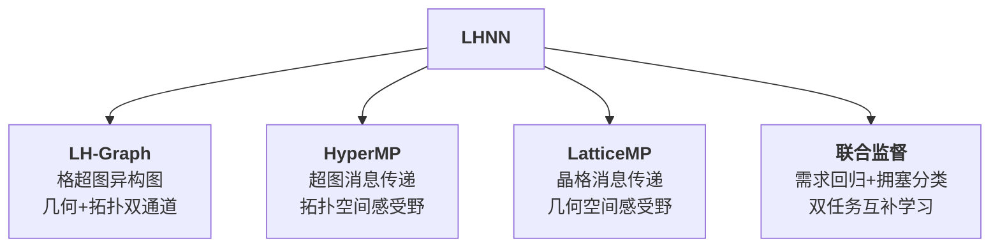
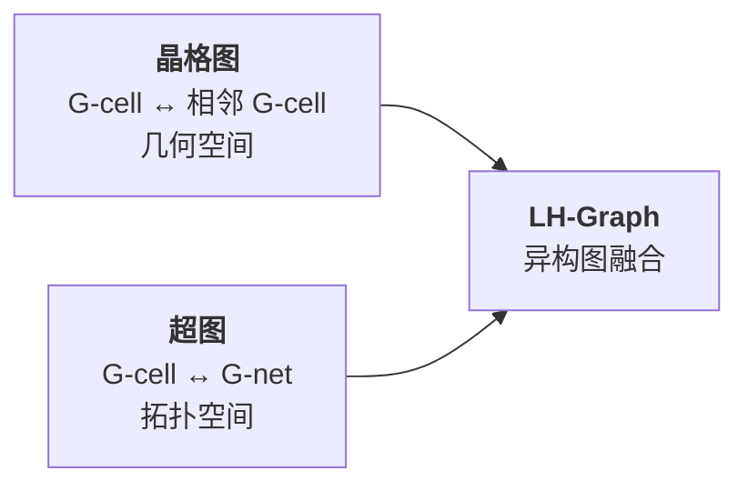

# Day 16: LHNN —— 格超图神经网络用于 VLSI 拥塞预测

> **论文标题**: LHNN: Lattice Hypergraph Neural Network for VLSI Congestion Prediction
>
> **作者**: Bowen Wang, Guibao Shen, Dong Li, Jianye Hao, Wulong Liu, Yu Huang, Hongzhong Wu, Yibo Lin, Guangyong Chen*, Pheng Ann Heng
>
> **机构**: The Chinese University of Hong Kong; Shenzhen Institutes of Advanced Technology; Huawei Noah's Ark Lab; Huawei Hisilicon; Peking University
>
> **会议**: arXiv preprint (under review), 2022
>
> **arXiv**: 2203.12831
>
> **分析日期**: 2026-06-11
>
> **系列定位**: Day 15（RouteNet）用 CNN 将布局视为图像预测拥塞，Day 13（ClusterNet）用 GNN + 聚类预测拥塞。本文 LHNN 提出了**格超图（LH-graph）**——一种新颖的异构图建模方式，同时保留电路的**几何空间**（晶格图）和**拓扑空间**（超图）连接。这是从"纯图像"到"图+图像融合"的关键跃迁，揭示了 CNN 感受野仅扩展几何空间而忽略网表拓扑的根本局限。

---

## 目录

1. [背景与动机](#1-背景与动机)
2. [核心贡献概述](#2-核心贡献概述)
3. [VLSI 电路基础术语](#3-vlsi-电路基础术语)
4. [格超图（LH-Graph）建模](#4-格超图lh-graph建模)
5. [LHNN 架构](#5-lhnn-架构)
6. [联合监督学习](#6-联合监督学习)
7. [实验结果与分析](#7-实验结果与分析)
8. [消融实验](#8-消融实验)
9. [创新点深度分析](#9-创新点深度分析)
10. [从 CNN 到异构图 GNN：拥塞预测演进对比](#10-从-cnn-到异构图-gnn拥塞预测演进对比)
11. [参考文献](#11-参考文献)

---

## 1. 背景与动机

### 1.1 拥塞预测的两种信息交互

论文图 1(b) 用一个精妙的例子展示了拥塞信息在电路中的两种传播方式：

| 交互类型 | 含义 | 示例 |
|---------|------|------|
| **几何传播** | 拥塞信息传到物理相邻区域 | 蓝色网完全被拥塞 G-cell 覆盖 → 绕到几何最近的不拥塞区域 |
| **拓扑传播** | 拥塞信息沿网表连接传到远处 | 红色网部分被拥塞 → 绕线到拓扑相连但几何遥远的 G-cell |

> **核心洞察**：CNN 的感受野只在几何空间扩展，但网表连接（拓扑关系）使得**几何上远处的区域也可能高度相关**。只靠几何感受野无法捕获这种跨空间的信息交互。

### 1.2 现有 CNN 方法的三大局限

| 局限 | 说明 |
|------|------|
| **网表信息丢失** | 将网连接转换为局部特征（如 RUDY）后，原始网表数据在后续学习过程中不再可用 |
| **单一监督信号** | 要么只预测布线需求图（demand map），要么只预测拥塞图（congestion map），未同时利用两者 |
| **纯几何感受野** | CNN 通过池化/深层扩展感受野，仅覆盖几何相邻区域，忽略拓扑连接 |

### 1.3 现有 GNN 方法的不足

| 方法 | 图建模 | 问题 |
|------|--------|------|
| CongestionNet [10] | 单元=节点，网=边 | 简单同构图，无法同时捕获几何和拓扑连接 |
| GraphSAGE [11] | G-cell=节点，网格=边 | 仅在网格图上消息传递，丢失超边信息 |

> **LHNN 的目标**：设计一种图建模方式，同时保留网表信息，同时支持几何和拓扑消息传递，并联合利用两种监督信号。

---

## 2. 核心贡献概述

1. **格超图（LH-graph）**：结合超图和晶格图的异构图，同时保留网表数据，允许消息在几何空间和拓扑空间中传播
2. **LHNN 架构**：基于 LH-graph 的异构图神经网络，通过 HyperMP 和 LatticeMP 两种消息传递块扩展感受野
3. **联合监督**：同时学习布线需求回归和拥塞分类，互补提升预测性能
4. **F1 分数提升 35%+**：相比 U-Net 和 Pix2Pix 取得显著改进

---

## 3. VLSI 电路基础术语

| 术语 | 定义 |
|------|------|
| **可移动单元（Movable cell）** | 位置需要优化的单元 |
| **端单元（Terminal cell）** | 在 floorplanning 阶段已固定位置的单元（如宏单元） |
| **引脚（Pin）** | 单元侧面的连接器 |
| **网（Net）** | 由同一条导线连接的一组引脚 |
| **网格单元（G-cell）** | 电路上的矩形区域单元，通常表示为一个像素 |
| **网格网（G-net）** | 能完全包含某条网覆盖范围的所有 G-cell 集合 |

> **G-net 的直觉**：先确定网的所有引脚的包围框，包围框覆盖的所有 G-cell 构成 G-net。布线器最可能在此区域内走线以最小化总线长。

---

## 4. 格超图（LH-Graph）建模

### 4.1 双图融合

LH-graph 将两种图融合为一个异构图：

**晶格图（Lattice Graph）**——几何空间：
- 每个 G-cell 是一个节点
- 相邻 G-cell 之间有边
- 消息在物理邻居间传播

**超图（Hypergraph）**——拓扑空间：
- 每个 G-cell 是一个超图节点
- 每个 G-net 是一条超边，连接它包含的所有 G-cell
- 消息沿网表连接传播（可以跨越几何距离）

### 4.2 正式定义

LH-graph 定义为 $G = (V_c, V_n, A, H)$：

- $V_c \in \mathbb{R}^{N_c \times d_c}$：G-cell 节点特征矩阵，$N_c$ 个 G-cell，$d_c$ 个特征通道
- $V_n \in \mathbb{R}^{N_n \times d_n}$：G-net 节点特征矩阵，$N_n$ 个 G-net，$d_n$ 个特征通道
- $A \in \mathbb{R}^{N_c \times N_c}$：晶格图邻接矩阵，$A_{ij} = 1$ 当 G-cell $i$ 和 $j$ 相邻
- $H \in \mathbb{R}^{N_c \times N_n}$：超图关联矩阵，$H_{ij} = 1$ 当 G-cell $i$ 被 G-net $j$ 包含

**度矩阵**：
- $D \in \mathbb{R}^{N_c \times N_c}$：超图部分的 G-cell 度矩阵，$D_{ii} = \sum_{\epsilon=1}^{N_n} H_{i\epsilon}$
- $B \in \mathbb{R}^{N_n \times N_n}$：超图部分的 G-net 度矩阵，$B_{ii} = \sum_{\epsilon=1}^{N_c} H_{\epsilon i}$
- $P \in \mathbb{R}^{N_c \times N_c}$：晶格图部分的 G-cell 度矩阵，$P_{ii} = \sum_{\epsilon=1}^{N_c} A_{i\epsilon}$

### 4.3 异构图的 Schema

LH-graph 的异构图包含：
- **两种节点类型**：{G-net, G-cell}
- **三种关系类型**：{G-cell → G-net, G-net → G-cell, G-cell → G-cell}

> **设计哲学**：不同类型的节点和边被允许在不同的表示空间中区分——G-cell 和 G-net 的特征维度可以不同，消息传递的变换也可以不同。

### 4.4 G-net 节点特征（4 通道）

| 通道 | 定义 | 含义 |
|------|------|------|
| $span_V$ | G-net 垂直方向覆盖的单位长度数 | 网的垂直跨度 |
| $span_H$ | G-net 水平方向覆盖的单位长度数 | 网的水平跨度 |
| $npin$ | 网的引脚数 | 网的连接复杂度 |
| $Area$ | G-net 包含的 G-cell 数 = $span_H \times span_V$ | 网的覆盖面积 |

### 4.5 G-cell 节点特征

- 水平/垂直网密度图
- 引脚密度图
- 端单元掩码（G-cell 是否被端单元覆盖的二值标记）

### 4.6 与手工特征的联系——关键洞察

LHNN 最精妙的设计之一：**传统 CNN 方法的手工特征可以通过 LH-graph 上的一步消息传递自动恢复**！

| 手工特征 | 恢复方式 |
|---------|---------|
| **水平网密度** | 给每个 G-net 节点赋值 $\frac{1}{span_V}$，经 G-net → G-cell 的 sum 聚合消息传递 |
| **RUDY** | 给 G-net 节点赋值 $\frac{npin \times (span_H + span_V)}{Area}$，经一步消息传递 |
| **引脚密度** | 给 G-net 节点赋值 $\frac{npin}{Area}$，经一步消息传递 |

> **深远意义**：LH-graph 不仅保留了传统特征的生成能力，还通过多步消息传递产生更复杂的节点嵌入——超越手工特征的表达能力。这是"超越人类特征工程"的核心论点。

---

## 5. LHNN 架构

### 5.1 整体流程

LHNN 分为两个阶段：
1. **编码阶段**：FeatureGen → HyperMP（×2）→ LatticeMP
2. **联合学习阶段**：LatticeMP（×2）+ 双分支输出

### 5.2 FeatureGen 块

FeatureGen 块模拟传统特征生成过程：

$$V_c^{(1)} = \phi_c^{(1)}\left(f_c^{(1)}(V_c^{(0)}) \parallel G_{nc}\left(f_n^{(1)}(V_n^{(0)})\right)\right)$$

$$V_n^{(1)} = \phi_n^{(1)}\left(f_n^{(1)}(V_n^{(0)})\right)$$

其中：
- $f_c^{(1)}, f_n^{(1)}$：带残差连接的 MLP，将输入特征转换为嵌入向量
- $G_{nc} = H$：G-net 到 G-cell 的消息传递
- $\parallel$：拼接操作
- $\phi_c^{(1)}, \phi_n^{(1)}$：聚合后的线性变换

> **直觉**：FeatureGen 先将 G-net 特征聚合到 G-cell，与 G-cell 自身特征拼接融合，生成初始嵌入。这相当于"自动生成传统手工特征 + 更多"。

### 5.3 HyperMP 块——拓扑空间感受野

HyperMP 块在 G-cell 和 G-net 之间交替消息传递：

**G-cell → G-net 部分**：
1. 用残差 MLP 变换上一层输入
2. 经 $G_{cn} = B^{-1}H^\top$ 聚合 G-cell 特征到 G-net
3. 与 FeatureGen 生成的 G-net 特征 $V_n^{(1)}$ 拼接融合
4. 添加残差连接

**G-net → G-cell 部分**：
- 对称操作，经 $G_{nc} = H$ 从 G-net 传回 G-cell

> **核心作用**：HyperMP 让拓扑上相连（属于同一 G-net）但几何上可能遥远的 G-cell 交换信息。堆叠多层实现多步邻域特征融合。

> **与 CNN 的对比**：CNN 需要很深的网络才能"看到"几何上远处的区域。HyperMP 通过一步超边传递就能让远处的 G-cell 直接交互——这是**拓扑感受野**的优势。

### 5.4 LatticeMP 块——几何空间感受野

LatticeMP 块仅在 G-cell → G-cell 关系上操作：

$$\text{LatticeMP}: V_c \leftarrow \text{Linear}(P^{-1}A \cdot V_c) + V_c$$

其中 $P^{-1}A$ 是归一化的晶格图邻接矩阵，加上跳跃连接。

> **设计动机**：HyperMP 基于假设"线最可能在网的包围框内走"，但当网的所有 G-cell 都拥塞时，布线需求信息需要传到**几何邻居**（即使不在同一网内）。LatticeMP 正是为了实现这种几何传播。

### 5.5 邻居采样

为了降低计算成本，LHNN 使用 DGL 的 mini-batch 训练和邻居采样：

| 块 | 采样邻居数 |
|-----|-----------|
| FeatureGen | 6 |
| HyperMP | 3 |
| LatticeMP | 2 |

此外，去除覆盖超过总 G-cell 数 0.25% 的大 G-net，避免采样被大度数 G-net 主导。

---

## 6. 联合监督学习

### 6.1 为什么需要联合监督？

| 单一拥塞图监督 | 单一需求图监督 | 联合监督 |
|-------------|-------------|---------|
| 将真实需求值阈值化为二值 → 信息丢失 | 需求值在拥塞/非拥塞区域间极接近 → 阈值化效果差 | **两种信号互补**：需求图保留连续信息，拥塞图提供二值标签 |

### 6.2 损失函数

$$L = L_{reg} + L_{cls}$$

**回归损失（MSE）**：

$$L_{reg} = \frac{1}{N_c} \sum_{i=1}^{N_c} (c_i^{reg} - y_i^{reg})^2$$

**分类损失（带权重的 BCE）**：

$$L_{cls} = -\frac{1}{N_c} \sum_{i=1}^{N_c} \left( (1 - y_i^{cls})^\gamma + y_i^{cls} \right) \times \left( y_i^{cls} \log c_i^{cls} + (1 - y_i^{cls}) \log (1 - c_i^{cls}) \right)$$

其中：
- $c_i^{cls}, c_i^{reg}$：第 $i$ 个 G-cell 的拥塞预测和需求预测
- $y_i^{cls}, y_i^{reg}$：对应的真实标签
- $\gamma \in (0, 1]$：超参数，减少非拥塞 G-cell 的损失权重

> **$\gamma$ 的作用**：拥塞 G-cell 仅占约 17%，严重不平衡。$\gamma$ 降低大量非拥塞样本的损失贡献，防止模型倾向于"全部预测为不拥塞"。实验中设 $\gamma = 0.7$。

---

## 7. 实验结果与分析

### 7.1 数据集

**ISPD 2011 + DAC 2012 benchmarks**，共 15 个 VLSI 设计：

| 划分 | 电路 ID | 平均 #单元 | 平均 #网 | 平均 #G-cell | 拥塞率 |
|------|---------|-----------|---------|-------------|--------|
| 训练 | 2,3,4,7,10,12,14,16,18,19 | 866K | 847K | 311K | 17.38% |
| 测试 | 1,5,6,9,11 | 887K | 877K | 406K | 17.38% |

> **数据划分策略**：遍历所有 10:5 划分，选择训练集和测试集平均拥塞率差异最小的划分，避免域迁移效应。

**标签生成**：
- 用 DREAMPlace 生成布局方案
- 用 NCTU-GR 2.0 生成水平/垂直布线需求图
- 拥塞图：布线需求超过容量的 G-cell 标记为 1

### 7.2 模型对比结果

| 模型 | 单通道 F1 | 单通道 ACC | 双通道 F1 | 双通道 ACC |
|------|----------|-----------|----------|-----------|
| 4-layer MLP | 32.58±0.37 | 94.29±0.13 | 28.95±0.64 | 94.27±0.10 |
| Pix2Pix | 30.20±0.53 | 93.82±0.26 | 28.31±0.54 | 93.13±0.13 |
| U-net | 29.75±3.03 | 94.45±0.19 | 29.52±3.27 | 92.28±0.45 |
| **LHNN** | **40.89±1.82** | **95.46±0.11** | **37.48±2.34** | **94.77±0.13** |

> **关键发现**：
>
> 1. LHNN 在 F1 分数上**大幅领先**：比 U-Net 提升 37.44%，比 Pix2Pix 提升 35.39%
> 2. 简单 MLP（仅用局部特征）的表现竟然与 U-Net 相当——说明手工特征已经很有效，CNN 的纯几何感受野扩展反而不够
> 3. LHNN 在 ACC 上也最优，且标准差更小——预测更稳定

### 7.3 可视化分析

论文图 4 展示了 Superblue 5、6、9 的预测结果（拥塞率分别为 1.43%、1.13%、47.70%）：

| 模型 | 行为特征 |
|------|---------|
| LHNN | 能区分不同拥塞水平的电路，预测结果差异明显 |
| U-Net / Pix2Pix | 倾向于在不同电路间产生**平均化**的拥塞预测——低拥塞电路误报多，高拥塞电路漏报多 |

> **"平均化"问题**：CNN 模型学到了"一般情况下的拥塞模式"，而非特定电路的实际拥塞分布。LHNN 通过拓扑连接感知电路的特定结构，避免了这种泛化偏差。

---

## 8. 消融实验

### 8.1 组件消融（单通道实验）

| FeatureGen | HyperMP | LatticeMP | 联合监督 | G-cell 特征 | F1 | ΔF1 (%) |
|-----------|---------|-----------|---------|------------|------|---------|
| ✓ | ✓ | ✓ | ✓ | ✓ | **40.89** | 0 |
| ✓ | ✓ | ✓ | ✓ | ✗ | 38.02 | -7.02 |
| ✓ | ✓ | ✓ | ✗ | ✓ | 38.99 | -4.65 |
| ✓ | ✓ | ✗ | ✓ | ✓ | 36.52 | -10.69 |
| ✓ | ✗ | ✓ | ✓ | ✓ | 32.53 | **-20.45** |
| ✓ | ✗ | ✗ | ✓ | ✓ | 35.72 | -12.64 |

### 8.2 关键发现

1. **HyperMP 最关键**（-20.45%）：去掉超图消息传递，即去掉拓扑感受野，性能下降最大。证明**拓扑连接对拥塞预测至关重要**。

2. **LatticeMP 也重要**（-10.69%）：去掉几何消息传递也会显著下降。证明**几何和拓扑两种感受野缺一不可**。

3. **联合监督有效**（-4.65%）：去掉需求回归分支，仅用拥塞分类训练，性能下降。需求图包含连续监督信号，补充了二值拥塞标签的信息丢失。

4. **G-cell 特征可自动恢复**（仅 -7.02%）：即使去掉引脚密度和网密度特征，LHNN 仍能达到 F1 = 38.02——远超 MLP/U-Net/Pix2Pix。这证明了 **LH-graph 可以自动恢复传统手工特征**。

> **最惊人的结果**：去掉所有 G-cell 密度特征后，LHNN (38.02) 仍然远超完整 MLP (32.58)、U-Net (29.75) 和 Pix2Pix (30.20)。这充分证明了 LH-graph 的表达力——仅靠 G-net 的 4 个通道特征 + 终端掩码 + 消息传递，就能超越依赖完整手工特征的 CNN 模型。

---

## 9. 创新点深度分析

### 9.1 创新点一：LH-Graph——几何与拓扑的统一

传统方法面临一个根本性选择：

| 方法 | 信息空间 | 丢失的信息 |
|------|---------|-----------|
| CNN (RouteNet) | 几何空间 | 拓扑连接 |
| 简单 GNN (CongestionNet) | 拓扑空间 | 几何邻接 |
| **LH-Graph** | **几何 + 拓扑** | **无** |

LH-graph 通过异构图将两种空间统一——不同类型的关系在不同空间中操作，互不干扰又互相补充。

> **设计哲学**：不是在 CNN 和 GNN 之间做选择，而是**同时拥有两种感受野**。HyperMP 提供拓扑感受野（"谁和谁连在一起"），LatticeMP 提供几何感受野（"谁在谁旁边"）。两者互补，缺一不可。

### 9.2 创新点二：手工特征的自动恢复与超越

LHNN 最有理论深度的贡献是揭示了传统手工特征与图消息传递的等价关系：

$$\text{手工特征} \approx \text{LH-graph 上的一步消息传递}$$

但 LH-graph 的优势不止于此：
- **一步消息传递 ≈ 手工特征**：恢复传统特征的表达能力
- **多步消息传递 > 手工特征**：捕获多步邻域信息，超越人类设计的特征

> **与 Day 15 RouteNet 的对比**：RouteNet 依赖精心设计的手工特征（长程 RUDY、短程 RUDY、RUDY 引脚等）。LHNN 则证明这些特征可以被图结构自动恢复和超越——这是从"依赖特征工程"到"依赖图结构设计"的范式转变。

### 9.3 创新点三：联合监督——连续与离散信号的互补

布线需求图（连续值）和拥塞图（二值）是同一物理现象的不同观测：

- **需求图**保留连续信息（"多少布线需求"），但阈值化后效果差（拥塞/非拥塞的需求值差异极小）
- **拥塞图**提供明确的二值标签（"是否拥塞"），但阈值化丢失了连续信息

联合监督巧妙地**同时利用两种信号**，让模型在学习"是否拥塞"的同时保持对"多少需求"的感知。

### 9.4 创新点四：从"局部假设"到"全局理解"

CNN 的感受野扩展基于**局部连续性假设**——相邻像素相似。但在电路中，由于网表连接，**几何上遥远的区域可能高度相关**。HyperMP 打破了这种局部性限制：

- 蓝色网：拥塞信息从网内传到网的几何邻居（LatticeMP）
- 红色网：拥塞信息沿网表连接传到拓扑相连的远处 G-cell（HyperMP）

两种传播模式需要同时存在，这正是 LH-graph 的设计初衷。

---

## 10. 从 CNN 到异构图 GNN：拥塞预测演进对比

| 维度 | RUDY [2] | RouteNet [7] | U-Net [20] | **LHNN** |
|------|-----------|-------------|-----------|----------|
| **年份** | 2007 | 2018 | 2015/2022 | **2022** |
| **架构** | 统计公式 | CNN (ResNet18) | CNN (U-Net) | **异构图 GNN** |
| **信息空间** | 几何（均匀假设） | 几何 | 几何 | **几何 + 拓扑** |
| **网表保留** | ✗（转为 RUDY 图） | ✗（转为图像） | ✗（转为图像） | **✓（超图建模）** |
| **拓扑感受野** | 无 | 无 | 无 | **✓（HyperMP）** |
| **几何感受野** | 全局（均匀） | CNN 多层 | U-Net 编解码 | **✓（LatticeMP）** |
| **监督信号** | 无（直接估计） | #DRV 或热点 | 拥塞图 | **需求图 + 拥塞图** |
| **手工特征** | 不需要 | 需要（RUDY 分解） | 需要 | **自动恢复/超越** |
| **宏单元** | 不显式处理 | ✓ | 不涉及 | ✓（终端掩码） |
| **ISPD F1** | — | — | 29.75 | **40.89** |

> **演进脉络**：
>
> 1. **RUDY (2007)**：统计公式 → 快但粗糙
> 2. **RouteNet (2018)**：CNN → 快且较准，但丢失网表信息，纯几何感受野
> 3. **U-Net/Pix2Pix (2022)**：CNN 编解码器 → 仍是纯几何，"平均化"问题
> 4. **LHNN (2022)**：**异构图 GNN** → 首次同时利用几何+拓扑信息，自动恢复/超越手工特征，联合监督
>
> 从 RouteNet 到 LHNN 是**纯图像 → 图+图像融合**的跃迁。LHNN 揭示了一个深刻的事实：电路不仅是"图像"，更是**图**——忽略网表拓扑连接就是丢失了最有价值的信息。

---

## 11. 参考文献

1. W.-H. Liu et al., "NCTU-GR 2.0: Multithreaded Collision-Aware Global Routing with Bounded-Length Maze Routing," IEEE TCAD, vol. 32, no. 5, pp. 709–722, 2013.

2. P. Spindler et al., "Fast and Accurate Routing Demand Estimation for Efficient Routability-driven Placement," in DATE, pp. 1–6, 2007.

3. A. F. Tabrizi et al., "A Machine Learning Framework to Identify Detailed Routing Short Violations from a Placed Netlist," in DAC, pp. 1–6, 2018.

4. J. Chen et al., "PROS: A Plug-in for Routability Optimization Applied in the State-of-the-Art Commercial EDA Tool Using Deep Learning," in ICCAD, pp. 1–8, 2020.

5. M. B. Alawieh et al., "High-Definition Routing Congestion Prediction for Large-Scale FPGAs," in ASP-DAC, pp. 26–31, 2020.

6. M.-K. Hsu et al., "NTUplace4h: A Novel Routability-Driven Placement Algorithm for Hierarchical Mixed-Size Circuit Designs," IEEE TCAD, vol. 33, no. 12, pp. 1914–1927, 2014.

7. Z. Xie et al., "RouteNet: Routability Prediction for Mixed-Size Designs Using Convolutional Neural Network," in ICCAD, pp. 1–8, 2018.

8. A. Al-Hyari et al., "A Deep Learning Framework to Predict Routability for FPGA Circuit Placement," TRETS, vol. 14, no. 3, pp. 1–28, 2021.

9. R. Liang et al., "DRC Hotspot Prediction at Sub-10nm Process Nodes Using Customized Convolutional Network," in ISPD, pp. 135–142, 2020.

10. R. Kirby et al., "CongestionNet: Routing Congestion Prediction Using Deep Graph Neural Networks," in VLSI-SoC, pp. 217–222, 2019.

11. X. Chen et al., "Detailed Routing Short Violation Prediction Using Graph-Based Deep Learning Model," IEEE TCAS-II, 2021.

12. M. Schlichtkrull et al., "Modeling Relational Data with Graph Convolutional Networks," in ESWC, pp. 593–607, 2018.

13. N. Yadati et al., "HyperGCN: A New Method of Training Graph Convolutional Networks on Hypergraphs," arXiv:1809.02589, 2018.

14. J. Gilmer et al., "Neural Message Passing for Quantum Chemistry," in ICML, pp. 1263–1272, 2017.

15. Z. Hu et al., "Heterogeneous Graph Transformer," in WWW, pp. 2704–2710, 2020.

16. N. Viswanathan et al., "The ISPD-2011 Routability-Driven Placement Contest and Benchmark Suite," in Proc. ISPD, pp. 141–146, 2011.

17. N. Viswanathan et al., "The DAC 2012 Routability-Driven Placement Contest and Benchmark Suite," in DAC, pp. 774–782, 2012.

18. Y. Lin et al., "DREAMPlace: Deep Learning Toolkit-Enabled GPU Acceleration for Modern VLSI Placement," IEEE TCAD, vol. 40, no. 4, pp. 748–761, 2020.

19. M. Wang et al., "Deep Graph Library: Towards Efficient and Scalable Deep Learning on Graphs," 2019.

20. O. Ronneberger et al., "U-Net: Convolutional Networks for Biomedical Image Segmentation," in MICCAI, pp. 234–241, 2015.

21. P. Isola et al., "Image-to-Image Translation with Conditional Adversarial Networks," in CVPR, pp. 1125–1134, 2017.

---

*本文档由 Claude Code 于 2026-06-11 生成，作为 EDA 论文每日分析系列的第 16 天内容。Day 16 标志着拥塞预测从"纯图像 CNN"到"图+图像融合 GNN"的范式跃迁——LHNN 的格超图建模首次同时利用几何和拓扑两种信息空间，揭示了 CNN 感受野的根本局限。与 Day 15 RouteNet 的"依赖特征工程"不同，LHNN 证明传统手工特征可以被图结构自动恢复和超越。这一洞察对整个 EDA + ML 领域具有深远意义——当我们将电路建模为图而非图像时，我们不仅保留了更多信息，还获得了更强的表达能力。*
