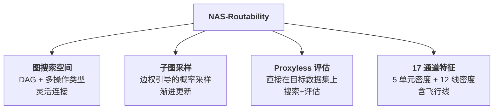
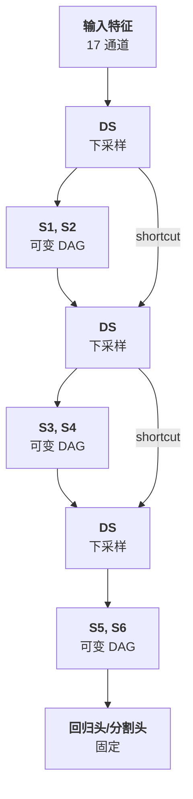

# Day 17: NAS-Routability —— 基于神经架构搜索的自动可布线性预测器开发

> **论文标题**: Automatic Routability Predictor Development Using Neural Architecture Search
>
> **作者**: Chen-Chia Chang*, Jingyu Pan*, Tunhou Zhang, Zhiyao Xie, Jiang Hu, Weiyi Qi, Chun-Wei Lin, Rongjian Liang, Joydeep Mitra, Elias Fallon, Yiran Chen
>
> **机构**: Duke University; Texas A&M University; Cadence Design Systems; National Taiwan University
>
> **会议**: IEEE/ACM International Conference on Computer-Aided Design (ICCAD)
>
> **年份**: 2021
>
> **DOI**: 10.1109/ICCAD51958.2021.9643483
>
> **arXiv**: 2012.01737
>
> **分析日期**: 2026-06-11
>
> **系列定位**: Day 15（RouteNet）手动设计 CNN 预测可布线性，Day 16（LHNN）手动设计异构图 GNN 融合几何与拓扑。本文则实现了从"**手动设计**"到"**自动搜索**"的范式跃迁——首次将神经架构搜索（NAS）引入 EDA 领域，让算法自动发现最优的拥塞预测网络架构。NAS 生成的模型在 Kendall's τ 上提升 5.85%、ROC-AUC 上提升 2.12%，且搜索过程仅需 **0.3 天**，而人类专家需要数周到数月。

---

## 目录

1. [背景与动机](#1-背景与动机)
2. [核心贡献概述](#2-核心贡献概述)
3. [相关工作](#3-相关工作)
4. [问题建模](#4-问题建模)
5. [NAS 方法论](#5-nas-方法论)
6. [特征提取](#6-特征提取)
7. [实验结果与分析](#7-实验结果与分析)
8. [NAS 生成架构深度分析](#8-nas-生成架构深度分析)
9. [消融与讨论](#9-消融与讨论)
10. [创新点深度分析](#10-创新点深度分析)
11. [从手动设计到自动搜索：拥塞预测演进对比](#11-从手动设计到自动搜索拥塞预测演进对比)
12. [参考文献](#12-参考文献)

---

## 1. 背景与动机

### 1.1 ML for EDA 的"人海战术"困境

机器学习在 EDA 领域的广泛应用带来了显著的效率提升，但模型开发本身面临严重瓶颈：

| 困境 | 说明 |
|------|------|
| **专业知识双重门槛** | 开发者需要同时精通 ML（架构设计、超参调优）和 EDA（特征工程、领域知识） |
| **开发周期漫长** | 设计一个工业级 CNN 预测器，经验丰富的开发者也需数周到数月 |
| **架构探索受限** | 人类设计师倾向于使用层次化结构，极少尝试并行分支或异构操作组合 |
| **可迁移性差** | 针对特定任务调优的架构难以直接迁移到新场景 |

### 1.2 现有可布线性预测器的共同局限

论文指出，所有先前的可布线性预测器——RouteNet [3]、PROS [6]、cGAN [4]、J-Net [5]——都是**人工设计**的，它们共享三个结构性缺陷：

| 局限 | 说明 | 示例 |
|------|------|------|
| **操作类型单一** | 仅使用常规卷积，缺少大感受野操作 | RouteNet 仅用 3×3 卷积 |
| **层次化结构受限** | 编码器-解码器框架，分支结构极少 | U-Net 仅有一条跳跃连接 |
| **无法捕获跨尺度模式** | 拥塞由远近不同区域共同影响，单一尺度难以覆盖 | 大范围绕线模式被忽略 |

> **核心洞察**：拥塞预测的正确架构可能远比人类直觉设计的更复杂。我们需要一种系统化的方法来探索庞大的架构空间——这就是 NAS 的价值所在。

### 1.3 AutoML / NAS 的启发

NAS 在计算机视觉领域已证明其价值：

- **ImageNet 分类**：NASNet [10] 超越手动设计的 ResNet
- **语义分割**：Auto-DeepLab [15] 自动搜索分割网络
- **目标检测**：NAS-FPN 自动发现特征金字塔


> **关键问题**：芯片布局可以像图像一样处理 [3][4]，那么 NAS 能否像在 CV 中一样，为可布线性预测自动发现更优的架构？

---

## 2. 核心贡献概述



四大贡献：

1. **首次将 NAS 引入 EDA**：自动化可布线性预测器开发，无需人工干预（据作者所知，这是 EDA 领域 AutoML 的首篇研究）
2. **大搜索空间设计**：支持四种操作类型（常规卷积、空洞卷积、混合卷积）和高度灵活的 DAG 连接，覆盖人类难以触及的架构
3. **显著性能提升**：Kendall's τ 提升 5.85%，ROC-AUC 提升 2.12%，搜索仅需 0.3 天
4. **架构洞察**：对 NAS 生成模型进行详细分析，为未来人工设计提供指导

---

## 3. 相关工作

### 3.1 可布线性预测方法对比

| 方法 | 年份 | 会议 | 架构类型 | 违反网数预测 | DRC 热点检测 | 操作类型 | 分支结构 |
|------|------|------|---------|------------|------------|---------|---------|
| RouteNet [3] | 2018 | ICCAD | CNN (ResNet-18) | ✓ | ✓ | 常规卷积 | 极少 |
| cGAN [4] | 2019 | DAC | 条件 GAN | ✗ | ✓ | 常规卷积 | 极少 |
| J-Net [5] | 2020 | ISPD | FCN (U-Net 变体) | ✗ | ✓ | 常规卷积 | 跳跃连接 |
| PROS [6] | 2020 | ICCAD | FCN (编码器-解码器) | ✗ | ✓ | 常规+空洞 | 极少 |
| **NAS-crafted** | **2021** | **ICCAD** | **自动搜索** | **✓** | **✓** | **常规+空洞+混合** | **丰富并行** |

### 3.2 NAS 方法对比

| NAS 方法 | 搜索空间 | 搜索策略 | 评估策略 | 应用领域 |
|----------|---------|---------|---------|---------|
| NASNet [10] | Cell-based | RL | Proxy | 图像分类 |
| NSGA-Net [11] | Cell-based | 进化算法 | Proxy | 图像分类 |
| ProxylessNAS [16] | Path-based | 梯度 | Proxyless | 图像分类 |
| Auto-DeepLab [15] | Hierarchical | RL | Proxy | 语义分割 |
| **SwiftNAS [17]→本文** | **Graph-based** | **子图采样** | **Proxyless** | **可布线性预测** |

> **本文 NAS 方法的关键差异**：采用图（DAG）搜索空间而非 cell/path-based 空间，允许任意操作组合和灵活连接拓扑，并直接在目标数据集上进行 proxyless 评估。

---

## 4. 问题建模

### 4.1 输入表示

布局放置完成后，将布局划分为 $w \times h$ 的网格（tiles），每个 tile 提取 $c$ 个特征通道：

$$X_i \in \mathbb{R}^{w \times h \times c}$$

其中 $c = 17$（5 个单元密度特征 + 12 个线密度特征，详见第 6 节）。

### 4.2 问题 1：违反网数预测（Violated Net Count Prediction）

给定放置方案集和搜索空间 $\mathcal{S}_C$，目标是生成输入特征 $X_i$，搜索神经网络架构 $A_C \in \mathcal{S}_C$，使得模型 $f_{A_C}$ 预测违反网数 $y_i$ 的性能最大化：

$$f_{A_C}: X_i \in \mathbb{R}^{w \times h \times c} \rightarrow y_i \in \mathbb{R}$$

**评估指标**：Kendall's $\tau \in [-1, 1]$

- $\tau = 1$：预测排序与真实完全一致
- $\tau = -1$：预测排序与真实完全相反
- $\tau = 0$：无相关性

### 4.3 问题 2：DRC 热点检测（DRC Hotspot Detection）

给定放置方案集和搜索空间 $\mathcal{S}_L$，目标是搜索架构 $A_L \in \mathcal{S}_L$，使得模型 $f_{A_L}$ 检测 DRC 热点位置 $Y_i$ 的性能最大化：

$$f_{A_L}: X_i \in \mathbb{R}^{w \times h \times c} \rightarrow Y_i \in \{0, 1\}^{w \times h}$$

**评估指标**：ROC-AUC（ROC 曲线下面积）

- ROC 曲线：在不同分类阈值下，真阳性率（TPR）vs 假阳性率（FPR）的权衡
- AUC = 1：完美分类器
- AUC = 0.5：随机猜测

> **两个问题的本质区别**：违反网数预测是**全局回归**（一张布局 → 一个标量），DRC 热点检测是**像素级分割**（一张布局 → 一个二值掩码）。NAS 为两个任务分别搜索不同的最优架构。

---

## 5. NAS 方法论

### 5.1 整体架构概览

模型分为**固定部分**和**可变部分**：



- **DS**：下采样层（步长为 2 的卷积），每次将特征图尺寸减半
- **S1-S6**：6 个可变 sampled-DAG（每两个 DS 层之间放置一对并行的 sampled-DAG）
- **Shortcut**：ResNet 风格的跳跃连接

### 5.2 搜索空间

#### 5.2.1 候选操作

| 操作 | 符号 | 参数 | 特点 |
|------|------|------|------|
| 常规卷积 (32 filters) | C32 | 3×3, 32 filters | 基础特征提取 |
| 常规卷积 (64 filters) | C64 | 3×3, 64 filters | 更丰富的特征表示 |
| 空洞卷积 (atrous) | Atr | 3×3, dilation=2, 32 filters | 扩大感受野，不增加参数 |
| 混合卷积 (MixConv) | Mix | 4 groups, kernel [7,9,11,13] | 多尺度特征同时提取 |

> **关键创新**：空洞卷积和混合卷积在先前的可布线性预测器中极少使用。空洞卷积可在不增加参数的情况下扩大感受野，适合捕获大范围绕线模式；混合卷积对通道分组使用不同卷积核，可同时识别不同尺度的拥塞模式。

#### 5.2.2 Guide-DAG 和 Sampled-DAG

搜索空间的核心是将神经网络抽象为**有向无环图（DAG）**：

**Guide-DAG** $G_i(V_i, E_i)$：
- 每个顶点 $v \in V_i$ 代表一个候选操作 $\text{OP}_v$
- 顶点完全有序：$1 \to 2 \to \cdots \to 7$
- 边 $e(u,v) \in E_i$ 表示数据从 $u$ 传播到 $v$
- **所有满足 $u < v$ 的边都存在** → 提供最大灵活性的全连接 DAG

**Sampled-DAG** $S_i(V_{S_i}, E_{S_i})$：
- 从 Guide-DAG 中采样得到的子图
- 是实际使用的网络结构

**顶点的计算规则**：

给定顶点 $v$ 的操作 $\text{OP}_v$ 和来自入边 $e(u_1,v), e(u_2,v), \ldots, e(u_k,v)$ 的输入张量 $i_{u_1}, i_{u_2}, \ldots, i_{u_k}$：

$$o_v = \text{OP}_v(\text{Concat}(i_{u_1}, i_{u_2}, \ldots, i_{u_k}))$$

> **设计哲学**：每个顶点将所有输入张量拼接后再执行操作。这使得模型可以发现不同特征组合来增强拥塞信息的观测。

#### 5.2.3 固定部分细节

| 组件 | 结构 | 说明 |
|------|------|------|
| 下采样层 | 卷积 + stride=2 | 每次特征图尺寸减半 |
| 回归头 | Mean Pool → Dense(32) → Dense(1) | 违反网数预测用 |
| 分割头 | 3×TransposedConv → Conv | DRC 热点检测用，总上采样因子 8 |
| Shortcut | DS → DS 直连 | ResNet 风格残差连接 |

### 5.3 评估策略（Evaluation Strategy）

采用 **Proxyless 评估**：直接在目标数据集上搜索，而非使用代理数据集或代理指标。

| 任务 | 搜索目标 |
|------|---------|
| 违反网数预测 | 验证集上的 Kendall's $\tau$ |
| DRC 热点检测 | 验证集上的 ROC-AUC |

数据集划分：
- 训练集：51 个设计的布局
- 验证集：23 个设计的布局
- **设计间不重叠** → 测试泛化能力

### 5.4 搜索策略（Search Strategy）

#### 5.4.1 核心算法

搜索策略基于**子图采样 + 边权更新**，灵感来自 SwiftNAS [17]。

**Algorithm 1：连接权重更新**

```
输入: Guide-DAGs {G_i, i=1 to 6}, 基线指标 β, 学习率 α
1:  for i = 1 to 6 do
2:    G'_i = Preprocess(G_i)  // 插入伪顶点 v_0
3:  while not converge do
4:    for i = 1 to 6 do
5:      S_i = Sampling(G'_i)  // Algorithm 2
6:    M = ConstructModel({S_i, i=1 to 6})
7:    μ = Eval(M)
8:    for i = 1 to 6 do
9:      for all edge e in G'_i do
10:       if e is selected in S_i then
11:         w_e = w_e · exp(α(μ - β))
12:       else
13:         w_e = w_e
14:   β = average of top five metrics of all sampled graphs
```

**逐行解释**：
- **Line 1-2**：预处理——在每个 $G_i$ 中添加伪顶点 $v_0$（代表前一个下采样层），并连接 $v_0$ 到所有其他顶点
- **Line 3**：主循环，直到收敛
- **Line 4-5**：对每个 Guide-DAG 执行子图采样
- **Line 6**：用 6 个 sampled-DAG 构建完整模型
- **Line 7**：评估模型性能 $\mu$
- **Line 8-13**：根据性能更新边权——被选中的边按 $w_e \cdot \exp(\alpha(\mu - \beta))$ 更新
- **Line 14**：更新基线为历史 top-5 平均

#### 5.4.2 边权更新公式

$$w_e = w_e \cdot \exp(\alpha(\mu - \beta))$$

其中：
- $w_e$：边 $e$ 的权重
- $\alpha$：更新学习率
- $\mu$：当前采样模型的评估指标
- $\beta$：基线指标（历史 top-5 模型指标的平均值）

> **直觉理解**：
> - 若 $\mu > \beta$（当前模型优于基线），则 $\exp(\alpha(\mu - \beta)) > 1$，被选中边的权重增加
> - 若 $\mu < \beta$，权重减小
> - 指数函数放大了权重更新的幅度，加速收敛

#### 5.4.3 子图采样算法

**Algorithm 2：Sampling(G'_i)**

```
输入: G'_i(V'_i, E'_i)
输出: S_i(V_{S_i}, E_{S_i})
1:  V_{S_i} = {v_0}; v_0 ∈ V'_i
2:  E_{S_i} = ∅
3:  for each v_j ∈ V'_i do
4:    if v_j ∈ V_{S_i} then
5:      for each e(v_j, v_k) ∈ E'_i do
6:        p = exp(w_e(v_j, v_k)) / Σ_l exp(w_e(v_j, v_l))
7:        r ~ Uniform(0, 1)
8:        if p > r then
9:          V_{S_i} = V_{S_i} ∪ {v_k}
10:         E_{S_i} = E_{S_i} ∪ {e(v_j, v_k)}
11: return S_i(V_{S_i}, E_{S_i})
```

**逐行解释**：
- **Line 1**：初始化顶点集为伪顶点 $v_0$（代表输入/下采样层）
- **Line 2**：初始化边集为空
- **Line 3-4**：遍历所有已在 sampled-DAG 中的顶点
- **Line 5-6**：对每个顶点的所有出边，用 softmax 计算采样概率
- **Line 7-8**：随机采样，若概率大于随机数则选中该边
- **Line 9-10**：将选中的边和顶点加入 sampled-DAG
- **Line 11**：返回采样结果

> **关键设计**：softmax 归一化使得权重大的边有更高概率被选中，同时指数函数进一步放大权重差异。这意味着经过多轮更新后，高性能架构中的边会以越来越高的概率被采样。

#### 5.4.4 采样示例

论文图 3 展示了一个具体例子：

| 步骤 | 操作 | 结果 |
|------|------|------|
| (a) 原始 Guide-DAG | 7 个顶点，全连接边 | 顶点 1→2→...→7 |
| (b) 预处理 | 插入伪顶点 0（绿色），连接到所有顶点 | 8 个顶点 |
| (c) 采样 | 选中红色边，构建 sampled-DAG | 如 0→3→5→6, 0→2→5 等 |

---

## 6. 特征提取

### 6.1 特征总览

输入特征张量 $X \in \mathbb{R}^{w \times h \times 17}$，包含两大类：

| 类别 | 通道数 | 特征列表 |
|------|--------|---------|
| 单元密度 | 5 | 宏单元密度、全部单元密度、DFF 密度、时钟树单元密度、引脚密度 |
| 线密度 | 12 | 6 种 × 2 组（大扇出/小扇出） |

### 6.2 单元密度特征（5 通道）

| 特征 | 含义 | 为什么重要 |
|------|------|-----------|
| 宏单元密度 | 宏单元占据的区域 | 宏单元阻挡布线通道 |
| 全部单元密度 | 所有标准单元的密度 | 高密度区域易产生拥塞 |
| DFF 单元密度 | D 触发器的密度分布 | DFF 通常有特殊布线需求（时钟信号） |
| 时钟树单元密度 | 时钟缓冲器的密度 | 时钟树布线需要特殊走线层 |
| 引脚密度 | 所有引脚的密度 | 引脚密集处布线需求大 |

> **关键洞察**：不同功能的单元对可布线性有不同的影响。DFF 和时钟树单元的密度分布单独提取，使模型能够学习这些特殊单元与拥塞的特定关系。

### 6.3 线密度特征（12 通道）

首先将网按扇出大小分为两组（阈值区分大扇出/小扇出），然后每组提取 6 种线密度特征：

#### 6.3.1 RUDY（Rectangular Uniform wire DensitY）

$$\text{RUDY}(x, y) = \sum_{\text{net } n} \frac{1}{\text{BB}_n^w \cdot \text{BB}_n^h}$$

- $\text{BB}_n^w, \text{BB}_n^h$：网 $n$ 的包围盒宽度和高度
- 在包围盒内均匀分布线量

#### 6.3.2 包围盒（Bounding Box）

直接绘制每个网的包围盒轮廓，统计每个 tile 被多少个包围盒覆盖。比 RUDY 更粗粒度。

#### 6.3.3 飞行线（Flight Lines）

飞行线是连接两个引脚的直线，用于估计布线需求。本文引入了 **4 种**飞行线特征（远超先前仅 1 种的做法）：

| 飞行线类型 | 连接方式 | 捕获的信息 |
|-----------|---------|-----------|
| **成对飞行线** | 每个引脚到同网所有其他引脚 | 全连接拓扑 |
| **星形飞行线** | 每个引脚到引脚中心 | 网的几何中心关系 |
| **源-汇飞行线** | 源引脚到所有汇引脚 | 时序优化驱动的布线方向 |
| **MST 飞行线** | 最小生成树的所有边 | 最短布线长度估计 |

> **设计哲学**：前三类飞行线倾向于**高估**布线用量，MST 飞行线提供了更精确的下界估计。四种飞行线互补，为模型提供了不同角度的布线需求信息。

### 6.4 特征提取示意图

论文图 4 展示了各线密度特征的直观示例：

| 特征 | 视觉描述 |
|------|---------|
| RUDY | 均匀填充的包围盒区域 |
| Bounding Box | 仅绘制边框的矩形 |
| 成对飞行线 | 网内所有引脚两两连线 |
| 星形飞行线 | 引脚到中心的放射状线条 |
| 源-汇飞行线 | 从源到各汇的方向性线条 |
| MST 飞行线 | 最小生成树的边 |

---

## 7. 实验结果与分析

### 7.1 实验设置

#### 7.1.1 数据集

| 来源 | 设计数 | 特点 |
|------|--------|------|
| ISCAS'89 [22] | 29 | 经典组合/时序电路基准 |
| ITC'99 [23] | 13 | RT 级基准电路 |
| IWLS'05 [24] | 19 | Faraday + OpenCores 设计 |
| ISPD'15 [25] | 13 | 带围栏区域和布线障碍的基准 |

**总计**：74 个设计，7,000+ 个布局方案

- 逻辑综合：Design Compiler®
- 物理设计：Innovus®（NanGate 45nm 工艺库）
- 输入特征：布局后阶段采集
- 真值：详细布线后的 DRC 结果

#### 7.1.2 NAS 设置

| 参数 | 值 |
|------|-----|
| 搜索硬件 | 8× NVIDIA TITAN RTX + Intel Xeon E5-2687W |
| 搜索时间 | **0.3 天** |
| 训练轮次 | 45 epochs |
| 优化器 | Adam |
| 批大小 | 48 |
| 学习率 | 0.0005（固定） |
| 正则化 | L2 weight decay = 10⁻⁵ + ReLU |
| 特征图分辨率 | 224×224 |
| 最终模型选择 | Top-5 NAS 模型中 5-fold CV 最优 |

> **0.3 天 vs 数周**：NAS 搜索的高效性是其最引人注目的优势。一个经验丰富的 ML 工程师基于 RouteNet 的架构设计可能需要 2 个月，而 NAS 仅需 7.2 小时。

### 7.2 违反网数预测结果

**TABLE I：违反网数预测对比**

| 模型 | s349 (270 nets) | mem_ctrl (9.3k) | b17 (33.8k) | DSP (73.1k) | 所有 74 设计 (τ) | 所有 74 设计 (ρ) |
|------|-----------------|------------------|-------------|-------------|-----------------|-----------------|
| RouteNet [3] | 0.3620 | 0.1547 | 0.1779 | 0.4414 | **0.5264** | 0.7224 |
| **NAS-crafted** | **0.6369** | **0.4657** | **0.2683** | **0.7302** | **0.5572** | **0.7930** |

**性能提升**：

| 指标 | RouteNet | NAS-crafted | 提升 |
|------|---------|-------------|------|
| Kendall's τ | 0.5264 | 0.5572 | **+5.85%** |
| Pearson's ρ | 0.7224 | 0.7930 | **+9.74%** |

> **关键观察**：
> 1. 在每个单独设计上，NAS-crafted 模型都显著优于 RouteNet
> 2. 小设计 (s349, 270 nets) 的提升最为显著（τ: 0.362→0.637, +75.7%）
> 3. 大设计 (DSP, 73.1k nets) 也有显著提升（τ: 0.441→0.730, +65.5%）

### 7.3 DRC 热点检测结果

**TABLE II：DRC 热点检测对比**

| 模型 | s349 | mem_ctrl | b17 | DSP | 所有 74 设计 |
|------|------|----------|-----|-----|-------------|
| RouteNet [3] | 0.829 | 0.844 | 0.902 | 0.866 | 0.847 |
| PROS [6] | 0.487 | 0.483 | 0.478 | 0.489 | 0.676 |
| cGAN [4] | 0.516 | 0.515 | 0.521 | 0.517 | 0.510 |
| **NAS-crafted** | **0.865** | **0.891** | **0.911** | **0.884** | **0.865** |

**性能提升**：

| 对比基线 | ROC-AUC 提升 |
|---------|-------------|
| vs RouteNet (最佳人工) | **+2.12%** (0.847→0.865) |
| vs PROS | +27.9% (0.676→0.865) |
| vs cGAN | +69.6% (0.510→0.865) |

> **PROS 和 cGAN 表现差的原因**：论文分析认为这两个模型的架构过于复杂，在训练和测试设计来自不同基准的异构数据上容易过拟合。这恰好说明了 NAS 的优势——自动搜索可以在灵活的架构空间中找到更适合当前数据的架构。

### 7.4 ROC 曲线分析

论文图 5 展示了 ROC 曲线的左半部分（高精度区域）：

- NAS-crafted 模型在相同假阳性率下，真阳性率明显高于 PROS 和 RouteNet
- 在低假阳性率（< 0.2）区间优势尤为显著
- 这意味着在实际应用中，NAS-crafted 模型可以在更少的误报下检测到更多的真实 DRC 热点

---

## 8. NAS 生成架构深度分析

### 8.1 违反网数预测架构

论文图 6(a) 展示了 NAS 为违反网数预测发现的架构：

| 位置 | 操作组合 | 分析 |
|------|---------|------|
| **S1, S2** | C64 作为父顶点，后续操作利用更丰富特征 | 宽卷积层提供丰富初始表示 |
| **S3, S4** | 仅 2 个空洞卷积 + 1 个混合卷积，结构紧凑 | 全局回归只需提取大范围模式 |
| **S5, S6** | 常规卷积 + shortcut 简单丰富表示 | 将提取的特征传递到回归头 |

> **核心发现**：对于全局回归任务，NAS 偏好**前宽后窄**的结构——早期用大通道数捕获丰富特征，中后期用大感受野操作提取全局模式，最后简单聚合。

### 8.2 DRC 热点检测架构

论文图 6(b) 展示了 NAS 为 DRC 热点检测发现的架构：

| 位置 | 操作组合 | 分析 |
|------|---------|------|
| **S1, S2** | 空洞+混合+常规卷积，复杂交互 | 需要同时捕获多尺度局部+全局模式 |
| **S3, S4** | 每条分支至少含一个空洞卷积 | 大感受野对于热点定位至关重要 |
| **S5, S6** | 大量混合卷积层组合 | 多尺度特征对像素级预测至关重要 |

> **核心发现**：对于像素级分割任务，NAS 生成了**远比回归任务更复杂的架构**，特别是在靠近分割头的部分。这反映了 DRC 热点检测需要同时利用多尺度模式的本质特征。

### 8.3 人工 vs NAS 架构对比

| 维度 | 人工设计 | NAS 生成 |
|------|---------|---------|
| 操作类型 | 通常仅 1-2 种 | 3-4 种混合 |
| 连接拓扑 | 严格层次化 | 丰富的并行分支和跳跃连接 |
| 感受野策略 | 逐层递增 | 空洞卷积 + 混合卷积直接扩大 |
| 架构对称性 | 编码器-解码器对称 | 不对称，任务自适应 |
| 开发时间 | 数周到数月 | 0.3 天 |

---

## 9. 消融与讨论

### 9.1 搜索空间设计的消融

论文隐含地通过对比 NAS-crafted 模型与人工模型验证了搜索空间设计的关键选择：

| 设计选择 | 作用 | 验证方式 |
|---------|------|---------|
| 空洞卷积作为候选 | 扩大感受野 | NAS 在 S3-S6 中大量选择空洞卷积 |
| 混合卷积作为候选 | 多尺度特征 | NAS 在 DRC 检测架构中广泛使用 |
| DAG 搜索空间 | 灵活连接 | NAS 生成了人工难以设计的复杂拓扑 |
| 伪顶点预处理 | 输入连接灵活性 | 允许从下采样层到任意操作的直接连接 |

### 9.2 两个任务的架构差异

| 对比维度 | 违反网数预测 | DRC 热点检测 |
|---------|------------|------------|
| 输出 | 标量 | 2D 掩码 |
| 架构复杂度 | 相对紧凑 | 更复杂 |
| 关键操作 | 空洞卷积主导 | 空洞+混合卷积并重 |
| 后半段设计 | 简单聚合 | 复杂多尺度融合 |
| 感受野需求 | 全局模式为主 | 局部+全局并重 |

> **深层洞察**：NAS 不仅找到了更好的架构，还**揭示了不同任务对网络架构的不同需求**。这种"任务驱动的架构发现"是 NAS 最有价值的副产品。

### 9.3 局限性与未来方向

| 局限 | 说明 |
|------|------|
| 搜索空间仅限 CNN | 未包含 GNN/Transformer 等操作 |
| 特征工程仍需人工 | 17 通道特征是手动设计的 |
| 数据集规模有限 | 7,000 布局方案可能不足以覆盖所有场景 |
| PROS/cGAN 基线较弱 | 这两个基线的表现异常差，可能存在实现问题 |
| 未与 GNN 方法比较 | 未与 LHNN、ClusterNet 等图方法对比 |

> **未来方向**（论文指出）：NAS 方法可以推广到其他 EDA 预测任务，如 IR drop 估计、时钟树预测、光刻热点检测、光学邻近校正等。

---

## 10. 创新点深度分析

### 10.1 设计哲学：从"设计模型"到"设计搜索空间"

传统 ML for EDA 的范式是：

$$\text{领域知识} \xrightarrow{\text{人工设计}} \text{模型架构} \xrightarrow{\text{训练}} \text{预测器}$$

本文提出的范式是：

$$\text{领域知识} \xrightarrow{\text{设计搜索空间}} \text{NAS} \xrightarrow{\text{自动搜索}} \text{最优架构} \xrightarrow{\text{训练}} \text{预测器}$$

> **关键转变**：人类的角色从"直接设计架构"变为"设计搜索空间"。后者需要更高级的抽象能力——不是决定"用什么"，而是决定"从哪些中选择"。

### 10.2 DAG 搜索空间的巧妙设计

| 设计选择 | 理由 |
|---------|------|
| 全连接 DAG（所有 $u < v$ 的边都存在） | 提供最大拓扑灵活性 |
| 7 个顶点 | 平衡搜索空间大小和表达能力 |
| 6 个并行 sampled-DAG 对 | 在不同尺度上独立搜索 |
| 拼接而非加法融合 | 保留不同路径的完整信息 |
| 伪顶点连接下采样层 | 允许跳过某些操作直接传递 |

### 10.3 搜索策略的效率

| 策略 | 效果 |
|------|------|
| 边权 + softmax 采样 | 高概率选中高性能边 |
| 指数权重更新 | 放大性能差异，加速收敛 |
| Top-5 基线 | 动态提升搜索标准 |
| Proxyless 评估 | 直接优化目标，无代理损失 |

---

## 11. 从手动设计到自动搜索：拥塞预测演进对比

| 维度 | Day 15 RouteNet | Day 16 LHNN | Day 17 NAS-Routability |
|------|----------------|-------------|----------------------|
| **年份** | 2018 | 2022 | 2021 |
| **会议** | ICCAD | DAC | ICCAD |
| **设计范式** | 人工设计 CNN | 人工设计异构图 GNN | 自动搜索 CNN |
| **操作类型** | 常规卷积 | 超图MP + 晶格MP | 常规+空洞+混合卷积 |
| **信息融合** | 像素级 | 几何+拓扑双通道 | 多尺度多分支并行 |
| **输入表示** | 图像（像素通道） | LH-Graph（异构图） | 图像（17 通道特征） |
| **预测任务** | 违反网数 + 热点 | 拥塞图 | 违反网数 + 热点 |
| **开发时间** | 数周-数月 | 数周-数月 | **0.3 天** |
| **核心创新** | CNN 首次用于可布线性 | 超图融合几何拓扑 | NAS 自动搜索架构 |
| **设计者** | 人类专家 | 人类专家 | **算法** |
| **评价指标** | Kendall's τ / ROC-AUC | F1 / SSIM | Kendall's τ / ROC-AUC |

> **演进脉络**：
> - **Day 15→16**：从纯图像（CNN）到图+图像融合（GNN），**信息表示**的跃迁
> - **Day 15→17**：从手动设计到自动搜索，**设计范式**的跃迁
> - **未来方向**：NAS + GNN/Transformer 搜索空间 → 同时实现信息表示和架构设计的双重自动化

---

## 12. 参考文献

1. [1] W.-T. J. Chan et al., "Routability optimization for industrial designs at sub-14nm process nodes using machine learning," in ISPD, 2017.
2. [2] A. F. Tabrizi et al., "A machine learning framework to identify detailed routing short violations from a placed netlist," in DAC, 2018.
3. [3] Z. Xie et al., "RouteNet: Routability prediction for mixed-size designs using convolutional neural network," in ICCAD, 2018.
4. [4] C. Yu and Z. Zhang, "Painting on placement: forecasting routing congestion using conditional generative adversarial nets," in DAC, 2019.
5. [5] R. Liang et al., "DRC hotspot prediction at sub-10nm process nodes using customized convolutional network," in ISPD, 2020.
6. [6] J. Chen et al., "PROS: A plug-in for routability optimization applied in the state-of-the-art commercial EDA tool using deep learning," in ICCAD, 2020.
7. [7] T.-C. Yu et al., "Pin accessibility prediction and optimization with deep learning-based pin pattern recognition," in DAC, 2019.
8. [8] M. B. Alawieh et al., "High-definition routing congestion prediction for large-scale FPGAs," in ASP-DAC, 2020.
9. [9] H. Pham et al., "Efficient neural architecture search via parameter sharing," arXiv:1802.03268, 2018.
10. [10] B. Zoph et al., "Learning transferable architectures for scalable image recognition," in CVPR, 2018.
11. [11] Z. Lu et al., "NSGA-Net: neural architecture search using multi-objective genetic algorithm," in GECCO, 2019.
12. [12] C. Li et al., "Routability-driven placement and white space allocation," IEEE TCAD, 2007.
13. [13] Z. Qi et al., "Accurate prediction of detailed routing congestion using supervised data learning," in ICCD, 2014.
14. [14] W.-T. J. Chan et al., "BEOL stack-aware routability prediction from placement using data mining techniques," in ICCD, 2016.
15. [15] C. Liu et al., "Auto-DeepLab: Hierarchical neural architecture search for semantic image segmentation," in CVPR, 2019.
16. [16] H. Cai et al., "ProxylessNAS: Direct neural architecture search on target task and hardware," arXiv:1812.00332, 2018.
17. [17] H.-P. Cheng et al., "SwiftNet: Using graph propagation as meta-knowledge to search highly representative neural architectures," arXiv:1906.08305, 2019.
18. [18] J. A. Hanley and B. J. McNeil, "The meaning and use of the area under a receiver operating characteristic (ROC) curve," Radiology, 1982.
19. [19] K. He et al., "Deep residual learning for image recognition," in CVPR, 2016.
20. [20] L.-C. Chen et al., "Rethinking atrous convolution for semantic image segmentation," arXiv:1706.05587, 2017.
21. [21] M. Tan and Q. V. Le, "MixConv: Mixed depthwise convolutional kernels," arXiv:1907.09595, 2019.
