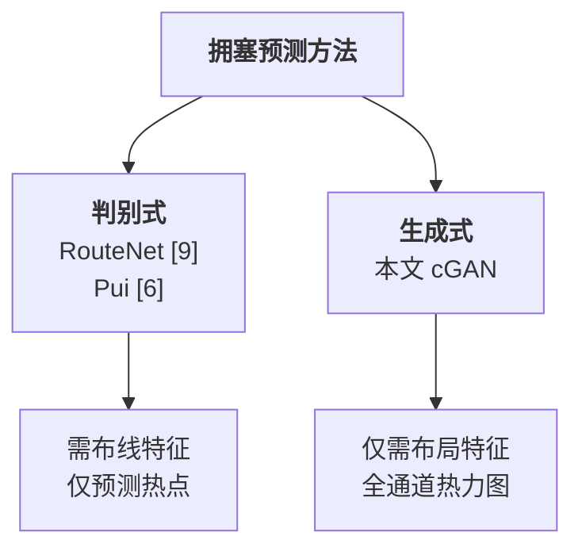
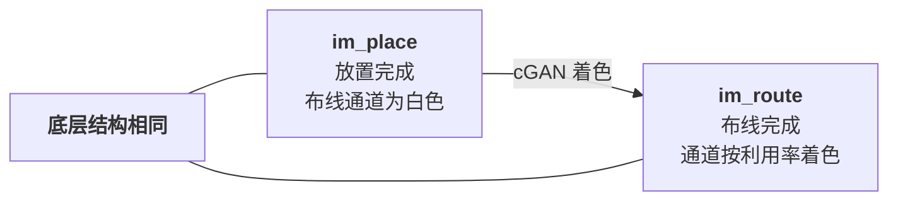
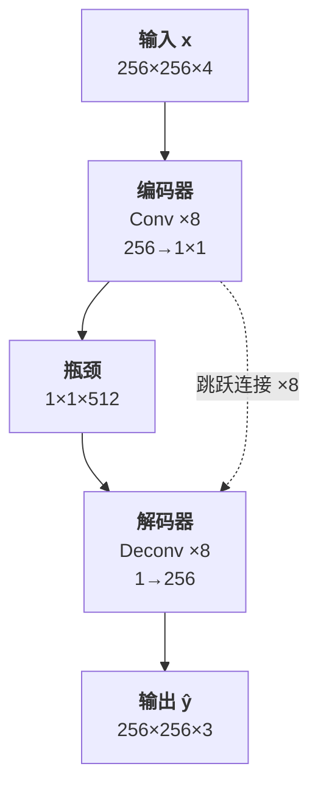
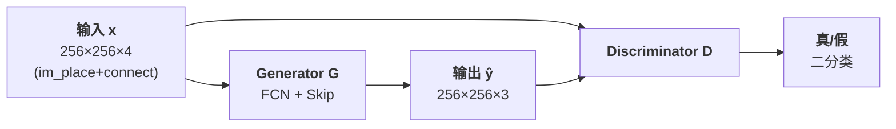
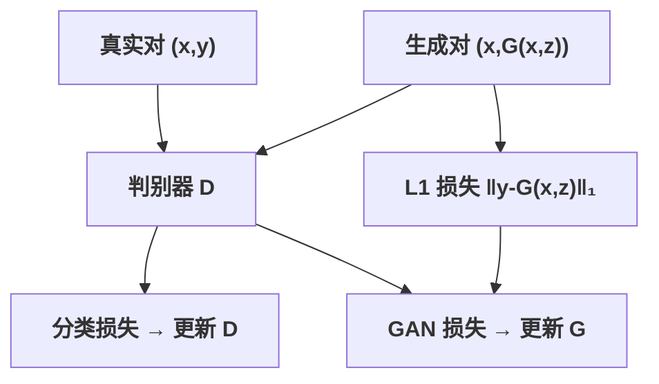
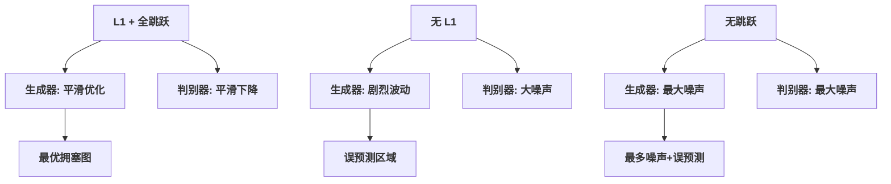
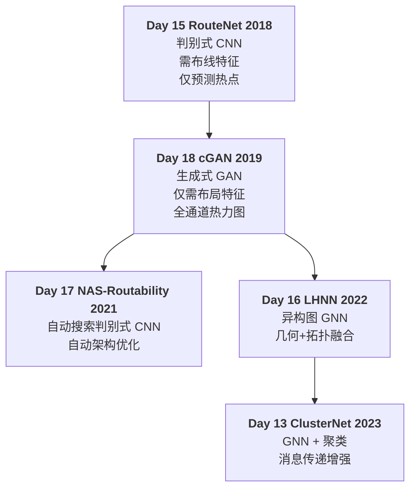

# Day 18: cGAN Congestion —— 基于条件生成对抗网络的布线拥塞预测

> **论文标题**: Painting on Placement: Forecasting Routing Congestion using Conditional Generative Adversarial Nets
>
> **作者**: Cunxi Yu, Zhiru Zhang
>
> **机构**: Computer Systems Laboratory (CSL), Cornell University
>
> **会议**: The 56th Annual Design Automation Conference (DAC)
>
> **年份**: 2019
>
> **DOI**: 10.1145/3316781.3317876
>
> **arXiv**: 1904.07077
>
> **分析日期**: 2026-06-11
>
> **系列定位**: Day 15（RouteNet）首次将判别式 CNN 引入可布线性预测；Day 16（LHNN）以异构图 GNN 融合几何与拓扑信息；Day 17（NAS-Routability）自动搜索最优判别式架构。本文实现了从**判别式模型**到**生成式模型**的范式跃迁——首次利用条件 GAN（cGAN）将布线拥塞预测构建为图像到图像的翻译（image translation）问题，学习拥塞图的条件分布而非单一点估计。

---

## 目录

1. [背景与动机](#1-背景与动机)
2. [相关工作](#2-相关工作)
3. [问题建模](#3-问题建模)
4. [核心方法](#4-核心方法)
5. [架构设计](#5-架构设计)
6. [训练方法](#6-训练方法)
7. [实验结果与分析](#7-实验结果与分析)
8. [消融与分析](#8-消融与分析)
9. [应用场景](#9-应用场景)
10. [讨论与局限性](#10-讨论与局限性)
11. [创新点深度分析](#11-创新点深度分析)
12. [演进对比表](#12-演进对比表)
13. [参考文献](#13-参考文献)

---

## 1. 背景与动机

### 1.1 物理设计的核心瓶颈

随着技术节点的持续缩微，物理设计规则（manufacturing parameters）的复杂度急剧增长。物理设计是 EDA 流程中最为耗时的一个阶段，其中**布线（routing）**是最关键的步骤。现代设计收敛（design closure）过程通常需要经历多次完整的布局布线（PnR）迭代才能满足设计约束，对大型设计而言开销巨大。由于物理设计过程不可预测、运行时间长，在短 time-to-market 的要求下完成设计收敛面临全新挑战。

### 1.2 现有方法的三大局限

论文系统梳理了已有布线预测方法的不足：

| 局限 | 说明 |
|------|------|
| **需要布线阶段特征** | [6]、[9]、[11] 均需要从布线阶段收集特征，无法在布局完成时就做出预测 |
| **仅预测热点** | RouteNet [9] 仅预测设计规则违反（DRV）的位置，而非完整拥塞热力图 |
| **仅预测 SLICE 拥塞** | [6] 仅基于 SLICE 预测热力图，未覆盖所有布线通道 |

### 1.3 核心洞察：从"判别"到"生成"

论文的核心洞察是**物理设计各阶段的中间结果可以可视化为图像**：

- 布图规划结果：`im_floor` ∈ R^(w×w×3)
- 布局后结果：`im_place` ∈ R^(w×w×3)
- 布线后结果：`im_route` ∈ R^(w×w×3)

这些图像在整个 PnR 流程中**增量地变化**：
- 从布图规划到布局：`Graph(V,E), im_floor → im_place`
- 从布局到布线：`Graph(V,E', grids), im_place → im_route`

因此，**预测布线热力图**可以自然地建模为**图像到图像的翻译问题**——给定布局图像（`im_place`），生成对应的布线拥塞热力图（`im_route`）。

> **范式跃迁**：判别式模型学习 `P(congestion | placement)`，给出单一点估计；生成式 cGAN 学习完整条件分布 `P(im_route | im_place)`，捕获拥塞图的空间结构和不确定性。

---

## 2. 相关工作

论文回顾了两条核心相关工作的脉络：

### 2.1 深度学习 for EDA

| 工作 | 应用领域 | 方法 | 与本工作的关系 |
|------|---------|------|---------------|
| Xu et al. [5] | 制造-亚分辨率辅助特征（SRAF） | 有监督学习 | 同属 ML+EDA |
| Ding et al. [7] | 制造-热点检测 | EPIC 统一元分类 | 同属后端 ML 应用 |
| Yu et al. [8] | 制造-热点检测 | SVM-Kernels | 传统 ML 方法 |
| Yang et al. [10] | 制造-热点检测 | 深度学习+张量特征 | 深度学习方法 |

### 2.2 布线拥塞预测

| 工作 | 方法 | 所需阶段 | 输出范围 | 与本工作的关键区别 |
|------|------|---------|---------|-------------------|
| Pui et al. [6] | ML 预测 SLICE 拥塞 | 布线阶段特征 | SLICE 区域 | 需布线特征，仅覆盖 SLICE |
| RouteNet [9] | CNN + 迁移学习 (ResNet18) | 布线阶段特征 | DRV 热点位置 | 需路由特征，仅预测热点 |
| Routability [11] | ML 可布线性优化 | sub-14nm 工业设计 | 可布线性判定 | 工业应用方向，非预测模型 |
| **本文** | **cGAN 图像翻译** | **仅需布局阶段** | **全部布线通道** | **首次全通道预测+无路由特征** |

### 2.3 图像翻译基础

论文深刻借鉴了 CV 领域的图像翻译（image translation）研究：

| 方法 | 核心贡献 | 对本文的影响 |
|------|---------|-------------|
| Isola et al. [19] (pix2pix) | 条件 GAN + L1 损失的图像翻译 | **直接方法基础**——cGAN 架构和 L1 损失 |
| Ronneberger et al. [16] (U-Net) | 跳跃连接的全卷积网络 | **跳跃连接设计**——传递输入图像结构 |
| Long et al. [15] (FCN) | 全卷积网络语义分割 | **编码器-解码器范式**——下采样+上采样 |
| Zhu et al. [22] (CycleGAN) | 无配对图像翻译 | 条件设置的灵感来源 |
| Goodfellow et al. [20] | 原始 GAN | GAN 理论基础 |
| Mirza & Osindero [21] | 条件 GAN (cGAN) | cGAN 基础框架 |

> **关键洞察**：图像翻译成立的前提是输入和输出图像具有**相同的底层结构**，仅在表面外观上不同 [19]。布局图像 `im_place` 和布线拥塞图像 `im_route` 恰好满足这一条件——它们的底层结构（CLB 位置、I/O Pad 布局、存储器和乘法器块）完全一致，仅布线通道的"着色"不同。

---

## 3. 问题建模

### 3.1 物理设计的形式化表示

物理设计的输入是技术映射后的网表，用有向图表示：

$$Graph(V, E)$$

其中 $V$ 是电路元件（cells）的集合，$E$ 是互连线（interconnects）的集合。对于 FPGA 布局，这是一个**打包后的网表**（packed netlist），每个集群逻辑块（CLB）可包含一个或多个基本逻辑元件（BLE）。

布图规划后，所有 $V$ 中的元件被放置在 2D 平面上的特定位置：

$$Graph(V, E', grids)$$

其中 `grids` 表示 $V$ 中元件的 2D 坐标位置，边的集合更新为 $E'$（包含位置信息）。

### 3.2 图像表示

中间结果的三个关键图像定义如下：

| 图像 | 符号 | 维度 | 说明 |
|------|------|------|------|
| 布图规划图像 | `im_floor` | R^(w×w×3) | 显示 FPGA 架构的基本结构 |
| 布局后图像 | `im_place` | R^(w×w×3) | 已用 CLB/I/O 位置填充黑色像素 |
| 布线后图像 | `im_route` | R^(w×w×3) | 布线通道按利用率着色 |

### 3.3 图像翻译建模

核心问题被建模为从布局图像到布线图像的映射：

$$G: (Graph(V, E', grids), im_{place}) \to im_{route}$$

其中 $G$ 是由生成器学习的一个可微函数。具体而言：

- **输入 $x$**：`im_place`（布局后 RGB 图像）+ `im_connect`（连接性图像，单通道）
- **输出 $\hat{y}$**：`im_route`（布线拥塞热力图，RGB 图像）
- **"翻译"**：布线本质上是将布局图像中的布线通道按照利用率"着色"

### 3.4 图像翻译成立条件

根据 [19]，高质量图像翻译需要满足：

> **输入和输出图像应具有相同的底层结构，主要差异在于表面外观（surface appearance）。**

在本文的应用中：

- **输入 `im_place`** 和**输出 `im_route`** 共享：
  - CLB 位置（黑色方块）
  - I/O Pad 位置（四边元素）
  - 存储器/乘法器位置（特定颜色块）
- **差异仅在于**：布线通道的颜色按利用率变化（白→黄→紫渐变）

---

## 4. 核心方法

### 4.1 GAN 基础

生成对抗网络（GANs）由 Goodfellow et al. [20] 提出，包含两个多层感知器：

- **生成器 $G$**：从随机噪声向量 $z$ 生成映射 $\hat{y} = G(z)$，实现可微函数 $z \to y$
- **判别器 $D$**：区分生成器生成的样本和训练数据集中的真样本

**原始 GAN 损失函数**：

$$
\mathcal{L}(G, D) = \min_{G}\max_{D}\Big(\mathbb{E}_{x}[\log D(x)] + \mathbb{E}_{z}[\log(1 - D(G(z)))]\Big) \tag{1}
$$

**训练目标**（双人零和博弈）：

1. **训练 $D$**：最大化给训练样本和生成样本分配正确标签的概率
2. **训练 $G$**：最小化 $\log(1 - D(G(z)))$

### 4.2 条件 GAN（cGAN）

条件 GAN [21] 的核心改进：生成器和判别器都额外**观察输入向量 $x$**：

$$\hat{y} = G(x, z), \quad (x, z) \to y$$

**条件 GAN 损失函数**：

$$
c\mathcal{L}(G, D) = \min_{G}\max_{D}\Big(\mathbb{E}_{x, y}[\log D(x, y)] + \mathbb{E}_{x, z}[\log(1 - D(G(x, z)))]\Big) \tag{2}
$$

与传统 GAN 的关键区别：

| 特性 | GAN | cGAN |
|------|-----|------|
| 生成器输入 | 仅噪声 $z$ | 输入 $x$ + 噪声 $z$ |
| 判别器输入 | 仅图像 | 输入 $x$ + 输出 $y/\hat{y}$ |
| 数据生成 | 无约束 | 受 $x$ 约束 |
| 适用场景 | 无条件图像生成 | 图像翻译、修复 |

### 4.3 引入 L1 距离的联合损失

根据 pix2pix [19] 的经验，论文在 cGAN 目标中额外加入 L1 距离：

$$
c\mathcal{L}(G, D) + \lambda \cdot \mathbb{E}_{x, y, z}\big[\|y - G(x, z)\|_1\big] \tag{3}
$$

其中 $\lambda$ 是 L1 损失的权重（论文中设为 50），$\beta$ 设为 0.1（用于调节 GAN 损失和 L1 损失的比例关系）。

**L1 距离的作用**：
- GAN 损失确保生成图像在**高频结构**上与真实图像相似（视觉真实性）
- L1 距离确保生成图像在**低频像素值**上与真实图像接近（像素级精度）
- 对图像翻译任务，L1 鼓励减少模糊（相比 L2 更有利于产生清晰的边缘）

---

## 5. 架构设计

### 5.1 输入特征工程

#### 5.1.1 颜色方案（Color Scheme）

论文使用特定的颜色方案区分放置和布线中的元件（VPR 交互模式的默认设置）：

| 颜色 | `im_place` 中的含义 | `im_route` 中的含义 |
|------|-------------------|-------------------|
| 白色（White） | 布线通道 | 超出布图范围 |
| 浅蓝（Light Blue） | CLB 空位 | 剩余 CLB 空位 |
| 粉色（Pink） | 乘法器 | 乘法器 |
| 浅黄（Light Yellow） | 存储器 | 存储器 |
| 黑色（Black） | 已用 CLB 和 I/O 位 | 已用 CLB 和 I/O 位 |
| 黄→紫渐变 | — | 布线通道利用率 |

#### 5.1.2 连接性图像（Connectivity Image）

为在神经网络中利用互连信息 $Graph(V, E', grids)$，论文将其转换为**连接性图像** `im_connect`：

- 每个边 $e \in E'$ 连接两个具有特定 2D 位置的节点
- 根据这些位置绘制边，构成 `im_connect`
- 维度与 `im_place` 相同，但仅为单通道：`R^(w×w×1)`

两个不同布局结果的连接性图像示例展示了：相同的网表但不同的布局会产生完全不同的连接模式。

#### 5.1.3 分辨率调整

分辨率 $w$ 需根据布图规划的大小进行调整，目标是：
- 保持 `im_place` 的实际布局结构
- 区分网表中的所有元件
- 每个放置元件的尺寸 ≥ 2×2 像素

论文中 $w = 256$（因为 `im_place` 和 `im_connect` 是矢量图形，可转换为任意分辨率的位图）。

**最终输入特征**：

$$
x = \text{stack}(im_{place}, \text{expand}(im_{connect})), \quad x \in \mathbb{R}^{256 \times 256 \times 4}
$$

即将 `im_place`（3 通道 RGB）和扩展后的 `im_connect`（1 通道扩展为 3 通道以匹配维度，或直接 concat 为 4 通道）堆叠。

### 5.2 生成器架构（Generator）

生成器是一个**全卷积网络（FCN）**，仅包含卷积层和反卷积层（无全连接层，无池化层）：

**编码器（下采样路径）**——捕获语义信息：

| 层 | 输入尺寸 | 输出尺寸 | 通道数变化 |
|----|---------|---------|-----------|
| Conv1 | 256×256 | 128×128 | 4→64 |
| Conv2 | 128×128 | 64×64 | 64→128 |
| Conv3 | 64×64 | 32×32 | 128→256 |
| Conv4 | 32×32 | 16×16 | 256→512 |
| Conv5 | 16×16 | 8×8 | 512→512 |
| Conv6 | 8×8 | 4×4 | 512→512 |
| Conv7 | 4×4 | 2×2 | 512→512 |
| Conv8 | 2×2 | 1×1 | 512→512 |

**解码器（上采样路径）**——恢复空间信息：

| 层 | 输入尺寸 | 输出尺寸 | 通道数变化 |
|----|---------|---------|-----------|
| Deconv1 | 1×1 | 2×2 | 512→512 |
| Deconv2 | 2×2 | 4×4 | 512→512 |
| Deconv3 | 4×4 | 8×8 | 512→512 |
| Deconv4 | 8×8 | 16×16 | 512→256 |
| Deconv5 | 16×16 | 32×32 | 256→128 |
| Deconv6 | 32×32 | 64×64 | 128→64 |
| Deconv7 | 64×64 | 128×128 | 64→64 |
| Deconv8 | 128×128 | 256×256 | 64→3 |

**跳跃连接（Skip Connections）**：将编码器中每一层的输出与解码器中对称层的输入进行拼接（concatenation），确保输入图像的结构信息能够传递到输出。

### 5.3 判别器架构（Discriminator）

判别器是一个**二分类 CNN**，判断输入-输出对是真实还是生成：

| 层 | 输入尺寸 | 输出尺寸 | 说明 |
|----|---------|---------|------|
| Conv1 | 256×256 | 128×128 | 6→64，批标准化 |
| Conv2 | 128×128 | 64×64 | 64→128，批标准化 |
| Conv3 | 64×64 | 32×32 | 128→256，批标准化 |
| Conv4 | 32×32 | 31×31 | 256→512，批标准化 |
| Conv5 | 31×31 | 30×30 | 512→1 |
| Sigmoid | 30×30 | 30×30 | 输出 [0,1] 概率 |

判别器的输入是两个 3 通道图像的拼接（输入 x + 真实/生成的输出），因此输入通道数为 6。

### 5.4 整体数据流

---

## 6. 训练方法

### 6.1 训练流程

**判别器训练**：
1. 接收输入-真实输出对 $(x, y)$，标签为 `1 (true)`
2. 接收输入-生成输出对 $(x, \hat{y})$，标签为 `0 (fake)`
3. 基于分类误差通过反向传播更新权重

**生成器训练**：
1. 生成输出 $\hat{y} = G(x, z)$
2. 损失由两部分组成：
   - 判别器反馈：`log(1 - D(x, G(x, z)))`（GAN 损失）
   - 像素级差异：$\lambda \|y - G(x, z)\|_1$（L1 损失）
3. 通过反向传播更新生成器权重

### 6.2 超参数设置

| 超参数 | 值 | 说明 |
|--------|-----|------|
| 学习率 | 0.0002 | Adam 优化器 |
| Adam β₁ | 0.5 | 一阶动量 |
| Adam β₂ | 0.999 | 二阶动量 |
| Adam ε | 10⁻⁸ | 数值稳定性 |
| L1 权重 λ | 50 | L1 损失在总损失中的权重 |
| β | 0.1 | GAN 损失与 L1 损失的比例调节 |
| 训练轮数 | 250 | epochs |
| 批大小 | 1 | batch size |
| 训练时间 | 2-3 小时 | 单 GPU NVIDIA 1080Ti |
| 推理时间 | ~0.09 秒 | 每张图 |

### 6.3 数据集

- **设计数量**：8 个 FPGA 设计（来自 VTR 8.0）
- **布局结果生成**：通过扫描 VPR 布局选项生成，包括：
  - `seed`（随机种子）
  - `ALPHA_T`（温度参数）
  - `INNER_NUM`（内部迭代数）
  - `place_algorithm`（布局算法）
- **每设计图像对数**：200 对
- **总数据量**：1500 对输入-输出图像

### 6.4 两种训练策略

**策略 1（Acc. 1）**：排除目标设计训练（leave-one-out）
- 训练集包含除测试设计外的所有图像
- 确保训练数据与测试数据**无重叠**
- 对**未见过的设计**进行推理

**策略 2（Acc. 2）**：迁移学习微调
- 在策略 1 模型的基础上，使用测试设计的**仅 10 对**图像微调
- 利用迁移学习的优势提高鲁棒性
- Top10 结果使用该策略评估

---

## 7. 实验结果与分析

### 7.1 Benchmark 设计

论文使用 VTR 8.0 中的 8 个 FPGA 设计，规模从小型到大型：

| 设计 | #LUTs | #FF | #Nets | 规模 |
|------|-------|-----|-------|------|
| diffeq1 | 563 | 193 | 2,059 | 小型 |
| diffeq2 | 419 | 96 | 1,560 | 小型 |
| raygentop | 1,920 | 1,047 | 5,023 | 中型 |
| SHA | 2,501 | 911 | 10,910 | 中型 |
| OR1200 | 2,823 | 670 | 12,336 | 中大型 |
| ode | 5,488 | 1,316 | 20,981 | 大型 |
| dcsm | 9,088 | 1,618 | 36,912 | 大型 |
| bfly | 9,503 | 1,748 | 38,582 | 大型 |

### 7.2 完整实验结果

| 设计 | # P | Acc. 1 | Acc. 2 | Top10 |
|------|-----|--------|--------|-------|
| diffeq1 | 200 | 67.2% | 68.9% | 50% |
| diffeq2 | 200 | 65.3% | 65.9% | 40% |
| raygentop | 200 | 68.1% | 77.1% | 70% |
| SHA | 200 | 43.3% | 61.0% | 40% |
| OR1200 | 200 | 64.6% | 67.6% | 90% |
| ode | 200 | 74.9% | 75.9% | 80% |
| dcsm | 200 | 71.4% | 85.4% | 80% |
| bfly | 200 | 71.5% | 76.5% | 70% |

**精度度量说明**：
- **Acc. 1**：逐像素精度（per-pixel accuracy），使用策略 1（leave-one-out 训练）
- **Acc. 2**：逐像素精度，使用策略 2（迁移学习微调）
- **Top10**：在测试集中找到真正最小拥塞布局的 top-10 准确率（例如 Top10=80% 表示选出的 10 个布局中有 8 个真实地属于 top-10 最低拥塞）

**加速比**：路由运行时 ÷ 推理时间（~0.09 秒），取决于不同布局的路由时间。

### 7.3 关键观察

1. **策略 2 显著改善 SHA**：SHA 设计的 Acc. 1（43.3%）远低于其他设计，但策略 2 提升至 61.0%（+17.7%），说明小样本迁移学习对"困难"设计特别有效
2. **小型设计预测困难**：diffeq1 和 diffeq2 的精度低于大型设计，论文分析原因是——小型设计中布线算法可以找到近最优解，使得数据集**极度不平衡**（大多数布局结果的拥塞水平相近）
3. **大型设计预测更准确**：ode（74.9%）、dcsm（71.4%）、bfly（71.5%）的 Acc. 1 较高
4. **OR1200 的 Top10 最高**：达到 90%，表明 cGAN 非常擅长做拥塞排序任务

---

## 8. 消融与分析

### 8.1 颜色方案 vs 灰度方案

为评估颜色方案的重要性，论文将 RGB 的 `im_place` 转换为灰度图进行对比。

| 配置 | 效果 |
|------|------|
| RGB 颜色方案 | 基准性能 |
| 灰度方案 | 平均像素精度下降 3-5%，生成图像偏亮，对低拥塞输入预测不准确 |

**额外收益**：灰度方案可节省约 20% 训练时间和 50% 推理时间，但由于精度损失且推理时间不关键，论文始终使用彩色布局图像。

### 8.2 L1 损失和跳跃连接的影响

论文以 OR1200 设计详细分析了 L1 损失和跳跃连接两个关键组件：

**定性分析——生成图像质量比较**：

| 配置 | 生成图像质量 | 问题 |
|------|-------------|------|
| **L1 + 全部跳跃连接** | 最优，几乎与真值图像相同 | — |
| **无 L1 + 全部跳跃连接** | 明显存在误预测区域 | 缺少像素级约束 |
| **L1 + 单一跳跃连接** | 大量误预测区域和噪声 | 结构信息传递不足 |

**定量分析——训练损失曲线**：

| 配置 | 生成器损失 | 判别器损失 | 训练稳定性 |
|------|-----------|-----------|-----------|
| L1 + 全部跳跃连接 | 平滑优化 | 平滑下降 | 最稳定 |
| 无 L1 | 剧烈波动 | 噪声较大 | 可能过拟合/欠拟合 |
| 无跳跃连接 | 噪声最大 | 噪声最大 | 最不稳定 |

关键洞察：
- L1 损失和跳跃连接**同时存在**时，训练损失平滑优化
- 仅使用 L1 但缺少跳跃连接，训练损失**以较大噪声剧烈优化**，容易出现**过拟合或欠拟合**
- 无跳跃连接比无 L1 产生更差的拥塞热力图
- 这解释了为何 L1+全跳跃连接产生最优结果

**与 RouteNet 的对比**：
- RouteNet [9] 发现 FCN 中**单个**跳跃连接足以预测热点（DRV 位置热力图）
- 本文发现：预测**完整布线热力图**需要连接**所有**卷积层和反卷积层的跳跃连接
- 这说明完整通道利用率预测远比热点预测更难，需要更强力的结构信息传递

---

## 9. 应用场景

### 9.1 拥塞最小化布局探索

如 Top10 结果所示，cGAN 可以有效探索布局解空间，找到具有最低布线拥塞的布局方案。Top10=50%~90%（视设计而定）意味着可以通过推理筛选后的小规模真实布线来进一步确认。

### 9.2 约束布局探索

利用 ODE 设计展示了约束条件下的布局探索：

| 目标 | 描述 |
|------|------|
| **Overall max-congestion** | 找到整体拥塞最高的布局 |
| **Overall min-congestion** | 找到整体拥塞最低的布局 |
| **Upper-min** | 找到 floorplan 上部区域拥塞最低的布局 |
| **Lower-min** | 找到 floorplan 下部区域拥塞最低的布局 |
| **Right-min** | 找到 floorplan 右侧区域拥塞最低的布局 |

> 论文的 cGAN 能够准确预测所有通道的布线密度，即使在非目标区域（低拥塞区域），预测也与真值良好吻合。

### 9.3 逐次布局过程可视化

cGAN 可以在布局过程中**实时**（on-the-fly）可视化布线通道利用率的变化。论文将其应用于 VPR 中经典的**模拟退火布局算法**：

> 可以在设计"正在被放置"的同时观察布线通道密度如何变化。

实时预测结果以 GIF 视频形式展示在项目网站 https://ycunxi.github.io/cunxiyu/dac19_demo.html。

这一应用的独特价值：
- 布局工具开发者可以**直观理解**布局算法对拥塞的影响
- 用户可以在布局过程中**及早干预**，避免不可修复的拥塞
- 为设计空间探索提供前所未有的实时反馈

---

## 10. 讨论与局限性

### 10.1 方法优势

1. **无需布线特征**：仅利用布局阶段可获取的特征，使预测可以在 PnR 流程的早期进行
2. **全通道覆盖**：不是仅预测热点，而是预测所有布线通道的利用率
3. **生成式输出**：输出是完整的热力图图像，包含丰富的空间信息
4. **低延迟推理**：每张图仅需约 0.09 秒
5. **多功能应用**：支持探索、约束优化和实时可视化

### 10.2 局限性

1. **仅针对 FPGA 架构**：实验仅在 VTR 8.0 的 FPGA 架构上进行，未在 ASIC 设计上验证
2. **小型设计预测差**：diffeq1/diffeq2 精度不理想，可能与数据集不平衡有关
3. **逐像素精度有限**：Acc. 1 从 43.3% 到 74.9% 不等，对于需要极高精度的 signoff 场景可能不足
4. **未讨论 GAN 训练不稳定性**：尽管论文展示了训练损失曲线，但未系统讨论模式坍塌（mode collapse）等问题
5. **缺乏与判别式模型的直接定量比较**：论文没有在相同 benchmark 上与 RouteNet 进行数值对比
6. **特征工程依赖**：连接性图像的构造是手工设计的，可能需要设计特定的图像生成流程
7. **分辨率限制**：w=256 可能无法满足超大规模设计的精细表示需求

### 10.3 未覆盖的维度

1. **时序约束**：仅考虑拥塞，未涉及时序预测
2. **多工艺节点**：仅在一种 FPGA 架构上验证
3. **工业级大规模 ASIC**：实验规模相对较小（最大约 9500 LUTs）
4. **与商业 EDA 工具的对比**：仅与 VPR 工具链对比

---

## 11. 创新点深度分析

### 创新点 1：范式跃迁——从判别式到生成式

| 维度 | 判别式模型（RouteNet 等） | 生成式模型（本文 cGAN） |
|------|-------------------------|----------------------|
| 数学本质 | 学习 `P(congestion | placement)` | 学习 `P(im_route | im_place)` |
| 输出形式 | 标量或热点图 | 完整热力图（每像素值） |
| 信息完整性 | 点估计 | 全空间分布 |
| 可解释性 | 较弱 | 可视化热力图可直接观察 |
| 应用灵活性 | 固定任务 | 可扩展至多种探索任务 |

**这是拥塞预测领域的开创性转变**——不再把问题看作回归或分类，而是看作**条件图像生成**。这一范式转变使得模型不仅能"预测"，还能"创作"——产生完整的拥塞图用于可视化、探索和诊断。

### 创新点 2：图像翻译建模的完美适配

论文识别出 EDA 物理设计中的**天然图像翻译结构**：

- PnR 各阶段结果可以可视化为图像
- 输入（布局）和输出（布线）共享底层结构
- 差异仅在于布线通道的"着色"

这个洞察将复杂的 EDA 问题转化为已成熟的 CV 问题，使得可直接利用 pix2pix 等成熟框架。

### 创新点 3：连接性图像——拓扑信息编码

论文创造性地将网表连接性 $Graph(V, E', grids)$ 编码为图像形式 `im_connect`：

- 将节点间的边在 2D 平面上绘制
- 使连接性信息可以作为额外通道与布局图像堆叠
- 为 cGAN 提供关键的拓扑约束

这是将**几何信息**（布局图像）和**拓扑信息**（连接性图像）同时输入 cGAN 的巧妙设计。

### 创新点 4：有限跳跃连接 vs 全跳跃连接

论文通过消融实验证明了一个重要发现：预测**完整拥塞热力图**（本文）与预测**热点**（RouteNet）对跳跃连接的需求完全不同：

- RouteNet：单个跳跃连接足够
- 本文：需要所有层的跳跃连接

这为后续研究提供了架构设计指导。

### 创新点 5：多场景应用验证

论文不仅提出模型，还在三个不同应用场景中验证了其价值：

1. 拥塞最小化布局探索
2. 约束布局探索
3. 实时布局过程可视化

展示了生成式模型在 layout 优化 pipeline 中的通用性。

---

## 12. 演进对比表

### 12.1 拥塞预测论文全线对比

| 维度 | Day 13 ClusterNet | Day 15 RouteNet | Day 16 LHNN | Day 17 NAS-Routability | **Day 18 cGAN** |
|------|------------------|----------------|-------------|----------------------|----------------|
| **年份/会议** | ICCAD 2023 | ICCAD 2018 | DAC 2022 | ICCAD 2021 | **DAC 2019** |
| **核心方法** | GNN + Leiden 聚类 | CNN + 迁移学习 (ResNet18) | 异构图 GNN (格超图) | NAS 自动搜索 CNN | **条件 GAN (cGAN)** |
| **模型范式** | 判别式 | 判别式 | 判别式 | 判别式（自动发现） | **生成式** |
| **输入特征** | 网表图 + 布局 | 布局图像 | 格节点 + 超边 | 17 通道（密度+线密度） | **布局 RGB 图 + 连接性图** |
| **输出** | 拥塞图（逐单元） | DRV 热点 + 可布线性 | 拥塞热力图 | 二值可布线性 | **完整布线热力图** |
| **几何信息** | ✓ (布局坐标) | ✓ (图像) | ✓ (格位置) | ✓ (密度图) | **✓ (布局图像)** |
| **拓扑信息** | ✓ (GNN 天然) | ✗ (无显式) | ✓ (超边) | ✓ (线密度) | **✓ (连接性图像)** |
| **跳跃连接** | N/A (非 FCN) | 单跳连接 | N/A | NAS 自动搜索 | **全部层跳跃连接** |
| **需求布线特征** | ✗ | ✓ | ✗ | ✗ | **✗** |
| **预测覆盖率** | 全芯片 | 热点 | 全芯片 | 全芯片 | **全芯片+全通道** |
| **训练范式** | 有监督 | 有监督 | 有监督 | 有监督 + NAS | **对抗训练** |
| **架构设计** | 人工设计 | 人工设计 | 人工设计 | **自动搜索** | 人工设计 |
| **关键创新** | GNN 消息传递 + 聚类 | 首次 CNN for EDA | 格超图融合几何+拓扑 | **首次 NAS for EDA** | **首次 GAN for EDA** |
| **实验设计** | 工业 ASIC | 工业 mixed-size | 开源 benchmark | ISPD benchmark | **VTR 8.0 FPGA** |
| **Top-K 排序** | ✗ | ✗ | ✗ | ✗ | **Top10 精度 50-90%** |
| **实时预测** | ✗ | ✗ | ✗ | ✗ | **✓ (on-the-fly)** |
| **约束探索** | ✗ | ✗ | ✗ | ✗ | **✓ (区域约束)** |
| **开源** | 未提及 | 未提及 | 未提及 | 未提及 | **项目网站 + 代码** |

### 12.2 范式演进路线

### 12.3 判别式 vs 生成式对比

| 维度 | 判别式家族 (Day 13/15/16/17) | 生成式家族 (Day 18) |
|------|---------------------------|-------------------|
| 学习目标 | `P(y|x)` 的后验概率 | `P(x,y)` 的联合分布 |
| 输出类型 | 标量/热点/二值 | 完整图像 |
| 损失函数 | 交叉熵/MSE/Kendall τ | GAN 损失 + L1 |
| 泛化能力 | 对见过的分布预测准确 | 可生成未见分布样本 |
| 可解释性 | 弱（黑盒） | 强（可视化热力图） |
| 应用灵活性 | 固定预测任务 | 多场景（探索/约束/可视化） |
| 训练难度 | 中等 | 较高（对抗训练） |
| 推理速度 | 快 | 快（0.09s） |

---

## 13. 参考文献

1. M. M. Ziegler, R. B. Monfort, A. Buyuktosunoglu, and P. Bose, "Machine Learning Techniques for Taming the Complexity of Modern Hardware Design," IBM Journal of Research and Development, 2017.
2. S. Dai, Y. Zhou, H. Zhang, E. Ustun, E. F. Y. Young, and Z. Zhang, "Fast and Accurate Estimation of Quality of Results in High-Level Synthesis with Machine Learning," FCCM 2018.
3. C. Yu, H. Xiao, and G. De Micheli, "Developing Synthesis Flows without Human Knowledge," DAC 2018.
4. E. Ustun, S. Xiang, J. Gui, C. Yu, and Z. Zhang, "Fast and Accurate Estimation of Quality of Results in High-Level Synthesis with Machine Learning," FCCM 2018.
5. X. Xu, Y. Lin, M. Li, and et al., "Sub-Resolution Assist Feature Generation with Supervised Data Learning," IEEE TCAD, vol. 37, no. 6, pp. 1225-1236, 2018.
6. C.-W. Pui, G. Chen, Y. Ma, E. F. Young, and B. Yu, "Clock-aware Ultrascale FPGA Placement with Machine Learning Routability Prediction," ICCAD 2017.
7. D. Ding, B. Yu, J. Ghosh, and D. Z. Pan, "EPIC: Efficient Prediction of IC Manufacturing Hotspots with a Unified Meta-classification Formulation," ASP-DAC 2012.
8. Y.-T. Yu, G.-H. Lin, I. H.-R. Jiang, and C. Chiang, "Machine-learning-based hotspot detection using topological classification and critical feature extraction," IEEE TCAD, vol. 34, no. 3, pp. 460-470, 2015.
9. Z. Xie, Y.-H. Huang, G.-Q. Fang, H. Ren, S.-Y. Fang, Y. Chen et al., "RouteNet: Routability Prediction for Mixed-size Designs using Convolutional Neural Network," ICCAD 2018.
10. H. Yang, J. Su, Y. Zou, Y. Ma, B. Yu, and E. F. Young, "Layout Hotspot Detection with Feature Tensor Generation and Deep Biased Learning," IEEE TCAD, 2018.
11. W.-T. J. Chan, P.-H. Ho, A. B. Kahng, and P. Saxena, "Routability Optimization for Industrial Designs at sub-14nm Process Nodes using Machine Learning," ISPD 2017.
12. A. Krizhevsky, I. Sutskever, and G. E. Hinton, "Imagenet Classification with Deep Convolutional Neural Networks," NeurIPS 2012.
13. Y. Kim, "Convolutional Neural Networks for Sentence Classification," arXiv:1408.5882, 2014.
14. D. Silver, A. Huang, C. J. Maddison, A. Guez et al., "Mastering the Game of Go with Deep Neural Networks and Tree Search," Nature 2016.
15. J. Long, E. Shelhamer, and T. Darrell, "Fully Convolutional Networks for Semantic Segmentation," CVPR 2015.
16. O. Ronneberger, P. Fischer, and T. Brox, "U-Net: Convolutional Networks for Biomedical Image Segmentation," MICCAI 2015.
17. C. Yu, C. Huang, G. Nam, M. Choudhury, V. N. Kravets, A. Sullivan, M. J. Ciesielski, and G. D. Micheli, "End-to-End Industrial Study of Retiming," ISVLSI 2018.
18. J. Luu, J. Goeders, M. Wainberg, A. Somerville, T. Yu, K. Nasartschuk, M. Nasr, S. Wang, T. Liu, N. Ahmed et al., "VTR 7.0: Next generation architecture and CAD system for FPGAs," ACM TRETS, 2014.
19. P. Isola, J.-Y. Zhu, T. Zhou, and A. A. Efros, "Image-to-Image Translation with Conditional Adversarial Networks," arXiv:1611.07004, 2016.
20. I. Goodfellow, J. Pouget-Abadie, M. Mirza, B. Xu, D. Warde-Farley, S. Ozair, A. Courville, and Y. Bengio, "Generative adversarial nets," NeurIPS 2014.
21. M. Mirza and S. Osindero, "Conditional Generative Adversarial Nets," arXiv:1411.1784, 2014.
22. J.-Y. Zhu, T. Park, P. Isola, and A. A. Efros, "Unpaired Image-to-Image Translation using Cycle-Consistent Adversarial Networks," arXiv:1703.10593, 2017.

---

> **分析完成日期**: 2026-06-11
> **分析工具**: Claude Code
>
> **核心贡献总结**: 本文是 EDA 领域首次将生成对抗网络引入拥塞预测的开创性工作。通过将布线拥塞预测建模为图像到图像的翻译问题，cGAN 仅需布局阶段特征即可生成完整的布线通道利用率热力图。这一范式跃迁使得模型从"单点预测"走向"全图生成"，为布局探索、约束优化和实时可视化等应用开辟了新路径。L1 损失和全跳跃连接被证明对全图预测至关重要——这与 RouteNet 仅需单跳跃连接形成鲜明对比。
