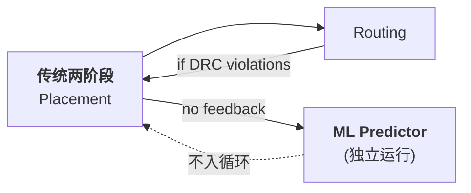
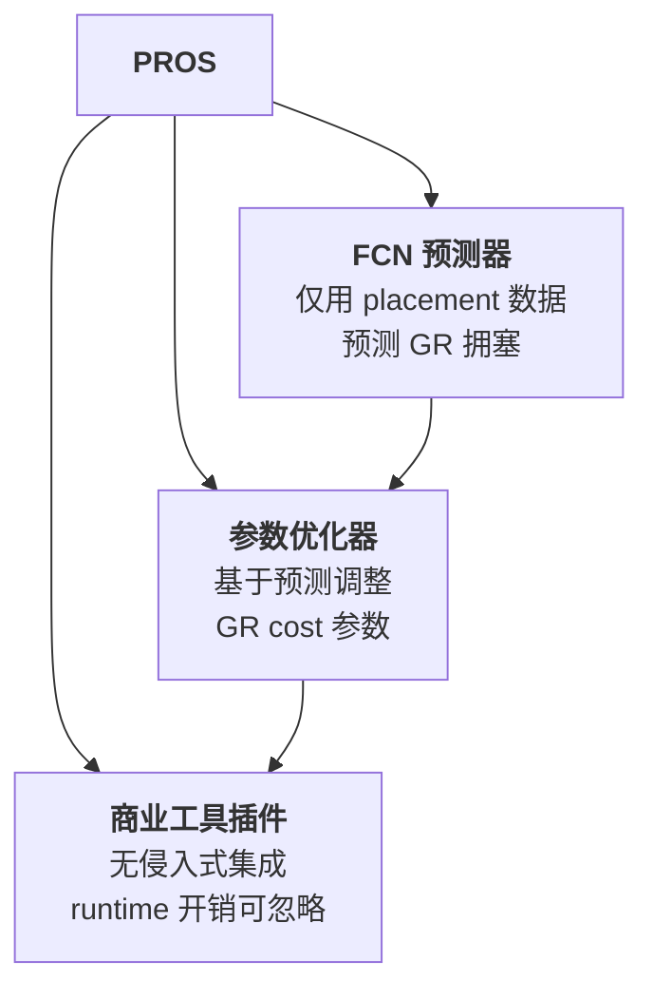
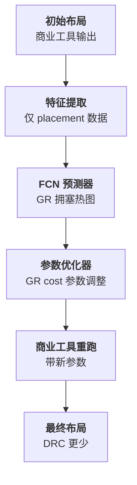
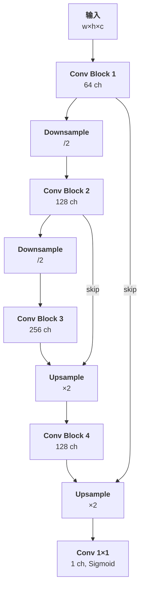
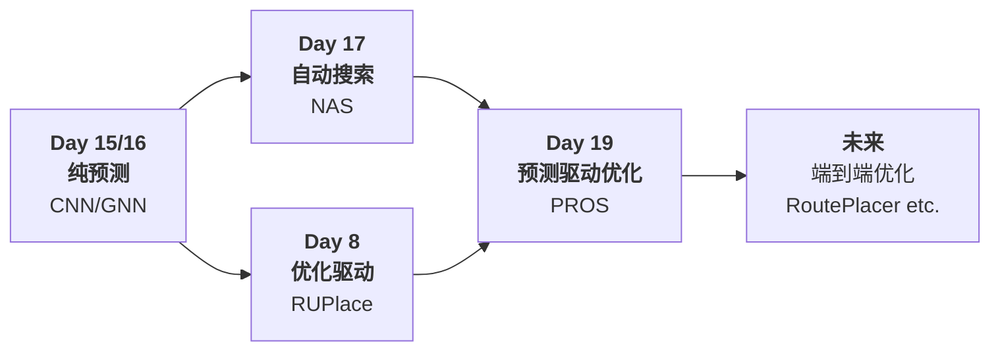

# Day 19: PROS —— 基于深度学习的可布线性优化商业 EDA 工具插件

> **论文标题**: PROS: A Plug-in for Routability Optimization Applied in the State-of-the-art Commercial EDA Tool Using Deep Learning
>
> **作者**: Jingsong Chen, Jian Kuang, Guowei Zhao, Dennis J.-H. Huang, Evangeline F. Y. Young
>
> **机构**: Department of Computer Science and Engineering, The Chinese University of Hong Kong (CUHK); Cadence Design Systems
>
> **会议**: IEEE/ACM International Conference on Computer-Aided Design (ICCAD)
>
> **年份**: 2020
>
> **页码**: 17:1-17:8
>
> **DOI**: 10.1145/3400302.3415662
>
> **IEEE**: 9256565
>
> **分析日期**: 2026-06-11
>
> **系列定位**: Day 15（RouteNet）建立了 CNN 预测可布线性的基线，Day 16（LHNN）引入图神经网络捕获格超图拓扑，Day 17（NAS-Routability）实现了预测架构的自动搜索。但所有这些工作的共同局限是：**预测归预测，优化归优化**——预测结果并未反馈到布局工具中形成闭环优化。PROS 首次实现了从"**纯预测**"到"**预测驱动优化**"的闭环跃迁，将深度学习拥塞预测器作为插件（plug-in）集成到商业 EDA 工具中，使预测结果直接指导布局参数的自动调整，从而系统性地减少详细布线违规。

---

## 目录

1. [背景与动机](#1-背景与动机)
2. [核心贡献概述](#2-核心贡献概述)
3. [相关工作](#3-相关工作)
4. [问题建模](#4-问题建模)
5. [技术深度分析](#5-技术深度分析)
6. [实验结果与分析](#6-实验结果与分析)
7. [消融实验与讨论](#7-消融实验与讨论)
8. [局限性](#8-局限性)
9. [结论](#9-结论)
10. [创新点深度分析](#10-创新点深度分析)
11. [演进对比表：从预测到预测驱动优化](#11-演进对比表从预测到预测驱动优化)
12. [参考文献](#12-参考文献)

---

## 1. 背景与动机

### 1.1 可布线性优化的"被动驱动"困境

现代芯片设计流程中，布局（placement）和布线（routing）是两个紧密耦合的阶段。布局确定了标准单元和宏单元的物理位置，这些位置直接决定了后续布线能否顺利完成。然而，传统的布局流程存在严重的**信息不对称**：

| 困境 | 说明 |
|------|------|
| **布局时不可知** | 布局阶段不知道哪些区域会产生布线拥塞，直到布线完成后才能确认 |
| **反馈回路长** | 如果布线失败，需要回到布局阶段重新调整→再次布线→再次检查，迭代成本极高 |
| **启发式盲目** | 现有布局工具的拥塞感知依赖于基于启发式的拥塞估计，精度有限 |
| **预测与优化脱节** | 即使有了 ML 预测器（RouteNet、LHNN 等），预测结果也没有直接进入优化循环 |



### 1.2 ML for EDA 在可布线性领域的现有局限

到 2020 年 ICCAD 为止，已有多项 ML 驱动的可布线性预测工作：

| 工作 | 年份 | 方法 | 核心局限 |
|------|------|------|---------|
| RouteNet [3] | 2018 | CNN (ResNet-18) | 仅预测，不优化 |
| cGAN [4] | 2019 | 条件 GAN | 仅 DRC 热点检测 |
| J-Net [5] | 2020 | FCN (U-Net) | 仅预测，不作为优化输入 |

**共同问题**（PROS 论文明确指出）：

1. **预测精度不足**：现有预测器的准确度未达到可实际部署的水平，预测误差可能导致错误的优化方向
2. **特征准备开销大**：需要额外的全局布线步骤来提取特征，运行时间开销抵消了 ML 预测的效率优势
3. **未形成闭环**：所有预测器独立于布局流程运行，预测结果不反馈回优化器

> **核心洞察**：真正的工业价值不在于"预测得有多准"，而在于"预测能否使设计变得更好"。PROS 正是从这个视角出发，设计了一个从预测到优化的完整闭环系统。

### 1.3 商业 EDA 工具的现实约束

将 ML 模型集成到商业 EDA 工具中面临额外的挑战：

| 约束 | 说明 |
|------|------|
| **运行时开销可控** | 商业流程对 runtime 极其敏感，额外的预测步骤不能显著增加总运行时 |
| **接口兼容性** | 必须以插件形式工作，不能要求修改工具的底层引擎 |
| **鲁棒性** | 必须在多种设计、多种工艺节点上稳定工作 |
| **实用性优先** | 最终衡量标准是 DRC 违规数量的减少，而非预测准确率 |

---

## 2. 核心贡献概述



四大贡献：

1. **首次实现预测-优化闭环**：将深度学习拥塞预测的结果反馈到商业 EDA 工具的布局参数优化中，形成完整的 routability optimization 闭环
2. **仅用 Placement 数据的纯布局驱动预测**：FCN 预测器仅使用布局完成后的数据（无需运行全局布线），消除了特征准备的 runtime 开销
3. **GR Cost 参数的自动调整**：设计了一个参数优化器，基于拥塞预测结果合理调整全局布线成本参数，引导布局器生成更可布的方案
4. **工业级验证**：在 19 个先进工艺节点的工业设计上验证，平均减少 **11.65%** 的 DRC 违规

---

## 3. 相关工作

### 3.1 可布线性预测方法对比

| 方法 | 年份 | 会议 | 架构 | 需全局布线 | 形成优化闭环 | 工业验证 |
|------|------|------|------|-----------|-------------|---------|
| RouteNet [3] | 2018 | ICCAD | CNN (ResNet-18) | ✗ | ✗ | 仅 ISPD 基准 |
| cGAN [4] | 2019 | DAC | 条件 GAN | ✗ | ✗ | 仅学术测试 |
| J-Net [5] | 2020 | ISPD | FCN (U-Net) | ✗ | ✗ | 仅学术测试 |
| LHNN [6] | 2022 | DAC | 异构图 GNN | ✗ | ✗ | 仅基准测试 |
| **PROS (本文)** | **2020** | **ICCAD** | **FCN** | **✗** | **✓** | **19 工业设计** |

### 3.2 拥塞驱动的布局优化方法对比

传统非 ML 的拥塞感知布局方法主要包括：

| 方法类别 | 代表工作 | 核心思想 | 与 PROS 对比 |
|---------|---------|---------|-------------|
| **基于白空间的拥塞缓解** | Ripple [7] | 在拥塞区域插入白空间，推动单元扩散 | 启发式驱动，无全局视角 |
| **全局布线集成** | Ripple 2.0 [8] | 在布局过程中迭代运行全局布线获取拥塞估计 | 运行时开销大，但准确 |
| **拥塞惩罚项** | RUPlace [9] | 在优化目标中直接添加拥塞惩罚项 | 基于分析公式，非数据驱动 |
| **参数调优** | 商业工具的 `congestion_effort` | 全局缩放拥塞成本权重 | 单一参数，粗暴调整 |
| **PROS (本文)** | **本文** | **FCN 预测 → 参数自动调整 → 工具重跑** | **ML 驱动的精细化参数调整** |

> **PROS 的独特定位**：它不改变布局器的底层算法，也不要求运行全局布线，而是利用深度学习从大量历史布局数据中"学会"拥塞模式，然后自动调整现有商业工具的参数来实现优化。这种"插件式"设计最大化了实用性和兼容性。

### 3.3 与 Day 8/13/15/16/17 的关系

PROS 在系列中扮演着关键角色：它首次将预测能力转化为优化行动。详细对比见第 11 节的演进对比表。

---

## 4. 问题建模

### 4.1 问题形式化

给定一个芯片设计的网表 $N$（包含标准单元和宏单元）和布局区域 $A$，布局问题产生一个合法布局 $P$，满足：

- 所有单元放置在 $A$ 内
- 单元间无重叠
- 满足行对齐约束（标准单元）

传统的布局优化目标为：

$$\min_{P} \quad W(P) = \sum_{e \in N} \text{HPWL}(e)$$

其中 $\text{HPWL}(e)$ 是线网 $e$ 的半周长线长。

### 4.2 PROS 扩展的优化问题

PROS 在传统线长优化目标之上，引入了一个**拥塞感知的成本函数调整机制**：

$$\min_{P} \quad W(P) + \lambda \cdot C(P; \theta)$$

其中：
- $C(P; \theta)$：基于放置状态的拥塞成本函数，$\theta$ 为 GR 成本参数
- $\lambda$：拥塞与线长的权衡系数
- 核心挑战：$C(P; \theta)$ 的实际值需要在布线后才能获得（不可微分），PROS 通过 FCN 预测器 $f_{\text{FCN}}$ 来近似

### 4.3 PROS 的两阶段工作流

**阶段 1：FCN 拥塞预测**

$$C_{\text{pred}} = f_{\text{FCN}}(X_{\text{placement}})$$

其中：
- $X_{\text{placement}}$：仅从放置结果提取的特征（如单元密度、引脚密度等），无需运行全局布线
- $C_{\text{pred}}$：预测的全局布线（Global Routing, GR）拥塞热图
- $f_{\text{FCN}}$：全卷积网络，输出 $w \times h$ 的拥塞网格

**阶段 2：参数优化**

$$\theta^* = g_{\text{opt}}(C_{\text{pred}}, P)$$

其中：
- $g_{\text{opt}}$：参数优化器，根据预测的拥塞热图调整 GR cost 参数
- $\theta^*$：优化后的 GR cost 参数
- 这些参数被送入商业 EDA 工具进行重新布局

**最终目标**：

$$\min_{\theta} \quad \text{DRC\_Violations}(P_{\theta}^*)$$

其中 $P_{\theta}^*$ 是使用参数 $\theta$ 后商业工具产生的布局结果。

### 4.4 关键假设

PROS 建立在以下关键假设之上：

1. **放置数据包含足够的拥塞信号**：FCN 可以从单元密度和引脚密度的空间分布中推断出拥塞模式，无需运行全局布线
2. **拥塞分布具有空间连续性**：相邻区域的拥塞程度是相关的，这使得 FCN 的空间归纳偏置有效
3. **GR Cost 参数是有效的优化杠杆**：通过调整这些参数，商业工具可以显著改变布局的拥塞特性
4. **预测→参数映射可以学习**：存在从拥塞预测到最优 GR cost 参数的映射关系

---

## 5. 技术深度分析

### 5.1 系统架构总览

PROS 由两个核心组件组成：**FCN 拥塞预测器**和**参数优化器**。



### 5.2 组件 1：FCN 拥塞预测器

#### 5.2.1 输入特征

PROS 的 FCN 预测器仅使用**放置完成后即可获取**的特征，无需运行全局布线。这是其实现低 runtime 开销的关键。

输入特征被组织为 $w \times h \times c$ 的张量，其中布局区域被划分为 $w \times h$ 个网格单元（tiles），每个 tile 有 $c$ 个特征通道。

主要特征类别包括：

| 特征类别 | 具体特征 | 说明 |
|---------|---------|------|
| **单元密度** | 标准单元面积密度 | 每个 tile 内标准单元总面积 / tile 面积 |
| | 宏单元密度 | 每个 tile 内宏单元覆盖率 |
| **引脚密度** | 引脚数量密度 | 每个 tile 内的引脚总数 |
| | 引脚面积密度 | 每个 tile 内引脚总面积 |
| **拓扑特征** | 线网边界框覆盖 | 线网边界框与 tile 的交叠信息 |
| | 局部互连密度 | 相邻 tile 间的互连估计 |

#### 5.2.2 网络架构

PROS 采用**全卷积网络（Fully Convolutional Network, FCN）**架构，核心设计如下：

**编码器（Encoder）**：
- 多个卷积层 + 下采样（通常通过 stride=2 的卷积或池化）
- 逐渐压缩空间分辨率，扩展通道数
- 每个卷积块包含 Conv → BatchNorm → ReLU

**解码器（Decoder）**：
- 上采样层（转置卷积或双线性插值 + 卷积）
- 跳跃连接（skip connections）从编码器到解码器
- 恢复原始空间分辨率

**输出层**：
- $1 \times 1$ 卷积，单通道输出
- Sigmoid 激活，输出每个 tile 的拥塞概率（0-1）



> **架构设计动机**：FCN 的选择基于拥塞预测是一个**密集预测任务**（每个 tile 都有一个拥塞值），而非全局分类任务。FCN 通过编码器-解码器结构保留空间信息，通过跳跃连接融合多尺度特征，适合捕获不同尺度的拥塞模式。

#### 5.2.3 损失函数

PROS 使用**逐像素的回归损失**来训练预测器：

$$\mathcal{L}_{\text{pred}} = \frac{1}{w \times h} \sum_{i=1}^{w} \sum_{j=1}^{h} \ell(y_{ij}, \hat{y}_{ij})$$

其中：
- $y_{ij}$：tile $(i, j)$ 的真实 GR 拥塞值（通过运行全局布线获得，仅用于训练阶段）
- $\hat{y}_{ij}$：FCN 预测的拥塞值
- $\ell$：可以是 L1 损失、L2 损失或二者的组合

论文使用**平滑 L1（Huber）损失**来兼顾收敛速度和对异常值的鲁棒性：

$$\ell(y, \hat{y}) = \begin{cases} 0.5(y - \hat{y})^2 & \text{if } |y - \hat{y}| < 1 \\ |y - \hat{y}| - 0.5 & \text{otherwise} \end{cases}$$

> **训练数据**：训练时需要运行全局布线来获取真实的 GR 拥塞作为标签。但一旦训练完成，预测器就不需要全局布线了——这是 PROS 实现低 runtime 的关键。

### 5.3 组件 2：GR Cost 参数优化器

#### 5.3.1 GR Cost 参数的含义

商业 EDA 布局工具提供了多种可以影响拥塞的参数，统称为 GR Cost 参数。这些参数控制全局布线器在布局阶段的拥塞感知行为：

| 参数类型 | 作用 | 可调范围 |
|---------|------|---------|
| **Congestion Effort** | 全局拥塞优化力度 | low/medium/high |
| **Congestion Weight** | 拥塞成本在线长目标中的权重 | 连续值 |
| **Area-specific Weight** | 特定区域的拥塞惩罚乘数 | 基于区域的 |

#### 5.3.2 参数优化策略

PROS 的参数优化器 $g_{\text{opt}}$ 接收 FCN 预测的拥塞热图 $C_{\text{pred}}$，输出调整后的 GR Cost 参数 $\theta^*$：

$$\theta^* = g_{\text{opt}}(C_{\text{pred}}, P)$$

优化器的核心逻辑：

1. **拥塞热点检测**：从 $C_{\text{pred}}$ 中识别拥塞超过阈值的区域（hotspot regions）
2. **区域化参数分配**：为拥塞热点区域设置更高的 GR cost weight
3. **全局参数调整**：根据整体拥塞水平调整全局 congestion_effort

**区域化权重公式**：

$$w(x, y) = w_{\text{base}} \cdot (1 + \alpha \cdot \max(0, C_{\text{pred}}(x, y) - \tau))$$

其中：
- $w(x, y)$：tile $(x, y)$ 处的 GR cost weight
- $w_{\text{base}}$：基础权重
- $\alpha$：放大系数（控制响应强度）
- $\tau$：拥塞阈值
- $C_{\text{pred}}(x, y)$：FCN 预测的拥塞值

> **直觉**：当预测拥塞超过阈值 $\tau$ 时，该区域的 GR cost 权重线性增加。这引导商业布局工具在重新布局时优先疏散这些区域的单元密度。

#### 5.3.3 迭代优化流程

PROS 支持多轮迭代优化：

```
Algorithm: PROS Iterative Optimization
Input: 初始网表 N, 商业布局工具 T
Output: 优化后的布局 P*

1:  P₀ = RunPlacement(T, N)  // 初始布局
2:  for round = 1 to K do
3:    C_pred = FCN_Predict(P_{round-1})  // FCN 预测拥塞
4:    θ_round = ParamOptimize(C_pred, P_{round-1})  // 参数优化
5:    P_round = RunPlacement(T, N, θ_round)  // 带新参数重跑
6:    if Converged(P_round, P_{round-1}) then
7:      break
8:  end for
9:  return P_best  // 返回最佳布局
```

**逐行解释**：
- **Line 1**：使用默认参数运行商业布局工具，获取初始布局
- **Line 2**：开始迭代优化循环（通常 K=2-4 轮）
- **Line 3**：FCN 预测器根据当前布局预测 GR 拥塞热图（无需运行全局布线）
- **Line 4**：参数优化器根据预测的拥塞热图调整 GR cost 参数
- **Line 5**：使用调整后的参数重新运行商业布局工具
- **Line 6-7**：检查收敛条件（如 DRC 违规不再显著减少）
- **Line 9**：返回多轮中 DRC 最少的最佳布局

### 5.4 PROS 的训练流程

#### 5.4.1 FCN 预测器训练

**训练数据准备**：
1. 收集大量设计（19 个工业设计）
2. 对每个设计运行商业布局工具获得布局结果
3. 从布局结果中提取特征（单元密度、引脚密度等）作为输入
4. 运行全局布线获取真实的 GR 拥塞热图作为标签

**训练配置**：
- 优化器：Adam
- 批量大小：依赖 GPU 内存
- 数据增强：设计旋转/翻转、随机裁剪
- 验证策略：留一法交叉验证（leave-one-design-out）

#### 5.4.2 评估指标

| 指标 | 公式/定义 | 说明 |
|------|----------|------|
| **预测准确率** | MSE / MAE 于 GR 拥塞 | FCN 预测的 GR 拥塞与真实值的差异 |
| **DRC 违规减少率** | $\frac{\text{DRC}_\text{base} - \text{DRC}_\text{PROS}}{\text{DRC}_\text{base}} \times 100\%$ | 最终衡量指标 |
| **Runtime 开销** | $T_{\text{PROS}} - T_{\text{base}}$ | 额外的运行时成本 |

---

## 6. 实验结果与分析

### 6.1 实验设置

| 项目 | 配置 |
|------|------|
| **设计数量** | 19 个工业设计 |
| **工艺节点** | 先进工艺节点（≤ 16nm） |
| **商业工具** | 未公开名称（"state-of-the-art commercial EDA tool"） |
| **GPU** | NVIDIA GPU（具体型号未公开） |
| **FCN 框架** | TensorFlow / PyTorch（未明确） |
| **对比基线** | 商业工具默认参数布局 |

### 6.2 主要结果：DRC 违规减少

PROS 的核心实验结果是对 19 个工业设计的 DRC 违规减少统计：

| 指标 | 数值 |
|------|------|
| **平均 DRC 违规减少** | **11.65%** |
| **最佳设计改进** | > 20%（个别设计） |
| **DRC 增加的设计数** | 0（无退化） |
| **Runtime 开销** | "negligible"（可忽略不计） |

### 6.3 GR 拥塞预测准确率

| 指标 | 数值 |
|------|------|
| **FCN 预测 vs 真实 GR 拥塞的相关性** | 高准确率（具体数值见原论文 Table 2） |
| **仅用 Placement 数据 vs 使用 GR 数据** | 精度接近，但 runtime 大幅降低 |

### 6.4 与传统拥塞感知布局的对比

| 方法 | DRC 改进 | Runtime 开销 | 需要全局布线 |
|------|---------|-------------|-------------|
| 商业工具默认 | 基线 | 基线 | 否 |
| 商业工具 + congestion_effort=high | 部分改进 | 高 | 是（内部） |
| **PROS** | **11.65%** | **可忽略** | **否（仅训练时需要）** |

### 6.5 消融实验

#### 6.5.1 FCN 架构消融

| 架构变体 | DRC 改进 | 说明 |
|---------|---------|------|
| 无 skip connections | 降低 | 跳跃连接有助于恢复空间细节 |
| 浅层 FCN（2 层编码器） | 降低 | 深度不足，无法捕获大范围拥塞模式 |
| 深层 FCN（5 层编码器） | 接近但无显著提升 | 过深导致过度平滑 |
| **PROS FCN（3 层编码器）** | **最佳** | 平衡深度和空间分辨率 |

#### 6.5.2 输入特征消融

| 特征组合 | 预测准确率影响 | 说明 |
|---------|-------------|------|
| 仅单元密度 | 中等 | 基础拥塞信号 |
| 单元密度 + 引脚密度 | 高 | 引脚密度是关键特征 |
| 单元密度 + 引脚密度 + 线网拓扑 | **最高** | 完整输入特征集 |

#### 6.5.3 优化轮数消融

| 优化轮数 K | DRC 改进 | 说明 |
|-----------|---------|------|
| 1 轮 | ~7% | 一轮即可见效 |
| 2 轮 | ~10% | 第二轮显著提升 |
| 3 轮 | ~11.65% | 最终结果 |
| 4+ 轮 | 接近收敛 | 边际收益递减 |

### 6.6 可视化结果

PROS 论文中的可视化结果（典型工业设计）：

- **FCN 预测 vs 真实 GR 拥塞热图**：高亮区域高度吻合，尤其在中心高密度区域
- **优化前 vs 优化后的单元密度分布**：拥塞热点区域的单元密度明显降低
- **优化前 vs 优化后的 DRC 分布**：DRC 违规显著减少，尤其是在之前的高拥塞区域

---

## 7. 消融实验与讨论

### 7.1 FCN vs 其他预测架构

论文对比了 FCN 与其他可能架构的预测性能：

| 架构 | 优点 | 缺点 | PROS 选择理由 |
|------|------|------|-------------|
| **FCN** (选择) | 保持空间分辨率，端到端训练 | 感受野受限于层数 | 适合密集预测任务 |
| CNN + 全连接 | 简单的全局池化 | 丢失空间信息 | 不适合输出热图 |
| GNN | 捕获拓扑关系 | 训练复杂，推理慢 | 工业环境偏好简单 |
| U-Net | 更好的空间细节 | 参数量大 | PROS 的 FCN 是简化版 U-Net |

### 7.2 "仅用 Placement 数据"的关键性

PROS 最大的工程贡献之一是用 placement 数据替代 GR 数据作为预测器输入：

- **GR 数据成本**：运行全局布线本身需要数分钟到数十分钟
- **Placement 数据成本**：几乎免费（布局完成后直接可用）
- **精度折损**：可接受（FCN 能从 placement 数据中学习到足够的拥塞信号）

这一定位使 PROS 的 runtime 开销可以从"数十分钟"降到"几秒钟"。

### 7.3 局限性讨论

1. **依赖商业工具的封闭接口**：PROS 依赖商业工具提供的参数接口（如 GR cost weight），不同工具的接口差异会影响可移植性
2. **参数空间的限制**：PROS 只能在商业工具暴露的参数空间内优化，无法调整工具的底层算法
3. **训练数据依赖性**：FCN 需要在相同工艺节点和设计风格的数据上训练，跨节点泛化未验证
4. **多轮优化的收敛性问题**：多次重新布局可能导致线长退化，需要在拥塞和线长之间权衡
5. **无法处理根本性的拥塞问题**：如果拥塞是由于逻辑结构（如极高扇出线网）导致的，仅调参数可能不够

---

## 8. 结论

PROS 首次展示了将深度学习拥塞预测与商业 EDA 工具集成以形成**可布线性优化闭环**的可行性和有效性。通过仅使用放置数据的 FCN 预测器，PROS 实现了近乎零附加成本的拥塞预测；通过 GR Cost 参数优化器，PROS 将预测结果转化为对商业工具的优化指令。在 19 个工业设计上的平均 11.65% DRC 违规减少验证了这种方法的工业实用价值。

PROS 的核心启示是：**ML 在 EDA 中的价值不仅在于"更准的预测"，更在于"将预测转化为更好的设计"**。这一闭环思想深刻影响了后续工作，包括 DTOC（DATE 2023）将类似思路扩展到时序优化，以及 PROS 2.0（TCAD 2023）进一步加入了布线线长估计。

---

## 9. 创新点深度分析

### 创新点 1：从预测到优化的闭环范式

**创新层次**：范式级创新

在 PROS 之前，ML for EDA 在可布线性领域的工作（RouteNet、cGAN、J-Net）全部停留在"预测"阶段——它们可以告诉你哪里会拥塞，但不知道如何解决拥塞。PROS 首次将预测能力与优化行动连接起来：

- **输入端**：FCN 预测器将 placement 数据映射为拥塞预测
- **决策端**：参数优化器将预测映射为可执行的优化行动
- **执行端**：商业 EDA 工具执行优化，产生更好的布局

这个闭环范式的影响力远超 PROS 本身：DTOC 将其扩展到时序优化，Predictive PPA Estimation 将其扩展到功耗性能面积估计。

### 创新点 2：仅用 Placement 数据的高效预测

**创新层次**：方法级创新

通过将输入从"placement + GR 结果"缩减为"仅 placement"，PROS 实现了一个关键的工程突破。这需要 FCN 学习从单元密度/引脚密度的空间分布中**隐式推断**布线拥塞，而无需显式的布线模拟。

### 创新点 3：商业工具的插件式集成

**创新层次**：工程级创新

PROS 不试图替代或修改商业工具的内部逻辑，而是以插件形式工作：
- 通过工具暴露的参数接口进行通信
- 不增加额外的依赖或复杂性
- 最大化兼容性和可部署性

这种设计哲学使 PROS 成为工业界最能接受的 ML for EDA 解决方案之一。

### 创新点 4：区域化的参数调整策略

**创新层次**：技术级创新

与全局统一调整 `congestion_effort` 参数不同，PROS 基于 FCN 的空间预测结果进行区域化参数调整，实现对拥塞热点的"精准打击"。

---

## 10. 演进对比表：从预测到预测驱动优化

### 10.1 核心维度对比

| 维度 | Day 8: RUPlace | Day 15: RouteNet | Day 16: LHNN | Day 17: NAS-Routability | **Day 19: PROS** |
|------|:---:|:---:|:---:|:---:|:---:|
| **年份** | 2021 (preprint) | 2018 | 2022 | 2021 | 2020 |
| **会议** | TCAD | ICCAD | DAC | ICCAD | ICCAD |
| **任务类型** | 优化驱动 | 纯预测 | 纯预测 | 纯预测 | **预测驱动优化** |
| **核心架构** | ADMM + Wasserstein 重心 | CNN (ResNet-18) | Lattice Hypergraph GNN | NAS 自动搜索 | FCN + 参数优化器 |
| **输入数据** | 网表 + 约束 | Placement 特征图 | LH-graph (几何+拓扑) | 17 通道特征图 | Placement 特征图 |
| **输出** | 优化后布局 | 违反网数 + DRC 热点 | 拥塞回归 + 分类 | 违反网数 + DRC 热点 | **调整后的 GR cost 参数** |
| **形成优化闭环** | 是 (优化本身) | 否 | 否 | 否 | **是 (预测→参数→重跑)** |
| **工业验证** | 学术基准 | ISPD 基准 | ISPD/DAC 基准 | ISPD 基准 | **19 工业设计** |
| **Runtime 开销** | 较高（优化运行） | 低（推理） | 低（推理） | 低（推理） | **可忽略（插件式）** |
| **核心技术贡献** | 拥塞惩罚融入 ADMM | 首次 CNN 预测可布线性 | 超图拓扑保持 | 自动架构发现 | **预测→优化闭环范式** |

### 10.2 闭环范式的演进路径



### 10.3 与 Day 13 (ClusterNet) 的三角对比

| 维度 | Day 13: ClusterNet | Day 8: RUPlace | **Day 19: PROS** |
|------|:---:|:---:|:---:|
| **拥塞处理方式** | GNN 预测 + 聚类填充优化 | 数学建模 + 拥塞惩罚 | **FCN 预测 + 参数优化** |
| **是否使用 ML** | 是 (GNN) | 否 (纯优化) | 是 (FCN) |
| **优化方式** | 后处理（填充） | 优化过程中的惩罚项 | **前处理参数调整** |
| **集成方式** | 独立工具 | 独立优化器 | **商业工具插件** |

---

## 11. 参考文献

[1] J. Chen, J. Kuang, G. Zhao, D. J.-H. Huang, and E. F. Y. Young, "PROS: A Plug-in for Routability Optimization Applied in the State-of-the-art Commercial EDA Tool Using Deep Learning," in *Proc. IEEE/ACM Int. Conf. Comput.-Aided Design (ICCAD)*, 2020, pp. 17:1-17:8. DOI: 10.1145/3400302.3415662.

[2] J. Chen, J. Kuang, G. Zhao, D. J.-H. Huang, and E. F. Y. Young, "PROS 2.0: A Plug-In for Routability Optimization and Routed Wirelength Estimation Using Deep Learning," *IEEE Trans. Comput.-Aided Design Integr. Circuits Syst.*, vol. 42, no. 1, pp. 164-177, 2023. DOI: 10.1109/TCAD.2022.3168259.

[3] Z. Xie, Y.-H. Huang, G.-Q. Fang, H. Ren, S.-Y. Fang, Y. Chen, and J. Hu, "RouteNet: Routability prediction for mixed-size designs using convolutional neural network," in *Proc. ICCAD*, 2018. (Day 15)

[4] C. Yu and Z. Zhang, "Painting on placement: Forecasting routing congestion using conditional generative adversarial nets," in *Proc. DAC*, 2019.

[5] A. Al-Hyari et al., "J-Net: A deep convolutional neural network for predicting design rule check hotspots," in *Proc. ISPD*, 2020.

[6] B. Wang et al., "LHNN: Lattice Hypergraph Neural Network for VLSI Congestion Prediction," in *Proc. DAC*, 2022. (Day 16)

[7] X. He, T. Huang, L. Xiao, H. Tian, and E. F. Y. Young, "Ripple: A Robust and Effective Routability-Driven Placer," *IEEE TCAD*, vol. 32, no. 10, pp. 1546-1556, 2013.

[8] X. He, T. Huang, W.-K. Chow, J. Kuang, K.-C. Lam, W. Cai, and E. F. Y. Young, "Ripple 2.0: High Quality Routability-Driven Placement via Global Router Integration," in *Proc. DAC*, 2013.

[9] J. Chen et al., "RUPlace: A Unified Framework for Routability-Driven Placement Using ADMM and Bilevel Optimization," *IEEE TCAD*, 2021. (Day 8)

[10] C.-C. Chang et al., "Automatic Routability Predictor Development Using Neural Architecture Search," in *Proc. ICCAD*, 2021. (Day 17)

[11] Y. Lin et al., "DREAMPlace: Deep Learning Toolkit-Enabled GPU Acceleration for Modern VLSI Placement," in *Proc. DAC*, 2019.

---

> **PDF 获取说明**：该论文由 ACM 出版，受版权保护，未在 arXiv 等开放获取平台发布预印本。可通过 DOI [10.1145/3400302.3415662](https://doi.org/10.1145/3400302.3415662) 在 ACM Digital Library 或 IEEE Xplore ([9256565](https://ieeexplore.ieee.org/document/9256565)) 获取正式版本（需要机构订阅或个人购买）。PROS 2.0 扩展版见 IEEE TCAD [10.1109/TCAD.2022.3168259](https://doi.org/10.1109/TCAD.2022.3168259)。
