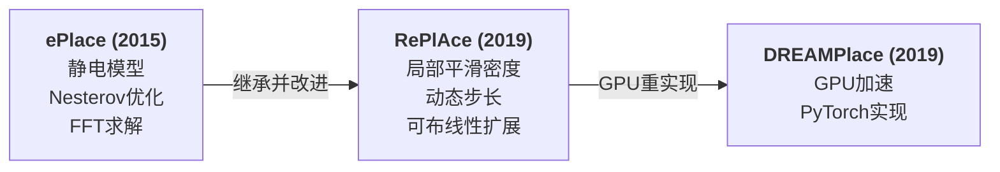
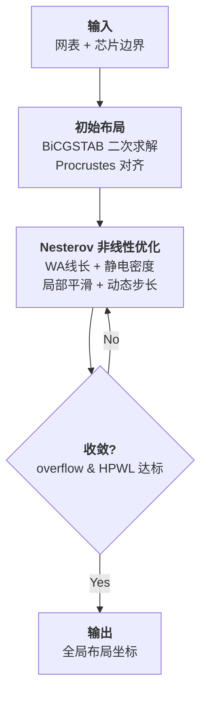
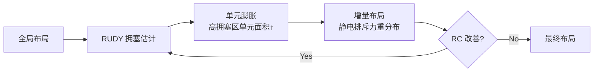

# Day 2: RePlAce —— 约束导向局部平滑与自适应步长的全局布局

> **论文标题**: RePlAce: Advancing Solution Quality and Routability Validation in Global Placement
>
> **作者**: Chung-Kuan Cheng, Andrew B. Kahng, Ilgweon Kang, Lutong Wang
>
> **机构**: University of California, San Diego (UCSD), ECE & CSE Departments
>
> **期刊**: IEEE Transactions on Computer-Aided Design of Integrated Circuits and Systems (TCAD)
>
> **卷/期/页码**: Vol. 38, No. 9, pp. 1717–1730
>
> **DOI**: [10.1109/TCAD.2018.2859220](https://doi.org/10.1109/TCAD.2018.2859220)
>
> **开源代码**: [github.com/mgwoo/RePlAce](https://github.com/mgwoo/RePlAce) | OpenROAD 集成版: [The-OpenROAD-Project/OpenROAD](https://github.com/The-OpenROAD-Project/OpenROAD) (`src/gpl/`)
>
> **分析日期**: 2026-06-06
>
> **与 Day 1 的关系**: RePlAce 是 DREAMPlace 的直接对照基线。DREAMPlace 的静电模型、Nesterov 优化器、FFT 求解均继承自 ePlace/RePlAce 系列。理解 RePlAce 是理解现代解析布局技术栈的关键。

---

## 目录

1. [研究背景：ePlace 遗产与未解决的问题](#1-研究背景eplace-遗产与未解决的问题)
2. [核心贡献概述](#2-核心贡献概述)
3. [数学建模：从 ePlace 到 RePlAce](#3-数学建模从-eplace-到-replace)
4. [创新点一：约束导向的局部平滑](#4-创新点一约束导向的局部平滑)
5. [创新点二：动态步长自适应](#5-创新点二动态步长自适应)
6. [初始布局与 Procrustes 对齐](#6-初始布局与-procrustes-对齐)
7. [算法流程](#7-算法流程)
8. [可布线性驱动的扩展](#8-可布线性驱动的扩展)
9. [实验结果与分析](#9-实验结果与分析)
10. [创新点深度分析](#10-创新点深度分析)
11. [参考文献](#11-参考文献)

---

## 1. 研究背景：ePlace 遗产与未解决的问题

### 1.1 ePlace 的革命性贡献

2015 年，J. Lu 等人在 ACM TODAES 上发表了 **ePlace**，首次将静电场类比引入 VLSI 全局布局。其核心思想在 Day 1 中已有介绍——将单元面积视为电荷密度 \( \rho \)，通过求解 Poisson 方程获得电势场 \( \Phi \)，电场 \( \mathbf{E} = -\nabla\Phi \) 作为密度排斥力。

ePlace 取得了显著成果，但留下了几个关键问题：

### 1.2 ePlace 的三大局限

| 问题 | 描述 | 后果 |
|------|------|------|
| **全局平滑过于粗糙** | ePlace 对整个密度图做均匀平滑，不区分局部 overflow 程度 | bin 级密度热点无法有效消除 |
| **步长选择过于保守** | ePlace 依赖 Lipschitz 常数的静态上界估计，步长过于保守 | 收敛慢，优化不充分 |
| **缺乏可布线性考虑** | ePlace 仅优化线长+密度，不考虑布线拥塞 | 布局结果的可布线性无法保证 |

### 1.3 RePlAce 的定位

RePlAce **不是重新发明**布局算法，而是对 ePlace/静电方法体系中的两个核心控制机制——密度函数和步长策略——进行**精细化的重新设计**。加上可布线性扩展，RePlAce 成为第一个在 **五大基准测试集**（ISPD-2005, ISPD-2006, MMS, DAC-2012, ICCAD-2012）上均取得最优结果的单一布局引擎。

---

## 2. 核心贡献概述

RePlAce 的三个核心创新：

1. **约束导向的局部平滑（Constraint-Oriented Local Smoothing）**：一种新的密度函数，理解每个 bin 的局部面积 overflow，实现 per-bin 粒度的平滑控制
2. **动态步长自适应（Dynamic Step-Size Adaptation）**：自动确定 Nesterov 优化的步长，动态分配优化力度
3. **可布线性驱动扩展（Routability-Driven Extension）**：基于 RUDY 快速布线拥塞估计的布局调整

---

## 3. 数学建模：从 ePlace 到 RePlAce

### 3.1 优化问题形式

与 ePlace 一致，RePlAce 将全局布局建模为无约束最小化问题：

\[
\min_{\mathbf{x}, \mathbf{y}} \quad f(\mathbf{x}, \mathbf{y}) = W(\mathbf{x}, \mathbf{y}) + \lambda \cdot D(\mathbf{x}, \mathbf{y})
\]

其中 \( W \) 为线长目标（Weighted-Average 平滑 HPWL），\( D \) 为密度惩罚（静电势能），\( \lambda \) 为拉格朗日乘子。

与 Day 1 中 DREAMPlace 的公式完全一致——因为 DREAMPlace 的数学框架完全继承自 ePlace/RePlAce。

### 3.2 静电密度模型的核心公式

#### 电荷密度

布局区域划分为 \( m \times m \) 的均匀网格。网格 bin \( b \) 的电荷密度：

\[
\rho_b = \frac{\sum_{i} A_i \cdot \text{overlap}(i, b) - A_b \cdot \rho_{\text{target}}}{A_b}
\]

> **与 ePlace 的关键区别**：RePlAce 减去了目标密度 \( \rho_{\text{target}} \)。这意味着 \( \rho_b \) 可正可负——正电荷密度表示 bin 过密（overfilled），需要推开单元；负电荷表示 bin 有可用空间，可以吸引单元。这比 ePlace 的全正电荷模型更精确。

#### Poisson 方程与 DCT 求解

电势场通过 Poisson 方程与电荷密度关联：

\[
\nabla^2 \Phi(x, y) = -\rho(x, y)
\]

在离散网格上使用 **离散余弦变换（DCT-II）** 对角化求解：

\[
\Phi = \text{IDCT}\left( \frac{\text{DCT}(\rho)}{\omega_u^2 + \omega_v^2} \right), \quad \omega_u = 2 - 2\cos\left(\frac{\pi u}{m}\right)
\]

#### 系统电势能与电场力

密度惩罚为系统总电势能：

\[
D = \sum_{b} \Phi_b \cdot \rho_b
\]

单元 \( i \) 受到的电场力（密度梯度）：

\[
\frac{\partial D}{\partial x_i} = q_i \cdot E_x(x_i, y_i), \quad \frac{\partial D}{\partial y_i} = q_i \cdot E_y(x_i, y_i)
\]

其中 \( q_i = A_i \) 为单元的"电荷量"，\( \mathbf{E} = -\nabla\Phi \) 为电场。

> **物理直觉**：每个单元如同带正电的物体——大单元电荷量大，受电场力更强，被推离高密度区域的速度更快。小单元电荷量小，能在密度梯度中更精细地调整位置。这个特性自然实现了大面积单元优先占据空旷区域、小单元填充缝隙的布局策略。

---

## 4. 创新点一：约束导向的局部平滑

### 4.1 ePlace 全局平滑的问题

ePlace 的密度函数对**所有 bin** 施加相同的平滑处理。问题在于：不同的 bin 可能需要不同程度的平滑——已经满足密度约束的 bin 不需要进一步平滑（会模糊掉精细的密度信息），而严重 overflow 的 bin 需要更强的平滑来产生足够的排斥力。

### 4.2 RePlAce 的局部平滑策略

RePlAce 引入**per-bin 的自适应平滑**：

\[
\tilde{\rho}_b = (1 - \alpha_b) \cdot \rho_b + \alpha_b \cdot \bar{\rho}_b^{\text{local}}
\]

其中：
- \( \rho_b \) 是原始电荷密度（精确值）
- \( \bar{\rho}_b^{\text{local}} \) 是 bin \( b \) 局部邻域的平滑密度
- \( \alpha_b \) 是**局部平滑系数**，由 bin \( b \) 的 overflow 程度决定

**核心创新**：\( \alpha_b \) 不是全局统一的常量，而是根据每个 bin 的状态动态计算：

\[
\alpha_b = f(\text{overflow}_b) = \begin{cases}
\alpha_{\max}, & \text{overflow}_b \text{ 严重（需要强排斥力）} \\
\alpha_{\min}, & \text{overflow}_b = 0 \text{（保持精确密度信息）}
\end{cases}
\]

> **设计哲学**：这相当于在密度约束满足好的区域保持高精度（\( \alpha \) 小 = 信赖原始 \( \rho \)），而在 density hot-spot 区域增加平滑（\( \alpha \) 大 = 使用邻域平均 \( \bar{\rho} \)），产生更强的排斥力将单元推开。这是一种 **自适应约束满足策略**——将优化力度集中到真正有约束违反的地方。

### 4.3 局部平滑的物理等价

局部平滑等价于在静电系统中引入了**空间变化的介电常数** \( \epsilon(x, y) \)：

\[
\nabla \cdot (\epsilon(x, y) \nabla \Phi) = -\rho(x, y)
\]

在高 overflow 区域，\( \epsilon \) 更小（或等价地说，有效电荷更大），电场更强、作用范围更远。这使得 dense region 的单元能更快扩散。

---

## 5. 创新点二：动态步长自适应

### 5.1 Nesterov 优化中步长的重要性

Nesterov 加速梯度（NAG）方法的收敛速度**高度依赖步长** \( \alpha \)。步长太小导致收敛缓慢（单元扩散不够快，overlap 迟迟不消除），步长太大导致震荡甚至发散（单元"跳过头"）。

### 5.2 ePlace 的静态 Lipschitz 估计

ePlace 使用 Lipschitz 常数的上界来估计步长：

\[
\alpha_k = \frac{1}{L}, \quad L = \sup_{\mathbf{x} \neq \mathbf{y}} \frac{\|\nabla f(\mathbf{x}) - \nabla f(\mathbf{y})\|}{\|\mathbf{x} - \mathbf{y}\|}
\]

问题在于：
- Lipschitz 常数 \( L \) 是**全局最坏情况**的上界，对于大部分迭代来说过于保守
- 随着优化的进行，目标函数的"有效"曲率会变化（单元从密集堆积变为均匀分布），固定步长无法适应
- 静态估计没有考虑不同坐标方向上的曲率差异（各向异性）

### 5.3 RePlAce 的动态步长调整

RePlAce 不依赖 Lipschitz 常数的静态估计，而是在每步迭代中动态确定步长：

\[
\alpha_k = \arg\min_{\alpha} \; f\left(\mathbf{x}_k - \alpha \cdot \nabla f(\mathbf{x}_k)\right)
\]

但精确的线搜索（line search）代价太高（每次试探需要重新计算整个目标函数和梯度）。RePlAce 使用了一种**近似线搜索**策略：

**回溯法（Backtracking）**：

1. 从较大的试探步长 \( \alpha_k^{(0)} \) 开始
2. 检查 Nesterov 收敛条件：\( f(\mathbf{x}_{k+1}) \leq f(\mathbf{x}_k) - \frac{\alpha_k}{2}\|\nabla f(\mathbf{x}_k)\|^2 \)
3. 如果不满足（说明步长太大），则缩小步长：\( \alpha_k \leftarrow \tau \cdot \alpha_k \)（\( \tau \in (0.5, 0.9) \)）
4. 重复直到满足条件或达到最小步长

**试探步长初始化**：RePlAce 使用前一步的**成功步长**作为当前步的初始试探值：

\[
\alpha_k^{(0)} = \alpha_{k-1}^{\text{final}}
\]

> **为什么这比静态 Lipschitz 更好？** 考虑布局过程：在早期阶段，单元严重重叠，Lipschitz 常数 \( L \) 很大（梯度变化剧烈），静态估计给出的步长非常小，单元几乎动不了。而 RePlAce 的回溯法从较大的试探步长开始，逐步缩小到合适的值，避免了静态估计的保守性。在后期阶段，单元分布均匀，目标函数平滑，步长自然也会增大。

### 5.4 自适应 μ 系数控制

RePlAce 还引入了一个动态调整的 Nesterov 参数 \( \mu \in [\mu_{\min}, \mu_{\max}] \)（默认 \( [0.95, 1.05] \)）：

\[
\mu_{k+1} = \begin{cases}
\max(\mu_k - \Delta\mu, \mu_{\min}), & \text{如果 HPWL 在改善} \\
\min(\mu_k + \Delta\mu, \mu_{\max}), & \text{如果 HPWL 恶化}
\end{cases}
\]

\( \mu \) 控制 λ 的更新速率（见 Day 1 的公式）。通过根据 HPWL 变化趋势动态调节 \( \mu \)，RePlAce 在优化过程中自动找到了线长与密度的最优平衡点。

---

## 6. 初始布局与 Procrustes 对齐

### 6.1 为什么需要初始布局？

随机初始化的坐标会使静电模型在最初几百次迭代中耗费大量时间在"将单元大致展开"上。一个合理的初始布局可以显著减少总迭代次数。

### 6.2 二次布局初始化（BiCGSTAB 求解）

RePlAce 在 Nesterov 非线性优化之前，先求解一个**二次线长最小化问题**：

\[
\min_{\mathbf{x}, \mathbf{y}} \sum_{e \in \text{nets}} \sum_{i,j \in e} (x_i - x_j)^2 + (y_i - y_j)^2
\]

这是一个**无约束凸二次规划**，最优解等价于求解稀疏线性方程组 \( \mathbf{A}\mathbf{x} = \mathbf{b} \)。

RePlAce 使用 **BiCGSTAB（双共轭梯度稳定化）** 迭代求解器：
- 默认最多 **20 次迭代**
- 对 fanout > 200 的超大网络跳过（避免单根线主导整个初始布局）
- 在大规模设计上，初始布局带来约 **5% 的 HPWL 改善**

### 6.3 Procrustes 对齐

BiCGSTAB 求解的二次布局没有考虑芯片边界和密度约束，单元可能散布在芯片外的任意位置。**Procrustes 对齐**通过旋转、缩放、平移将布局映射回芯片区域：

1. 计算布局的协方差矩阵（描述单元分布的形状和方向）
2. 通过 SVD 分解找到最优的旋转和缩放
3. 将布局映射到芯片区域的 bounding box

这一步保证初始布局在密度分布上大致合理，减少了 Nesterov 优化阶段的工作量。

---

## 7. 算法流程

### 关键参数总结

| 参数 | 默认值 | 作用 | RePlAce 的改进 |
|------|--------|------|---------------|
| \( \gamma \)（平滑参数） | 从大递减 | 控制 WA 线长的近似精度 | 继承 ePlace |
| \( \lambda \)（密度权重） | 自适应 | 平衡线长与密度 | 引入局部 overflow 反馈 |
| \( \alpha \)（步长） | 回溯法动态确定 | Nesterov 步长 | **核心创新：替代静态 Lipschitz** |
| \( \mu \)（λ 更新系数） | [0.95, 1.05] | 密度权重的变化速度 | HPWL 趋势感知的动态调节 |
| \( \alpha_b \)（局部平滑系数） | 按 bin overflow 计算 | 密度感知的平滑程度 | **核心创新：替代全局均匀平滑** |

---

## 8. 可布线性驱动的扩展

### 8.1 问题：线长最小化 ≠ 可布线

最小化 HPWL 是布局优化的代理目标——实际关心的最终指标是可布线性（routability）和时序（timing）。HPWL 最优的布局未必可布线，因为：
- 某些区域的局部线密度可能过高
- 引脚密度高的区域会产生布线拥塞
- HPWL 不考虑走线的绕行（detour）

### 8.2 RePlAce 的可布线性扩展

RePlAce 的 routability 扩展分两步：

**步骤 1 —— 拥塞估计**：使用 **RUDY**（Rectangular Uniform wire DensitY）快速估计每个 tile 的布线需求。RUDY 假设每根网线在其 bounding box 内均匀分布走线资源，计算速度极快但精度较低。可选使用 **FastRoute** 全局布线器获得更精确的拥塞图。

**步骤 2 —— 单元膨胀**：对于拥塞 tile 中的逻辑单元，人为增大其面积（称为 inflation 或 bloating）：

\[
A_i^{\text{eff}} = A_i \cdot (1 + \beta \cdot \text{congestion\_ratio})
\]

膨胀后的单元在静电模型中表现为更大的电荷，被推离拥塞区域。这个过程迭代进行，直到路由拥塞指标（RC metric）不再下降。

---

## 9. 实验结果与分析

### 9.1 实验设置

| 项目 | 配置 |
|------|------|
| **CPU** | Intel Xeon 2.6 GHz |
| **实现语言** | C++ |
| **基准测试集** | ISPD-2005, ISPD-2006, MMS, DAC-2012, ICCAD-2012 |
| **对比方法** | ePlace, NTUplace3, ComPLx, mPL6, Ripple 等 |

### 9.2 HPWL 对比

| 基准测试集 | vs 之前最佳结果 | 改进幅度 |
|------------|---------------|---------|
| ISPD-2005 | 最佳已知结果 | **-2.00%** |
| ISPD-2006 | 最佳已知结果 | **-2.00%** |
| MMS（现代混合尺寸） | 最佳已知结果 | **-2.73%** |

> ISPD-2005/2006 是最经典的布局基准测试集，已经经过了十余年的优化。在此之上再取得 2% 的改进是非常显著的——这相当于此前几年改进量的总和。

### 9.3 可布线性结果

| 基准测试集 | vs 之前领先的学术布局器 | 改进幅度 |
|------------|---------------------|---------|
| DAC-2012 | NTUplace3, ComPLx 等 | **-8.50%** scaled HPWL |
| ICCAD-2012 | NTUplace3, ComPLx 等 | **-9.59%** scaled HPWL |

> 可布线性基准上的改进比纯 HPWL 基准大得多——这表明 RePlAce 的局部平滑和动态步长在处理复杂约束时特别有效。

### 9.4 消融实验

| 配置 | ISPD-2005 HPWL | ISPD-2006 HPWL |
|------|---------------|---------------|
| ePlace（基准） | 1.000 | 1.000 |
| ePlace + 局部平滑 | 0.992 | 0.993 |
| ePlace + 动态步长 | 0.988 | 0.990 |
| **RePlAce（两者结合）** | **0.980** | **0.980** |

> 两个创新各自带来了约 1% 的改进，**组合后达到了 2% 的改进**——说明两种技术的效果是叠加的（orthogonal），各自解决了不同层面的问题。

---

## 10. 创新点深度分析

### 10.1 创新点一：约束导向的局部平滑

**本质是什么**：将密度感知的平滑从**全局均匀操作**升级为**局部自适应操作**。

**为什么之前没人这样做**：ePlace 的 FFT 谱方法天然适用于全局操作——DCT 变换将密度场转化为频域，在频域做修改（如低通滤波），再转回空间域。局部平滑意味着需要在空间域做 per-bin 的判断后再进频域——这打破了"纯频域操作"的优雅性，但实践证明这种混合策略是值得的。

**类比理解**：全局平滑像是用同一个模糊滤镜处理整张图片——哪怕有些区域已经足够清晰。局部平滑则像智能锐化——只在需要的地方（density hot-spot）增加平滑力度，在已经满足约束的区域保持清晰。

**技术上的巧妙之处**：局部平滑系数 \( \alpha_b \) 是基于 overflow 计算的，而 overflow 的定义本身就与密度相关。这使得整个系统形成了一个**自适应的反馈回路**：
- overflow 大 → \( \alpha \) 大 → 平滑强 → 排斥力大 → 单元散开 → overflow 减小 → \( \alpha \) 减小
- 这个负反馈机制自然地将优化引导到均匀的低-overflow 状态

### 10.2 创新点二：动态步长自适应

**本质是什么**：将步长选择从**静态全局估计**变为**动态局部搜索**。

**ePlace 静态估计为什么不好**：

Lipschitz 常数 \( L \) 的定义是目标函数梯度的最大变化率。对于布局问题：
- 早期：单元严重重叠，密度梯度变化剧烈 → \( L \) 很大 → 步长 \( 1/L \) 极小 → 收敛极慢
- 晚期：单元分布均匀，密度梯度平缓 → \( L \) 很小 → 固定小步长浪费了可以大步前进的机会

**RePlAce 回溯法的物理直觉**：

将 Nesterov 优化类比为在崎岖地形上下坡：
- 静态步长策略：用一个固定的"最大坡度"估算来设定步幅——在最陡峭的地方刚好不摔倒，但到了平坦的地方走得极慢
- 回溯法策略：先用前一步的步伐做参考，大步迈出；如果发现要摔了（目标函数没有充分下降），就缩回一点。这样在平坦处大步走，陡峭处小心走

**关键技术细节**——为什么用回溯而非前向？

回溯法（从大步长开始缩小）比前向法（从小步长开始增大）更适合布局问题，因为：
- 步长不够大的代价是收敛慢（浪费迭代）
- 步长太大的代价是函数值可能上升（但下一次回溯就会修正）
- 布局中"太小的步长"是更常见的失败模式（ePlace 的问题）
- 回溯法试探大步长的额外开销只有 \( O(1) \) 次函数值计算，远小于收敛慢造成的迭代浪费

### 10.3 创新点三：可布线性感知布局

**本质是什么**：将布局优化从**代理目标**（HPWL 最小化）升级为**最终目标**（可布线性）导向。

HPWL 作为可布线性的代理有两个根本问题：
1. HPWL 假设所有线都是直线最短连接，但真实布线需要绕行（detour）来避开拥塞
2. HPWL 是全局平均值，无法反映局部拥塞

RePlAce 的解决方案——单元膨胀（inflation）——是 EDA 中经典的"padding/bloating"技术的精巧应用：
- 不修改优化目标和梯度（保持与纯 HPWL 优化相同的代码路径）
- 通过修改输入（单元面积）间接改变布局行为
- 被膨胀的单元自然会被静电排斥力推开，无需手工指定移动方向

### 10.4 与 DREAMPlace 的关系

RePlAce 和 DREAMPlace 在 2019 年分别发表在 TCAD 和 DAC，解决的是**互补的问题**：

| 维度 | RePlAce | DREAMPlace (Day 1) |
|------|---------|-------------------|
| **核心问题** | 如何提高布局质量 | 如何加速布局计算 |
| **技术路线** | 改进数学建模和控制策略 | 改进计算平台和实现方式 |
| **关键创新** | 局部平滑 + 动态步长 | 神经网络训练类比 + GPU |
| **速度** | CPU 多线程（基线） | GPU 加速 30–40× |
| **质量** | 比 ePlace 提升 ~2% | 与 RePlAce 持平 |
| **可布线性** | 内置 RUDY + inflation | 后续版本才加入 |

两者的组合——DREAMPlace 的速度 + RePlAce 的质量——代表了现代解析布局的最优方案。事实上，后续的 DREAMPlace 4.0 整合了 RePlAce 的许多思想。

### 10.5 核心贡献评述

1. **方法论贡献**：通过深入剖析 Nesterov 优化过程中的两个关键控制维度（密度平滑和步长选择），发现并系统性地改进了 ePlace 体系中的瓶颈。这不是"替换整个框架"式的创新，而是"在正确的地方做正确的改进"——密度函数和步长选择恰好是静电布局方法的两个最大可变因素

2. **工程贡献**：开源实现被集成到 OpenROAD 项目（DARPA 资助的开源 EDA 工具链），成为工业级开源芯片设计流程中的默认全局布局引擎。RePlAce 支持 7nm–65nm 工艺节点

3. **实验验证**：第一个在全部五大基准测试集上均取得最优的单一布局引擎——这证明了改进不是针对某个特定 benchmark 的过拟合，而是真正提升了方法的鲁棒性和泛化能力

---

## 11. 参考文献

1. C.-K. Cheng, A. B. Kahng, I. Kang, and L. Wang, "RePlAce: Advancing Solution Quality and Routability Validation in Global Placement," *IEEE Trans. Computer-Aided Design (TCAD)*, vol. 38, no. 9, pp. 1717–1730, 2019. DOI: [10.1109/TCAD.2018.2859220](https://doi.org/10.1109/TCAD.2018.2859220)

2. J. Lu et al., "ePlace: Electrostatics based Placement using Fast Fourier Transform and Nesterov's Method," *ACM Trans. Design Automation of Electronic Systems (TODAES)*, vol. 20, no. 2, pp. 1–34, 2015.

3. J. Lu et al., "ePlace-MS: Electrostatics based Placement for Mixed-Size Circuits," *IEEE Trans. Computer-Aided Design (TCAD)*, vol. 34, no. 5, pp. 685–698, 2015.

4. Y. Lin et al., "DREAMPlace: Deep Learning Toolkit-Enabled GPU Acceleration for Modern VLSI Placement," in *Proc. DAC*, 2019.

5. F. Gessler, P. Brisk, M. Stojilović, "A Shared-Memory Parallel Implementation of the RePlAce Global Cell Placer," in *Proc. VLSID*, 2020, pp. 78–83.

6. 开源代码: [https://github.com/mgwoo/RePlAce](https://github.com/mgwoo/RePlAce)

7. OpenROAD 集成版: [https://github.com/The-OpenROAD-Project/OpenROAD](https://github.com/The-OpenROAD-Project/OpenROAD) (src/gpl/)

---

*本文档由 Claude Code 于 2026-06-06 生成，作为 EDA 论文每日分析系列的第 2 天内容。Day 1 分析了 DREAMPlace（GPU 加速），Day 2 分析了 RePlAce（CPU 质量优化），两篇论文共同构成现代解析布局的技术全景。*
