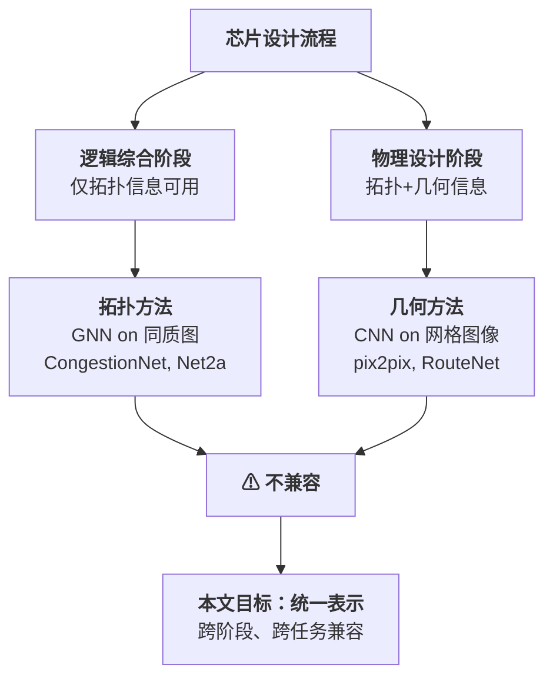
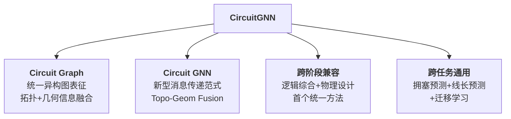
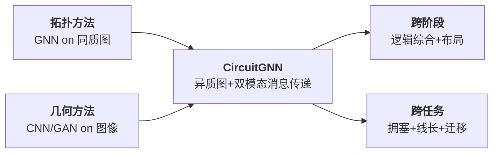
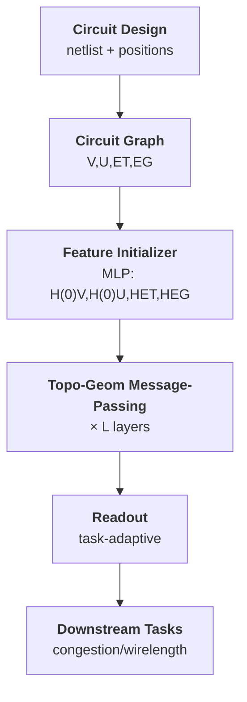

# Day 20: CircuitGNN —— 通用多阶段图神经网络电路表示学习

> **论文标题**: Versatile Multi-stage Graph Neural Network for Circuit Representation
>
> **作者**: Shuwen Yang, Zhihao Yang, Dong Li, Yingxue Zhang, Zhanguang Zhang, Guojie Song*, Jianye HAO*
>
> **机构**: School of Intelligence Science and Technology, Peking University; School of Software and Microelectronics, Peking University; Huawei Noah's Ark Lab
>
> **会议**: Advances in Neural Information Processing Systems 35 (NeurIPS 2022) — Main Conference Track
>
> **年份**: 2022
>
> **DOI/Proceedings**: [NeurIPS 2022 Proceedings](https://proceedings.neurips.cc/paper_files/paper/2022/hash/7fa548155f40c014372146be387c4f6a-Abstract-Conference.html)
>
> **引用数**: 76+ (Google Scholar)
>
> **分析日期**: 2026-06-11
>
> **系列定位**: Day 13-19 的拥塞预测论文均为**任务特定**的专用模型（为拥塞预测专门设计架构）。本文则实现了从"**专用模型**"到"**通用表示**"的范式跃迁——首次提出统一的异构图表示（Circuit Graph）和通用 GNN 框架（Circuit GNN），学习到的电路表示可迁移到拥塞预测、线长预测等多种下游任务，且跨逻辑综合和物理设计两个阶段。这是 EDA 领域向"基础模型（foundation model）"思路迈出的早期探索。

---

## 目录

1. [背景与动机](#1-背景与动机)
2. [核心贡献概述](#2-核心贡献概述)
3. [相关工作](#3-相关工作)
4. [Circuit Graph：统一异构图表示](#4-circuit-graph统一异构图表示)
5. [Circuit GNN：多阶段消息传递框架](#5-circuit-gnn多阶段消息传递框架)
6. [问题建模与形式化](#6-问题建模与形式化)
7. [实验结果与分析](#7-实验结果与分析)
8. [迁移学习实验](#8-迁移学习实验)
9. [消融与讨论](#9-消融与讨论)
10. [创新点深度分析](#10-创新点深度分析)
11. [从专用模型到通用表示：拥塞预测演进对比](#11-从专用模型到通用表示拥塞预测演进对比)
12. [结论与未来方向](#12-结论与未来方向)
13. [参考文献](#13-参考文献)

---

## 1. 背景与动机

### 1.1 EDA 中的信息孤岛问题

集成电路设计流程（图 1）包含多个阶段：系统规格说明、架构设计、功能与逻辑设计、逻辑综合、布局布线、制造封装。在芯片设计过程中，会遇到来自不同阶段的多样化、异质性信息源，其中最重要的两类是：

| 信息类型 | 来源阶段 | 内容 |
|---------|---------|------|
| **拓扑信息** (Topological) | 逻辑综合阶段即可得 | 网表（Netlist）：cells（电子单元）和 nets（连接关系/超边），以及 cell 类型、逻辑关系 |
| **几何信息** (Geometrical) | 布局后可得 | 单元的物理位置（$p_x, p_y$）、空间邻近关系 |

论文指出核心痛点：**每个信息源独立处理是次优的**。现有方法要么只使用拓扑信息（基于图的 GNN 方法），要么只使用几何信息（基于图像的 CNN 方法），两者未能有效融合。



### 1.2 现有方法的三大局限

| 局限 | 说明 | 代表方法 |
|------|------|---------|
| **跨阶段不兼容** | 拓扑方法只工作在逻辑综合阶段，几何方法只工作在布局后阶段 | CongestionNet vs LHNN |
| **任务专用性** | 每个方法为特定任务设计，无法迁移到其他任务 | Net2a 只预测线长 |
| **异构信息丢失** | 拓扑方法将二部图简化为同质图，丢失 cell/net 的异质性 | GAT/GCN 简化处理 |

### 1.3 "Shift-Left" 愿景

论文强调 EDA 的"shift-left"趋势：在设计的早期阶段（逻辑综合）就能预测后期物理设计的质量（如拥塞、时序），从而减少设计迭代。这需要一个**跨阶段的统一表示**——这正是 Circuit Graph 的设计动机。

> **核心洞察**：如果能在逻辑综合阶段就拥有一个能够编码位置信息的表示框架，那么后期物理指标（拥塞、线长）就能在早期被预测，避免不必要的设计迭代。在有布局信息时，这个框架又能自然融入几何信息进行更精细的预测。

---

## 2. 核心贡献概述



三大核心贡献：

1. **Circuit Graph（统一表示）**：首次将拓扑信息（cells/nets/topo-edges）和几何信息（geom-edges）融合为一个异构图，兼容逻辑综合（无几何信息）和布局后（有几何信息）两个阶段。这是据作者所知，首个可跨 EDA 任务和阶段的统一电路表示方法。

2. **Circuit GNN（新型消息传递）**：设计了对拓扑边和几何边分别进行消息传递、然后融合（MaxPooling）的两阶段消息传递范式。该范式的推理时间与电路规模线性，具有最优效率。

3. **SOTA 性能**：在逻辑综合阶段拥塞预测上超过最优方法 16.7%；在布局阶段拥塞预测上，比当时 SOTA 方法 LHNN 平均提升 5.6%，且速度达到 10 倍；在线长预测任务上误差降低 16.9%；在迁移学习实验中展示出优越的可迁移性。

---

## 3. 相关工作

### 3.1 拓扑方法（Topological Methods）

| 方法 | 年份 | 会议 | 技术路线 | 关键特征 | 局限 |
|------|------|------|---------|---------|------|
| CongestionNet [5] | 2019 | VLSI-SoC | 多层 GAT 架构 | 专门为拥塞预测设计的 deep GAT，在逻辑综合阶段预测 cell 级拥塞 | 仅拓扑，无几何；任务专用 |
| GCN/GAT/GraphSAGE [11][25][26] | 2017-2018 | ICLR/NIPS | 通用 GNN | 将网表转为同质图（cell-oriented 或 net-oriented） | 简化导致异构信息丢失 |
| Net2f/Net2a [12] | 2022 | TCAD | 定制 GNN | 布局前线长和时序预测，设计专用汇聚函数 | 仅拓扑；任务专用 |
| MPNN [10] | 2017 | ICML | 边函数消息传递 | 理论上可处理异构边，但边函数计算昂贵 | 推理慢（5x），未优化边函数 |

**拓扑方法的共同缺陷**：
- 将 cell-net 二部图简化为同质图（图2(c)(d)），忽略了 cell 和 net 的异质性
- 无法利用布局后的几何信息
- 通常为特定任务定制架构

### 3.2 几何方法（Geometrical Methods）

| 方法 | 年份 | 会议 | 技术路线 | 关键特征 | 局限 |
|------|------|------|---------|---------|------|
| RouteNet [13] | 2018 | ICCAD | CNN (ResNet-18) | 首次将 CNN 引入可布线性预测，将电路转为 RGB 通道图像 | 仅图像级，忽略拓扑结构 |
| pix2pix/cGAN [8][9] | 2019 | DAC/MLCAD | 条件 GAN + 图像翻译 | 用生成式模型预测拥塞图 | 纯图像方法，无拓扑建模 |
| LHNN [14] | 2022 | DAC | 格超图神经网络 | 将电路转为格网络（lattice network），每个网格为内部节点，每个 net 为外部节点，融合几何与部分拓扑信息 | 仅拥塞预测；仅布局阶段 |

**几何方法的共同缺陷**：
- 需要布局后信息，无法在逻辑综合阶段使用
- 对 cell 级（instance-level）任务不感知
- 拓扑信息的建模不够充分

### 3.3 本文方法与既有工作的关系



---

## 4. Circuit Graph：统一异构图表示

### 4.1 电路特征化

电路设计最初表示为网表（netlist），由 cells $V$ 和 nets $U$ 组成。特征矩阵定义如下：

- $X_V$：cell 特征矩阵，主要包含 cell 的尺寸（size）和度（degree to net）
- $X_U$：net 特征矩阵，存储 net span 和度（degree to cell）
- $P \subseteq V \times U$：pins，表示 cell 和 net 之间的二部拓扑连接
- $X_P$：pin 特征矩阵，保留交互细节（如信号方向：input/output）
- $p_x, p_y$：布局后 cell 的位置坐标，是主要的几何信息来源

### 4.2 现有两种特征化方法的对比

**定义 1（几何驱动的电路特征化）**：

$$F_G = \{X_{gr}\}$$

其中 $X_{gr} \in \mathbb{R}^{C_x \times C_y \times D_{gr}}$ 是网格特征矩阵，$C_x, C_y$ 为网格的列数和行数，$D_{gr}$ 为网格原始特征维度。网格特征 $X_{gr}$ 主要包括 pin density 和 net density。由于 $X_{gr}$ 结构与 RGB 图像通道相似，可以用 CV 模型（如 CNN）处理。

**定义 2（拓扑驱动的电路特征化）**：

$$F_T = \{V, U, P, X_V, X_U, X_P\}$$

其中 cells $V$ 和 nets $U$ 为两类顶点，pins $P$ 为连接它们的边。

> **关键观察**：$F_T$ 通常被简化为同质图再喂给 GNN（如 GAT）。这种简化导致异构信息丢失——GNN 不再区分 cell 和 net 是不同类型节点。

### 4.3 Circuit Graph 的正式定义

为同时受益于两种特征化方式，论文提出将拓扑和几何信息编码进统一异构图。

**构图过程**（图 3）：

1. **topo-edge 构造**：将 pins 作为 topo-edges，即 $E_T = P$，$X_{E_T} = X_P$
2. **geom-edge 构造**：链接几何上邻近的 cell 对，用 shifted windows（Swin Transformer 的窗口划分机制）将 cells 按窗口大小 $(w_x, w_y)$ 分割，每个 cell 最多与同窗口内相邻的 $c$ 个 cell 链接（$c$ 称为 "link capacity"），存储 cell-pair 距离于特征矩阵 $X_{E_G}$
3. 合并得到 Circuit Graph

**定义 3（Circuit Graph）**：

$$G = \{V, U, E_T, E_G, X_V, X_U, X_{E_T}, X_{E_G}\}$$

其中：
- $V$：cells 集合（顶点类型 1）
- $U$：nets 集合（顶点类型 2）
- $E_T \subseteq V \times U$：topo-edges（pin 连接 cell 和 net）
- $E_G \subseteq V \times V$：geom-edges（cell-cell 空间邻近连接）
- $X_V, X_U, X_{E_T}, X_{E_G}$：各元素对应的特征矩阵

### 4.4 Shifted Windows 的几何边构造（附录 B.1）

为避免计算所有 $O(|V|^2)$ cell-pair 距离，论文采用 shifted windows 策略将时间降至 $O(|V|)$：

**算法 1：Shifted Windows 几何边构造**

```
输入: cells 位置 {(p_x(v), p_y(v)) | v ∈ V}，窗口大小 (w_x, w_y)，link capacity c
输出: geom-edges E_G 及其特征 X_{E_G}

步骤:
1. 将电路板划分为大小为 (w_x, w_y) 的非重叠窗口
2. 将窗口水平和垂直偏移 (w_x/2, w_y/2)，得到 shifted windows
3. 对每个窗口 E_G ← ∅
4. 对窗口内的每对 cell (v, v*)，计算欧几里得距离 d(v, v*)
5. 对每个 cell v，仅保留距离最近的 c 个邻居加入 E_G
6. X_{E_G}(v, v*) ← d(v, v*) （存储距离作为边特征）
7. 返回 E_G, X_{E_G}
```

**复杂度分析**：构造 Circuit Graph 的总时间复杂为 $O(|V| + |U| + |P|)$，与电路规模线性（附录 B.2 提供了严格证明）。

### 4.5 跨阶段兼容性

| 阶段 | 可用信息 | EG 处理 |
|------|---------|---------|
| **逻辑综合阶段**（预布局） | 仅 $V, U, E_T$ 及特征 | $E_G = \emptyset$，geom 消息传递不影响模型运行 |
| **物理设计阶段**（布局后） | 全部 $V, U, E_T, E_G$ 及特征 | 正常使用 geom-edges |

> **设计精妙之处**：geom-edges 的缺失不会禁用 topo-edges 的消息传递——拓扑信息仍可被完整收集。这使 Circuit Graph 自然兼容逻辑综合阶段的电路。

---

## 5. Circuit GNN：多阶段消息传递框架

### 5.1 整体架构



Circuit GNN 的推理流程：

1. **初始化**：通过 MLP 将原始特征 $X_V, X_U, X_{E_T}, X_{E_G}$ 映射到隐藏表示 $H^{(0)}_V, H^{(0)}_U, H_{E_T}, H_{E_G}$
2. **消息传递**：经过 $L$ 层 Topo-Geom 消息传递
3. **读出**：通过任务自适应的 Readout 层输出预测

### 5.2 Topo-Geom 消息传递（核心创新）

每一层消息传递分为三个步骤：拓扑消息传递、几何消息传递、融合与更新。

#### 5.2.1 拓扑消息传递（Topological Message-Passing）

拓扑消息在 cells $V$ 和 nets $U$ 之间通过 topo-edges $E_T$ 传输：

$$M^{(l),\text{topo}}_V = \Phi^{E_T \rightarrow V}_{\text{msg}}(U, E_T, H^{(l)}_U, H_{E_T}) \tag{1}$$

$$M^{(l)}_U = \Phi^{V \rightarrow U}_{\text{msg}}(V, E_T, H^{(l)}_V, H_{E_T}) \tag{1 续}$$

其中：
- $l$ 为当前层号
- $\Phi^{E_T \rightarrow V}_{\text{msg}}$：从 nets $U$ 向 cells $V$ 收集拓扑消息（经由 topo-edges）
- $\Phi^{V \rightarrow U}_{\text{msg}}$：从 cells $V$ 向 nets $U$ 收集拓扑消息
- $H^{(l)}_U, H^{(l)}_V$：第 $l$ 层的 net 和 cell 表示

#### 5.2.2 $\Phi^{V \rightarrow U}_{\text{msg}}$ 的详细设计（公式 5）

受 SchNet [17] 启发，对每个 net $u$，融合周围 cells 和 topo-edges 的表示：

$$\Phi^{V \rightarrow U}_{\text{msg}}(\{(h^V_v, h^{E_T}_{(v,u)}) | (v, u) \in E_T\}) = \sum_{(v,u)\in E_T} (W^{E_T \rightarrow U} h^{E_T}_{(v,u)}) \odot (W^{V \rightarrow U} h^V_v) \tag{5}$$

符号解释：
- $h^V_v$：cell $v$ 的表示向量
- $h^{E_T}_{(v,u)}$：topo-edge 连接 $(v, u)$ 的表示向量
- $W^{V \rightarrow U}, W^{E_T \rightarrow U}$：可学习的权重矩阵
- $\odot$：逐元素乘法（element-wise multiplication）
- 使用 $\odot$（而非加法）可使 topo-edge 表示起到"门控"作用——调制 cell 信息流向 net

#### 5.2.3 $\Phi^{E_T \rightarrow V}_{\text{msg}}$ 的简化设计（公式 6）

由于 topo-edge 的表示已在 $\Phi^{V \rightarrow U}_{\text{msg}}$ 中收集，反向消息传递仅考虑 net 的表示以加速：

$$\Phi^{E_T \rightarrow V}_{\text{msg}}(\{h^U_u | (v, u) \in E_T\}) = \sum_{(v,u)\in E_T} W^{U \rightarrow V} h^U_u \tag{6}$$

这是一个故意的简化——省略 topo-edge 权重以减少计算量，开销为 $O(|E_T|F_U F_V)$，相比公式 5 的 $O(|E_T|(F_{E_T}F_U + F_V F_U + F_U))$ 更高效。

#### 5.2.4 几何消息传递（公式 2 和 7）

几何消息在 cells 之间通过 geom-edges $E_G$ 传输：

$$M^{(l),\text{geom}}_V = \Phi^{E_G \rightarrow V}_{\text{msg}}(V, E_G, H^{(l)}_V, H_{E_G}) \tag{2}$$

详细设计（公式 7）——使用 geom-edge 表示计算边权重：

$$\Phi^{E_G \rightarrow V}_{\text{msg}}(\{(h^V_{v^*}, h^{E_G}_{(v,v^*)}) | (v, v^*) \in E_G\}) = \sum_{(v,v^*)\in E_G} (a^\top h^{E_G}_{(v,v^*)}) \cdot W^{V \rightarrow V} h^V_{v^*} \tag{7}$$

符号解释：
- $h^V_{v^*}$：邻居 cell $v^*$ 的表示
- $h^{E_G}_{(v,v^*)}$：geom-edge 的表示（存储 cell 间距离）
- $a$：可学习的权重**向量**（将标量距离映射为注意力权重）
- $a^\top h^{E_G}_{(v,v^*)}$：计算出的标量边权重（距离越近，权重越大）
- $W^{V \rightarrow V}$：可学习的权重矩阵

> **设计直觉**：geom-edge 的特征（cell 间距离）被转化为注意力权重，使得空间上更近的 cells 在消息传递中权重更大——这是空间局部性的显式编码。

#### 5.2.5 融合与更新（公式 3 和 4）

$$M^{(l)}_V = \text{MaxPooling}(M^{(l),\text{geom}}_V, M^{(l),\text{topo}}_V) \tag{3}$$

$$H^{(l+1)}_V = \Phi_{\text{update}}(H^{(l)}_V, M^{(l)}_V), \quad H^{(l+1)}_U = \Phi_{\text{update}}(H^{(l)}_U, M^{(l)}_U) \tag{4}$$

其中更新函数定义为：
$$\Phi_{\text{update}}(H, M) = H + \text{Tanh}(M)$$

- **MaxPooling 融合**：对拓扑和几何消息逐元素取最大值，保留两个信息源中最显著的特征
- **Tanh + 残差连接**：$\text{Tanh}(M)$ 将消息限制在 $[-1, 1]$，避免梯度爆炸，残差连接（$H + \cdot$）促进梯度流动

#### 5.2.6 推理时间分析

| 组件 | 时间复杂度 |
|------|-----------|
| $\Phi^{V \rightarrow U}_{\text{msg}}$ | $O(\|E_T\|(F_{E_T}F_U + F_V F_U + F_U))$ |
| $\Phi^{E_T \rightarrow V}_{\text{msg}}$ | $O(\|E_T\|F_U F_V)$ |
| $\Phi^{E_G \rightarrow V}_{\text{msg}}$ | $O(\|E_G\|(F_{E_G} + F_V^2))$ |
| 融合 (MaxPooling) | $O(\|V\|F_V)$ |
| 更新 | $O(\|V\|F_V + \|U\|F_U)$ |

由于维度是常数（$F_V=64, F_U=128, F_{E_T}=8, F_{E_G}=4$），且 $|E_T| = O(|P|), |E_G| = O(|V|)$（附录 B.2），单层总推理时间为 $O(|V| + |U| + |P|)$，与 Circuit Graph 规模线性。

### 5.3 任务自适应 Readout

经过 $L$ 层消息传递后，cell 和 net 的表示 $H^{(L)}_V, H^{(L)}_U$ 被读出以处理不同的下游任务。

#### 5.3.1 Cell-level 和 Net-level 任务（公式 8）

$$\hat{y}_{\text{cell}} = \text{MLP}(H^{(L)}_V \oplus X_V), \quad \hat{y}_{\text{net}} = \text{MLP}(H^{(L)}_U \oplus X_U) \tag{8}$$

- $\oplus$：拼接操作（concatenation）——将学习到的表示与原始特征拼接，增强信息
- MLP：多层感知机，将拼接后的特征映射到预测值
- 用于 cell 级拥塞预测、net 级线长预测等

#### 5.3.2 Grid-level 任务（公式 9）

对于 grid 级任务（如网格级拥塞图预测），模型需要生成每个 grid 的输出表示：

$$\hat{y}_{\text{grid}} = \text{MLP}(\hat{M} H^{(L)}_V) \tag{9}$$

其中 $\hat{M} \in \mathbb{R}^{C_x \times C_y \times |V|}$ 是变换矩阵，满足 $\sum_k \hat{M}_{i,j,k} = 1, \forall i, j$。

- $\hat{M}$ 将 cell 表示通过 mean-pooling 映射到 grid 表示——每个 grid 的输出是其内部所有 cells 表示的均值
- 这个设计使得可以只用 grid 级标签训练，而模型自然地学习 cell 级表示

---

## 6. 问题建模与形式化

### 6.1 拥塞预测（Congestion Prediction）

**定义**：在详细布线阶段之前预测布线拥塞。拥塞预测让布局工具能快速反馈布局质量，避免产生不可布线的布局方案。

**两个场景**：

| 场景 | 可用信息 | 预测粒度 | 评估指标 |
|------|---------|---------|---------|
| 逻辑综合阶段 | 仅拓扑 | Cell 级 + Grid 级 | Pearson/Spearman/Kendall 相关系数 |
| 布局后阶段 | 拓扑 + 几何 | Cell 级 + Grid 级 | 同上 + Precision/Recall/F1-score |

**数据集**：ISPD 2011，包含 12 个 VLSI 设计。10 个用于训练，design #18 验证，#19 测试。使用 DREAMPlace [18] 放置 cells 并初始化原始特征；NCTU-GR 2.0 [23] 生成网格级拥塞标签。Cell 级拥塞标签设为其所在 grid 的值。

**评估指标**：
- **相关系数**：Pearson（线性相关）、Spearman（秩相关）、Kendall（序相关）
- **二分类指标**：拥塞值分为 $[0, 0.9]$（非拥塞）和 $(0.9, \infty)$（拥塞），计算 Precision/Recall/F1-score

### 6.2 线长预测（Net Wirelength Prediction）

**定义**：预测每条 net 的布线长度，是芯片最终性能的重要指标。

**目标**：使用半周长线长（HPWL, Half-Perimeter Wirelength）作为线长估计量，这是最常用的线长计算方法。

**数据集**：DAC 2012，7 个设计用于训练，design #16 验证，#19 测试。DREAMPlace [18] 生成目标标签。

**预处理**：目标值范围 $[0, \sim 25\text{k}]$，取 $\log_{10}$ 平滑分布。

**评估指标**：Pearson/Spearman/Kendall 相关系数，以及 MAE（Mean Average Error）和 RMSE（Root Mean Square Error）。

### 6.3 迁移任务（Transfer Task）

**定义**：首先在拥塞预测任务上训练 Circuit GNN/LHNN，然后在保持或微调 GNN 参数的情况下，在线长预测任务上评估。

**实验设置**：
- **Evaluate 模式**：冻结 GNN 参数，仅从头训练 Readout 模块
- **Fine-tune 模式**：GNN 参数可微调，Readout 从头训练
- 两种模式均只训练默认设置的 $1/5$ epoch，以测试特征的迁移能力

---

## 7. 实验结果与分析

### 7.1 实验设置详情

| 超参数 | 值 |
|--------|-----|
| 隐藏层维度 $(F_V, F_U, F_{E_T}, F_{E_G})$ | $(64, 128, 8, 4)$ |
| 消息传递层数 $L$ | 2 |
| 窗口大小 $(w_x, w_y)$ | $(32, 40)$ |
| Link capacity $c$ | 5 |
| 优化器 | Adam |
| 学习率 $\gamma$ | 0.0002 |
| 学习率衰减 $\Delta\gamma$ | 0.02 |
| 权重衰减 $\eta$ | 0.0002 |
| 训练 epoch | 100 |

### 7.2 逻辑综合阶段拥塞预测（Table 1）

**场景**：几何信息不可用，仅使用拓扑信息（等效于 Ours w/o. geom.）。

| 方法 | Time (s/epoch) | Cell-level Pearson | Cell-level Spearman | Cell-level Kendall | Grid-level Pearson | Grid-level Spearman | Grid-level Kendall |
|------|------|------|------|------|------|------|------|
| GCN | 9.43 | 0.777 | 0.265 | 0.199 | 0.221 | 0.366 | 0.260 |
| GraphSAGE | 11.79 | 0.776 | 0.252 | 0.188 | 0.208 | 0.375 | 0.268 |
| GAT | 13.90 | 0.777 | 0.267 | 0.200 | 0.215 | 0.399 | 0.280 |
| CongestionNet | 22.31 | 0.777 | 0.269 | 0.200 | 0.277 | 0.394 | 0.280 |
| MPNN | 116.24 | 0.780 | 0.289 | 0.217 | 0.292 | 0.458 | 0.319 |
| **Ours (w/o. geom.)** | **21.62** | **0.779** | **0.289** | **0.217** | **0.315** | **0.468** | **0.329** |

**关键发现**：
1. **Cell-level**：Ours (w/o. geom.) 与 MPNN 并列最优（Spearman 0.289, Kendall 0.217），但速度快 $5\times$
2. **Grid-level**：Ours (w/o. geom.) 在所有 grid 指标上全面超越所有基线，比 CongestionNet 的 grid-level Kendall 提升 $17.5\%$（0.329 vs 0.280）
3. **效率对比**：比 MPNN 快 5.4x（21.62 vs 116.24 s/epoch），与简单 GAT 相当——这是因为 MPNN 的边函数计算昂贵但未充分利用

### 7.3 布局阶段拥塞预测（Table 2）

**场景**：拓扑+几何信息全部可用。

| 方法 | Time (s/epoch) | Cell-level Pearson | Cell-level Spearman | Cell-level Kendall | Grid-level Pearson | Grid-level Spearman | Grid-level Kendall |
|------|------|------|------|------|------|------|------|
| GAT (w. geom.) | 16.21 | 0.777 | 0.263 | 0.197 | 0.210 | 0.397 | 0.279 |
| pix2pix | 4.46 | — | — | — | 0.562 | 0.554 | 0.392 |
| LHNN | 305.47 | — | — | — | 0.703 | 0.695 | 0.540 |
| Ours (w/o. topo.) | 21.54 | 0.883 | 0.713 | 0.573 | 0.684 | 0.730 | 0.536 |
| **Ours** | **27.07** | **0.887** | **0.714** | **0.575** | **0.697** | **0.770** | **0.577** |

**关键发现**：
1. **vs LHNN（当时 SOTA）**：Grid-level 上 Ours 的 Spearman 0.770 vs LHNN 0.695（$+10.8\%$）；Kendall 0.577 vs 0.540（$+6.9\%$）
2. **Cell-level 表现**：Pearson 0.887, Spearman 0.714, Kendall 0.575 —— 远超 GAT (w. geom.)
3. **速度优势**：Ours 27.07 s/epoch vs LHNN 305.47 s/epoch —— **10x 加速**
4. **消融分析**：Ours (w/o. topo.) 仍表现良好（Spearman 0.730），但完整模型（Ours）最优，证明拓扑+几何融合的必要性

### 7.4 拥塞图可视化（Figure 5）

**描述**：Figure 5 展示了 ispd2011/superblue19 电路在不同方法下的拥塞图可视化对比。

| 子图 | 方法 | 观察 |
|------|------|------|
| (a) | Input | 输入特征图 |
| (b) | pix2pix | 预测模糊，细节丢失 |
| (c) | LHNN | 较清晰的预测，但仍有边界伪影 |
| (d) | Ours | **最清晰**的预测，与 ground-truth 最接近 |
| (e) | Ground-truth | 参考标准 |

**结论**：与基于视觉的方法（pix2pix）和格网络方法（LHNN）相比，Circuit GNN 生成的拥塞预测具有更好的可辨识度（discriminability）和更精细的结构。

### 7.5 线长预测结果（Table 3）

**场景**：布局后阶段，Net-level 回归任务。

| 方法 | Time (s/epoch) | Pearson | Spearman | Kendall | MAE ↓ | RMSE ↓ |
|------|------|------|------|------|------|------|
| MLP | 2.22 | 0.493 | 0.547 | 0.415 | 0.626 | 0.819 |
| Net2f | 10.42 | 0.517 | 0.635 | 0.525 | 0.615 | 0.825 |
| Net2a | 19.83 | 0.632 | 0.656 | 0.553 | 0.614 | 0.821 |
| LHNN | 260.00 | 0.801 | 0.796 | 0.603 | 0.581 | 0.780 |
| **Ours** | **14.79** | **0.848** | **0.835** | **0.646** | **0.483** | **0.683** |

**关键发现**：
1. **全面超越**：所有指标上最优 —— Pearson 0.848（vs 次优 LHNN 0.801），RMSE 降低 $12.4\%$
2. **vs 任务专用方法**：Net2f/Net2a 是专门为线长预测设计的 GNN，但 Ours（通用模型）在所有指标上超越它们
3. **MAE 增益**：0.483 vs Net2a 0.614 —— $21.4\%$ 误差降低
4. **速度**：14.79 s/epoch，与 Net2a (19.83) 相当但远快于 LHNN (260.00)

### 7.6 线长预测散点图（Figure 6）

**描述**：散点图展示各方法输出（y 轴）与真值（x 轴）的关系。Ours 在 $\log_{10}$ 空间中点最贴合 $y=x$ 直线，表明预测最准确、方差最小。

| 子图 | 方法 | 观察 |
|------|------|------|
| (a) MLP | 离散度大，低值区偏斜严重 |
| (b) Net2f | 较 MLP 改善，但仍有偏差 |
| (c) Net2a | 进一步改善，但尾部分散 |
| (d) LHNN | 整体较好，高值区仍有偏差 |
| (e) Ours | **最贴合 y=x**，分布最紧凑 |

---

## 8. 迁移学习实验（Table 4）

**设置**：从拥塞预测迁移到线长预测，评估 learned representation 的可迁移性。

| 方法 | Time (s/epoch) | Pearson | Spearman | Kendall |
|------|------|------|------|------|
| MLP | 2.22 | 0.493 | 0.547 | 0.415 |
| LHNN (evaluate) | 192.45 | 0.689 | 0.715 | 0.563 |
| **Ours (evaluate)** | **9.55** | **0.799** | **0.811** | **0.622** |
| LHNN (fine-tune) | 248.96 | 0.805 | 0.794 | 0.612 |
| **Ours (fine-tune)** | **14.80** | **0.842** | **0.829** | **0.639** |
| LHNN (full train) | 260.00 | 0.801 | 0.796 | 0.603 |
| Ours (full train) | 14.79 | 0.848 | 0.835 | 0.646 |

**关键发现**：

1. **冻结评估（evaluate）**：Ours 冻结特征直接使用（仅训练 Readout）即达到 Spearman 0.811，远超 LHNN evaluate (0.715) 和 MLP (0.547)。这说明 Circuit GNN 学到的表示具有**极强的跨任务泛化能力**。

2. **微调（fine-tune）**：仅微调 $1/5$ epoch，Ours 达到 Spearman 0.829，已接近全量训练的 0.835。LHNN fine-tune 仅 0.794，甚至低于其 evaluate 模式的 0.715→0.794 提升幅度也有限。

3. **效率**：Ours evaluate 仅需 9.55 s/epoch —— 比 LHNN evaluate 快 $20\times$。

4. **核心洞察**：LHNN 的特征表示**不可迁移**——其表示过度专用化于拥塞预测。而 Circuit GNN 的表示是**通用**的，可以从拥塞预测中学到对线长预测也有用的电路结构知识。

---

## 9. 消融与讨论

### 9.1 模块消融

**Ours (w/o. geom.) vs Ours (w/o. topo.) vs Ours**：

| 变体 | 逻辑综合阶段 | 布局阶段 |
|------|------------|---------|
| Ours (w/o. geom.) | 无 geom-edges → 仅拓扑 | — |
| Ours (w/o. topo.) | — | 无 topo-edges → 仅几何 |
| Ours | — | 完整拓扑+几何 |

从 Table 1 和 Table 2 可知：仅拓扑（逻辑综合阶段）已在 grid 级上超过所有基线；添加几何信息后（布局阶段）进一步提升（Kendall 0.329 → 0.577）；仅几何（w/o. topo.）在布局阶段也表现不错但不及完整模型。**拓扑和几何信息是互补的**。

### 9.2 参数敏感性分析（附录 C）

论文在附录 C 中测试了窗口大小 $(w_x, w_y)$ 和 link capacity $c$ 的敏感性，结论是模型对这些参数**不敏感**——在一定范围内变化对性能影响很小，展示了模型的鲁棒性。

### 9.3 模型敏感性分析（附录 D）

论文在附录 D 中证明了模型对初始化、数据扰动等因素的稳定性。

### 9.4 局限性

| 局限 | 说明 |
|------|------|
| **学术-工业落差** | 尽管 AI for EDA 是热门方向且已有深度学习技术被主流 EDA 工具（Cadence, Synopsys）采用，但新型 ML 算法与商业工具之间仍存在鸿沟 |
| **早期 EDA 阶段的兼容性** | 在更早的 EDA 阶段可能使用数据流图（data-flow graph）或 AIG 图（And-Inverter Graph），这些图中节点和边的语义与本文使用的网表图不同，方法可能不适用 |
| **社会影响** | 本文的双阶段电路表示服务于各种 EDA 下游任务，社会影响有限，但存在极小的误用可能性 |

---

## 10. 创新点深度分析

### 10.1 统一的异构图表示

**创新程度**：★★★★★（范式级创新）

这是据作者所知首个可同时兼容逻辑综合和物理设计两个阶段、多种下游任务的统一电路表示方法。之前的电路表示要么是"同质图（丢异构信息）"要么是"网格图像（丢拓扑结构）"。

**技术要点**：
- 保留 cell-net 二部异构性（不简化为同质图）
- topo-edges 编码 pin 级信号方向，geom-edges 编码空间距离
- shifted windows 降低几何边构造复杂度
- $E_G = \emptyset$ 的自然降级使逻辑综合阶段自动兼容

### 10.2 双模态消息传递与融合

**创新程度**：★★★★☆（机制创新）

独立处理拓扑消息和几何消息，然后通过 MaxPooling 融合的设计，相比简单将所有边类型统一处理的异构图 GNN（如 RGCN），具有以下优势：
- **模态感知的边函数**：topo-edge 和 geom-edge 使用不同的消息函数（公式 5/6 vs 公式 7）
- **选择性信息保留**：MaxPooling 自然实现了跨模态特征的竞争选择
- **计算效率**：topo-to-cell 方向省略边表示（公式 6），减少冗余计算

### 10.3 任务自适应 Readout

**创新程度**：★★★☆☆（工程创新）

通过变换矩阵 $\hat{M}$ 将 cell 表示映射到 grid 表示（公式 9），使得模型可以接受 grid 级监督信号同时学习 cell 级表示。这解决了"grid 级任务（如拥塞图）与 cell 级表示之间的不一致"问题。

### 10.4 跨任务迁移能力

**创新程度**：★★★★☆（能力验证）

迁移实验证明了 Circuit GNN 表示的通适性——这一点此前无人验证。LHNN 无法有效迁移，说明之前方法的表示是"死"的（任务过拟合）；Circuit GNN 的表示是"活"的（可重用）。

### 10.5 理论效率保证

**创新程度**：★★★☆☆（理论贡献）

论文在附录 B 中严格证明了 Circuit Graph 构造和 Circuit GNN 推理均为 $O(|V|+|U|+|P|)$ —— 与电路规模线性。这是实际可部署性的重要保证。

---

## 11. 从专用模型到通用表示：拥塞预测演进对比

| 维度 | Day 13<br/>ClusterNet | Day 15<br/>RouteNet | Day 16<br/>LHNN | Day 17<br/>NAS-Routability | Day 18<br/>cGAN | Day 19<br/>PROS | **Day 20<br/>CircuitGNN** |
|------|------|------|------|------|------|------|------|
| **年份** | 2023 | 2018 | 2022 | 2021 | 2019 | 2020 | **2022** |
| **会议** | ICCAD | ICCAD | DAC | ICCAD | DAC | ICCAD | **NeurIPS** |
| **方法类型** | GNN+聚类 | CNN | 格超图GNN | NAS自动搜索 | 条件GAN | DL+优化 | **通用异构图GNN** |
| **输入表示** | 网格图像 | 网格特征图 | 格网络 | 网格特征图 | 网格图像 | 网格+路由特征 | **Circuit Graph（拓扑+几何统一）** |
| **拓扑建模** | 无（隐含于特征） | 无 | 有限（net span） | 无 | 无 | 无 | **完整（cells/nets/pins异质图）** |
| **几何建模** | CNN 卷积 | CNN 卷积 | 格网络+超图 | NAS 搜索架构 | GAN 生成 | CNN+统计特征 | **geom-edges（显式距离编码）** |
| **跨阶段** | 仅布局 | 仅布局 | 仅布局 | 仅布局 | 仅布局 | 仅布局 | **逻辑综合+布局** |
| **跨任务** | 仅拥塞 | 可布线性+DRC | 仅拥塞 | 拥塞+DRC | 仅拥塞 | 仅拥塞优化 | **拥塞+线长+迁移** |
| **任务专用性** | 专用 | 专用 | 专用 | 专用 | 专用 | 专用 | **通用** |
| **Cell级感知** | 否 | 否 | 否 | 否 | 否 | 否 | **是** |
| **迁移能力** | 未测试 | 未测试 | 弱（论文证明） | 未测试 | 未测试 | 未测试 | **强（冻结即0.811 Spearman）** |
| **推理速度** | - | 快（CNN） | 慢 (305 s/epoch) | 快（自动搜索） | 快 | 快 | **快（27 s/epoch, 10x LHNN）** |
| **可解释性** | 聚类可视化 | 特征图 | 格结构可视化 | NAS 架构分析 | 生成图 | 优化轨迹 | **图结构可分析** |
| **范式定位** | 专用模型 | 专用模型 | 专用模型 | 自动设计 | 生成式 | 预测驱动优化 | **通用表示基础模型** |

### 演进脉络总结

```
2018 RouteNet ──→ 2019 cGAN ──→ 2020 PROS ──→ 2021 NAS-Routability ──→ 2022 LHNN ──→ 2023 ClusterNet
   CNN首次引入    生成式方法   预测驱动优化    自动架构搜索     拓扑+几何融合     GNN+聚类

                                    ↓ 范式跃迁 ↓

                      2022 CircuitGNN (NeurIPS)
              从"为每个任务设计专用模型"到"学习通用电路表示"
         → 一次训练，多任务共享 → 特征可迁移 → 跨阶段兼容 → 线性效率
```

---

## 12. 结论与未来方向

### 12.1 论文结论

CircuitGNN 提出了首个通用的电路图神经网络表示框架，包含两个核心组件：

1. **Circuit Graph**：将拓扑信息（cells/nets/pins）和几何信息（cell 位置距离）统一编码为异构图
2. **Circuit GNN**：通过独立的拓扑/几何消息传递 + MaxPooling 融合进行表示学习

实验在拥塞预测和线长预测两个代表性任务上均达到 SOTA，且表现出优越的跨任务迁移能力。该工作支持 EDA"shift-left"方向——通过深度结合 AI 加速全流程电路设计。

### 12.2 未来方向

论文暗示但未明确列举的方向包括：
- 扩展到更早期 EDA 阶段（数据流图、AIG 图）
- 与主流商业 EDA 工具的集成
- 更多下游任务的适配（时序分析、功耗预测、IR-drop 等）
- 大规模预训练 + 微调范式（真正的 EDA 基础模型）

---

## 13. 参考文献

1. Bustany et al. "ISPD 2015 benchmarks with fence regions and routing blockages for detailed-routing-driven placement." ISPD 2015.
2. Mirhoseini et al. "A graph placement methodology for fast chip design." Nature 594, 2021.
3. Cheng & Yan. "On joint learning for solving placement and routing in chip design." NeurIPS 2021.
4. Sánchez Lopera et al. "A survey of graph neural networks for electronic design automation." MLCAD 2021.
5. Kirby et al. "CongestionNet: Routing congestion prediction using deep graph neural networks." VLSI-SoC 2019.
6. Ghose et al. "Generalizable cross-graph embedding for GNN-based congestion prediction." ICCAD 2021.
7. Alawieh et al. "High-definition routing congestion prediction for large-scale FPGAs." ASP-DAC 2020.
8. Yu & Zhang. "Painting on placement: Forecasting routing congestion using conditional generative adversarial nets." DAC 2019.
9. Zhou et al. "Congestion-aware global routing using deep convolutional generative adversarial networks." MLCAD 2019.
10. Gilmer et al. "Neural message passing for quantum chemistry." ICML 2017.
11. Velickovic et al. "Graph attention networks." ICLR 2018.
12. Xie et al. "Pre-placement net length and timing estimation by customized graph neural network." TCAD 2022.
13. Xie et al. "RouteNet: Routability prediction for mixed-size designs using convolutional neural network." ICCAD 2018.
14. Wang et al. "LHNN: Lattice hypergraph neural network for VLSI congestion prediction." DAC 2022.
15. You et al. "Deep lattice networks and partial monotonic functions." NeurIPS 2017.
16. Liu et al. "Swin transformer: Hierarchical vision transformer using shifted windows." ICCV 2021.
17. Schutt et al. "SchNet: A continuous-filter convolutional neural network for modeling quantum interactions." NeurIPS 2017.
18. Lin et al. "DREAMPlace: Deep learning toolkit-enabled GPU acceleration for modern VLSI placement." TCAD 2021.
19. Lin & Chu. "POLAR 2.0: An effective routability-driven placer." DAC 2014.
20. Li et al. "Routability-driven placement and white space allocation." TCAD 2007.
21. Jindal et al. "Detecting tangled logic structures in VLSI netlists." DAC 2010.
22. Kudva et al. "Metrics for structural logic synthesis." ICCAD 2002.
23. Liu et al. "NCTU-GR 2.0: Multithreaded collision-aware global routing with bounded-length maze routing." TCAD 2013.
24. Caldwell et al. "On wirelength estimations for row-based placement." TCAD 1999.
25. Kipf & Welling. "Semi-supervised classification with graph convolutional networks." 2017.
26. Hamilton et al. "Inductive representation learning on large graphs." NeurIPS 2017.

---

> **分析说明**：本文分析基于 NeurIPS 2022 会议论文原文（12 页，含正文 10 页 + 附录）。作者 Shuwen Yang（北京大学智能科学与技术学院）、Zhihao Yang（北京大学软件与微电子学院）、Dong Li/Yingxue Zhang/Zhanguang Zhang/Jianye HAO（华为诺亚方舟实验室）、Guojie Song（北京大学智能科学与技术学院）。* 标注为通讯作者。该工作被引用 76+ 次（Google Scholar），是 EDA 领域通用电路表示学习的奠基性工作之一。
