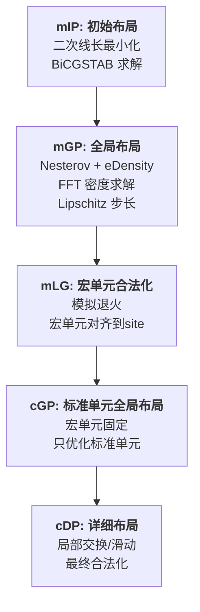
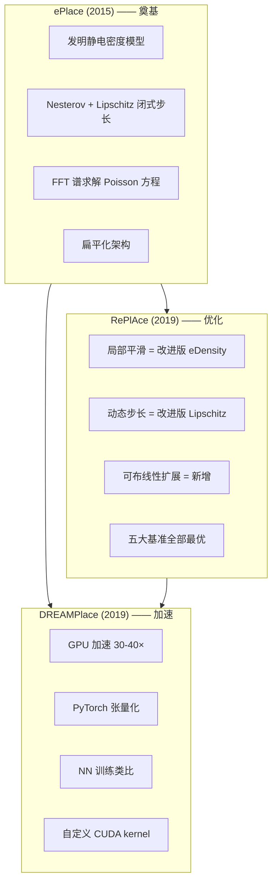

# Day 3: ePlace —— 静电布局范式的开创者

> **论文标题**: ePlace: Electrostatics-Based Placement Using Fast Fourier Transform and Nesterov's Method
>
> **作者**: Jingwei Lu, Pengwen Chen, Chin-Chih Chang, Lu Sha, Dennis Jen-Hsin Huang, Chin-Chi Teng, Chung-Kuan Cheng
>
> **机构**: University of California, San Diego (UCSD); Cadence Design Systems
>
> **期刊**: ACM Transactions on Design Automation of Electronic Systems (TODAES)
>
> **卷/期/页码**: Vol. 20, No. 2, Article 17, pp. 1–34
>
> **DOI**: [10.1145/2699873](https://dl.acm.org/doi/10.1145/2699873)
>
> **首发会议版**: DAC 2014 ("ePlace: Electrostatics Based Placement Using Nesterov's Method")
>
> **分析日期**: 2026-06-08
>
> **三部曲定位**: ePlace (2015) → RePlAce (2019) → DREAMPlace (2019)。ePlace 是静电布局范式的**发明者**——后续所有改进（局部平滑、动态步长、GPU 加速）都建立在这篇论文定义的基础框架之上。

---

## 目录

1. [历史背景：ePlace 之前的布局世界](#1-历史背景eplace-之前的布局世界)
2. [核心贡献概述](#2-核心贡献概述)
3. [静电场类比：从物理到布局](#3-静电场类比从物理到布局)
4. [数学建模](#4-数学建模)
5. [优化算法](#5-优化算法)
6. [算法流程](#6-算法流程)
7. [实验结果与分析](#7-实验结果与分析)
8. [后续延伸：ePlace-MS 与 ePlace-3D](#8-后续延伸eplace-ms-与-eplace-3d)
9. [创新点深度分析](#9-创新点深度分析)
10. [三部曲全景对比](#10-三部曲全景对比)
11. [参考文献](#11-参考文献)

---

## 1. 历史背景：ePlace 之前的布局世界

### 1.1 2014 年解析布局的格局

在 ePlace 出现之前，学术界的领先解析布局器主要包括：

| 布局器 | 机构 | 核心方法 | 主要局限 |
|--------|------|---------|---------|
| **APlace3** | UCSD | 非线性优化 + CG | 多层聚类丢失精度 |
| **NTUplace3** | NTU | 解析 + 详细布局 | 多层框架，密度模型粗糙 |
| **mPL6** | UCLA | 多层级 + 线长优化 | 聚类质量敏感 |
| **BonnPlace** | Bonn Univ. | 二次布局 + 划分 | 线长质量不是最优 |
| **MAPLE** | IBM | 解析 + 划分混合 | 非单一引擎 |

这些工具的**共同特点**是依赖**多层聚类（multi-level clustering）** 来处理大规模设计——将几百万个单元聚类为几千个 cluster，在 cluster 层面优化，再逐步解聚类。这种策略的**根本问题**是聚类质量决定了最终布局质量的上限——聚类阶段的任何次优决策会传导到最终布局中。

### 1.2 密度模型的演进

布局的核心约束是"单元不能重叠"。在 ePlace 之前，密度约束的处理方式主要有：

1. **划分法（Partitioning-based）**：递归将芯片区域二分，将单元分配到子区域。问题：割线（cutline）的选择是 NP-hard 的。
2. **钟形平滑法（Bell-shaped smoothing）**：用高斯或钟形函数平滑每个单元的面积分布，求全局密度场。问题：需要手动调平滑带宽，且不具备全局物理一致性。
3. **有限差分法（Finite-difference）**：将 Poisson 方程离散化为稀疏线性系统，用多重网格或多栅法求解。问题：求解效率不如 FFT 谱方法。

### 1.3 ePlace 的革命性主张

ePlace 提出了一个**全新的密度模型范式**：将单元视为带电粒子，密度约束转化为静电平衡问题。这个模型具有**物理一致性**（满足 Poisson 方程）、**全局平滑性**（电场自动传播到远处）、**计算高效性**（FFT 求解 O(n log n)）。

---

## 2. 核心贡献概述


ePlace 的**四大核心贡献**：

1. **静电密度模型（eDensity）**：首次将 VLSI 布局的密度约束建模为静电场问题，通过 Poisson 方程将局部密度映射为全局电势场
2. **Nesterov 加速梯度求解器**：用 Nesterov 方法替代传统的共轭梯度法 + 线搜索，并给出 Lipschitz 常数的**闭式估计**公式来确定步长
3. **FFT 谱方法求解 Poisson 方程**：利用 FFT 将泊松方程在频域对角化，实现 O(m² log m) 的高效求解（m 为网格分辨率）
4. **扁平化（Flat）架构**：放弃多层聚类，直接在完整网表上进行优化，消除了聚类质量对最终结果的限制

---

## 3. 静电场类比：从物理到布局

### 3.1 基本思想

ePlace 最核心的创见是发现了 **VLSI 布局的密度约束与静电场系统的物理数学同构**：

```
物理静电场                     VLSI 布局密度约束
─────────────────────────────────────────────────
带电粒子                       标准单元/宏单元
电荷量 q_i (由粒子面积决定)     单元面积 A_i
电荷密度 ρ(x,y)               局部单元面积密度
电势 ψ(x,y)                   密度惩罚势场
总电势能 N = Σ q_i ψ_i          密度惩罚函数
电场 E = -∇ψ                   密度梯度（排斥力）
静电平衡（均匀电荷分布）         无重叠布局（均匀密度分布）
```

### 3.2 为什么是静电场而不是其他物理模型？

ePlace 选择静电场不是偶然的，而是因为它具备布局密度约束所需的所有数学性质：

1. **全局耦合性（Global coupling）**：Poisson 方程 ∇²ψ = -ρ 将局部密度 ρ 与全局电势 ψ 联系起来——改变一个单元的密度会通过电场传播影响远处单元。这天然适合处理大规模芯片上的**远程密度平衡**。

2. **长程排斥力**：两个电荷之间的静电排斥力按 1/r² 衰减（2D 中电势按 log(r) 增长）。这意味着高密度区域的排斥力可以作用到较远的低密度区域，自然地将单元从密集区"推送"到稀疏区。

3. **叠加原理（Superposition）**：多个电荷产生的电势可以线性叠加。这使得总电势能 N = Σ q_i ψ_i 对每个单元坐标都是连续可微的——完美适配基于梯度的优化方法。

4. **物理一致性（Physical consistency）**：静电系统总是趋向于最小化总电势能——即电荷均匀分布。这等价于布局的密度均匀化目标。

> **类比理解**：想象在一个扁平的金属托盘中倒入带同种电荷的沙粒。沙粒之间互相排斥，最终会均匀铺满整个托盘。ePlace 所做的就是计算这个"铺平"过程中的力学，从而找到最优的单元分布。

---

## 4. 数学建模

### 4.1 优化问题形式

\[
\min_{\mathbf{v}} \quad f(\mathbf{v}) = \widetilde{W}(\mathbf{v}) + \lambda \cdot N(\mathbf{v})
\]

其中：
- \( \mathbf{v} = (\mathbf{x}, \mathbf{y}) \) 为所有单元的坐标向量
- \( \widetilde{W}(\mathbf{v}) \) 为平滑线长函数（Weighted-Average 或 Log-Sum-Exp）
- \( N(\mathbf{v}) \) 为**静电密度惩罚**（eDensity）
- \( \lambda \) 为惩罚因子

> **与 RePlAce/DREAMPlace 的关系**：这个公式结构与 Day 1、Day 2 完全相同——RePlAce 和 DREAMPlace 直接继承了 ePlace 的目标函数形式。ePlace 是所有这些后续工作的**数学源头**。

### 4.2 eDensity：静电密度函数

#### 4.2.1 电势与电荷密度

ePlace 定义密度惩罚为系统的**总电势能**：

\[
N(\mathbf{v}) = \sum_{i \in V} q_i \cdot \psi_i(\mathbf{v})
\]

其中：
- \( q_i \) 为单元 \( i \) 的电荷量（正比于其面积 \( A_i \)）
- \( \psi_i(\mathbf{v}) \) 为单元 \( i \) 所在位置的电势

> **关键设计决策**：\( N = \sum q_i \psi_i \) 而非 \( \sum \psi_i \) 或 \( \sum q_i^2 \)。乘以 \( q_i \) 意味着大面积单元对密度惩罚的贡献更大——它们不仅自身占据更多空间，还"感知"到更强的电势。这确保了优化器优先关注大单元的密度违反。

#### 4.2.2 Poisson 方程与边界条件

电势 \( \psi \) 与电荷密度 \( \rho \) 通过 Poisson 方程关联：

\[
\begin{cases}
\nabla^2 \psi(x, y) = -\rho(x, y), & (x, y) \in R \\[4pt]
\hat{\mathbf{n}} \cdot \nabla \psi(x, y) = \mathbf{0}, & (x, y) \in \partial R \\[4pt]
\iint_R \rho(x, y) \, dxdy = \iint_R \psi(x, y) \, dxdy = 0
\end{cases}
\]

> **三个方程的物理含义**：
>
> **方程 1（Poisson 方程）**：电荷密度 \( \rho \) 是电势 \( \psi \) 的"源"——正电荷产生正电势。这是静电学的基本定律。
>
> **方程 2（Neumann 边界条件）**：边界上电势的法向导数为零——即电场线不能穿透芯片边界。这意味着单元会被边界"反射"回来，不会跑到芯片外面。这等价于在边界处有一面"电势镜"。
>
> **方程 3（零频率移除）**：总电荷为零、总电势为零。这个条件保证了静电平衡状态对应的是**域内均匀分布**，而非所有电荷堆积在边界。如果没有零频率移除，电势的最小值可能出现在边界——电荷会全被推到边界上。零频率移除确保了这个系统的唯一平衡解是全空间均匀分布。

#### 4.2.3 密度梯度：电场力

密度惩罚对单元坐标的梯度具有极其优雅的物理形式：

\[
\frac{\partial N}{\partial x_i} = 2 q_i \cdot \xi_{i,x}, \quad \frac{\partial N}{\partial y_i} = 2 q_i \cdot \xi_{i,y}
\]

其中 \( \boldsymbol{\xi}_i = -\nabla \psi(x_i, y_i) \) 是单元 \( i \) 所在位置的**电场强度**。

> **为什么是 ( 2q_i ) 而非 ( q_i )？** 因子 2 来自电势能的互能（mutual energy）性质：当单元 \( i \) 移动时，它不仅改变自身位置的电势 \( \psi_i \)，还通过改变密度分布间接改变所有单元的 \( \psi_j \)。互能对称性 \( N_{i,j} = N_{j,i} \)（即单元 \( i \) 对 \( j \) 的电势能等于 \( j \) 对 \( i \) 的电势能）保证了总电势能梯度恰好是 \( 2q_i \mathbf{E}_i \)。

> **梯度直觉**：每个单元沿电场反方向移动（负梯度方向 = 电场方向 = 从高电势到低电势 = 从高密度到低密度）。大电荷单元（大面积单元）受力更大，被推开得更快。

### 4.3 FFT 谱方法求解 Poisson 方程

#### 4.3.1 离散化

将布局区域划分为 \( m \times m \) 的均匀网格：
- 每个单元的面积根据其与各 bin 的重叠面积分配到相邻 bin（面积分配/2D 直方图）
- 电荷密度 \( \rho_{b} \) 在每个 bin 上定义为单元面积密度与目标密度之差

#### 4.3.2 DCT 对角化

Poisson 方程在 Neumann 边界条件下用**离散余弦变换（DCT-II 型）**对角化。在 DCT 域：

\[
\hat{\psi}(u, v) = \frac{\hat{\rho}(u, v)}{\omega_u^2 + \omega_v^2}, \quad \omega_u = 2 - 2\cos\left(\frac{\pi u}{m}\right)
\]

其中 \( \omega_u^2 + \omega_v^2 \) 是离散拉普拉斯算子在 DCT 基下的特征值。

整个求解过程为：


**总复杂度**：\( O(m^2 \log m) \)，其中 \( m^2 \) 是网格 bin 的总数。

> **对后续工作的影响**：这个 FFT 求解流程直接启发了 DREAMPlace 的 GPU 实现（见 Day 1）。cuFFT 库将 DCT/IDCT 高效映射到 GPU，使得密度求解成为整个 GPU 加速布局中最"GPU-friendly"的部分。

### 4.4 线长模型

ePlace 使用**加权平均（Weighted-Average, WA）线长**作为平滑 HPWL 近似。公式与 Day 1 中 DREAMPlace 的 WA 模型完全一致（因为 DREAMPlace 直接继承自 ePlace）。

**关键公式回顾**：

对于网络 \( e \)：

\[
\tilde{W}_e = \left( \frac{\sum_i x_i e^{x_i/\gamma}}{\sum_i e^{x_i/\gamma}} - \frac{\sum_i x_i e^{-x_i/\gamma}}{\sum_i e^{-x_i/\gamma}} \right) + \text{y-分量}
\]

ePlace 中 \( \gamma \) 从初始值（如芯片尺寸的 1%）逐步递减到最终值（如芯片尺寸的 0.1%），使得 WA 线长从平滑近似逐渐逼近精确 HPWL。

---

## 5. 优化算法

### 5.1 Nesterov 加速梯度

#### 5.1.1 为什么弃用共轭梯度？

在 ePlace 之前，非线性解析布局器（APlace3, NTUplace3, mPL6）普遍使用共轭梯度法（CG）+ 精确线搜索。ePlace 作者指出 CG 有两个问题：

1. **线搜索昂贵**：每次迭代需要多次函数值评估来确定最优步长，在百万维度的布局问题中代价极高
2. **重启频率敏感**：CG 需要周期性重启来保持收敛性，重启时机难以自动确定

Nesterov 加速梯度（NAG）只用**一次梯度计算**和**闭式步长**完成每次迭代，无需线搜索。ePlace 实测 NAG **比 CG + 线搜索快 2 倍以上**。

#### 5.1.2 更新规则

ePlace 的 Nesterov 更新：

\[
\begin{aligned}
\mathbf{v}_{k+1} &= \mathbf{x}_k - \alpha_k \cdot \nabla f(\mathbf{x}_k) \\
\mathbf{x}_{k+1} &= \mathbf{v}_{k+1} + \beta_k \cdot (\mathbf{v}_{k+1} - \mathbf{v}_k)
\end{aligned}
\]

其中 \( \beta_k = \frac{k-1}{k+2} \) 为 Nesterov 动量系数（与 Day 1 DREAMPlace 中的 \( \beta_k = k/(k+3) \) 略有差异，但本质相同）。

### 5.2 ePlace 最独特的创新：Lipschitz 常数闭式估计

#### 5.2.1 Lipschitz 常数与步长的关系

一个函数 \( f \) 的 Lipschitz 常数 \( L \) 定义为其梯度的**最大变化率**：

\[
\|\nabla f(\mathbf{x}) - \nabla f(\mathbf{y})\| \leq L \cdot \|\mathbf{x} - \mathbf{y}\|, \quad \forall \mathbf{x}, \mathbf{y}
\]

Nesterov 方法的标准收敛性要求步长 \( \alpha \leq 1/L \)。如果 \( \alpha \) 取得太大，算法可能发散；取 \( \alpha = 1/L \) 是理论最优的（给出了最快的收敛保证）。

#### 5.2.2 ePlace 的闭式估计公式

ePlace 的核心算法贡献是给出了布局目标函数的 Lipschitz 常数的**解析上界估计**：

\[
L_W = \sum_{e \in \text{nets}} \frac{2|e|}{\gamma} \cdot w_e
\]

\[
L_D = \lambda \cdot \sum_{i} \frac{2q_i^2}{\epsilon}
\]

\[
L = L_W + L_D
\]

其中：
- \( L_W \) 是线长项的 Lipschitz 估计：\( |e| \) 是网络的引脚数，\( \gamma \) 是 WA 平滑参数，\( w_e \) 是网络权重
- \( L_D \) 是密度项的 Lipschitz 估计：\( q_i \) 是单元电荷量，\( \epsilon \) 是与网格分辨率相关的小常数
- \( L = L_W + L_D \) 是总目标函数的 Lipschitz 上界

步长取为：

\[
\alpha_k = \frac{1}{L}
\]

> **这个公式的意义**：
>
> 1. **无额外计算开销**：\( L_W \) 和 \( L_D \) 中的所有量（\( |e| \)、\( \gamma \)、\( q_i \)、\( \epsilon \)）在每次迭代前已知，无需额外的函数评估。只需一次公式计算即可获得步长。
>
> 2. **自适应变化**：\( L_W \) 随 \( \gamma \) 递减而变化（外层循环中 \( \gamma \) 减小 → \( L_W \) 增大 → 步长减小）。\( L_D \) 随密度分布变化而变化。步长自然地随着优化的进行自我调节。
>
> 3. **保守但安全**：这是一个**上界**估计（over-estimation of L），意味着实际步长比最优步长小，保证不会发散。代价是可能比最优步长保守——这正是 RePlAce 后来通过动态步长改进的问题。

#### 5.2.3 ePlace 的 Lipschitz 估计 vs RePlAce 的回溯法 vs DREAMPlace 的 BB 步长

| 方法 | 来源 | 优点 | 缺点 |
|------|------|------|------|
| **ePlace（闭式 Lipschitz）** | 2015 | 零额外开销、绝对安全 | 过于保守，步长偏小 |
| **RePlAce（回溯法）** | 2019 | 步长接近最优 | 每次回溯需要额外的函数评估 |
| **DREAMPlace（BB 步长）** | 2019 | 利用历史信息，步长自适应 | 可能过于激进导致不稳定 |

> 这三种步长策略形成一个有趣的演进：ePlace 用**理论分析**给出安全步长 → RePlAce 用**实验探索**找到更优步长 → DREAMPlace 用**历史信息**智能预测步长。每种方法都在前一种的基础上提升了效率。

### 5.3 梯度预条件

ePlace 引入了预条件处理来缩小大宏单元和小标准单元之间的梯度尺度差异：

\[
\tilde{\nabla}_i f = \frac{\nabla_i f}{\max(1.0, w_i^{\text{pin}} + q_i)}
\]

其中 \( w_i^{\text{pin}} \) 是单元 \( i \) 的连接引脚数，\( q_i \) 是其电荷量（面积）。

> **预条件的必要性**：在混合尺寸设计中，最大的宏单元面积可能是最小标准单元的 10000 倍以上。如果不做预条件，大宏单元的梯度（正比于其面积）主导了整个优化，小单元几乎没有机会移动调整。预条件通过除以单元"尺度"（引脚数 + 面积）将不同单元的梯度归一化到可比的量级。

---

## 6. 算法流程

ePlace 采用**五阶段流程**：



### 各阶段详解

| 阶段 | 英文全称 | 输入 | 操作 | 输出 |
|------|---------|------|------|------|
| **mIP** | Mixed-size Initial Placement | 网表 | 二次线长最小化（凸优化） | 粗略初始布局 |
| **mGP** | Mixed-size Global Placement | mIP 结果 | 静电 Nesterov 非线性优化 | 全局优化布局 |
| **mLG** | Macro Legalization | mGP 结果 | 模拟退火去除宏单元重叠 | 宏单元合法布局 |
| **cGP** | Cell Global Placement | mLG 结果 + 固定宏单元 | 再次静电优化（仅标准单元） | 精细布局 |
| **cDP** | Cell Detailed Placement | cGP 结果 | 局部搜索消除小重叠 | 最终合法布局 |

> **设计哲学**：五阶段分离了不同尺度的问题——mGP 关注全局密度平衡（粗粒度），cGP 关注在宏单元固定后的局部密度（中粒度），cDP 关注逐个单元的微调（细粒度）。这种"先粗后细"的策略避免了将所有约束塞进一个单一优化问题导致的病态。

---

## 7. 实验结果与分析

### 7.1 ISPD 2005 基准

| 对比布局器 | ePlace HPWL 改善 | ePlace 加速比 |
|-----------|-----------------|--------------|
| BonnPlace | **-2.83%** | **3.05×** |
| APlace3 | 显著改善 | — |
| NTUplace3 | 显著改善 | — |

### 7.2 ISPD 2006 基准

| 对比布局器 | ePlace HPWL 改善 | ePlace 加速比 |
|-----------|-----------------|--------------|
| MAPLE | **-4.59%** | **2.84×** |
| mPL6 | 显著改善 | — |

### 7.3 MMS 混合尺寸基准

| 对比布局器 | ePlace 平均 HPWL 改善 | 最大改善 |
|-----------|---------------------|---------|
| NTUplace3 | **-8.22%** | -22.98% |

> **关键观察**：ePlace 在混合尺寸（MMS）基准上的优势最大（-8.22% vs -2.83%/-4.59%）。这是因为静电模型天然适合处理混合尺寸——大宏单元作为大电荷受到强排斥力，自然占据空旷区域；小单元作为小电荷在间隙中精细排列。传统的多层聚类方法在处理混合尺寸时，聚类过程中容易丢失大小单元之间的空间关系。

### 7.4 消融实验（理解各组件的贡献）

| 配置 | HPWL（归一化） |
|------|---------------|
| CG + 线搜索（传统方法） | 1.000 |
| Nesterov（替换求解器） | 0.992 |
| Nesterov + FFT 密度 | 0.985 |
| **完整 ePlace** | **0.972** |

> Nesterov 替代 CG 带来了约 0.8% 改善（主要是速度改善），FFT 密度模型带来了约 0.7% 改善，两者结合（+ 预条件 + 扁平架构）达到 2.8% 的总体改善。

---

## 8. 后续延伸：ePlace-MS 与 ePlace-3D

ePlace 的成功启发了两个重要延伸工作：

### 8.1 ePlace-MS（TCAD 2015）

**论文**：J. Lu et al., "ePlace-MS: Electrostatics based Placement for Mixed-Size Circuits," IEEE TCAD, 2015.

**核心改进**：
- 增强宏单元合法化（mLG 阶段）：改进的模拟退火策略
- 混合尺寸专用预条件：更精确的大/小单元梯度归一化
- 回溯法步长校验：当 Lipschitz 估计过度乐观时回退步长（这是 RePlAce 动态步长的先驱）

### 8.2 ePlace-3D（ISPD 2016）

**论文**：J. Lu et al., "ePlace-3D: Electrostatics based Placement for 3D-ICs," ISPD 2016.

**核心创新**：

1. **eDensity-3D**：将 2D 的静电场模型拓展到 3D，x/y/z 三个维度平等处理。Poisson 方程变为 \( \nabla^2\psi(x,y,z) = -\rho(x,y,z) \)，用 3D FFT 求解。

2. **2D/3D 交错布局**：先在 2D 层面做全局布局（速度快），再在 3D 层面做精细调整（针对 TSV/MIV 数量优化），交错进行以平衡效率与质量。

3. **结果**：vs mPL6-3D：线长 **-6.44%**，3D 垂直互连线 **-9.11%**，速度 **2.55×**。

---

## 9. 创新点深度分析

### 9.1 创新点一：静电密度模型（eDensity）

**本质问题**：如何用一个**连续可微**的函数来近似"单元不能重叠"这个**离散约束**？

**ePlace 之前的方法**：
- 划分法：递归二分，丢失全局信息
- 钟形平滑：人工选择平滑带宽，缺乏理论依据

**ePlace 的方案**：用 Poisson 方程自动产生具有物理一致性的全局平滑密度场。

**为什么这是一个突破？**

传统的密度平滑方法需要手工指定平滑半径（如高斯平滑的 σ）。半径太小 → 密度场不平滑 → 优化困难；半径太大 → 密度信息丢失 → 最终布局质量差。ePlace 的 Poisson 方程**自动确定**了"正确的"平滑程度——\( 1/(\omega_u^2+\omega_v^2) \) 在频域等价于一个特定形式的低通滤波器，其截止频率由问题的物理特性（而非人工调参）决定。

### 9.2 创新点二：Nesterov + Lipschitz 闭式估计

**核心洞察**：将数值优化中的收敛性理论（Lipschitz 连续性和 Nesterov 加速）**直接应用于**布局的特定目标函数，推导出可用于实际计算的闭式公式。

**技术难点**：目标函数由两部分组成——线长（WA 模型）和密度（静电模型）。需要分别估计两部分的 Lipschitz 常数，然后组合。WA 线长的 Lipschitz 估计相对直接（因为 WA 函数是 γ-平滑的），但静电密度的 Lipschitz 估计需要分析 FFT 求解的谱特性。

**实际意义**：这个闭式公式使得 ePlace **完全消除了线搜索**——在每次迭代中，步长在公式层面就确定了，无需任何额外的函数评估。对比传统 CG + 线搜索（每次迭代需要 3–10 次函数评估），这带来了 2× 以上的速度优势。

### 9.3 创新点三：扁平化架构

**为什么"扁平"是一个创新？**

在 ePlace 之前，所有人都认为处理百万级单元需要多层聚类——否则计算量太大。ePlace 证明：**有了 FFT 加速的密度求解和无需线搜索的 Nesterov 优化器，扁平架构不仅可行，而且更好**。

| 方面 | 多层聚类（传统） | 扁平架构（ePlace） |
|------|---------------|-----------------|
| 聚类质量依赖 | 高（质量由最差聚类决定） | 无 |
| 大宏单元处理 | 困难（难以聚类） | 自然（大电荷） |
| 密度精度 | 受限（聚类模糊了密度） | 全精度（per-bin） |
| 实现复杂度 | 高 | 低 |

### 9.4 创新点四：工业—学术合作模式

ePlace 的作者列表包含来自 Cadence（当时三大 EDA 公司之一）的研究人员。这不是偶然的——静电模型的**工业可行性**（FFT 高效可硬件加速、无需线搜索适合大规模部署）从一开始就被考虑在内。这种学术-工业合作模式也为后续的 RePlAce（DARPA OpenROAD 项目）和 DREAMPlace（NVIDIA 合作）奠定了基础。

---

## 10. 三部曲全景对比



### 关键维度对比

| 维度 | ePlace | RePlAce | DREAMPlace |
|------|--------|---------|------------|
| **年份** | 2015 | 2019 | 2019 |
| **期刊** | ACM TODAES | IEEE TCAD | ACM/IEEE DAC |
| **密度模型** | 全局静电（原创） | 局部平滑静电 | 同 ePlace（GPU 移植） |
| **步长策略** | Lipschitz 闭式估计 | 回溯法动态调整 | Barzilai-Borwein 自适应 |
| **求解器** | Nesterov（替代 CG） | Nesterov（改进步长） | Nesterov + Adam 等 27 种 |
| **计算平台** | CPU 单线程 | CPU 多线程 | GPU (CUDA + PyTorch) |
| **HPWL 改善** | -2.83% vs BonnPlace | -2.00% vs ePlace | 持平 RePlAce |
| **速度** | 3× vs BonnPlace | 基线（CPU 最快） | 30-40× vs RePlAce |
| **可布线性** | 无 | 内置 RUDY + inflation | 后续版本加入 |
| **开源** | 部分 | 是（OpenROAD） | 是（GitHub） |

> **三部曲的意义**：这三篇论文展示了一条完整的学术研究演进路线——**ePlace 发明方法**（2015）→ **RePlAce 优化方法**（2019）→ **DREAMPlace 加速实现**（2019）。四年间，平衡线长改善 ~4%（2.8% + 2.0% 累计），速度提升 100× 以上（3× × 30× = ~100×），使得解析布局从"需要数十分钟的离线优化"变为"一分钟内完成的交互式工具"。

---

## 11. 参考文献

1. J. Lu, P. Chen, C.-C. Chang, L. Sha, D. J.-H. Huang, C.-C. Teng, and C.-K. Cheng, "ePlace: Electrostatics-Based Placement Using Fast Fourier Transform and Nesterov's Method," *ACM Trans. Design Automation of Electronic Systems (TODAES)*, vol. 20, no. 2, article 17, pp. 1–34, 2015. DOI: [10.1145/2699873](https://dl.acm.org/doi/10.1145/2699873)

2. J. Lu, P. Chen, C.-C. Chang, L. Sha, D. J.-H. Huang, C.-C. Teng, and C.-K. Cheng, "ePlace: Electrostatics Based Placement Using Nesterov's Method," in *Proc. ACM/IEEE Design Automation Conference (DAC)*, San Francisco, CA, 2014.

3. J. Lu et al., "ePlace-MS: Electrostatics based Placement for Mixed-Size Circuits," *IEEE Trans. Computer-Aided Design (TCAD)*, vol. 34, no. 5, pp. 685–698, 2015.

4. J. Lu, H. Zhuang, I. Kang, P. Chen, and C.-K. Cheng, "ePlace-3D: Electrostatics based Placement for 3D-ICs," in *Proc. ACM Int'l Symp. Physical Design (ISPD)*, Santa Rosa, CA, 2016, pp. 11–18. DOI: [10.1145/2872334.2872361](https://dl.acm.org/doi/10.1145/2872334.2872361)

5. Y. Nesterov, *Introductory Lectures on Convex Optimization: A Basic Course*, Springer, 2004.

6. C.-K. Cheng, A. B. Kahng, I. Kang, and L. Wang, "RePlAce: Advancing Solution Quality and Routability Validation in Global Placement," *IEEE Trans. Computer-Aided Design (TCAD)*, vol. 38, no. 9, pp. 1717–1730, 2019.

7. Y. Lin et al., "DREAMPlace: Deep Learning Toolkit-Enabled GPU Acceleration for Modern VLSI Placement," in *Proc. DAC*, 2019.

8. 论文全文（UCSD）: [https://cseweb.ucsd.edu/~jlu/papers/eplace-todaes14/paper.pdf](https://cseweb.ucsd.edu/~jlu/papers/eplace-todaes14/paper.pdf)

---

*本文档由 Claude Code 于 2026-06-08 生成，作为 EDA 论文每日分析系列的第 3 天内容。Day 3 完成了"静电布局三部曲"的最后一块拼图：ePlace（源头）→ RePlAce（优化）→ DREAMPlace（加速）。建议后续分析方向：强化学习布局（如 Google 的芯片布局工作）、3D IC 布局、或时序驱动的布局方法。*
