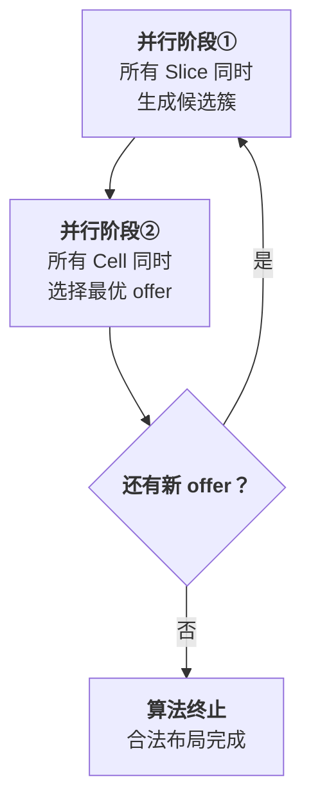
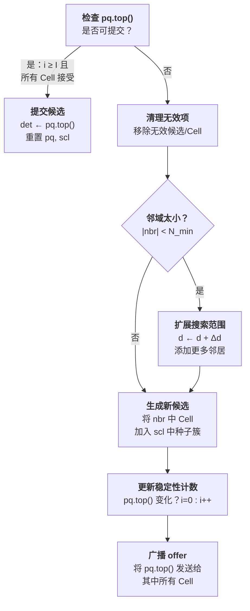
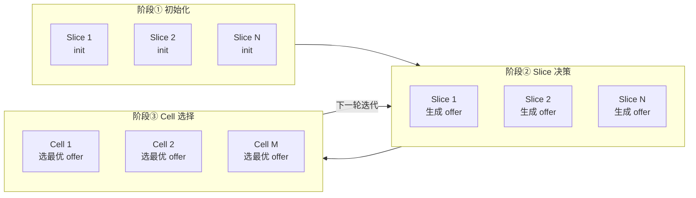
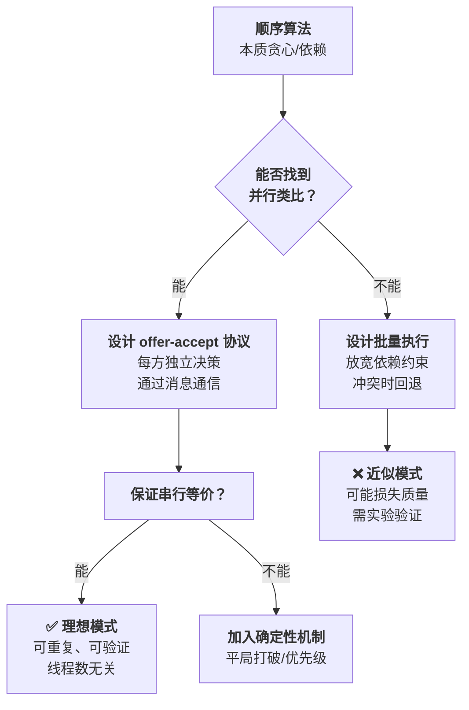

# Day 4 补充：FPGA 无打包布局的并行算法深度分析

> **基于论文**: A New Paradigm for FPGA Placement without Explicit Packing (TCAD 2019)
>
> **重点章节**: §IV-C Fully Parallelizable Direct Legalization
>
> **核心问题**: 传统 FPGA 合法化/打包算法本质上是顺序贪心的，如何将其改造为大规模并行算法，且保证与串行版本结果完全一致（串行等价性）？

---

## 目录

1. [并行化的核心难题](#1-并行化的核心难题)
2. [大学录取类比：并行性的直觉来源](#2-大学录取类比并行性的直觉来源)
3. [节点中心算法：每个 Slice 独立决策](#3-节点中心算法每个-slice-独立决策)
4. [完整并行 DL 算法：三阶段并行结构](#4-完整并行-dl-算法三阶段并行结构)
5. [串行等价性：并行不损失质量](#5-串行等价性并行不损失质量)
6. [评分函数：布局与打包的统一度量](#6-评分函数布局与打包的统一度量)
7. [后 DL 异常处理：撕毁与重分配](#7-后-dl-异常处理撕毁与重分配)
8. [并行加速实验数据](#8-并行加速实验数据)
9. [与传统方法的对比分析](#9-与传统方法的对比分析)
10. [并行算法设计方法论总结](#10-并行算法设计方法论总结)

---

## 1. 并行化的核心难题

### 1.1 传统 FPGA 合法化为什么难以并行？

FPGA 合法化需要同时解决两个耦合问题：
- **布局问题**：将单元放到物理位置，最小化线长
- **打包问题**：将单元组合到 CLB Slice 中，满足架构约束（控制集、LUT/FF 数量限制）

传统方法的执行流程是顺序的：

```
传统流程：打包 → 合法化 → 详细布局
  打包：贪心聚类（依赖前序决策）
  合法化：逐行/逐列扫描（依赖邻居状态）
  详细布局：逐单元优化（依赖全局状态）
```

> **核心矛盾**：打包和布局天然耦合——单元应该打包在一起往往是因为它们在物理上靠近，而它们应该放在哪里又取决于它们和谁打包在一起。传统方法将两者分开处理（先打包再布局），不仅损失解质量，而且每一步内部的贪心依赖使得并行化极其困难。

### 1.2 并行化的两大挑战

| 挑战 | 描述 | 传统后果 |
|------|------|---------|
| **数据依赖** | 后续决策依赖前序结果（如"单元 A 放在 Slice X 后，单元 B 不能再去 Slice X"） | 必须顺序执行 |
| **质量退化** | 并行执行可能导致冲突（如两个 Slice 同时竞争同一个单元） | 并行版本解质量差于串行版本 |

> **关键目标**：设计一个既可大规模并行，又保证与串行版本完全等价的算法。

---

## 2. 大学录取类比：并行性的直觉来源

### 2.1 Gale-Shapley 大学录取问题

论文的核心灵感来自经典的 **Gale-Shapley 大学录取问题（College Admission Problem）**：

| 论文概念 | 大学录取类比 | 含义 |
|---------|------------|------|
| Slice（CLB 切片） | 大学（College） | 有名额限制的接收方 |
| Cell（单元） | 学生（Student） | 需要被接收的请求方 |
| 共享网表的单元 | 朋友（Friends） | 有社交关系的群体 |
| 控制集约束 | 专业限制 | 某些学生不能进同一大学 |

### 2.2 为什么大学录取天然可并行？

大学录取的关键性质：**所有大学可以同时独立做出录取决策**。

```
串行版本：大学 A 做决策 → 大学 B 做决策 → ... → 大学 N 做决策
并行版本：大学 A, B, ..., N 同时做决策 → 学生处理收到的多个 offer → 下一轮
```



### 2.3 与经典大学录取的两个关键差异

论文指出，FPGA 合法化比标准大学录取问题更复杂：

1. **学生评价大学不仅看大学本身，还看朋友的决策**：一个单元是否选择某个 Slice，取决于它的"朋友"（同网表的单元）是否也在同一个 Slice 中——这引入了单元间的间接依赖
2. **某些学生不能进入同一大学**：FPGA 架构约束（控制集限制、LUT/FF 数量限制）使得某些单元不能在同一个 Slice 中共存

> 尽管有这些额外复杂度，算法仍然保持了大学录取问题的核心并行结构——每个 Slice 独立决策，每个 Cell 独立选择。

---

## 3. 节点中心算法：每个 Slice 独立决策

### 3.1 数据结构

每个计算节点（Slice）维护以下数据结构：

| 变量 | 类型 | 含义 |
|------|------|------|
| `det` | 集合 | 已确定属于该 Slice 的单元集合 |
| `pq` | 优先队列 | 当前最优的 K 个候选簇（K=10） |
| `nbr` | 集合 | 邻域内可考虑的候选单元集合 |
| `scl` | 列表 | 种子簇——用于生成新候选 |
| `i` | 整数 | 自 `pq.top()` 上次变化以来的迭代次数 |

### 3.2 节点中心算法流程

每个 Slice 在每次 DL 迭代中执行以下流程：



### 3.3 关键参数与数值

| 参数 | 值 | 含义 |
|------|-----|------|
| K | 10 | 优先队列中保留的最优候选数 |
| I | 3 | 提交前需稳定的迭代次数（防止提交过早的候选） |
| $N_{NBRmin}$ | 10 | 邻域最小 Cell 数 |
| d（初始） | 1 | 初始最大位移约束 |
| Δd | 1 | 每次扩展的位移增量 |
| D | 12 | 最终最大位移约束 |

### 3.4 逐步追踪示例

假设 Slice S1 当前状态：`det = {c1, c2}`，`nbr = {c3, c4, c5, c6}`，`pq.top() = {c1, c2, c3}`：

**步骤 1：检查 pq.top() 是否可提交**
- `pq.top() = {c1, c2, c3}`，需要 Cell c3 接受此 offer
- 假设 c3 还在接受其他 Slice 的 offer，i = 1 < I = 3，不可提交

**步骤 2：清理无效项**
- c5 已被另一个 Slice 确定 → 从 `nbr` 中移除
- `nbr` 更新为 {c3, c4, c6}

**步骤 3：检查邻域大小**
- |nbr| = 3 < $N_{NBRmin}$ = 10 → 扩展搜索范围
- d 从 1 增加到 2，添加距离 1 < dist ≤ 2 的 Cell
- `nbr` 扩展为 {c3, c4, c6, c7, c8, c9, c10, c11, c12}

**步骤 4：生成新候选**
- 将 `nbr` 中每个 Cell 加入 `scl` 中每个种子簇
- 新候选示例：{c1, c2, c7}, {c1, c2, c8}, {c1, c2, c3, c7}, ...
- 将有效新候选加入 `pq`，保留 top-K

**步骤 5：更新稳定性计数**
- 如果 `pq.top()` 变了 → i = 0（发现更好的候选）
- 如果 `pq.top()` 没变 → i++（当前最佳稳定中）

**步骤 6：广播 offer**
- 将 `pq.top()` 中的 Cell 列表和评分发送给每个 Cell
- Cell 们将在并行阶段②中做出选择

---

## 4. 完整并行 DL 算法：三阶段并行结构

### 4.1 Algorithm 1 完整伪代码

```
输入：粗糙合法布局，Cell 集合 C，Slice 集合 S，初始位移约束 d
输出：合法布局

═══════════════════════════════════════════
阶段①：并行初始化
═══════════════════════════════════════════
parallel for each s ∈ S do
  s.i   ← 0
  s.det ← ∅
  s.pq  ← ∅
  s.nbr ← {c ∈ C | dist(c, s) ≤ d}
  s.scl ← {空簇}
end parallel for

═══════════════════════════════════════════
主循环：迭代直到无新 offer
═══════════════════════════════════════════
while ∃ valid pq.top() for s ∈ S do

  ──── 阶段②：Slice 并行决策 ────
  parallel for each s ∈ S do
    执行节点中心算法（图 7）
  end parallel for

  ──── 阶段③：Cell 并行选择 ────
  parallel for each c ∈ C do
    从 {s ∈ S | c ∈ s.pq.top()} 中
    选择 SCORE(s) 最高的 Slice s'
    并告知 s' 接受其 offer
  end parallel for

end while
```

### 4.2 三阶段并行结构详解



| 阶段 | 并行对象 | 操作 | 同步点 |
|------|---------|------|--------|
| ① 初始化 | 所有 Slice | 设置初始状态 | 全部完成后进入主循环 |
| ② Slice 决策 | 所有 Slice | 独立执行节点中心算法，生成 offer | 全部完成后进入阶段③ |
| ③ Cell 选择 | 所有 Cell | 处理收到的多个 offer，选择最优 | 全部完成后回到阶段② |

> **同步模型**：算法采用 **BSP（Bulk Synchronous Parallel）** 模型——每个阶段内部完全并行，阶段之间通过全局同步点分隔。这种模型非常适合多线程 CPU（OpenMP）和 GPU（CUDA）实现。

### 4.3 为什么这个结构可以并行？

**阶段②可以并行的原因**：
- 每个 Slice 只读取自己的 `det`, `pq`, `nbr`, `scl` 状态
- 每个 Slice 只写入自己的 `pq`（优先队列）和广播消息
- 不同 Slice 的写入不冲突——它们操作不同的数据结构

**阶段③可以并行的原因**：
- 每个 Cell 只需要读取来自各 Slice 的 offer（只读）
- 每个 Cell 独立做出选择，写入自己的决定
- 不同 Cell 的写入不冲突

**阶段之间的数据流**：
- 阶段② → 阶段③：Slice 广播 offer（多对多通信）
- 阶段③ → 阶段②：Cell 通知接受/拒绝（多对多通信）

> **无竞争条件**：阶段②中 Slice 不读取其他 Slice 的状态，阶段③中 Cell 不修改其他 Cell 的决定。唯一的数据交换通过"offer/accept"消息完成，在同步点处统一处理。

---

## 5. 串行等价性：并行不损失质量

### 5.1 定义

> **串行等价性（Serial Equivalency）**：一个并行算法满足串行等价性，当且仅当它总是产生与串行版本**完全相同**的解——无论使用多少线程。

### 5.2 为什么串行等价性重要？

| 性质 | 有串行等价性 | 无串行等价性 |
|------|------------|------------|
| 结果可重复 | ✅ 每次运行结果相同 | ❌ 结果随线程数变化 |
| 调试友好 | ✅ 可用单线程版本验证 | ❌ 并行/串行结果不同 |
| 线程数灵活 | ✅ 有多少用多少 | ⚠️ 可能多线程更差 |
| 理论保证 | ✅ 等价于良定义的串行算法 | ❌ 无理论保证 |

### 5.3 串行等价性的保证机制

**Lemma 1**：假设 $s_1$ 和 $s_2$ 是两个不同的计算节点。如果对同一 DL 迭代中的任意 $s_1$ 和 $s_2$，$\text{SCORE}(s_1) \neq \text{SCORE}(s_2)$ 成立，则算法收敛性得到保证。

**实现方式**：当多个 Slice 对同一个 Cell 提供相同的分数改善时，使用 Slice 的**唯一标识符**打破平局。这保证了：
1. 每个 Cell 在每次迭代中做出**唯一确定**的选择
2. 串行版本和并行版本中，Cell 面临的 offer 集合相同
3. Cell 的选择逻辑相同（选分数最高的，平局按 ID）
4. 因此最终结果完全一致

> **与 ABCDPlace 的对比**：ABCDPlace（Day 5）的并行全局交换算法需要顺序应用交换结果（ApplyCand 步骤）来处理冲突，因此**不保证**串行等价性。本文的 DL 算法通过"offer-accept"协议和确定性平局打破，**保证**了串行等价性。

### 5.4 收敛性分析

算法的收敛性由以下机制保证：

1. **分数单调递增**：每次成功提交（commit）都严格改善目标函数值
2. **有限解空间**：Cell-Slice 的组合是有限的
3. **无振荡**：确定性平局打破避免了"A→B→A→B"的振荡

因此算法在有限步内收敛。

---

## 6. 评分函数：布局与打包的统一度量

### 6.1 评分函数定义

给定一个 Slice $s$ 和一个候选簇 $c$，评分函数定义为：

$$\text{SCORE}(c, s) = \sum_{e \in \text{Net}(c)} \frac{\text{InternalPins}(e, c)}{\text{TotalPins}(e) - 1} - \lambda \cdot \text{HPWL}(c, s)$$

其中：
- $\text{Net}(c)$：至少包含 $c$ 中一个 Cell 的网集合
- $\text{TotalPins}(e)$：网 $e$ 的总引脚数
- $\text{InternalPins}(e, c)$：网 $e$ 在簇 $c$ 内的引脚数
- $\text{HPWL}(c, s)$：将 $c$ 中 Cell 从 FIP 位置移到 Slice $s$ 造成的 HPWL 增量
- $\lambda = 0.02$：权重参数

### 6.2 两项的物理意义

**第一项（打包质量项）**：

$$\sum_{e \in \text{Net}(c)} \frac{\text{InternalPins}(e, c)}{\text{TotalPins}(e) - 1}$$

> **解读**：这项衡量簇的"内部化"程度——将外部网变为内部网的能力。当更多引脚被吸收到簇内部时，该簇需要的对外路由资源减少，布线更友好。分母 $\text{TotalPins}(e) - 1$ 使得吸收大网（引脚数多的网）的收益相对较低——因为大网即使部分内部化，仍需对外连接。

**第二项（布局位移项）**：

$$-\lambda \cdot \text{HPWL}(c, s)$$

> **解读**：这项惩罚位移造成的线长增加。负号意味着 HPWL 增加越多的候选得分越低。$\lambda$ 控制"打包质量"与"线长"之间的权衡。

### 6.3 数值计算示例

假设簇 $c = \{c_1, c_2, c_3\}$，候选 Slice $s$：

| 网 $e$ | TotalPins | InternalPins | 贡献 |
|--------|-----------|-------------|------|
| $e_1$ (连接 $c_1, c_2, x_1$) | 3 | 2 | $2/(3-1) = 1.0$ |
| $e_2$ (连接 $c_2, c_3$) | 2 | 2 | $2/(2-1) = 2.0$ |
| $e_3$ (连接 $c_1, x_2, x_3$) | 3 | 1 | $1/(3-1) = 0.5$ |

打包质量项 = $1.0 + 2.0 + 0.5 = 3.5$

假设移动到 Slice $s$ 的 HPWL 增量为 50：

$$\text{SCORE} = 3.5 - 0.02 \times 50 = 3.5 - 1.0 = 2.5$$

> 直觉上：$e_2$ 完全内部化（贡献最高 2.0），$e_1$ 大部分内部化（贡献 1.0），$e_3$ 仅部分内部化（贡献 0.5）。该簇的打包质量较好，且位移代价适中。

### 6.4 分数改善量

Cell 选择 Slice 时使用的不是绝对分数，而是**分数改善量**：

$$\text{SCORE}(s) = \text{SCORE}(\text{pq.top()} \text{ of } s, s) - \text{SCORE}(\text{det} \text{ of } s, s)$$

> 即：如果接受 Slice $s$ 的 offer，$s$ 的分数会比当前状态改善多少。Cell 自然倾向于选择改善最大的 Slice。

---

## 7. 后 DL 异常处理：撕毁与重分配

### 7.1 问题

DL 主循环结束后，通常有 < 1% 的 Cell 仍无法在位移约束 D 内找到合法位置。

### 7.2 撕毁评分函数

对于非法 Cell $v$ 和 Slice $s$（其已确定簇为 $c$），撕毁 $c$ 以容纳 $v$ 的评分：

$$\text{SCORE}_{ripup}(v, s, c) = -\lambda_1 \cdot \text{HPWL}(v, s) - \lambda_2 \cdot \text{SCORE}(c, s) - \lambda_3 \cdot \text{Area}(c)$$

参数：$\lambda_1 = 0.02$，$\lambda_2 = 1.0$，$\lambda_3 = 4.0$

> **三项的含义**：
> - $-\lambda_1 \cdot \text{HPWL}$：优先选择移动 $v$ 线长代价小的 Slice
> - $-\lambda_2 \cdot \text{SCORE}$：优先撕毁当前分数低的簇（即质量较差的簇）
> - $-\lambda_3 \cdot \text{Area}$：优先撕毁面积小的簇——面积大的簇要么包含很多 Cell（重新合法化困难），要么包含难以打包的 Cell

### 7.3 撕毁-重分配流程（Algorithm 2）

```
for each 非法 Cell c:
  D(c) ← D  (初始位移约束)
  while Legalize(c, D(c)) 失败:
    D(c) ← D(c) + 1  (逐步放宽约束)

function Legalize(c, D):
  ls(c) ← {s ∈ S | dist(c, s) ≤ D}  (候选 Slice)
  按 SCOREripup 降序排列 ls(c)
  for each s in ls(c):
    if RipUpAndLegalize(s, c, D) 成功:
      return 成功
  return 失败

function RipUpAndLegalize(s, c, D):
  lv ← {v ∈ C | v ∈ s.det}  (记录将被撕毁的 Cell)
  s.det ← {c}  (将非法 Cell c 放入 s)
  for each v in lv:  (逐个重新合法化被撕毁的 Cell)
    ls(v) ← {s' ∈ S | dist(v, s') ≤ D 且 s'.det ∪ {v} 合法}
    if ls(v) 为空:
      恢复 s.det 原状，return 失败
    else:
      选择使分数改善最大的 s'
      s'.det ← s'.det ∪ {v}
  return 成功
```

> **注意**：后 DL 异常处理是**顺序执行**的——因为撕毁一个簇后重新分配其 Cell 需要逐步检查，每一步都依赖前一步的结果。但由于涉及的 Cell 数极少（< 1%），顺序执行的开销很小。

---

## 8. 并行加速实验数据

### 8.1 实验配置

| 项目 | 配置 |
|------|------|
| **CPU** | Intel Core i9-7900X (10 核, 3.30GHz) |
| **线程库** | OpenMP 4.0 |
| **DL 线程数** | 16（超线程） |
| **其他部分** | 单线程 |
| **目标 FPGA** | Xilinx UltraScale (67K Slices) |

### 8.2 DL 算法的线程扩展性

| 线程数 | 加速比 | 备注 |
|--------|--------|------|
| 1 | 1.00× | 基线 |
| 2 | 1.65× | |
| 4 | 3.15× | |
| 8 | 6.19× | |
| 16 (超线程) | 8.68× | 受限于 10 物理核 |

> **近线性扩展性**：2-8 线程时，加速比接近理想的线性加速（2→1.65, 4→3.15, 8→6.19）。8→16 线程时饱和，因为 i9-7900X 只有 10 个物理核心，超线程共享执行资源无法真正并行。

### 8.3 设计规模扩展性

固定线程数下，DL 运行时间与设计规模呈**线性关系**——Cell 数翻倍，运行时间翻倍。这是因为每个 Slice 的计算量与该 Slice 周围的 Cell 数成正比，而总计算量与总 Cell 数成正比。

### 8.4 运行时占比

| 步骤 | 占总运行时比例 |
|------|-------------|
| 二次布局（QP + 粗合法化） | 64.5% |
| 详细布局 | 18.5% |
| **DL（16 线程）** | **12.5%** |
| DAA（动态面积调整） | 2.2% |
| 后 DL 异常处理 | 0.7% |

> 如果 DL 也用单线程运行，其占比将从 12.5% 上升到约 $12.5\% \times 8.68 \approx 109\%$——即 DL 本身将成为运行时瓶颈。16 线程并行使 DL 从"瓶颈"变为"次要开销"。

---

## 9. 与传统方法的对比分析

### 9.1 与 UTPlaceF 的对比

| 维度 | UTPlaceF（传统） | 本文方法 |
|------|-----------------|---------|
| **打包方式** | 显式打包（先聚类后布局） | 隐式打包（DL 同时考虑） |
| **合法化** | 顺序 Tetris/贪心 | 并行 DL |
| **并行性** | 打包和合法化本质顺序，难以并行 | DL 全阶段可并行 |
| **串行等价** | N/A（不可并行） | ✅ 保证 |
| **解空间** | 打包和布局分别搜索 | 同时探索打包+布局解空间 |

### 9.2 与 ABCDPlace（Day 5）的对比

| 维度 | ABCDPlace (ASIC 详细布局) | 本文 DL (FPGA 合法化) |
|------|-------------------------|---------------------|
| **问题** | 合法解上增量优化线长 | 从非法解直接产生合法解 |
| **并行策略** | 批量执行（batch） | offer-accept 协议 |
| **冲突处理** | 顺序 ApplyCand，放弃冲突 | 确定性平局打破 |
| **串行等价** | ❌ 不保证 | ✅ 保证 |
| **粒度** | 粗粒度 batch（256 个单元/批） | 细粒度（每个 Slice/Cell 一个线程） |
| **理论基础** | 工程实践驱动 | Gale-Shapley 理论驱动 |

> **核心差异**：ABCDPlace 采用"乐观并行+冲突回退"策略——先并行执行，遇到冲突就放弃。本文采用"协议并行+确定性选择"策略——通过 offer-accept 协议避免冲突，通过确定性平局打破保证串行等价。后者更优雅但应用场景更受限（需要问题本身具有"大学录取"结构）。

---

## 10. 并行算法设计方法论总结

### 10.1 从本文提炼的并行算法设计模式



### 10.2 Offer-Accept 协议的设计要点

1. **分离决策与通信**：每个节点独立决策（生成 offer），通过消息传递协调
2. **确定性选择**：当存在多个等价 offer 时，使用确定性规则打破平局
3. **BSP 同步**：阶段之间全局同步，阶段内部完全并行
4. **单调改善**：每轮迭代目标函数单调改善，保证收敛
5. **有限状态**：解空间有限，算法在有限步内终止

### 10.3 适用条件

Offer-Accept 协议适用于以下场景：
- 问题可建模为**双边匹配**（two-sided matching）
- 两方可以**独立评估**对方（评分函数可分解）
- 存在**自然的多对多通信**模式（每个 Slice 可能涉及多个 Cell，反之亦然）
- 可以容忍**迭代收敛**（非一步到位）

> **不适用的场景**：强耦合的优化问题（如连续优化中的梯度下降）、全局最优依赖（如整数规划的分支定界）、需要严格同步的流水线操作。

---

## 参考文献

1. W. Li, Y. Lin, and D. Z. Pan, "UTPlaceF: A Routability-Driven FPGA Placer with Deterministic Routing Resource Assignment," in *Proc. ISPD*, 2016.

2. D. Gale and L. S. Shapley, "College Admissions and the Stability of Marriage," *The American Mathematical Monthly*, vol. 69, no. 1, pp. 9–15, 1962.

3. Y. Lin et al., "ABCDPlace: Accelerated Batch-based Concurrent Detailed Placement on Multi-threaded CPUs and GPUs," *IEEE TCAD*, 2020.

4. W. Li, M. Li, J. Wang, and D. Z. Pan, "UTPlaceF 3.0: A Parallelization Framework for Modern FPGA Global Placement," in *Proc. ICCAD*, 2017.

5. OpenMP Architecture Review Board, "OpenMP Application Programming Interface," Version 4.0, 2013.

---

*本文档作为 Day 4 FPGA 无打包布局论文的并行算法深度补充分析，由 Claude Code 于 2026-06-08 生成。核心贡献在于揭示了如何将本质贪心的 FPGA 合法化/打包问题改造为基于 Gale-Shapley 大学录取模型的 offer-accept 并行协议，并保证串行等价性——这为 EDA 中其他顺序算法的并行化提供了可借鉴的设计范式。*
