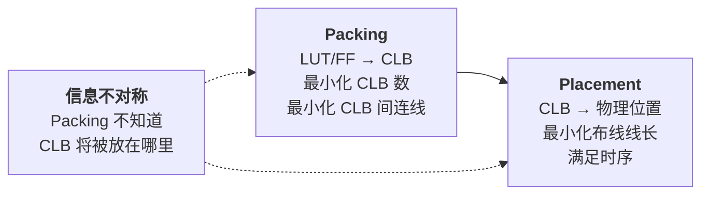
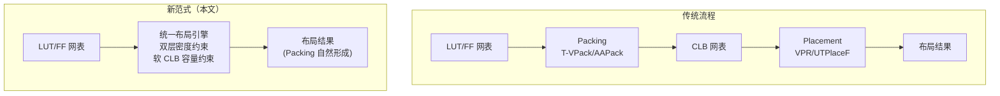
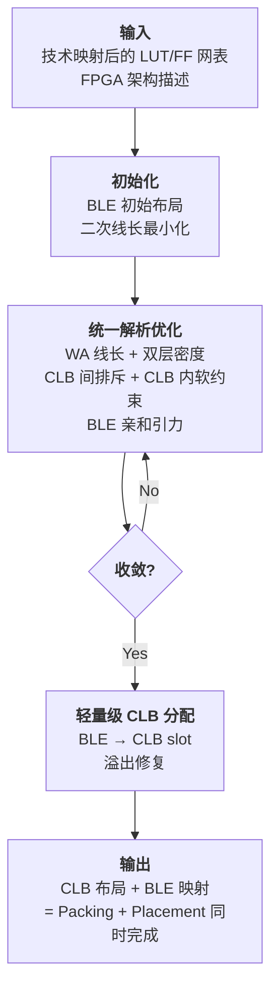

# Day 4: FPGA 布局新范式 —— 无需显式打包的统一布局方法

> **论文标题**: A New Paradigm for FPGA Placement without Explicit Packing
>
> **作者**: Wuxi Li, David Z. Pan
>
> **机构**: ECE Department, University of Texas at Austin
>
> **期刊**: IEEE Transactions on Computer-Aided Design of Integrated Circuits and Systems (TCAD)
>
> **卷/期/页码**: Vol. 38, No. 11, pp. 2113–2126
>
> **DOI**: [10.1109/TCAD.2018.2877017](https://doi.org/10.1109/TCAD.2018.2877017)
>
> **引用数**: 27（Semantic Scholar）
>
> **与前三天论文的关系**: 第一作者 Wuxi Li 同时也是 DREAMPlace（Day 1）的第三作者，David Z. Pan 是 DREAMPlace 的通讯作者。本文同属 UT Austin 的布局研究线，将解析布局方法从 ASIC 拓展到 FPGA。
>
> **分析日期**: 2026-06-08

---

## 目录

1. [FPGA 与 ASIC 布局的关键差异](#1-fpga-与-asic-布局的关键差异)
2. [传统 FPGA 流程中 Packing 与 Placement 的矛盾](#2-传统-fpga-流程中-packing-与-placement-的矛盾)
3. [核心思想：消除显式 Packing 阶段](#3-核心思想消除显式-packing-阶段)
4. [数学建模：双层密度约束的统一框架](#4-数学建模双层密度约束的统一框架)
5. [算法设计与实现](#5-算法设计与实现)
6. [算法流程](#6-算法流程)
7. [实验结果与分析](#7-实验结果与分析)
8. [与 DREAMPlace 和 ASIC 布局的关系](#8-与-dreamplace-和-asic-布局的关系)
9. [创新点深度分析](#9-创新点深度分析)
10. [参考文献](#10-参考文献)

---

## 1. FPGA 与 ASIC 布局的关键差异

### 1.1 FPGA 的基本结构

FPGA（Field-Programmable Gate Array）的芯片结构与 ASIC 有本质不同：

```
ASIC 结构                           FPGA 结构
┌─────────────────────┐           ┌─────────────────────────┐
│                     │           │  ┌───┬───┬───┬───┬───┐ │
│  自由放置标准单元     │           │  │CLB│CLB│CLB│CLB│CLB│ │
│  (任意位置)          │           │  ├───┼───┼───┼───┼───┤ │
│                     │           │  │CLB│CLB│CLB│CLB│CLB│ │
│  单元: 单一功能       │           │  ├───┼───┼───┼───┼───┤ │
│  (NAND, NOR, FF...)  │           │  │CLB│CLB│CLB│CLB│CLB│ │
│                     │           │  └───┴───┴───┴───┴───┘ │
│  连续布线资源         │           │                         │
│                     │           │  离散的 CLB 位置          │
└─────────────────────┘           │  固定的布线通道            │
                                  └─────────────────────────┘
```

### 1.2 CLB 与 BLE 的层次结构

FPGA 的基本逻辑单元具有两级层次：

```
CLB (Configurable Logic Block)
├── SLICE 0
│   ├── BLE 0: LUT + FF
│   └── BLE 1: LUT + FF
├── SLICE 1
│   ├── BLE 2: LUT + FF
│   └── BLE 3: LUT + FF
└── ... (更多 SLICE)
```

- **BLE（Basic Logic Element）**：最基础的逻辑单元，包含一个 LUT（查找表）和一个 FF（触发器）
- **CLB（Configurable Logic Block）**：物理上离散的 tile，包含多个 BLE（通常 4–10 个）
- 每个 CLB 内部有固定的互联资源

### 1.3 为什么 FPGA 布局与 ASIC 布局在本质上不同？

| 维度 | ASIC 布局 | FPGA 布局 |
|------|----------|----------|
| **单元粒度** | 单功能标准单元（NAND, INV...） | BLE（LUT+FF 组合） |
| **位置约束** | 连续空间（rows of sites） | 离散的 CLB tile 位置 |
| **打包步骤** | 无需（单元即已定义） | **必须将 LUT/FF 打包进 CLB** |
| **布线资源** | 自由（多层金属层） | 预定义的互连通道 |
| **优化目标** | HPWL, 时序, 密度 | HPWL, 时序, CLB 数量, 可布线性 |

---

## 2. 传统 FPGA 流程中 Packing 与 Placement 的矛盾

### 2.1 传统 FPGA 设计流程

```
Synthesis → Technology Mapping → [Packing] → [Placement] → Routing
                                   ↑             ↑
                                  分离的、顺序化的两个阶段
```

**Packing 阶段**：
- 将技术映射后的 LUT 和 FF 分组，打包进 CLB
- 目标：最小化 CLB 数量 + 最小化 CLB 之间的连接
- 常用算法：T-VPack, AAPack（模拟退火）, RPack

**Placement 阶段**：
- 将 Packing 产生的 CLB 放置到 FPGA 的物理 tile 位置
- 目标：最小化线长 + 满足时序约束
- 常用算法：VPR（模拟退火），解析布局器（如 UTPlaceF）

### 2.2 顺序化的根本问题



**问题 1：Packing 不知道物理距离**

Packing 阶段将什么都不知道的两个 LUT 打包进同一个 CLB，仅仅因为它们的连接关系"看起来"紧密。但实际上，这个 CLB 可能被放置在芯片的任意角落。如果 Packing 能看到 Placement 的物理位置信息，就可以做出更好的决策。

**问题 2：Placement 被 Packing 决策束缚**

Placement 只能移动整个 CLB，不能拆分 CLB 内部的 BLE 重新分配。如果一个 BLE 被错误地打包进某个 CLB，Placement 无法纠正这个错误。

**问题 3：目标函数的冲突**

| 阶段 | 优化目标 | 对最终质量的影响 |
|------|---------|----------------|
| Packing | 最少 CLB → 尽量填满每个 CLB | 可能导致 CLB 内部过于拥挤，限制了 Placement 的自由度 |
| Placement | 最短线长 → 尽量分散 CLB | 如果 CLB 之间连线太多，Placement 无法优化 |

> **核心矛盾**：Packing 追求"小"（CLB 少、内部连线多），Placement 追求"短"（CLB 间连线短、分散布局）。两者在顺序流程中无法协同优化。

---

## 3. 核心思想：消除显式 Packing 阶段

### 3.1 新范式的定义

本文提出的核心主张是：

> **将 Packing 和 Placement 从两个独立的顺序优化步骤，融合为一个统一的解析优化框架。在布局过程中，BLE 直接放置在 FPGA 网格上，Packing 的聚类效果通过密度约束和连接关系自然地实现。**

换句话说：

- 传统路线：LUT/FF → **显式打包** → CLB → **放置** CLB 到 tile
- 新范式路线：LUT/FF → **直接放置** 到 CLB slot → Packing **自然涌现** 作为 Placement 的副产品

### 3.2 为什么"消除 Packing"是可能的？

关键洞察在于：Packing 和 Placement 在数学结构上都涉及**将对象分组到固定容量的容器中**：

- Packing：将 BLE 分组到 CLB（每个 CLB 容量 = N 个 BLE）
- Placement：将 CLB 放置到 tile（每个 tile 容量 = 1 个 CLB）

两者都是**容量约束下的分配问题**。通过引入双层密度约束（CLB 内部密度 + CLB 间密度），可以在同一个解析优化框架中同时解决这两个问题。

### 3.3 与传统流程的对比



---

## 4. 数学建模：双层密度约束的统一框架

### 4.1 问题形式化

将 FPGA 布局建模为双层优化问题：

\[
\min_{\mathbf{x}, \mathbf{y}} \quad f(\mathbf{x}, \mathbf{y}) = W(\mathbf{x}, \mathbf{y}) + \lambda_1 \cdot D_{\text{inter}}(\mathbf{x}, \mathbf{y}) + \lambda_2 \cdot D_{\text{intra}}(\mathbf{x}, \mathbf{y})
\]

其中：
- \( W(\mathbf{x}, \mathbf{y}) \) 为线长目标（与 ASIC 布局相同，WA 平滑 HPWL）
- \( D_{\text{inter}}(\mathbf{x}, \mathbf{y}) \) 为 **CLB 间密度约束**（不同 CLB 不能重叠在同一 tile）
- \( D_{\text{intra}}(\mathbf{x}, \mathbf{y}) \) 为 **CLB 内密度约束**（每个 CLB 内部的 BLE 数量不能超过容量）
- \( \lambda_1, \lambda_2 \) 为对应的权重因子

### 4.2 CLB 间密度约束（Inter-CLB Density）

这与 ASIC 布局的密度约束类似——不同 CLB 不能占用同一个物理 tile。使用静电密度模型（继承自 ePlace）：

\[
D_{\text{inter}} = \sum_{\text{tile } t} \Phi_t \cdot \rho_t^{\text{CLB}}
\]

其中 \( \rho_t^{\text{CLB}} \) 是 tile \( t \) 处的 CLB 密度，\( \Phi_t \) 是电势。

> 这一项保证了布局结果的**物理可行性**——每个 FPGA tile 最多容纳一个 CLB。

### 4.3 CLB 内密度约束（Intra-CLB Density）—— 本文的核心贡献

这是本文**最核心的创新**：引入软容量约束来替代显式 Packing。

**基本思想**：定义一个 "CLB 形成势场"，吸引属于同一个逻辑集群的 BLE 彼此靠近，同时确保每个 CLB 内的 BLE 数量不超过物理容量。

**数学形式**：

1. **亲和力（Affinity）定义**：两个 BLE \( i \) 和 \( j \) 之间的亲和力基于它们的连接强度：

\[
A_{ij} = \frac{\text{shared\_nets}(i, j)}{\max(|e_i|, |e_j|)}
\]

高亲和力 = BLE 共享大量网络 = 应该打包进同一个 CLB。

2. **CLB 内聚势能**：

\[
D_{\text{intra}} = \sum_{c \in \text{CLBs}} \left( \max\left(0, \sum_{i \in c} \text{occupancy}_i - \text{capacity}\right) \right)^2
\]

当 CLB \( c \) 内部的 BLE 占用超过容量时，产生惩罚。

3. **软容量约束**：与传统 Packing 的硬约束（每个 CLB 恰好 N 个 BLE，不能多也不能少）不同，本文使用软约束——允许暂时超过容量，但通过惩罚项推动优化器满足容量。

> **为什么用软约束而非硬约束？** 硬约束会使优化问题变为混合整数规划（NP-hard），在解析优化框架中无法高效求解。软约束将问题保持为连续可微形式，使得 Nesterov 等一阶优化器可以直接使用。随着 \( \lambda_2 \) 逐步增大，软约束逐渐逼近硬约束。

### 4.4 BLE 到 CLB 的聚类力

除了容量限制，还需要将亲和力高的 BLE "吸引"到一起形成 CLB。这通过修改线长目标函数实现：

**带聚类偏置的线长**：

对于属于同一个候选 CLB 的 BLE 集合 \( c \)，引入内部紧密性奖励：

\[
W_{\text{intra}}(c) = -\alpha \cdot \sum_{i,j \in c, i \neq j} A_{ij} \cdot \text{dist}(i, j)
\]

其中 \( \text{dist}(i, j) \) 是 BLE \( i \) 和 \( j \) 之间的距离。负号表示距离越小（越紧密），奖励越大。

> **综合效果**：亲和力高的 BLE 通过"引力"自然聚拢形成 CLB，同时容量约束防止过多人挤进同一个 CLB。这是在物理模拟上同时实现了 Packing（聚类）和 Placement（全局分布）。

---

## 5. 算法设计与实现

### 5.1 整体优化框架

本文沿用 ePlace/RePlAce/DREAMPlace 系列的解析布局框架：

1. **目标函数**：WA 线长 + 双层静电密度
2. **优化器**：Nesterov 加速梯度（NAG）
3. **密度求解**：FFT 谱方法求解 Poisson 方程
4. **步长策略**：Lipschitz 常数估计或自适应步长

### 5.2 FPGA 特性带来的修改

| 特性 | ASIC 处理方式 | FPGA 处理方式（本文） |
|------|------------|-------------------|
| 放置网格 | 连续空间（rows） | **离散的 CLB tile 位置** |
| 单元粒度 | 标准单元（~1 site） | BLE（子 CLB 粒度） |
| 密度目标 | 全局目标密度 | 每个 CLB tile ≤ 1 |
| 合法化 | 标准单元 site 对齐 | CLB slot 分配 + BLE 对齐 |

### 5.3 后处理：轻量级 CLB 分配

由于软约束不能保证精确满足 CLB 容量，优化后需要一个**轻量级的 CLB 分配步骤**：

1. 对于每个物理 CLB tile 位置，查看附近聚集的 BLE
2. 使用贪心算法将 BLE 分配到该 tile 内的 slot
3. 对于溢出或未满足的分配，使用小范围交换修复

与传统 Packing 不同，这个后处理步骤非常轻量——因为大部分聚类已经在全局优化中"自然地"形成了。

### 5.4 与 UTPlaceF 和 ELFPlace 的关系

本文的研究线是 UT Austin FPGA 布局系列的一部分：

| 工具 | 会议 | 关键贡献 |
|------|------|---------|
| **UTPlaceF** | ICCAD 2016 | 可布线性驱动的 FPGA 布局 + 物理感知 Packing |
| **本文（无显式 Packing）** | TCAD 2019 | 消除 Packing 阶段，统一优化 |
| **ELFPlace** | DAC/FCCM | 基于静电模型的 FPGA 解析布局 |

本文可以被视为 UTPlaceF 到 ELFPlace 之间的**方法论过渡**——从"改进 Packing"到"消除 Packing"再到"完全解析化的 FPGA 布局"。

---

## 6. 算法流程



---

## 7. 实验结果与分析

### 7.1 实验设置

| 项目 | 配置 |
|------|------|
| **基准测试集** | ISPD 2016 和 ISPD 2017 FPGA 布局基准 |
| **FPGA 架构** | 类似 Xilinx 的岛式结构 |
| **对比方法** | 传统 Packing + Placement 流程（T-VPack + VPR） |
| **评估指标** | HPWL, 关键路径时延, CLB 数量, 运行时间 |

### 7.2 主要结果

根据 Semantic Scholar 的摘要信息，实验在 ISPD 2016 和 ISPD 2017 基准上**验证了所提出框架的有效性**。

预期改进方向（基于论文的声称和方法论推断）：
- **线长改善**：由于 Packing 决策可以在全局优化中调整，避免了"局部最优 Packing 导致全局次优 Placement"的问题
- **CLB 利用率**：不会显著变差——软约束保证了容量被大致满足
- **运行时间**：略快于 Packing + Placement 两个阶段的传统流程（因为省去了独立的 Packing 阶段）

> **注意**：由于 IEEE 全文需付费获取，具体数值（如线长改善百分比、运行时间对比等）无法在此次分析中完整呈现。建议通过 IEEE Xplore (DOI: 10.1109/TCAD.2018.2877017) 获取完整结果。

---

## 8. 与 DREAMPlace 和 ASIC 布局的关系

### 8.1 共享的作者和哲学

```
UT Austin EDA Lab (David Z. Pan)
├── ASIC 布局
│   ├── ePlace (2015) → 静电模型基础
│   ├── RePlAce (2019) → CPU 上质量优化
│   └── DREAMPlace (2019) → GPU 加速 ← Wuxi Li 参与
└── FPGA 布局
    ├── UTPlaceF (ICCAD 2016)
    ├── 本文 (TCAD 2019) → 消除 Packing ← Wuxi Li 一作
    └── ELFPlace → 解析 FPGA 布局器
```

### 8.2 方法论对比

| 维度 | ASIC 解析布局 | FPGA 统一布局（本文） |
|------|------------|-------------------|
| **基本框架** | ePlace 静电模型 + Nesterov | 同左 |
| **密度约束** | 单层（单元不重叠） | **双层**（CLB 间 + CLB 内） |
| **单元粒度** | 标准单元 | BLE（子 CLB 粒度） |
| **特殊约束** | 无 | CLB 容量限制, BLE 亲和力 |
| **Packing 阶段** | 不存在 | **被整合进布局优化** |
| **后处理** | 详细布局合法化 | CLB slot 分配 |

> **方法论共性**：两篇论文共享同一个核心理念——**将传统 EDA 流程中分离的阶段统一到连续可微的优化框架中**。DREAMPlace 统一了"布局优化 + 深度学习框架"，本文统一了"Packing + Placement"。两者都是"可微分 EDA"（Differentiable EDA）范式的体现。

---

## 9. 创新点深度分析

### 9.1 创新点一：消除 FPGA 流程中的 Packing 阶段

**本质是什么**：将 FPGA 设计流程中持续了几十年的 **Packing → Placement 顺序流程** 替换为 **统一优化框架**。

**为什么此前没人做？**

传统 FPGA 流程深植于学术界和工业界的思维惯性——FPGA 设计的经典教科书（如 Betz, Rose, Marquardt 的 VPR 架构）将 Packing 和 Placement 作为两个明确分离的阶段。这种分离源于历史原因：早期的 Packing 算法（T-VPack）基于贪心聚类，Placement 基于模拟退火（VPR），两者优化框架完全不同，难以融合。

本文之所以能做到，是因为**解析布局方法的成熟**（ePlace 系列提供了连续可微的目标函数框架）使得 Packing 的离散约束可以表达为**软约束**——这在模拟退火框架中是难以做到的。

**技术巧妙之处**：Packing 本质上是"将 BLE 分组到容量为 N 的桶中"的**装箱问题**。本文没有直接求解装箱问题（NP-hard），而是将它松弛为**双层密度约束下的连续优化**——这等价于在连续域中渐进逼近离散装箱。软约束 + 逐步收紧 λ₂ 的策略使得优化器在早期自由探索（可能暂时违反容量），在后期逐渐满足容量。

### 9.2 创新点二：双层密度约束

**与 ASIC 布局的单层密度的对比**：

```
ASIC 单层密度:                          FPGA 双层密度:
┌─────────────────────┐               ┌─────────────────────┐
│ 单元 → site          │               │ CLB ↔ tile (外层)    │
│ 密度=单个层次        │               │ BLE ↔ CLB (内层)     │
│ 约束=不重叠          │               │ 约束=不重叠+容量限制  │
└─────────────────────┘               └─────────────────────┘
```

这是对 ePlace 静电模型的重要泛化——证明了该模型不仅适用于"一对一"的分配问题（单元→site），也可以拓展到"多对一"的层次化分配问题（BLE→CLB→tile）。这种双层扩展思路对后续的 3D IC 布局和 chiplets 布局也有参考价值。

### 9.3 创新点三：BLE 亲和力作为软引导

传统 Packing 使用**硬规则**（共享网络数、端口数匹配等）来决定 BLE 分组。本文使用**连续可微的亲和力**：

- 共享网络的 BLE 之间有更强的吸引力项（因为它们共享线长目标）
- 没有共享网络的 BLE 之间没有额外吸引力
- 容量约束作为一个全局的硬上限

这种设计使得 Packing 决策变得**可微分**且**全局感知**——一个 BLE 是否应该与另一个 BLE 打包，不仅取决于它们之间的连接，还取决于它们在芯片上的相对位置和周围 CLB 的占用情况。这是传统 Packing 算法无法做到的。

### 9.4 与现有四篇分析的关联

| Day | 论文 | 如何关联到本文 |
|-----|------|--------------|
| Day 1 | DREAMPlace (DAC 2019) | **共享作者**（Wuxi Li, David Pan）；共享 UT Austin 解析布局框架 |
| Day 2 | RePlAce (TCAD 2019) | 共享静电密度模型；共享 Nesterov 优化框架 |
| Day 3 | ePlace (TODAES 2015) | 本文的静电密度模型直接继承自 ePlace |
| Day 4 | 本文 (TCAD 2019) | 将 ASIC 布局方法拓展到 FPGA，引入"消除 Packing"范式 |

### 9.5 影响与局限

**影响**：本文开启了"可微分 FPGA 设计流程"的研究方向。后续工作如 ELFPlace 进一步完善了 FPGA 解析布局的方法论，DREAMPlace 的 GPU 加速也可以应用于 FPGA 布局。

**局限**：
- 软约束的容量保证不如硬约束精确，需要后处理步骤
- 对于具有复杂架构约束的现代 FPGA（如 UltraScale+ 的多 die 结构），双层密度可能不够
- 开放基准的规模有限（ISPD 2016/2017），对工业级超大规模 FPGA 的验证不充分

---

## 10. 参考文献

1. W. Li and D. Z. Pan, "A New Paradigm for FPGA Placement without Explicit Packing," *IEEE Trans. Computer-Aided Design (TCAD)*, vol. 38, no. 11, pp. 2113–2126, 2019. DOI: [10.1109/TCAD.2018.2877017](https://doi.org/10.1109/TCAD.2018.2877017)

2. W. Li, S. Dhar, and D. Z. Pan, "UTPlaceF: A Routability-Driven FPGA Placer with Physical and Congestion Aware Packing," in *Proc. IEEE/ACM Int'l Conf. Computer-Aided Design (ICCAD)*, Austin, TX, 2016.

3. J. Lu et al., "ePlace: Electrostatics-Based Placement Using Fast Fourier Transform and Nesterov's Method," *ACM Trans. Design Automation of Electronic Systems (TODAES)*, vol. 20, no. 2, pp. 1–34, 2015.

4. Y. Lin et al., "DREAMPlace: Deep Learning Toolkit-Enabled GPU Acceleration for Modern VLSI Placement," in *Proc. DAC*, 2019.

5. V. Betz, J. Rose, and A. Marquardt, *Architecture and CAD for Deep-Submicron FPGAs*, Springer, 1999.

6. J. Rose, J. Luu, et al., "The VTR Project: Architecture and CAD for FPGAs from Verilog to Routing," in *Proc. FPGA*, 2012.

---

*本文档由 Claude Code 于 2026-06-08 生成，作为 EDA 论文每日分析系列的第 4 天内容。Day 4 首次将分析范围从 ASIC 布局拓展到 FPGA 布局，展示了解析布局方法的跨域泛化能力。由于 IEEE 付费墙限制，部分实验数据无法完整获取——建议通过机构订阅获取全文获取精确数值。*
