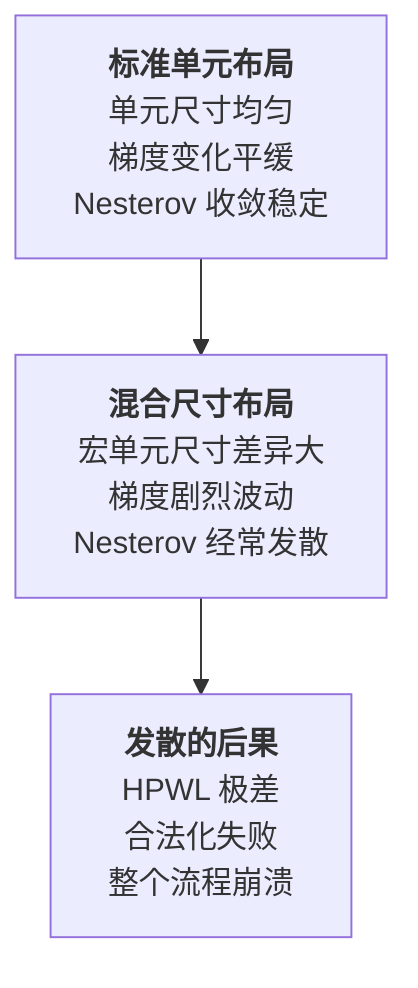
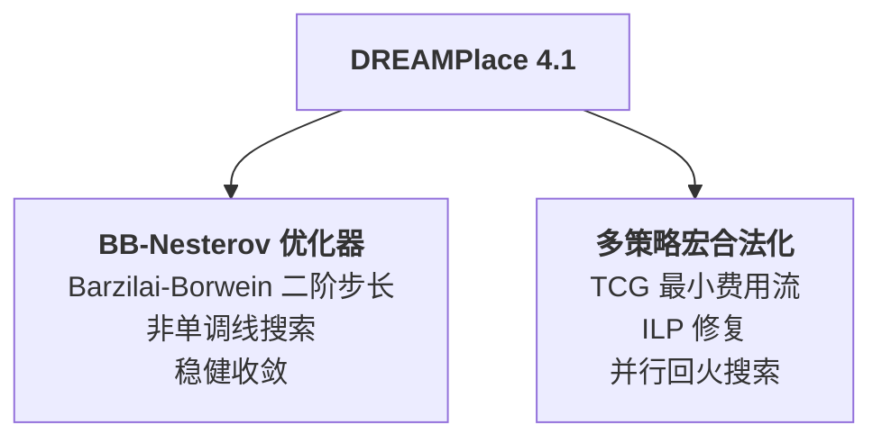
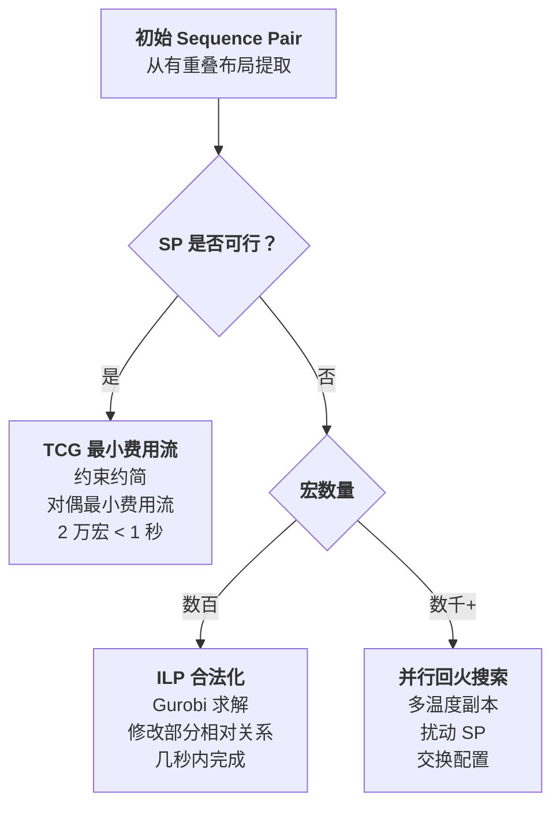
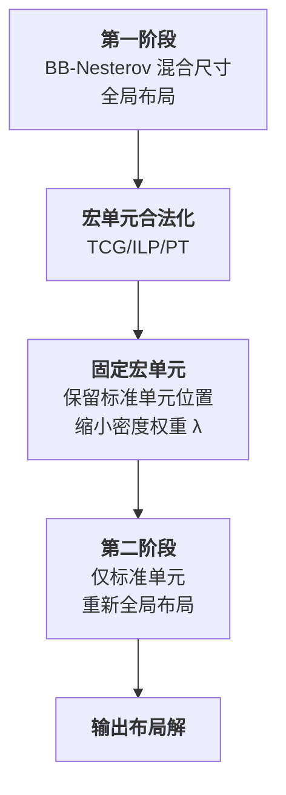

# Day 7: DREAMPlace 4.1 —— 基于二阶信息的混合尺寸布局骨干

> **论文标题**: Stronger Mixed-Size Placement Backbone Considering Second-Order Information
>
> **作者**: Yifan Chen, Zaiwen Wen, Yun Liang, Yibo Lin
>
> **机构**: School of Integrated Circuits, Peking University; Beijing International Center for Mathematical Research, Peking University; Institute of Electronic Design Automation, Peking University
>
> **会议**: IEEE/ACM International Conference on Computer-Aided Design (ICCAD)
>
> **年份**: 2023
>
> **分析日期**: 2026-06-08
>
> **系列定位**: 本文解决了一个被长期忽视的关键问题——**混合尺寸布局（Mixed-Size Placement）中宏单元导致的优化器发散**。Day 1-3 和 Day 6 的全局布局方法主要针对标准单元，而实际设计中包含大量大小不一的宏单元（macro）。DREAMPlace 4.1 引入 Barzilai-Borwein 二阶方法，使混合尺寸布局从"经常发散"变为"稳健收敛"。

---

## 目录

1. [背景：混合尺寸布局为什么难？](#1-背景混合尺寸布局为什么难)
2. [核心贡献概述](#2-核心贡献概述)
3. [Barzilai-Borwein 方法：一阶到二阶的跨越](#3-barzilai-borwein-方法一阶到二阶的跨越)
4. [宏单元合法化：多策略协同](#4-宏单元合法化多策略协同)
5. [整体框架：两阶段布局流程](#5-整体框架两阶段布局流程)
6. [实验结果与分析](#6-实验结果与分析)
7. [创新点深度分析](#7-创新点深度分析)
8. [ePlace 系列演进全景对比](#8-eplace-系列演进全景对比)
9. [参考文献](#9-参考文献)

---

## 1. 背景：混合尺寸布局为什么难？

### 1.1 混合尺寸布局的定义

现代 VLSI 设计包含两类实例：
- **标准单元（Standard Cells）**：尺寸统一（1-2 行高），数量巨大（百万级）
- **宏单元（Macros）**：尺寸差异大（从几行到数百行），数量较少（数十到数千）

混合尺寸布局需要同时优化宏单元和标准单元的位置。

### 1.2 核心挑战：宏单元导致优化器发散



> **根本原因**：宏单元的面积远大于标准单元。当一个宏单元移动时，其密度梯度变化量是标准单元的数千倍。这种**梯度的异质性**使得一阶优化方法（如 Nesterov 加速梯度）的 Lipschitz 常数估计严重失准——用全局 Lipschitz 常数作为步长，标准单元的移动可能过于保守；用局部 Lipschitz 常数，宏单元附近可能步长过大导致发散。

论文给出了实际例子：在 ISPD2005 的 bigblue2 和 MMS 的 newblue3 上，默认 DREAMPlace 发散——密度溢出无法降低，HPWL 极差，合法化失败。

### 1.3 为什么 L-BFGS 不行？

Newton 法和 L-BFGS 是经典的二阶方法，但在布局中面临两个困难：

1. **线长函数的平滑系数 \\( \epsilon \\) 不断变化**：每次变化导致 Hessian 矩阵的结构改变，之前缓存的梯度信息失效
2. **密度惩罚权重 \\( \lambda \\) 不断增大**：同样的原因导致 Hessian 近似需要重新计算

这意味着 L-BFGS 需要频繁重置，失去了其"有限内存"的优势。

---

## 2. 核心贡献概述

DREAMPlace 4.1 的两大核心贡献：



1. **BB-Nesterov 优化器**：将 Barzilai-Borwein 步长估计融入 Nesterov 加速梯度框架——用二阶信息近似 Hessian 逆，以对角矩阵的形式（\\( \beta I \\)）融入预条件，不增加显存和计算开销
2. **多策略宏合法化**：结合 TCG 最小费用流（可行情况）、ILP 修复（小规模不可行）、并行回火搜索（大规模不可行），保证任何情况都能得到合法解

---

## 3. Barzilai-Borwein 方法：一阶到二阶的跨越

### 3.1 一阶 vs 二阶优化

考虑无约束优化问题 \\( \min f(\mathbf{x}) \\)，记 \\( \mathbf{g}^{(k)} = \nabla f(\mathbf{x}^{(k)}) \\)，\\( H^{(k)} = \nabla^2 f(\mathbf{x}^{(k)}) \\)：

| 方法 | 更新规则 | 信息阶数 | 收敛速度 |
|------|---------|---------|---------|
| **梯度下降** | \\( \mathbf{x}^{(k+1)} = \mathbf{x}^{(k)} - \alpha \mathbf{g}^{(k)} \\) | 一阶 | 线性 |
| **Newton 法** | \\( \mathbf{x}^{(k+1)} = \mathbf{x}^{(k)} - (H^{(k)})^{-1} \mathbf{g}^{(k)} \\) | 二阶 | 二次 |
| **BB 方法** | \\( \mathbf{x}^{(k+1)} = \mathbf{x}^{(k)} - \beta^{(k)}_{BB} \mathbf{g}^{(k)} \\) | 一阶+二阶近似 | 超线性 |

### 3.2 Barzilai-Borwein 步长推导

BB 方法的核心思想：用**两个连续迭代点的梯度差**来近似 Hessian 矩阵，从而获得隐式的二阶信息。

令 \\( \mathbf{s}^{(k-1)} = \mathbf{x}^{(k)} - \mathbf{x}^{(k-1)} \\)，\\( \mathbf{y}^{(k-1)} = \mathbf{g}^{(k)} - \mathbf{g}^{(k-1)} \\)。

由 Taylor 展开，Hessian 近似满足：

\[
H^{(k)} \mathbf{s}^{(k-1)} \approx \mathbf{y}^{(k-1)}
\]

BB 方法用标量 \\( \beta \\) 近似 Hessian 的逆（即 \\( \beta^{-1} I \approx H \\)），求解最小二乘：

**BB1 步长**（长步长）：

\[
\beta_{BB1}^{(k)} = \frac{(\mathbf{s}^{(k-1)})^T \mathbf{s}^{(k-1)}}{(\mathbf{s}^{(k-1)})^T \mathbf{y}^{(k-1)}}
\]

**BB2 步长**（短步长）：

\[
\beta_{BB2}^{(k)} = \frac{(\mathbf{s}^{(k-1)})^T \mathbf{y}^{(k-1)}}{(\mathbf{y}^{(k-1)})^T \mathbf{y}^{(k-1)}}
\]

> **公式解读**：
> - BB1 最小化 \\( \|\beta^{-1} \mathbf{s} - \mathbf{y}\|^2 \\)：让标量 Hessian 逆的预测最接近实际的梯度差
> - BB2 最小化 \\( \|\mathbf{s} - \beta \mathbf{y}\|^2 \\)：让步长的预测最接近实际的位移
> - 两者满足关系：\\( \beta_{BB2} \leq \lambda_{Lip} \leq \beta_{BB1} \\)，其中 \\( \lambda_{Lip} \\) 是 Lipschitz 步长

### 3.3 短 BB 步长的选择

DREAMPlace 4.1 选择**短 BB 步长**（\\( \beta_{BB2} \\)），原因有二：

1. **非凸安全**：当目标函数非凸时，\\( (\mathbf{s}^{(k-1)})^T \mathbf{y}^{(k-1)} \\) 可能为零甚至为负——此时 BB1 步长可能无穷大或为负，而 BB2 仅涉及 \\( \mathbf{y}^T \mathbf{y} \\)，始终为正
2. **更保守**：短步长更接近 Lipschitz 步长，不容易因步长过大而发散

### 3.4 BB-Nesterov 算法（Algorithm 1）

```
输入：主解 u^(k)，参考解 v^(k)，加速参数 a_k

计算梯度差：
  g^(k-1) = ∇f(v^(k-1))
  g^(k)   = ∇f(v^(k))
  s^(k-1) = v^(k) - v^(k-1)
  y^(k-1) = g^(k) - g^(k-1)

计算 BB 步长：
  β_bb = (s^T · y) / (y^T · y)    ← 短 BB 步长
  if β_bb > 0:
    α₀ = β_bb                      ← BB 步长作为初始步长
  else:
    α₀ = λ_Lip                     ← 非凸时回退到 Lipschitz 步长

非单调线搜索：
  α = LineSearch(v^(k), g^(k), starts from α₀)  ← Zhang-Hager 线搜索

Nesterov 加速更新：
  u^(k+1) = v^(k) - α · g^(k)
  a_(k+1) = (1 + √(4a²_k + 1)) / 2
  v^(k+1) = u^(k+1) + (a_k - 1)/(a_(k+1)) · (u^(k+1) - u^(k))
```

> **与原始 DREAMPlace 的关键差异**：
> - 原始 DREAMPlace 使用**预测 Lipschitz 步长** \\( \lambda_{Lip} = \frac{\mathbf{s}^T \mathbf{s}}{\mathbf{s}^T \mathbf{y}} \\)（类似 BB1）作为线搜索起点
> - DREAMPlace 4.1 使用**短 BB 步长** \\( \beta_{BB2} = \frac{\mathbf{s}^T \mathbf{y}}{\mathbf{y}^T \mathbf{y}} \\)，更保守，更适合非凸的混合尺寸布局
> - 更重要的是：当 \\( \beta_{BB2} \leq 0 \\) 时（Hessian 在该方向上不是正定的），**回退到 Lipschitz 步长**——这提供了安全网

### 3.5 非单调线搜索：Zhang-Hager 方法

BB 方法不保证目标函数单调下降——某些迭代可能使目标函数上升。为保证全局收敛，DREAMPlace 4.1 使用 Zhang-Hager 非单调线搜索：

\[
C_{k+1} = \frac{\eta \cdot Q_k \cdot C_k + f(\mathbf{x}_{k+1})}{Q_{k+1}}, \quad Q_{k+1} = \eta \cdot Q_k + 1
\]

> **直觉**：非单调线搜索允许目标函数在短期内上升，但要求其**加权移动平均**在下降。这比严格单调线搜索更灵活——允许优化器"越过小山丘"以到达更深的山谷，同时保证不会持续恶化。

### 3.6 收敛性保证

论文引用了 Raydan (1997) 的定理：

> **Theorem 1**：假设水平集 \\( \Omega_0 = \{x : f(x) \leq f(x_0)\} \\) 有界，\\( f \\) 在 \\( \Omega_0 \\) 的某邻域内连续可微。则 BB 方法 + 非单调线搜索产生的序列满足：
> - \\( \liminf_{k \to \infty} \|\nabla f_k\| = 0 \\)
> - 无极限点是局部极大值
> - 若 \\( \Omega_0 \\) 中驻点有限，则序列收敛

> **意义**：虽然布局问题是高度非凸的（不保证全局最优），但 BB-Nesterov 保证**收敛到某个驻点**，不会发散——这正是混合尺寸布局最需要保证的。

---

## 4. 宏单元合法化：多策略协同

全局布局后，宏单元之间可能仍有重叠。宏合法化的目标是在**最小化位移**的前提下消除重叠。

### 4.1 Sequence Pair 表示

宏合法化的基础是 **Sequence Pair（SP）**——用一对排列 \\( S^+, S^- \\) 表示宏单元之间的相对位置关系：

- \\( a \prec_x b \\)（a 在 b 左边）：\\( S^+(a) < S^+(b) \\) 且 \\( S^-(a) < S^-(b) \\)
- \\( b \prec_x a \\)（b 在 a 左边）：\\( S^+(a) > S^+(b) \\) 且 \\( S^-(a) > S^-(b) \\)
- \\( a \prec_y b \\)（a 在 b 下面）：\\( S^+(a) > S^+(b) \\) 且 \\( S^-(a) < S^-(b) \\)
- \\( b \prec_y a \\)（b 在 a 下面）：\\( S^+(a) < S^+(b) \\) 且 \\( S^-(a) > S^-(b) \\)

> **从布局到 SP**：通过切割式重叠消除（cutting-based overlap removal）和扫描线算法，可以在 \\( O(n \log n) \\) 时间内从有重叠的布局中提取初始 SP。

### 4.2 三层合法化策略



#### 策略一：TCG 最小费用流（可行 SP）

如果初始 SP 是可行的（即存在合法布局满足该相对关系），则问题退化为线性规划：

\[
\min \|\mathbf{x} - \hat{\mathbf{x}}\|_1 + \|\mathbf{y} - \hat{\mathbf{y}}\|_1
\]

\[
\text{s.t.} \quad x_i + w_i \leq x_j, \quad e_{ij} \in G_x \quad \text{（TCG 水平约束图）}
\]

\[
y_i + h_i \leq y_j, \quad e_{ij} \in G_y \quad \text{（TCG 垂直约束图）}
\]

> **关键优化**：使用传递闭包图（TCG）消除了 \\( O(n^2) \\) 的冗余约束——如果 \\( i \prec_x j \\) 且 \\( j \prec_x k \\)，则 \\( i \prec_x k \\) 的约束是冗余的。TCG 只保留直接约束，将约束数从 \\( O(n^2) \\) 降到 \\( O(n) \\) 级别。

x 和 y 方向**独立求解**：先解 x 方向的最小费用流，再解 y 方向（只考虑 x 方向有重叠的宏对）。

#### 策略二：ILP 合法化（不可行 SP，宏数少）

当初始 SP 不可行时，需要修改某些宏对之间的相对关系。通过引入二值变量，将"或"约束转化为 ILP：

\[
\min \|\mathbf{x} - \hat{\mathbf{x}}\|_1 + \|\mathbf{y} - \hat{\mathbf{y}}\|_1
\]

\[
\text{s.t.} \quad x_i + w_i \leq x_j + W(x_{ij} + y_{ij}), \quad (i,j) \in D
\]

\[
x_{ij}, y_{ij} \in \{0, 1\}
\]

其中 \\( D \\) 是需要改变相对关系的宏对集合。算法逐步扩大 \\( D \\)（从 gap 小、距离近的宏对开始），直到 ILP 可行。

#### 策略三：并行回火搜索（不可行 SP，宏数多）

当宏数量太大导致 ILP 求解超时时，采用并行回火（Parallel Tempering）搜索可行 SP：

- 多个"温度"副本并行运行
- 高温副本接受较差的移动，低温副本更贪心
- 周期性地交换相邻温度的配置——帮助低温副本逃离局部最优

扰动操作包括：交换 \\( S^+ \\) 或 \\( S^- \\) 中的元素、移动元素位置。

代价函数设计：

\[
\text{Cost} = \begin{cases} \alpha \cdot \text{TNG} + \beta \cdot \text{GreedyDisp}, & \text{if TNG} > 0 \\ \alpha \cdot \text{TNG} + \gamma \cdot \text{Disp}, & \text{if TNG} \leq 0 \end{cases}
\]

其中 TNG（Total Negative Gap）衡量非法程度，\\( \alpha \\) 足够大以保证优先消除非法性。

---

## 5. 整体框架：两阶段布局流程



### 为什么需要两阶段？

单一阶段的混合尺寸布局中，宏单元的移动会不断扰动标准单元的位置——宏单元"拖拽"周围的标准单元，造成优化不稳定。两阶段流程的精髓在于：

1. **第一阶段**：BB-Nesterov 同时优化宏单元和标准单元，确定宏单元的大致位置
2. **宏合法化**：消除宏单元之间的重叠，固定宏单元
3. **第二阶段**：宏单元固定后，标准单元在**不受宏单元扰动**的环境下精细优化

> **关键细节**：第二阶段不是从头开始——标准单元从第一阶段的位置出发，密度权重 \\( \lambda \\) 被缩小以避免过度扩散。这相当于"解锁"标准单元进行微调，而非重新布局。

---

## 6. 实验结果与分析

### 6.1 实验配置

| 项目 | 配置 |
|------|------|
| **平台** | NVIDIA RTX 2080 + Intel Xeon Silver 4210R (10核) |
| **基准** | MMS, ISPD2005 (I/O-freed), TILOS |
| **对比** | 默认 DREAMPlace (单阶段) |

### 6.2 关键结果

#### MMS 基准（16 个设计）

| 方法 | 发散数 | HPWL 比 | 迭代数比 | 运行时比 |
|------|--------|---------|---------|---------|
| 默认 DREAMPlace | 1 (newblue3) | 1.000 | 1.000 | 1.000 |
| Ours w/o BB | 1 (同上) | 0.953 | 1.298 | 2.135 |
| **Ours w/ BB** | **0** | **0.935** | **1.186** | **1.784** |

#### I/O-freed ISPD2005（8 个设计，更具挑战性）

| 方法 | 发散数 | HPWL 比 | 迭代数比 | 运行时比 |
|------|--------|---------|---------|---------|
| 默认 DREAMPlace | 1 (bigblue2) | 1.000 | 1.000 | 1.000 |
| Ours w/o BB | 1 (同上) | 0.787 | 1.295 | 2.715 |
| **Ours w/ BB** | **0** | **0.704** | **1.112** | **2.802** |

> HPWL 比值 0.704 意味着 **29.6% 的线长改善**！这主要来自两个方面：BB 方法避免了发散（发散情况下的 HPWL 极差），两阶段流程使得标准单元的布局质量更高。

#### TILOS 基准（5 个 RISC-V 设计）

| 方法 | 发散数 | HPWL 比 |
|------|--------|---------|
| 默认 DREAMPlace | 1 (NVDLA) | 1.000 |
| Ours w/o BB | 1 (同上) | 0.684 |
| **Ours w/ BB** | **0** | **0.667** |

> HPWL 比值 0.667 意味着 **33.3% 的线长改善**。NVDLA 设计包含 128 个宏单元，默认 DREAMPlace 发散，BB 方法使其稳健收敛。

### 6.3 BB 方法的额外开销

BB 方法本身几乎不增加运行时（仅需计算一次向量内积），主要的运行时增加来自：
1. **两阶段流程**比单阶段多一次全局布局
2. **宏合法化**的额外时间

但 HPWL 的显著改善证明了这些开销是值得的。

### 6.4 集成到 AutoDMP

AutoDMP 是一个基于多目标贝叶斯优化的宏布局框架，它使用 DREAMPlace 作为后端。将默认 Nesterov 替换为 BB-Nesterov 后：

| 设计 | Bad Runs（默认） | Bad Runs（+BB） |
|------|-----------------|----------------|
| Ariane133 | 22/354 | **0/354** |
| Ariane136 | 40/360 | **0/365** |
| MemPool | 27/356 | **0/353** |
| BlackParrot | 29/51 | **0/357** |
| NVDLA | 29/56 | **0/44** |

> **"Bad Run"** 指优化器发散、最终目标函数值为 INF 的情况。BB 方法将 Bad Runs 数量从**数十次**降到**零**——这是鲁棒性的质变。对于 AutoDMP 这种需要运行数百次采样的超参优化框架，零 Bad Runs 意味着不需要浪费任何计算预算在失败的运行上。

---

## 7. 创新点深度分析

### 7.1 创新点一：BB 步长作为二阶信息的轻量级引入

**核心洞察**：混合尺寸布局的发散问题根源是一阶优化方法对 Hessian 信息"视而不见"——宏单元的巨大尺寸导致 Hessian 矩阵的条件数极差，一阶方法无法自适应调整步长。

BB 方法以**极低的代价**引入了二阶信息：
- **存储**：只需额外保存上一步的梯度和位置（\\( O(n) \\)），不像 L-BFGS 需要 \\( O(mn) \\)
- **计算**：每步仅增加两次向量内积（\\( O(n) \\)），几乎可忽略
- **效果**：将"盲目的"一阶步长变为"有方向的"准二阶步长

> **设计哲学**：不追求精确的 Hessian（Newton/L-BFGS 太贵），也不放弃二阶信息（梯度下降太盲目），而是在两者之间找到最佳平衡点——用最少的代价获取最有用的二阶信息。

### 7.2 创新点二：BB + 非单调线搜索的组合保证收敛

BB 方法单独使用不保证收敛——步长可能振荡。Zhang-Hager 非单调线搜索提供了**安全网**：

- 允许短期目标函数上升（非单调性 → 跳出浅的局部最优）
- 要求加权平均下降（收敛性 → 不会持续恶化）
- BB 步长提供搜索起点（比 Lipschitz 步长更好的起点）

> **与 DREAMPlace 3.0 的对比**：DREAMPlace 3.0 用回滚（rollback）和熵注入（entropy injection）应对发散——这是一种"检测并修复"的后处理策略。DREAMPlace 4.1 用 BB 步长从根源上避免发散——这是一种"预防"策略。两者互补：BB 解决步长估计问题，回滚/熵注入解决鞍点问题。

### 7.3 创新点三：TCG + 最小费用流的高效宏合法化

传统宏合法化使用模拟退火或贪心策略，质量差且速度慢。本文的 TCG 最小费用流方法：

1. **用 SP 编码相对关系** → 用 TCG 消除冗余约束 → 用最小费用流精确求解 LP
2. **2 万个宏在 1 秒内完成**——比通用 LP 求解器（如 Gurobi）快几个数量级
3. **x 和 y 解耦**：先解 x 再解 y，每次只考虑相关约束

> **为什么快？** 最小费用流是网络优化中最成熟的问题之一，其专用算法（如 network simplex）比通用 LP 求解器快得多。TCG 的约束约简进一步降低了问题规模。

### 7.4 创新点四：多策略合法化的系统设计

论文没有试图找到一个"万能"的合法化算法，而是根据问题的**可行性和规模**选择不同策略：

| 情况 | 策略 | 时间复杂度 |
|------|------|-----------|
| SP 可行 | TCG 最小费用流 | \\( O(V(V+E)) \\) + 最小费用流 |
| SP 不可行，宏数少 | ILP（Gurobi） | 指数级但实际秒级 |
| SP 不可行，宏数多 | 并行回火 | 启发式，可控 |

> **工程智慧**：学术上追求统一优雅的算法，工程上追求"每种情况都有最优解"。DREAMPlace 4.1 选择了工程路线——不同情况用不同工具，总有一款适合你。

---

## 8. ePlace 系列演进全景对比

| 维度 | ePlace | RePlAce | DREAMPlace | DREAMPlace 3.0 | **DREAMPlace 4.1** |
|------|--------|---------|------------|----------------|-------------------|
| **年份** | 2015 | 2019 | 2019 | 2020 | **2023** |
| **核心创新** | 静电模型 | 局部平滑 | GPU 加速 | 多电场 + 鲁棒 | **BB 二阶步长** |
| **优化器** | Nesterov | Nesterov + 回溯 | Nesterov + Lipschitz | Nesterov + 回滚 | **BB-Nesterov** |
| **步长策略** | 估计 Lipschitz | 动态步长 | 预测 Lipschitz | 同 DREAMPlace | **BB 步长 + 非单调线搜索** |
| **二阶信息** | 对角 Hessian 预条件 | 无 | 无 | 无 | **BB 隐式 Hessian** |
| **混合尺寸** | ✓ (ePlace-MS) | ✓ | ✓（常发散） | ✗（仅标准单元 + 区域） | **✓（稳健收敛）** |
| **区域约束** | ✗ | ✗ | ✗ | ✓ | ✗ |
| **宏合法化** | 通用 | 通用 | 通用 | Abacus | **TCG + ILP + PT** |
| **发散发解** | 手动调参 | 手动调参 | 可能发散 | 回滚 + 熵注入 | **BB 预防 + 两阶段** |

> **演进脉络**：ePlace 系列的优化器经历了四代演进：
> 1. **ePlace**：Nesterov + 估计 Lipschitz（基础但脆弱）
> 2. **RePlAce**：Nesterov + 动态步长 + 回溯线搜索（更稳定）
> 3. **DREAMPlace 3.0**：Nesterov + 回滚 + 熵注入（后处理式救急）
> 4. **DREAMPlace 4.1**：**BB-Nesterov + 非单调线搜索**（从根源预防发散）
>
> 每一代都在解决前一代遗留下来的收敛性问题，从"被动修复"到"主动预防"，反映了布局优化理论的逐步成熟。

---

## 9. 参考文献

1. Y. Chen, Z. Wen, Y. Liang, and Y. Lin, "Stronger Mixed-Size Placement Backbone Considering Second-Order Information," in *Proc. IEEE/ACM ICCAD*, 2023.

2. J. Barzilai and J. M. Borwein, "Two-Point Step Size Gradient Methods," *IMA Journal of Numerical Analysis*, vol. 8, no. 1, pp. 141–148, 1988.

3. M. Raydan, "The Barzilai and Borwein Gradient Method for the Large Scale Unconstrained Minimization Problem," *SIAM Journal on Optimization*, vol. 7, 1997.

4. H. Zhang and W. W. Hager, "A Nonmonotone Line Search Technique and Its Application to Unconstrained Optimization," *SIAM Journal on Optimization*, vol. 14, no. 4, pp. 1043–1056, 2004.

5. J. Lu, P. Chen, C.-C. Chang, L. Sha, D. J.-H. Huang, C.-C. Teng, and C.-K. Cheng, "ePlace: Electrostatics-Based Placement Using Fast Fourier Transform and Nesterov's Method," *ACM TODAES*, vol. 20, no. 2, p. 17, 2015.

6. Y. Lin, S. Dhar, W. Li, H. Ren, B. Khailany, and D. Z. Pan, "DREAMPlace: Deep Learning Toolkit-Enabled GPU Acceleration for Modern VLSI Placement," in *Proc. DAC*, 2019.

7. J. Gu, Z. Jiang, Y. Lin, and D. Z. Pan, "DREAMPlace 3.0: Multi-Electrostatics Based Robust VLSI Placement with Region Constraints," in *Proc. ICCAD*, 2020.

8. H. Murata, K. Fujiyoshi, S. Nakatake, and Y. Kajitani, "VLSI Module Placement Based on Rectangle-Packing by the Sequence-Pair," *IEEE TCAD*, vol. 15, no. 12, pp. 1518–1524, 1996.

9. A. Agnesina, P. Rajvanshi, T. Yang, et al., "AutoDMP: Automated DREAMPlace-based Macro Placement," in *Proc. ISPD*, 2023.

---

*本文档由 Claude Code 于 2026-06-08 生成，作为 EDA 论文每日分析系列的第 7 天内容。Day 7 从优化理论的角度审视布局问题——Barzilai-Borwein 方法证明了"在正确的地方引入二阶信息"比"盲目增加计算量"更有效。这是 ePlace 系列中第一个从优化算法底层改变步长策略的工作，标志着布局优化从"调参工程"走向"理论驱动"的新阶段。*
